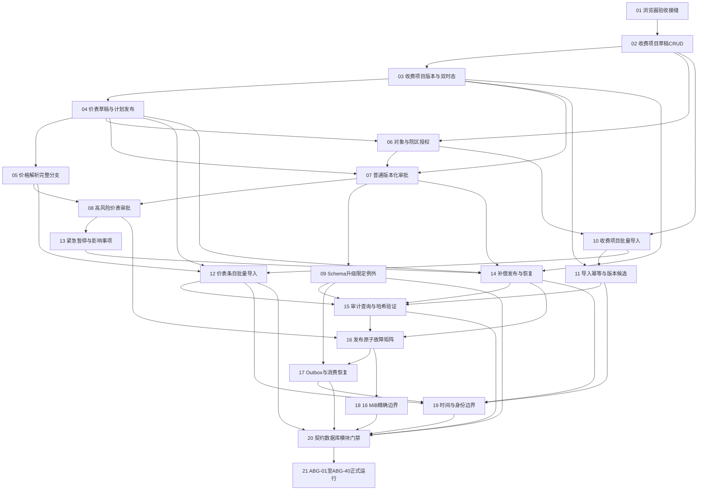

# Phase 01剩余能力执行地图

Status: active

Source spec: `spec.md`

Baseline commit: `f7dd94f`

## Notes

- 本计划只完成POC可执行架构基线阶段的剩余能力及ABG-01至ABG-40，不进入完整POC扩展。
- 每张票都是一条可独立演示和验证的纵向切片，必须同时完成其所需的迁移、领域行为、冻结契约、生成客户端、界面路径和测试。
- 一次只认领依赖已经全部完成的任务。任务开始时把状态从`ready-for-agent`改为`claimed`，验收证据齐全后改为`resolved`并在`Comments`追加结果。
- 不得修改或补写已经终态化的历史证据运行；正式重跑必须建立新的运行身份。

## Phases

| 阶段 | 目标 | Tickets |
|---|---|---|
| 1 | 建立可持续验收接缝 | 01 |
| 2 | 补齐领域生命周期 | 02–05 |
| 3 | 补齐授权与工作流 | 06–09 |
| 4 | 补齐批量导入 | 10–12 |
| 5 | 补齐暂停、纠正和审计 | 13–15 |
| 6 | 故障、容量与最终门禁 | 16–21 |

## Dependency graph

## Current frontier

- `01-real-browser-baseline.md` — 已认领，开发完成；等待内存门禁允许真实浏览器与完整测试后验收。

## Decisions so far

- 任务粒度、阶段和阻塞边已由用户确认。
- Tracker只使用本地Markdown，不创建或调用远端Issue Tracker。

## Fog

- 当前没有阻断实施的未决产品决策。若实现要求改变事务边界、数据库结构主权、身份/版本语义、一发布一快照或消费者契约身份，必须暂停并形成新ADR。
