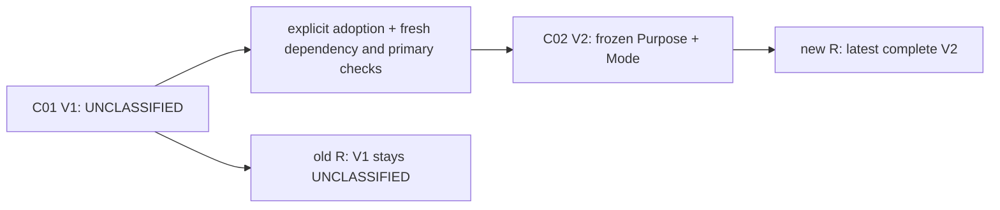

# PV-006-C-02 — Assignment purpose, mode and scoped primary affiliation

Status: local engineering gates passed. DONE takes effect only on the sole local
completion commit after same-tree independent Standards/Spec approval. SYNTHETIC /
NON_PRODUCTION / TEST POLICY ONLY. Domain date-times are offset-free Asia/Shanghai strings.

## Authority and decisions

The user C-02 1.1.0-local-only prompt and explicit authorization to resume the
existing local edits authorize only this ticket. Execution mode is
`LOCAL_AUTHORITY_NO_EXTERNAL_NETWORK`. START_HEAD is
`8490afa128bf5b4a72a4cdb9fe29672e4f1fba03`, START_TREE is
`a30783e06179eb9979492ce3af2ed152b8421da1`, branch is
`prototype/phase-03-person-master`. The earlier R1 remote observation is historical;
this execution performs no remote verification or external project requests.
Local upstream values are cached references only. REMOTE_VERIFICATION is
NOT_PERFORMED_BY_SCOPE; remote tips are NOT_OBSERVED and final containment UNKNOWN.
This scope does not establish platform identity verification or remote synchronization.
The local-only preflight found existing C-02 edits and stopped as instructed;
the user then explicitly authorized continuing those edits without cleaning them.
The original spec and historical C-01 comments are preserved.

| Existing source fact | C-02 decision |
|---|---|
| ADR-0046 separates purpose and mode and scopes primary affiliation | Closed machine codes: three purposes, two supported modes |
| ADR-0001 establishes one hospital governance subject | HOSPITAL_DEPARTMENT_PLACEMENTS covers all Department placements in that hospital |
| C-01 owns stable Assignment and complete immutable versions | A 1:1 append-only semantic extension freezes both definition versions |
| C-01 uses ASSIGNMENT_DEPARTMENT_CORE_V1 dependency evidence | Separate ASSIGNMENT_PRIMARY_DEPARTMENT_SCOPE_V1 is additive; old fingerprints do not change |
| C-01 records contain no classification | They remain UNCLASSIFIED; adoption appends a new core version |
| ADR-0049 separates professional fact ownership | Definition grants are independent of operational Assignment grants |
| No reusable generic value-set module exists in the current module inventory | Two small Person-owned definition tables, with no general reference engine |

The scope, unknown handling and pairing decisions are recorded in ADR-0117.
They do not assert a production HR policy, approval workflow or clinical permission.

## Two axes and operation matrix

Purpose: ORGANIZATIONAL_AFFILIATION, CLINICAL_PRACTICE, TRAINING_LEARNING.
Mode: PRIMARY_AFFILIATION, STANDING_CONCURRENT. The primary meaning is fixed by
the code, never an editable boolean. Other modes fail explicitly with
ASSIGNMENT_MODE_NOT_SUPPORTED_IN_SLICE. Roles, credentials, source relationships,
hospital/campus entities, transfer processes, HTTP, projections, releases and
Browser work are outside this ticket.

| Command | Prior head | Period | Purpose and mode |
|---|---|---|---|
| core create | absent | caller's complete period | UNCLASSIFIED |
| core revise | unclassified lineage | new complete period | UNCLASSIFIED |
| classified create | absent | caller's complete period | explicit pair |
| adopt semantics | UNCLASSIFIED | unchanged complete period | explicit pair on a new version |
| revise classified period | CLASSIFIED | new complete period | same codes, newly resolved definition versions |
| correct semantics | CLASSIFIED | unchanged complete period | explicit corrected pair and bounded reason |

Output reason types include SEMANTIC_ADOPTION and SEMANTIC_CORRECTION. C-01 revise
inputs still accept only VALIDITY_CORRECTION and CONTINUATION_EXTENSION.
No new reason is cast to the old input enum.

## Bucket, completeness and clocks

The bucket is `(person governanceObjectId, personId, engagementId, purposeCode,
HOSPITAL_DEPARTMENT_PLACEMENTS)`. Neither departmentId nor
departmentGovernanceObjectId partitions it. Person is derived from the Engagement.
There is no person-wide current Department endpoint and no requirement to always
have a primary affiliation.

For each stable Assignment, select the highest core versionNo with recordedFrom
at or before R, then its exact semantic row, then test the business period.
Old open periods and old primary classifications never revive after a newer
complete assertion. Periods are half-open, microsecond-precise and null-ended
infinity. Upstream suspension or Department inactivity does not delete a primary
declaration; callers request C-01 dependency assessment separately.

A primary write rejects confirmed collisions first and otherwise rejects
overlapping unclassified candidates. Concurrent-mode writes do not occupy a
primary slot and record NOT_APPLICABLE_NON_PRIMARY without claiming completeness.
Point resolution returns CONFLICT for multiple known primaries, UNKNOWN for an
otherwise incomplete set, UNIQUE for one known primary with no unknown, and NONE
for an empty complete set. Only UNIQUE includes a selected version ID.

Definition selection uses the latest complete definition visible at server R,
then requires ENABLED and complete-period coverage. It cannot fall back to an old
open definition. Exact historical reads preserve retired definitions and old
labels. The new semantic record clock equals its new core version's record clock.

## Actual lock graph and transaction boundary

| Path | Lock order / snapshot |
|---|---|
| C-01 raw mutation | request advisory → own Assignment UPDATE when revising → Engagement SHARE → published DepartmentVersion SHARE → R → inserts → Person audit |
| C-02 classified mutation | same request authority → own Assignment UPDATE when revising → Engagement directly UPDATE → published DepartmentVersion SHARE → definition stable SHARE in ID order → R → evaluation and inserts → Person audit |
| Definition mutation | definition request advisory → code advisory on registration or stable term UPDATE on append → immutable version → Person audit |
| Engagement lifecycle | own Engagement UPDATE → lifecycle/period append → Person audit |
| Engagement period revision | Engagement UPDATE → person overlap advisory → policy shared advisory → append → Person audit |
| Department publication | Department stream audit may precede draft lock → publication advisory → current published DepartmentVersion UPDATE |
| Semantic and definition reads | local REPEATABLE READ; close snapshot before separate read-audit transaction |

Candidate scans do not lock other Assignment rows. The Department narrow reader
does not write Department audit; Person and Department governance scopes have
distinct audit streams. No hospital-wide new lock is added. Different Engagements
have distinct mutation fences; the existing audit sequence serialization remains.
The present execution checks Kysely transaction and row-lock APIs against the
installed local dependency; it makes no online documentation request.

The core's private mutation coordinator retains validation, owner dependency
observation, save, request replay and outcomes. It evaluates semantics before
creating a stable Assignment, then writes core version, segments, exact semantics,
the single original ledger outcome and both success audits in the same transaction.
No public saveApproved/validated bypass exists. Current authorization precedes
replay. Stable collision/incompleteness refusals persist in the original ledger;
system SQL errors are not converted into permanent business refusals.

Primary resolution obtains the Person binding through an Engagement-owner
identity-only reader assembled by the composition root. It requires Assignment
READ and SEMANTICS_READ, uses the same transaction snapshot, and rejects record
times before the Engagement identity existed. The existing complete-period port
and lifecycle permissions are unchanged; declaration resolution does not perform
dependency assessment or read Engagement's tables in the Assignment repository.

## Native database boundary

0033 adds assignment_semantic_term, assignment_semantic_term_version and
assignment_version_semantics. The retained pre-C02 fingerprint receipt observed
32 migrations and the C01 baseline had 85 tables. This local-only resume observed
0033/0034 already applied: 34 migrations and 88 tables. It preserves those applied
files and verifies the resulting upgrade state; it does not claim to have rerun
their original upgrade commands. Current fresh installation independently runs
the full 0001–0034 chain. Applied 0001–0032 remain unchanged.

0034 retains the earlier SQL RED where an old REPEATABLE READ snapshot admitted
a second declaration despite a row lock on immutable identity. It rejects semantic
writes outside READ COMMITTED. Read-only historical RR and C01 raw paths remain.

| New Person-owned table | Columns | Constraints | Non-internal triggers | Indexes |
|---|---:|---:|---:|---:|
| assignment_semantic_term | 7 | 18 | 4 | 3 |
| assignment_semantic_term_version | 16 | 31 | 3 | 6 |
| assignment_version_semantics | 26 | 48 | 5 | 1 |

The actual catalog also contains five new semantic guard/pin functions, one
replaced C01 completeness function and one new fence trigger on the existing
core version table. Live codegen and fresh-generated type equality both passed.

Composite foreign keys enforce exact core version, Person/Engagement/governance,
term version/dimension/code and actor/request/hash pairing. Definition and
semantic rows reject UPDATE, DELETE and TRUNCATE. Deferred core completeness
continues to require full C-01 segments and a matching ledger outcome, now also
requiring the classified operation and paired semantics. Old raw outcomes cannot
acquire semantics later, and classified lineage cannot append a raw version.

The semantic insert guard locks Engagement and checks current latest complete
declarations, including unknown rows and candidate overflow. Direct SQL with a
stale evaluation R is rejected when newer candidates are observed. Applications
take UPDATE directly; a raw SQL client attempting a SHARE-to-UPDATE upgrade can
receive a database deadlock and must roll back. These guards apply to ordinary
writes with the guards enabled; a schema owner or superuser able to change DDL
can bypass them. They do not establish administrator-proof evidence integrity.

## Evidence and stop line

Current coordinator: `.runtime/pv006-c02/local-only-20260907/`.
Historical preservation coordinator: `.runtime/pv006-c02/resume-20260907-r1/`. Before the earlier cohort writes,
19 immutable Person tables including all four C-01 tables were hashed at cutoff
`2026-09-07T12:56:32.603003`, database hdi_prototype, OID 16389. The application
role was neither superuser nor CREATEDB. Each application attempt has a new UUID
directory and an exclusive receipt; failed RED and repair attempts remain.

The candidate evidence matrix is `acceptance-precommit.json` in the current
coordinator: 59 of 63 entries have measured passing evidence. AS-05, PA-13 and
EV-06 await same-tree independent review; EV-07 awaits the actual commit and its
post-commit checks. These gates are not prefilled PASS. The later
`acceptance-reviewed.json` and `acceptance-final.json` record their actual results.
The same evidence package maps all 72 C01 cases to current application, oracle,
architecture, recovery, regression and local-authority checks. C01's historical
remote observations are not relabeled as current remote verification.

| Evidence | Actual result / receipt |
|---|---|
| C02 application | `7116ba02-ec00-40eb-9ce3-da60d2c82a16/application.json`: 21 passing assertion groups |
| C02 native SQL | `0d61ac0f-62e1-4fd9-8026-b45590ce451b/application.json`: 6 passing groups, including committed C01 CREATE/REVISE retrofit rejection and classified-lineage raw V2 rejection |
| Fresh full chain | `df7fbe32-2f77-4217-a278-257f74c8cba7/fresh-install.json`: empty database, 34 migrations, 88 tables, separate official/Department/Person seeds, C01/C02 application and SQL, schema/type equality, five cleanup negatives, owned database removed |
| Real C02 restart | `a130b882-3d87-486e-90f1-f3f728899123/recovery-result.json`: changed postmaster, new pool, old/new R, primary reads, frozen definition labels, original successful outcome and row/audit fingerprint reproduced |
| C02 recovery negatives | `e14b53b3-231f-4463-a472-c62058b3adcb/negative-recovery.json`: missing/mode/database/OID/endpoint failures, no cohort or audit count change, original receipt bytes unchanged |
| Regressions | `c8b064fb-b10d-4392-b672-f4d83e48eeea/commands.json`: 25 real commands, all exit 0 |
| C01 application/recovery | `.runtime/pv006-c01/e30cde50-88b1-40d4-85a2-acb5bab3916e/` has 33 passing groups including the 500-case owner oracle; recovery `b37c9c15-74a5-44bb-a683-d3abe0bed38a` and five negatives `01d3a9b8-e036-42ad-b167-16e1a2632096` passed |

UUID paths in this table are relative to `.runtime/pv006-c02/` unless an explicit
C01 path is given. The complete mapping in the coordinator uses full repository-relative paths.

The final adoption proof preserves raw version
`01a07ad5-ecd0-7db1-bda2-547210b10366` at R
`2026-09-07T15:47:15.298805` as UNCLASSIFIED. New version
`01a07ad5-ed68-7be8-947b-45e6d0c4f2d6` records its classification at
`2026-09-07T15:47:15.43126`, without changing the complete business period.
After restart, 17 selected immutable core/semantic/definition/outcome/audit rows
retain SHA-256 `345489483b6bc68e735c4c0a48dece5f361bcfc71d713d5edd7d56a8d5b5413f`.

Actual Engagement lock queues prove one successful primary, one explicit conflict
and exactly one persisted core version for two competing creates. Adoption,
extension, mode/purpose correction and raw-create orderings are separate cases.
Independent Engagement progress is observed while another is blocked. Six audit
faults (create/adopt/correct at either success audit) leave every business/outcome
count unchanged; read-audit failure propagates without business mutation.
Native tsrange point counts independently check microsecond boundaries and an
unbounded tail. The otherwise unreachable CONFLICT read is tested in a controlled
rollback-only transaction; its domain collision trigger is restored and row counts
are unchanged. This is a domain corruption fixture, not a platform security change.

Governance API passed 38 files / 512 tests, Sim Consumer 20, Release SDK 72 and
Replay 4. C01's nine contract/architecture tests and 1,500 pure containment cases
remain. A-01/A-02A/A-02B/B-01/B-02/B-03/B-04, Department native/repository/projection/
application/HTTP, Metrics/Audit, contract lint, full workspace typecheck, build,
root check with live database authority, canonical freeze and B04 schema normalizer
passed. Only the pre-existing formal/container integration file was excluded.
There is no standalone root lint script and none is claimed.

OpenAPI remains `f64db5c2c0688c0128a942d0705a0d91809e1fd795dedbd95f588067e91d8035`.
Seven canonical artifacts are byte-identical, all 15 Department paths are unchanged,
and Generated Client/Browser sources and 0001–0032 remain unchanged. The final
19-table preservation check still equals the pre-C02 cutoff/count/digest manifest.

Failures are retained separately: historical missing-capability and old-RR SQL
RED receipts; the resumed test requestId type error; a closed-query fixture error;
the original C01 TRUNCATE dependency error (0A000), repaired by adding the new FK
dependent while retaining the 55000 immutable-trigger assertion; the owner-port
architecture RED, repaired by moving the identity lookup to Engagement; and the
SQL fixture's TypeScript value-type error. No business negative was removed.
The final tooling typecheck is `typecheck-final-02.log`, exit 0.

Required wrapper logs preserve READY/CLOSED records and cleanupPassed=true.
Some stop commands returned 1; independent service and connection checks still
confirmed inactive/unreachable. Those exit codes are retained, not normalized to 0.
The cumulative hdi_prototype database and immutable evidence cohorts remain.
Current execution sends no external project request; process-local Redocly telemetry
and update notices are off, npm uses installed offline dependencies, and HTTP
regressions target their owned loopback servers.

No formal ABG/AR07, container, browser, Keycloak or real HIS/EMR/HR activity was
performed. No platform identity verification or security-policy exception is asserted.

Final post-commit SHA/tree and explicit remote-not-observed fields will be written under the ignored
coordinator directory, avoiding tracked self-reference. Only
`feat(person): add assignment semantics and scoped primary affiliation` may be
committed, with no push. C-02 completion leaves C and PV-006 IN_PROGRESS;
C-03 and D–G remain NOT_STARTED. NEXT_PHASE_EXECUTION_AUTHORIZED=NO.

## Per-case validation map

This is the frozen case-to-evidence map. Measured status and exact paths are in the coordinator acceptance receipts; review and commit are separate gates. APP/SQL refer to the final C02 application/native receipts, and the other keys match the evidence table above.

| ID | Scenario | Validation type | Evidence |
|---|---|---|---|
| AS-01 | 本地代码与工作树基线 | Local Git + scope evidence | LOCAL |
| AS-02 | 两个轴而非组合枚举 | contract | APP |
| AS-03 | 仅支持两种方式 | contract + review | APP |
| AS-04 | 临床用途不等于执业许可 | contract + spec | APP |
| AS-05 | 主归属规范术语与scope | static review | REVIEW |
| DF-01 | 双轴定义隔离 | unit + live DB | APP, SQL |
| DF-02 | 定义V1/V2追加 | live DB | APP |
| DF-03 | 定义完整期间 | unit + live DB | APP |
| DF-04 | 未来/停用/未知定义 | live DB | APP, SQL |
| DF-05 | 冻结引用历史 | live DB + restart | APP |
| DF-06 | 模式含义不可更换 | DB + contract | APP, SQL |
| DF-07 | 字典写权限分离 | authorization | APP |
| HV-01 | 无迁移默认分类 | live DB + hashes | APP |
| HV-02 | 首次显式adoption | live DB | APP |
| HV-03 | 错误adoption目标 | unit + live DB | APP |
| HV-04 | 语义完整纠正 | live DB | APP |
| HV-05 | 期限制定与语义操作分开 | contract + DB | APP |
| HV-06 | 不向旧版本追补分类 | DB + application | SQL |
| HV-07 | 已classified不降回raw | live DB | APP, SQL |
| HV-08 | 旧已成功请求兼容 | live DB | APP |
| HV-09 | 查询先取最新core | unit + live DB | APP |
| HV-10 | 未知R与缺分类分开 | live DB | APP |
| PA-01 | 不同科室同bucket冲突 | live APP/DB | APP |
| PA-02 | 不同用途允许 | live APP/DB | APP |
| PA-03 | 不同Engagement独立 | live APP/DB | APP |
| PA-04 | 常设兼任不占主归属 | live APP/DB | APP |
| PA-05 | 无需强制一个PRIMARY | live DB | APP |
| PA-06 | 半开区间边界 | unit + live DB | APP |
| PA-07 | 中段交叠 | unit + live DB | APP |
| PA-08 | 无界期间 | unit + live DB | APP |
| PA-09 | 旧版本不占新期 | live DB | APP |
| PA-10 | 模式纠正释放声明 | live DB | APP |
| PA-11 | semantic纠正新冲突 | live DB | APP |
| PA-12 | 上游失效不自动释放声明 | live DB | APP |
| PA-13 | scope无目标分桶漏洞 | code review + fixture | REVIEW |
| UK-01 | 未知不默认兼任 | live DB | APP |
| UK-02 | 未知不默认主归属 | live DB | APP |
| UK-03 | 可先采用非PRIMARY | live DB | APP |
| UK-04 | 后来新增raw影响完整性 | live DB | APP |
| UK-05 | query四态 | unit + DB or controlled corruption probe | APP, SQL |
| UK-06 | 旧head采用自排除 | live DB | APP |
| UK-07 | 查询完整性超限 | unit + live DB | APP |
| TX-01 | 原子classified create | live DB fault | APP, SQL |
| TX-02 | 原子adopt/correct | live DB fault | APP |
| TX-03 | 两个并发PRIMARY | live DB barriers | APP, SQL |
| TX-04 | 两个并发adoption | live DB barriers | APP |
| TX-05 | 改期与新PRIMARY并发 | live DB barriers | APP |
| TX-06 | 语义切换与新PRIMARY | live DB barriers | APP |
| TX-07 | raw create与PRIMARY双顺序 | live DB barriers | APP |
| TX-08 | 不同E不全院串行 | lock inspection | APP |
| TX-09 | 上游与语义并发 | live DB regression | APP |
| TX-10 | 成功request重放 | live DB | APP |
| TX-11 | 拒绝request重放 | live DB | APP |
| TX-12 | 跨入口同request冲突 | live DB | APP |
| TX-13 | 权限撤销和actor隔离 | authorization + live DB | APP |
| TX-14 | 只读audit与RR | live DB | APP |
| EV-01 | 升级与旧历史保护 | DB + digests | PRESERVATION, FREEZE |
| EV-02 | fresh完整链 | fresh live DB | FRESH |
| EV-03 | 真实restart | restart | RECOVERY |
| EV-04 | 负恢复receipt | subprocess negative | NEGATIVE |
| EV-05 | 全部回归和冻结 | commands + hashes | REGRESSIONS, FREEZE |
| EV-06 | 同树审查与资源 | review + resource | REVIEW, RESOURCES |
| EV-07 | 一提交且不执行远端动作 | Local Git + final report | COMMIT |
