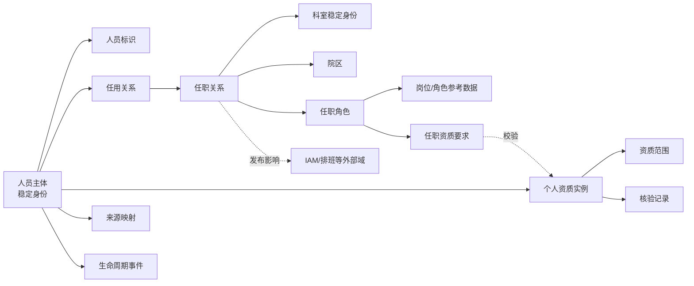

# 人员与科室混合主权POC调整方向

状态：人员域POC边界确认完成，可进入详细设计与实现计划
更新日期：2026-07-30

## 1. 调整依据

本方向基于：

- 已确认的单医院治理主体、多院区、单一组织与人员权威来源、治理对象级授权、院区可扩展但不得覆盖全院条目等边界。
- 已确认的科室三层模型、四个语义域、双业务时间线、多视图层级、稳定身份和不可变版本。
- `deep-research-report (4).md`，SHA-256：`32074C7507F037DC78132C9C67107E5E710E268891ED1C5C57E38FF7C47C4576`。
- [研究报告（4）适配分析](../research/person-department-mixed-sovereignty-report-analysis.md)。

报告中的集团化实施路线、真实系统集成和示例DDL不进入POC承诺。其有效增量是人员多对象模型和混合主权治理思想。

## 2. 总体修订

### 2.1 科室主数据

既有科室方向保持不变，并按人员模型进一步收紧：

- 科室负责人不是科室版本上的人员字段，而是人员在科室上的有时效任职角色。
- 科室拆分、合并、停用或被替代只产生任职影响事项，不自动迁移人员。
- 科室院区归属、服务地点和业务性质继续按版本或关系表达，不提升为永不变化的身份属性。
- 诊疗科目、病案口径、成本中心和源系统代码继续使用独立映射或独立视图，不进入科室宽表。
- 视图内分组节点继续不取得科室稳定ID，也不能承载人员任职。

### 2.2 人员主数据

人员主数据从“员工记录”调整为“人员主体及其关系对象图”：

人员主数据稳定身份与平台IAM安全主体分别治理。人员OIDC账号只能通过经核验的显式外部身份绑定关联平台人员安全主体，再由平台人员安全主体可选关联人员主数据稳定ID；姓名、工号、邮箱、任职角色或Keycloak角色均不得自动合并身份或产生业务权限。服务身份不能关联人员主数据，也不能代替人员执行提交、复核或审批。

人员主体只回答“这个人是谁”，不保存当前所属科室、当前岗位或简单在离职状态。任用关系回答“此人与医院之间存在什么正式工作关系”，任职关系回答“此人在何时、哪个院区和科室，以何种岗位或角色履职”，专业资质回答“此人具有什么经核验且有有效期的资格”。

人员主体范围已经确认：

- 纳入与医院存在或曾存在经确认、可审计、具有明确有效期的正式任用、执业、进修或学习关系，并承担医院职责的自然人。
- 代表类型包括正式员工、合同及派遣人员、返聘人员、外聘或会诊专家、进修轮转人员、规培人员和实习人员。
- 患者、家属、供应商联系人、临时访客和系统账号不进入人员主体；同一自然人同时是患者时，患者身份与人员身份分域治理，不自动合并。
- 一个自然人只保留一个全院人员稳定ID。离院、返聘、再次任用或转换用工形式只改变任用关系，不重新创建人员主体。

该边界见[ADR-0044](../adr/0044-include-all-formally-engaged-hospital-personnel.md)。

### 2.3 任用关系

任用关系采用“分层分类、关系独立、允许受控并存、状态与人员主体分离”的语义：

1. 一级类别为劳动或人事任用、派遣或服务任用、外部专业任用、培训或学习任用；正式、合同、返聘、派遣、外聘、会诊、进修、规培和实习等作为受治理的二级类型。
2. 每一项具有独立法律或管理依据的关系拥有独立任用关系ID、业务有效期和不可变版本，不以人员表上的类型字段代替。
3. 连续续聘、期限延长或属性修订沿用原关系ID并形成新版本；关系结束后再次任用，或者劳动、派遣等法律及管理基础改变时，新建任用关系ID，但人员稳定ID不变。
4. 同一人员可以并存多项任用关系；允许、禁止或必须复核的时间重叠由版本化的任用类型重叠规则矩阵决定。
5. 草稿、审批、发布和失效属于治理状态；计划生效、生效中、暂停和结束属于业务状态。当前状态按业务时点及事件计算，不写回人员主体。
6. 进修、规培等关系中的具体科室轮转属于任职关系，不为每次轮转重新创建任用关系。

该语义见[ADR-0045](../adr/0045-model-engagements-as-independent-overlap-governed-relations.md)。

### 2.4 任职关系

任职采用“组织安置与职责角色分离、唯一性按用途和作用域校验、并行关系独立留痕”的语义：

1. 每条任职隶属于且仅隶属于一条任用关系，拥有独立任职ID、业务有效期、双时态和不可变版本。
2. 组织作用域明确区分医院级、院区级和科室级；地点、服务和专业上下文另外显式引用，不根据科室名称或任何一棵层级树推断。
3. 任职用途表达组织归属、临床执业、培训学习等语义维度；任职方式表达主归属、常设兼任、兼职、借调、轮转或临时支援。两者正交治理，避免一列任职类型同时承载多个含义。
4. `assignment`表达人员安置在哪里，`assignment_role`表达承担什么职责。同一任职可以承载科室主任、副主任、医师、护士长或质控负责人等多个有期限角色。
5. 主归属不实行人员全院唯一，而按人员、任用关系、任职用途、组织作用域和业务时间校验；一个人可以同时具有行政归属任职和临床执业任职。
6. 科室主任不进入科室版本。正式主任默认在同一科室和业务时点最多一名，副主任可多人；特殊共任必须由版本化角色占用规则显式允许。
7. 调动通过结束旧任职并建立新任职表达；兼职增加并行任职；借调和轮转建立有期限的新任职并关联来源任职，不自动结束或覆盖原任职。
8. 科室拆分、合并或被替代只产生任职影响事项，不自动复制或迁移人员。
9. 发布时冻结科室、院区、岗位、角色字典和约束规则版本；后续变化只触发重审，不改写历史。
10. 排班班次、系统账号和访问权限继续由外部域消费任职结果，不进入任职对象。

为避免与“科室主任”混淆，表示主要组织归属的规范术语统一使用“主归属任职”，不使用“主任职”。该语义见[ADR-0046](../adr/0046-separate-assignment-placement-from-timed-roles.md)。

### 2.5 专业资质

专业资质采用“定义、实例、范围、核验和任职要求分层治理，并按依赖关系分层阻断”的语义：

1. `credential_definition`表达资质类型、签发机构类型、是否需要有效期和允许的范围维度，是可版本化参考定义。
2. `credential`表达某个人实际持有的资格、证书或注册实例，包括证号、签发方、签发时间、可选有效期及证据附件。
3. `credential_scope`独立表达执业类别、执业范围、执业地点或适用专业，允许多值和独立版本，不把范围压缩为证书自由文本。
4. `credential_verification`只追加保存核验来源、时间、操作者、结果和证据；后续复核形成新记录，不覆盖历史核验。
5. `credential_requirement`把任职角色与必需资质类型、范围、核验状态和业务有效性进行版本化绑定。
6. 医师资格和执业注册由医务管理Owner审核，护士资格和执业注册由护理管理Owner审核，进修、规培和实习证明由教学管理Owner审核。人力资源权威来源可提供初值和材料，但不代替专业Owner批准临床资质。
7. 缺失、未核验、已到期、已撤销或范围不匹配的资质，错误级阻断依赖它的新任职、续任和未来临床消费；临近到期只产生预警。
8. 已生效任职遇到资质到期或撤销时，不自动结束或改写任职；从对应业务时点起将其临床可用性投影置为阻断，并生成高优先级影响事项。
9. 历史任职和当时冻结的校验快照继续保留；与该资质无关的行政任职、人员查询及非临床用途不受影响。
10. 资质续期、范围变更、暂停或撤销形成新版本和事件，不覆盖既有记录；上游定义变化只触发重审。
11. POC覆盖医师资格、医师执业注册和护士执业注册三个代表性资质，不建设完整证照目录，也不纳入具体手术或操作授权。

该语义见[ADR-0047](../adr/0047-govern-credentials-in-layers-and-block-by-dependency.md)。

## 3. 混合主权的本项目解释

### 3.1 三层主权

本项目不采用多黄金源竞争或字段级自动幸存规则，而采用三层责任：

1. **全院统一主权**：稳定ID、身份消歧、共享规则、共享字典框架、跨院区唯一性、发布与审计。
2. **分域事实主权**：人力资源、医务、护理、组织、病案等Owner分别负责其治理对象和属性类别。
3. **院区范围维护**：院区数据管家维护获授权院区的局部任职、来源映射和视图内容，不能覆盖全院身份或其他Owner事实。

混合主权必须服从以下已有规则：

- 每个属性类别在同一业务时点只有一个权威责任，不允许多个来源无规则覆盖。
- 权限按治理对象、操作和院区范围组合，域归属不自动授予全部字典权限。
- 提交人与审批人分离；跨院区或全院级变更需要相应全院Owner复核。
- 各对象独立版本、审批和发布，只通过变更主题和影响事项关联。

### 3.2 责任矩阵

| 治理对象或事实 | 最终内容Owner | 院区或科室数据管家边界 |
|---|---|---|
| 人员稳定身份、核心身份属性和身份消歧 | 全院人员主数据Owner | 只能提交新增、疑似重复和更正申请 |
| 劳动、人事、返聘、派遣或服务任用 | 人力资源Owner | 提交本院区材料，不得直接批准 |
| 外聘、会诊、多点执业等专业任用 | 医务或护理Owner | 提交专业任用申请及证据 |
| 进修、规培、实习等学习任用 | 教学管理Owner | 提交学习关系和培养材料 |
| 组织主归属任职 | 人力资源或组织Owner | 维护授权院区的提案 |
| 临床执业任职及医师角色 | 医务管理Owner | 科室或院区管家提交 |
| 护理执业任职及护理角色 | 护理管理Owner | 科室或院区管家提交 |
| 轮转、进修和带教任职 | 教学管理Owner | 目标科室确认接收 |
| 医师资质 | 医务管理Owner | 上传证据并发起核验 |
| 护士资质 | 护理管理Owner | 上传证据并发起核验 |
| 科室稳定身份和正式版本 | 全院组织Owner | 院区只能提出新增或变更 |
| 行政、运营和病案层级视图 | 各视图独立Owner | 在授权视图和院区内维护 |
| 九组代码系统和六组值域 | 每个治理对象独立指定Owner | 不因拥有人事域权限而获得全部字典权限 |

一个组织与人员权威来源负责人员身份和权威初值；医务、护理、教学等Owner治理各自专业事实，不产生竞争的人员黄金源。

### 3.3 跨院区审批

1. 同院区局部任职由院区或科室数据管家提交，对应专业Owner审批。
2. 跨院区兼职、借调或轮转需要来源院区确认知情或释放条件、目标院区确认接收，再由全院对应领域Owner最终审批。
3. 主归属跨院区调动需要来源院区确认结束或释放、目标院区确认接收，再由全院人力资源或组织Owner最终审批。
4. 医院级角色、人员身份合并和科室稳定身份变化必须由全院Owner审批，院区只能提交证据和意见。
5. 来源和目标院区的确认是前置业务意见，不形成两个并列Owner；每个对象在一个业务时点只有一个最终内容Owner。
6. 任一必需确认拒绝或缺失，该治理对象不得发布；已发布的其他独立治理对象不回滚。
7. 审批完成后由平台服务执行发布，不设置可以绕过审批直接写库的人工发布员。
8. 一个人可以组合取得提交、来源确认、目标确认或审批等多类权限，但在同一次流程中提交人与最终审批人必须不同。
9. 所有确认、退回、拒绝、审批和发布记录操作者、角色、院区范围、理由、时间及所见对象版本。

该责任与审批模型见[ADR-0049](../adr/0049-centralize-identity-and-distribute-professional-fact-ownership.md)。

## 4. 候选人员对象

| 对象 | 稳定性和时间 | 主要内容 | 边界 |
|---|---|---|---|
| `person` | 一个自然人一个全院稳定ID，永久不复用 | 最小身份与记录状态 | 无当前科室、岗位、任用状态或患者身份 |
| `person_version` | 不可变、双时态 | 经授权的姓名等可变身份属性 | 敏感属性按字段和用途受控 |
| `person_identifier` | 来源化、版本化 | 全院人员号、权威源ID、历史工号 | 标识不等于人员稳定ID |
| `engagement` | 独立关系ID、双时态和不可变版本 | 分层任用类型、正式依据和业务有效期 | 不包含具体科室岗位、当前人员状态或治理状态 |
| `assignment` | 独立任职ID、双时态和不可变版本 | 任用关系、组织作用域、任职用途、任职方式和业务有效期 | 不直接承载职责角色、系统权限或排班事实 |
| `assignment_role` | 独立有效期和版本 | 任职上的岗位或职责角色、占用范围和依据 | 不进入科室版本，不等于IAM角色 |
| `credential_definition` | 稳定定义ID、不可变版本 | 资质类型、签发机构类型、有效期与范围结构 | 不包含个人证书事实 |
| `credential` | 独立实例ID、双时态和不可变版本 | 人员、资质定义、证号、签发方、有效期和证据 | 资质不自动产生任职或权限 |
| `credential_scope` | 多值、独立有效期和版本 | 执业类别、范围、地点或适用专业 | 不压缩为证书自由文本 |
| `credential_verification` | 只追加 | 核验来源、时间、操作者、结果和证据 | 不覆盖过去核验结果 |
| `credential_requirement` | 独立规则ID和版本 | 任职角色所需资质、范围、核验与有效性要求 | 不自动改写任职或资质 |
| `person_source_xref` | 来源化、版本化 | 源系统人员键到稳定ID | 不自动合并人员 |
| `person_change_event` | 只追加 | 改名、任用、离开、复职、借调等依据 | 不替代实体版本 |

`engagement_category`、`engagement_type`、`assignment_purpose`、`assignment_mode`、`position_category`、`role`、`professional_title`、`specialty`和`credential_type`为POC确定建设的九组代码系统。资质核验状态及其他生命周期状态属于平台固定状态机；任用类型重叠矩阵、主归属唯一性、角色占用约束和任职资质要求属于版本化治理规则。实际人员与代码的关系通过任用、任职、任职角色或资质对象表达。

## 5. 字典和值域模型调整

人员域POC建设以下九组代码系统：

| 代码系统 | 代表规模 | 代表内容 |
|---|---:|---|
| `engagement_category` | 4 | 劳动或人事、派遣或服务、外部专业、培训或学习 |
| `engagement_type` | 约11 | 正式、合同、返聘、派遣、外包服务、外聘、会诊、多点执业、进修、规培、实习 |
| `assignment_purpose` | 3 | 组织归属、临床执业、培训学习 |
| `assignment_mode` | 6 | 主归属、常设兼任、兼职、借调、轮转、临时支援 |
| `position_category` | 约7 | 医疗、护理、医技、药学、管理、教学科研、后勤支持 |
| `role` | 约8 | 医师、护士、科室主任、副主任、护士长、质控负责人、教学负责人、轮转学员 |
| `professional_title` | 约8 | 医师和护理系列的代表性专业技术职称 |
| `specialty` | 约6至8 | 内科、外科、儿科、影像、检验、护理等代表专业 |
| `credential_type` | 3 | 医师资格、医师执业注册、护士执业注册 |

在这些代码系统之上，POC建设六组上下文值域：

1. `engagement_types_by_category`：各任用一级类别允许的二级任用类型。
2. `assignment_modes_by_purpose`：各任职用途允许的任职方式。
3. `roles_by_purpose_and_scope`：各任职用途及组织作用域允许的任职角色。
4. `titles_by_position_category`：各岗位类别允许使用的专业技术职称。
5. `specialties_by_credential_type`：各资质类型允许登记的专业或执业范围。
6. `credential_types_by_role`：各任职角色可以接受或必须具备的资质类型集合。

人员域必须严格区分代码系统、值域、固定状态机和治理规则：

- 代码系统定义可复用代码身份和含义；值域只从冻结的代码系统版本中选择某个上下文允许的代码。
- 草稿、审批、发布、失效、业务生命周期和资质核验结果属于平台固定状态机，不开放为可任意编辑的业务字典。
- 任用重叠、主归属唯一性、角色占用和任职资质要求属于版本化规则，不伪装成字典或值域。
- 岗位类别只是参考代码；具体编制岗位、岗位空缺和占用实例不进入POC。
- 任职角色不等于IAM权限角色；专业技术职称不等于执业资质，也不自动产生岗位或角色。
- 人员专业、科室稳定身份和医疗机构诊疗科目代码值域是三个独立对象，只能通过显式版本化映射关联。
- 资质证照号、人员工号和源系统键是人员标识或资质实例属性，不是字典代码。
- 每个代码系统和值域独立版本、独立授权和独立审批；POC只提供覆盖验证场景的代表值，不宣称为国家或医院完整目录。

该范围见[ADR-0048](../adr/0048-limit-personnel-poc-to-nine-code-systems-and-six-value-sets.md)。

## 6. 版本与影响规则

- 人员改名不改人员稳定ID，形成新的人员版本。
- 任用关系开始、暂停、恢复或结束形成自身版本和事件，不覆盖人员主体。
- 连续续聘沿用任用关系ID；结束后再次任用或关系基础改变时新建任用关系ID。
- 并存任用关系按审批时冻结的重叠规则版本校验，上游规则变化只产生重审事项，不改写历史。
- 任职和任职角色分别独立版本化；新增、调动、兼职、借调、轮转、角色变更和结束分别形成关系版本与事件。
- 调动结束旧任职并新建任职；借调或轮转关联来源任职，不自动覆盖原任职。
- 科室改名通常不改任职；科室拆分、合并或身份替代产生任职影响事项，由Owner逐项决定。
- 资质到期或撤销不删除人员或自动结束任职；它从相应业务时点阻断依赖该资质的临床可用性并生成影响事项。
- 资质续期、范围变更、暂停和撤销形成新版本与事件；核验记录只追加。
- 任职、资质和人员标识均冻结审批时所校验的上游版本，上游新版只触发影响，不自动传播。
- 人员域代码系统和值域分别独立版本化；使用方冻结目标版本，上游新增或停用只产生影响事项，不自动迁移。

## 7. POC建议场景

### 7.1 代表性语义场景

人员POC应至少覆盖：

1. 同一人员拥有一个主归属任职、一个不同用途的临床执业任职和一个跨院区兼职任职。
2. 临时借调或轮转到另一科室，到期自动进入结束状态但不删除历史。
3. 任用关系结束后再次建立关系，人员稳定ID保持不变。
4. 人员姓名更改，新旧版本和来源依据可回溯。
5. 专业资质即将到期、已到期和复核续期。
6. 科室拆分后产生两个待处置任职影响事项，不自动复制人员。
7. 源系统存在同名人员、同人多工号和历史工号变更，必须人工或规则辅助消歧。
8. 院区数据管家只能维护授权院区任职，不能修改人员全院身份。
9. 同一自然人同时具有人员身份与患者身份，两个领域各自治理且不自动合并。
10. 同一人员存在允许重叠、禁止重叠和需要人工复核的任用类型组合。
11. 同一科室正式主任的冲突任职被阻断，副主任多人并存；经版本化规则批准后可验证特殊共任。
12. 医师资格有效但执业注册范围不匹配时阻断临床任职，匹配范围并重新核验后才能发布新版本。
13. 护士执业注册临近到期产生预警，到期后仅阻断依赖它的临床可用性，历史任职和行政用途保持可查。
14. 同一专业代码分别与人员、科室和诊疗科目建立显式映射，验证名称相同不会自动建立关系。
15. 代码系统新增或停用后，既有值域和任职继续冻结原版本，只有受影响的未来使用进入重审。
16. 跨院区兼职依次完成来源院区和目标院区确认后由领域Owner终审；任一必要确认拒绝时该任职不发布。
17. 同一用户拥有提交和审批权限时，系统仍阻断其审批自己提交的跨院区变更。
18. 院区人员管家能够维护本院区任职，但无法修改全院人员身份或未授权代码系统。

### 7.2 合成数据规模

全部数据使用明确标记的合成身份、合成证件号和合成证书，不混入真实个人信息。

| 合成对象 | 最小规模 |
|---|---:|
| 人员主体 | 24人 |
| 人员标识及来源映射 | 30项 |
| 任用关系 | 32项 |
| 任职关系 | 42项 |
| 任职角色 | 36项 |
| 专业资质实例 | 18项 |
| 院区 | 2个 |
| 关联科室 | 使用既定不少于12个合成科室 |
| 代码系统和值域 | 已确认的9组代码系统和6组值域 |

24名人员由12名基础正常人员、6名复杂关系人员和6名边界或错误人员组成，覆盖医师、护士、医技、药学、管理、返聘、外聘、派遣、进修、规培和实习等代表类型。

### 7.3 强制场景矩阵

至少执行36个强制验收场景：

| 场景组 | 最少数量 | 重点 |
|---|---:|---|
| 人员身份与标识 | 5 | 同名不同人、同人多标识、改名、返聘、人员与患者身份分离 |
| 任用关系 | 5 | 四类任用、连续续聘、重新任用、允许或禁止或复核重叠 |
| 任职与角色 | 8 | 主归属、临床任职、兼职、借调、轮转、调动、主任冲突、科室变化影响 |
| 专业资质 | 6 | 有效、缺失、未核验、范围不符、临近到期、到期或撤销 |
| 代码系统与值域 | 4 | 上下文选值、停用、冻结版本、显式映射 |
| 导入、审批、权限、审计和时间回溯 | 8 | 批次判重、幂等重试、部分成功、跨院区审批、职责分离、对象级授权、双时态查询、审计追踪 |

### 7.4 验收门槛

- 36个强制场景全部通过，不以部分通过判定人员域POC成功。
- 所有业务规则经同一平台服务执行；REST API覆盖全部强制场景，管理界面至少覆盖12个代表性端到端场景，并验证两种入口结果一致。
- 每类人员对象至少完成新增、查询、修改形成新版本、草稿删除、已发布失效和历史回溯。
- 每类导入至少验证批次内重复、逐字段错误、部分成功、原批次幂等重试及新批次同键形成版本变更。
- 未授权操作、本人审批本人提交、缺少跨院区确认和资质不满足等场景全部被阻断并留下审计记录。
- 已发布历史不得物理删除或覆盖；任一历史业务时点和记录时点均能复现当时版本及校验依据。
- 所有写操作、审批、发布、失败导入、权限拒绝和敏感人员查询均追溯到操作者、角色、院区、批次或请求、理由和对象版本。
- 资质、科室、代码或规则新版不得自动改写任职，只生成可追踪的影响事项。
- 不设置生产性能、真实系统联调、真实人员规模或生产SLA门槛。

该验收范围见[ADR-0050](../adr/0050-validate-personnel-poc-with-24-synthetic-people.md)。

## 8. 明确排除

- 不接真实HR、HIS、排班、IAM、执业注册或其他真实系统。
- 不治理薪酬、绩效、考勤、排班班次、患者级诊疗事实。
- 不把OIDC账号、平台安全主体或业务访问权限并入人员主数据；二者只通过显式、可审计且生命周期独立的绑定衔接。
- 不建设集团多医院租户、跨法人任用或外部全国提供者目录。
- 不按报告的生产实施周期、事件总线或夜间真实对账形成验收承诺。

## 9. 决策状态

### 9.1 已确认

1. 人员主体覆盖所有具有正式医院职责的自然人，不限于正式或在编员工。
2. 一个自然人只保留一个全院人员稳定ID；离开后再次任用继续复用该ID。
3. 患者身份与人员身份分域治理，不自动合并。
4. 任用关系分层分类并拥有独立关系ID；多项任用允许受规则控制地并存，业务状态、治理状态与人员主体状态分离。
5. 任职安置与任职角色分离；唯一性按用途、作用域和业务时间校验，主归属、兼职、借调与轮转分别留痕。
6. 专业资质按定义、个人实例、范围、核验记录和任职要求分层治理；按依赖关系阻断临床可用性，不改写人员或历史任职。
7. 人员域POC限定九组代码系统和六组上下文值域；平台状态机与版本化规则不作为可编辑字典。
8. 全院身份集中主权、专业事实分域主权、院区范围维护；跨院区变更双向确认后由单一Owner终审。
9. 人员域使用24名合成人员和不少于36个强制场景验收；API全覆盖，管理界面至少覆盖12个端到端场景。
10. 人员主数据稳定身份、平台人员安全主体、外部OIDC账号和治理权限相互分离，只能显式绑定；服务身份不能绑定人员或执行人员审批。

### 9.2 结论

人员域POC的对象边界、身份语义、任用、任职、专业资质、字典值域、混合主权、IAM分离、权限审批、合成数据规模和验收标准均已确认，本方向可作为后续详细数据模型、接口和测试计划的输入。认证与平台授权边界见[ADR-0079](../adr/0079-separate-keycloak-authentication-from-platform-authorization.md)。
