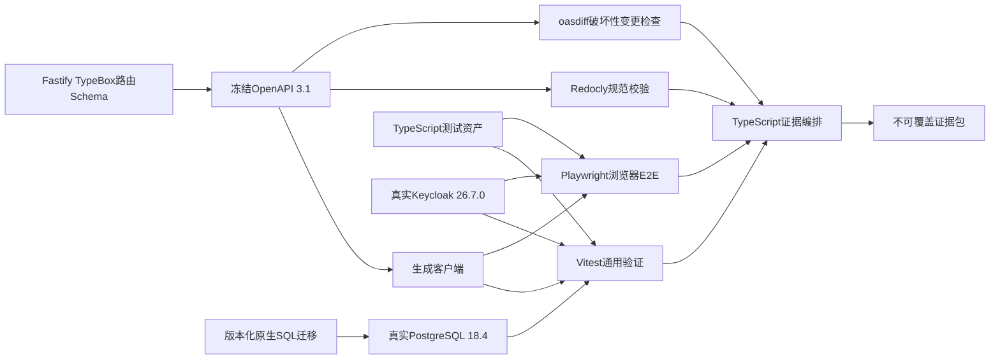

# Phase 01自动化验证、故障注入与证据基线

状态：单一TypeScript验证权威、真实依赖集成环境、双层受控故障注入、不可覆盖SHA-256证据包、CI厂商中立、根目录单一npm工作区、governance-api深模块、领域版本所有权、价表与解析模块边界、`release-distribution`统一发布登记与投递、领域内容投影与快照制品seam、领域版本化投影Schema与单一TypeBox—OpenAPI契约链、消费者精确支持声明与不兼容投递隔离、Phase 01一发布一规范投影一权威快照、投影Schema升级高风险契约治理、投影载荷与完整快照制品双摘要、PostgreSQL `bytea`事务内权威快照存储验证、仅适用于合成POC的16 MiB单快照容量门禁、完整POC受控导出瞬时技术故障有限完整重建式重试验证、完整POC确定性无压缩ZIP派生制品验证、完整POC派生ZIP独立PostgreSQL `bytea`与短事务原子提交验证、完整POC完成派生制品保留/取代及禁止选择性删除验证、完整POC派生制品代表性容量实验与超限失败关闭验证、“Phase 01只验证快照拉取、完整POC邻接受控导出、逐记录推送长期预留”的阶段范围，以及完整POC 72个REST与20个界面场景的验收基线均已确认

容量环境补充状态：ADR-0110已确认本机WSL2 Anolis OS 8.9独占运行环境及环境门禁；当前初始化回执不是容量证据运行。

容器运行时补充状态：ADR-0111已确认rootful Podman为唯一现行容器运行时；受管容器只用host network和冻结回环端口，Docker/Compose不再进入执行路径。

更新日期：2026-08-30

## 1. 目标与适用范围

本文把Phase 01已经确认的验证工具链转成可执行架构基线。它服务于收费项目—价表—解析—审计—仿真消费纵向切片和`SNAPSHOT_PULL`，证明架构门禁可以在全新环境自动重复执行，并为后续完整POC的A01至G12共72个REST API场景和U01至U20共20个管理界面场景提供同一套测试资产与证据结构。

Phase 01只执行纵向切片、`SNAPSHOT_PULL`和ABG门禁所需的场景子集，不因选择了完整POC测试工具而提前宣称72/20或受控导出已经通过。完整POC扩展必须在同一工具链上重新执行A01至G12和U01至U20，既有60/16不得替换或抵扣新增12/4。

受控导出的确定性错误与技术故障恢复只在完整POC的G05和U19中作为必需参数化子用例执行：测试必须以枚举化故障点证明同一冻结作业内有限重试、每次完整重建、尝试只追加、未知或额度耗尽待处置及受控重试。该确认不增加或改写Phase 01 ABG-01至ABG-40。

受控导出的确定性格式只在完整POC的G05、G06和U18中作为必需参数化子用例执行：固定黄金字节向量必须证明UTF-8无BOM且仅使用LF的`records.csv`、确定性`manifest.json`、只含两个`STORE`成员且元数据归一化的ZIP、清单内CSV摘要与制品外完整ZIP摘要的作用域分离，以及相同冻结输入在同一作业重试和新作业重建时逐字节一致。测试还必须阻断XLSX、裸CSV、压缩成员、分片、多格式、成员或行序漂移、传输改写及摘要错层。本规则不增加或改写Phase 01 ABG-01至ABG-40，Phase 01也不预建CSV/ZIP生成adapter。

受控导出的存储与成功提交只在完整POC的G05、G06、G07、G12和U18中作为必需参数化子用例执行：测试必须证明ZIP及摘要先在最终事务外完整形成，随后一个短PostgreSQL事务原子写入与`release_snapshot`分离的`managed_export_artifact`非空`bytea`、元数据、成功尝试/作业终态、审计及可交付资格；逐写点故障全部回滚。并发、提交前崩溃和提交后重复恢复必须分别证明完整重建、一作业一制品和既有`artifact_id`幂等返回；仓库及运行环境扫描必须证明无文件/S3/MinIO、双写、暂存提升、跨资源补偿、独立存储模块或未使用port，且所有取得路径都经过平台授权。该规则不增加Phase 01门禁，也不把16 MiB套用于派生制品。

受控导出的制品生命周期只在完整POC的G05、G07、G12和U18中作为必需参数化子用例执行：新作业必须形成新制品，取代关系只追加且不修改旧字节、清单、摘要或证据；撤权只使取得失败，恢复授权后仍返回原`artifact_id`和相同字节。契约、界面、任务、依赖及数据库写路径扫描必须证明不存在单制品删除、自动过期、覆盖、重打包、原位脱敏、选择性清理或环境处置业务入口；`poc-disposal-readiness.json`证明不可覆盖证据包未导出复核时环境处置失败关闭。实际整体处置是验收后、平台外的收尾程序，不增加Phase 01门禁或72/20编号。

受控导出的容量方法只在完整POC实施准备及G04、G05、G12和U19参数化子用例中执行，并形成两阶段证据：Phase 01全部门禁通过后，既有TypeScript验证工具链以一次性隔离试验装置、冻结的`F00`/`N10`/`N30`/`N50`/`N100`/`W50`/`E50`画像和逐字段分布版本、环境、方法及阈值测量候选ZIP、同物理形态PostgreSQL写入/读取与受控下载，支撑后续ADR冻结实施上限；业务薄切集成后，再以完全相同的画像、字段分布版本和其余参数通过实际`release-distribution`及冻结公共下载API重跑全部指标，后者才授予最终容量验收资格。运行环境由[ADR-0110](../adr/0110-use-local-wsl2-anolis-8-9-for-capacity-simulation.md)固定为本机独占运行的WSL2 `Anolis-8.9-HDI-POC`，8 vCPU、4 GiB、无swap、10 GiB根磁盘；必须保存全局WSL配置与唯一运行发行版证据，且不得把WSL用户空间结果解释为生产实机。随后还须验证作业冻结容量基线、等于上限成功、超过上限在成功事务前零制品失败关闭，以及所有替代计量与规避路径被阻断。重复次数、峰值RSS/磁盘余量/时间阈值、结果聚合和数值上限尚待确认；本规则不新增Phase 01门禁或72/20编号，Phase 01也不生成画像、字段分布fixture或容量证据。

## 2. 验证权威链

验证权威遵循以下规则：

1. TypeScript是测试用例、fixture生成、场景编排和证据汇总的唯一实现语言。
2. Vitest是通用测试运行器；Playwright Test是仅限真实浏览器端到端场景的专用例外，不再并行引入Jest或其他通用运行器。
3. Fastify路由和模块测试可以使用`inject()`避免无意义的监听端口，但必须装配真实应用插件、授权、Schema和适用的真实依赖。
4. REST验收场景只能通过冻结OpenAPI生成的客户端访问公开服务，不得维护另一套手写请求模型或测试DTO。
5. CI平台只调用仓库内确定性命令并保存产物，不能另定义场景、跳过规则、修改通过条件或生成另一份权威结论。
6. 当前根目录的npm workspaces和唯一根锁文件承载全部测试资产；测试、生成客户端和验证工具不得通过工作区便利性导入治理后端内部领域实现。
7. `governance-api`模块接口是内部行为的主要测试面；静态边界、表所有权和事务运行器门禁必须证明深模块不是目录命名约定，而是可执行约束。
8. `price-resolution`模块测试只通过`price-list`的不可变已发布解析视图工作；正式门禁必须证明单向依赖、解析证据表所有权、冻结视图重放和算法唯一实现，而不是依赖代码评审口头约定。
9. `release-distribution`模块接口是发布登记、快照/变化查询、投递状态、回执和受控重放的唯一测试面；内部轮询、租约、发送和重试不得形成独立模块或第二测试权威。
10. 领域模块接口测试必须证明投影从本模块权威状态构造并在跨越seam前完成语义校验；`release-distribution`接口测试必须从冻结投影验证规范序列化、投影载荷摘要、完整制品摘要、存储和原子登记，不得通过查询领域表或使用数据库/REST传输类型制造测试捷径。
11. 契约门禁必须证明稳定投影类型、字段语义、可执行TypeBox Schema和不可变Schema版本归所属领域模块并只经其`index.ts`提供；组合根登记并装配它们进入冻结OpenAPI 3.1，`release-distribution`只核验及携带类型、版本和Schema摘要。中央Schema模块、已引用Schema原位改义删除、平行手写契约、隐式迁移或按版本标签推断兼容性必须自动阻断。
12. 消费门禁必须以两个仿真消费者的不可变订阅版本验证精确支持集合、发布前本地预检、`BLOCKED_INCOMPATIBLE`无租约/网络/尝试/水位推进、兼容消费者继续和升级后原快照受控重放；禁止`latest`、通配符、范围、SemVer推断、运行时探测、自动降级、转换或迁移。
13. 发布制品门禁必须证明每个`governance_release`恰有一个`CANONICAL`快照、发布ID与快照ID分别稳定、两个消费者引用同一制品，且第二快照、另一Schema或消费者变体登记失败；以相同领域内容升级Schema时必须形成新发布、新契约、新快照和新双摘要，旧字节及双摘要不变。仓库扫描必须阻断多投影表、注册器、转换器、变体路由器、消费者选择器和未使用的多投影port。
14. Schema治理门禁必须证明升级固定为高风险，冻结领域Owner语义确认、平台契约Owner终审、TypeBox/OpenAPI差异、精确支持兼容矩阵、冻结客户端仿真消费和影响分析。同一已授权人员可以分别提交及终审纯契约升级，但动作必须分别授权、编号和审计；领域内容、成员、规则或生命周期变化后同人终审必须失败。消费者Owner无审批或否决动作，发布时不得探测消费者，也不得建立独立契约治理模块。
15. 双摘要门禁必须使用固定字节向量证明`projection_payload_digest`只覆盖规范投影载荷，`snapshot_artifact_digest`覆盖最终冻结包络加载荷完整字节且不自嵌入；两者初始使用SHA-256并冻结算法与序列化规则。改变存储位置、投递、尝试、回执、审计或运维状态不得改变摘要，跨Schema领域等价只能由领域版本或成员摘要证明，历史摘要不得重算或覆盖。
16. 快照存储门禁必须证明最终制品精确字节保存于`release_snapshot`非空PostgreSQL `bytea`，并与发布事实、元数据、成员、预检、独立投递、审计和Outbox同事务；两个消费者只能凭稳定快照ID经生成客户端下载。任何文件/S3实现、双写、暂存提升、跨资源补偿、数据库直读、物理位置泄露、独立存储模块或未使用port必须自动阻断。
17. 容量门禁必须以最终规范制品逻辑字节计量并覆盖边界值：16,777,216字节成功，16,777,217字节返回`SNAPSHOT_ARTIFACT_TOO_LARGE`且全回滚、无投递和水位推进。TOAST与HTTP内容编码不得改变计量，拆分、截断、裁剪、改换序列化、压缩规避、替代快照和外部存储回退均被阻断；静态扫描还必须证明16 MiB只标为合成POC护栏，没有成为全院初始化、生产容量、性能SLA或招标默认值。
18. 完整POC派生制品容量门禁必须使用冻结容量负载画像矩阵和原始测量建立可追溯的数值依据，计量最终确定性ZIP精确字节；后续上限冻结后，等于上限可提交，超过上限必须在成功事务前保持制品、成功尝试、成功作业和可交付资格零基数。记录数、CSV大小、TOAST/物理占用、HTTP编码及证据包压缩大小不得成为计量权威，压缩、分片、截断、表示切换、存储回退和临时放宽不得成为规避路径；测量不安全时必须阻断受控导出实现并要求新架构ADR。
19. 完整POC容量证据必须成对保存前置可行性实验与集成后真实链路核验；两者使用完全相同的画像身份及版本、环境、方法和阈值并记录差异。前置装置不是业务API、正式DDL、运行时依赖或最终验收权威；集成后阶段必须调用实际`release-distribution`和冻结公共下载API。核验失败不得换画像、择优或静默放宽，任何上限调整须有新证据和新ADR。
20. 容量画像生成器及矩阵编排只属于既有TypeScript验证工具链中的确定性fixture资产，不是业务领域、数据库实体、公共契约、管理界面能力、独立应用、workspace或共享包。矩阵固定包含`F00`、`N10`、`N30`、`N50`、`N100`、`W50`和`E50`，最终CSV数据行数分别为24、10,000、30,000、50,000、100,000、50,000和50,000且不含表头；`F00`不参与上限推断，四个`N`画像仅改变行数，`W50`隔离行宽压力，`E50`隔离中文多字节和合法CSV转义压力。容量fixture与业务验收fixture隔离，记录必须有效、唯一、引用完整、有稳定全序且可确定转换；画像必须冻结身份/版本、投影Schema、交付配置/格式、生成器/代码摘要、种子、行数、分布及字符规则，且每个外部变长字符串必须有有限可执行最大长度。Phase 01不得预建或运行该生成器；集成后阶段必须让生成结果进入真实`release-distribution`及公共下载路径，不能保留平行容量实现。
21. 同一容量fixture资产必须按精确输出列身份和稳定记录顺序执行ADR-0109，不得以运行时随机近似：四个`N`画像逐可选字段精确70%有值/30%冻结空值，适用非空文本精确70%/25%/5%达到冻结合法最大Unicode码点长度的20%/50%/85%；普通画像只用安全单字节基线字符，身份/代码/枚举/引用/摘要/严格模式字符串使用合法确定性生成器且排除出长度分布。`W50`全部可选字段有值，字符串目标90%且唯一后缀计入预算，非字符串采用最长合法表示，字符串保持单字节。`E50`复用`N50`逐字段非空与码点长度分布，每个适用文本字段内按稳定顺序形成纯中文、中文+ASCII、含逗号、含双引号、含逗号/双引号/LF五组各20%；适用/排除列由身份清单冻结，LF只进入多行字段，身份/代码/枚举/引用/摘要/金额/数值/日期/日期时间/布尔/不兼容模式字段排除。无合法字段、映射与Schema不一致、静默跳过或重分配必须失败关闭。字符串长度使用Unicode码点，容量只使用最终ZIP字节。该规则不形成第二生成器、业务配置或Phase 01资产。
22. 两阶段容量证据运行前必须执行ADR-0110环境门禁：先`wsl --shutdown`，再只启动`Anolis-8.9-HDI-POC`；保存WSL版本/内核、`.wslconfig`摘要、唯一运行发行版、Anolis用户空间身份、`nproc=8`、约4 GiB `MemTotal`、空swap列表、10 GiB根块设备、systemd状态和`Asia/Shanghai`。任一其他WSL、Docker Desktop、Podman Machine或其他容器后端并发，或者资源配置漂移、根磁盘扩容、环境清单缺失，均使该轮证据失格；不得把通过结果描述为Anolis原生内核、生产实机或内网服务器验收。

`E50`适用字段必须同时合法容纳全部五类；不允许LF的单行文本列整体排除在五组压力清单之外并保持普通内容，不能只跳过第五组或把其20%转移给其他类别。

## 3. 工具与版本基线

| 能力 | Phase 01基线 | 版本与冻结要求 |
|---|---|---|
| 包管理与工作区 | npm workspaces | Node.js精确`24.18.0`、npm精确`11.9.0`、一个根`package-lock.json`，正式安装使用`npm ci` |
| 容器运行时 | rootful Podman | 精确`4.9.4-rhel`；唯一API为`/run/podman/podman.sock`；受管容器只用host network并在进程层绑定冻结回环端口；Docker CLI、Compose provider、桥接网络和端口发布均不进入现行执行路径 |
| 通用TypeScript测试 | Vitest | 首个证据基线精确固定`4.1.6`；`@vitest/coverage-v8`保持同版 |
| Fastify模块和路由测试 | Vitest＋Fastify `inject()` | 使用实际应用构建入口，不另建测试专用业务实现 |
| REST API场景 | Vitest＋冻结OpenAPI生成客户端 | 客户端来源摘要进入证据包 |
| React组件交互 | 在Vitest内运行 | 不引入Jest形成第二套通用测试权威 |
| 浏览器端到端 | Playwright Test | 首个证据基线精确固定`1.61.0`；浏览器构建标识进入证据包 |
| 真实依赖环境 | Testcontainers for Node | npm精确版本在工程锁文件中冻结 |
| 数据库 | PostgreSQL容器 | 精确`18.4`并冻结镜像摘要 |
| 身份提供方 | Keycloak容器及隔离持久化厂商数据库 | Keycloak精确`26.7.0`并冻结镜像摘要；厂商数据库产品、版本和镜像摘要在工程初始化时冻结 |
| 网络故障 | Toxiproxy容器 | 产品版本和镜像摘要在首个证据基线冻结 |
| OpenAPI规范检查 | Redocly CLI | 精确版本在工程锁文件和证据中冻结 |
| OpenAPI兼容检查 | oasdiff | 精确版本及二进制或镜像摘要进入证据 |
| 证据编排 | 仓库内TypeScript命令 | 与测试资产同版本、同锁文件、同一运行身份 |
| 模块结构门禁 | 仓库内TypeScript静态检查＋Vitest | 检查唯一公开入口、导出清单、依赖环、禁止深层导入、表所有权、横向层、通用业务基类、独立通用版本模块/基类/仓储/CRUD或生命周期引擎、`price-resolution -> price-list`已发布视图单向依赖，以及`release-distribution`表所有权、禁止拆分`publication`/`delivery`/`outbox`/`snapshot-builder`/`snapshot-store`/`compatibility`/`digest`、内部派发器不外露与阶段隔离；同时检查领域投影无数据库/REST类型泄漏、分发模块无领域表查询、PostgreSQL `bytea`存储无反向写入、文件/S3/暂存提升/补偿及未使用存储port为零、容量护栏无拆分/截断/压缩规避且未外推全院、双摘要责任不外移、投影Schema归属领域模块且只经唯一入口导出、禁止中央`projection-schema`/`shared-schemas`、组合根契约登记与装配、版本化订阅支持和预检归同一深模块、禁止转换器与自动降级；精确实现工具在工程初始化时冻结 |

同一主版本内的补丁升级可以按普通依赖变更评审，但必须更新锁文件、工具清单及证据摘要并重新执行全部受影响门禁。Vitest或Playwright主版本、真实依赖策略、契约检查权威或证据不可变语义发生变化时，必须重新确认核心架构。

## 4. 真实依赖集成环境

每次正式验证从受控、隔离的环境启动，并至少满足：

1. PostgreSQL从空数据库执行全部权威原生SQL迁移，再生成及校验数据库派生类型；不得从预制业务数据库或人工快照起步。运行时PostgreSQL绑定`127.0.0.1:55432`，Testcontainers集成PostgreSQL通过同一Podman socket以host network绑定`127.0.0.1:55433`，不得用端口NAT或第二容器后端。
2. Keycloak使用正式版本镜像、与治理数据库分离的持久化厂商数据库和合成Realm配置，真实执行人员Authorization Code＋PKCE S256及服务Client Credentials；重启测试不得依赖内置临时数据库，不得通过测试请求头、伪造令牌或应用内假身份提供方绕过。
3. Toxiproxy和容器生命周期只用于构造依赖延迟、超时、断连、恢复和重启，不改变平台领域结果。
4. fixture使用固定生成版本、种子和稳定标识；不得导入真实患者、人员、费用、医嘱或消费系统数据。
5. 各正式运行不得复用上一次运行的业务数据库、Keycloak状态、消费者水位或证据目录。
6. SQLite、内存数据库、内存Outbox、伪造IAM和预置成功消费者只能用于与业务无关的局部开发实验，不能进入任何架构门禁或验收结论。

## 5. 测试分层

| 层级 | 目的 | 必须使用 | 不可替代为 |
|---|---|---|---|
| 静态与构建 | 类型、工作区及模块依赖边界、生产构建 | TypeScript严格检查、前后端构建、依赖图、模块导出及禁止结构扫描、依赖锁文件 | 人工代码浏览或目录命名约定 |
| 单元与领域 | 纯规则、状态机、规范化和Decimal边界 | Vitest、固定输入输出 | 仅界面演示 |
| 模块接口 | 治理命令、查询、不变量、权限、版本、错误和事务副作用 | Vitest＋模块公开接口＋真实PostgreSQL（涉及持久化时） | 内存repository或仅测试内部类 |
| 路由adapter | Fastify插件、Schema、认证适配、错误契约 | Vitest＋`inject()`＋实际组合根 | 手写controller替身或复制业务规则 |
| 数据库集成 | 迁移、约束、事务、并发、双时态和排序 | Vitest＋真实PostgreSQL 18.4 | SQLite或内存仓库 |
| REST场景 | 公开契约、权限、状态、副作用和证据 | Vitest＋生成客户端＋真实服务 | Postman集合或内部函数调用 |
| 浏览器E2E | 真实OIDC、同源SPA和用户闭环 | Playwright Test＋真实Keycloak | 预置令牌或静态页面 |
| 消费闭环 | 投递、幂等、缺口、重试、水位和回执 | 独立仿真消费者＋公开契约 | 应用内假回调 |
| 故障与恢复 | 事务窗口、崩溃窗口、网络和依赖恢复 | 枚举化故障点＋Toxiproxy/容器生命周期 | 人工改库或随机破坏 |

代码覆盖率由V8生成并作为未测试路径诊断材料，不以一个总体百分比替代ABG门禁、72个REST场景或20个界面场景。任何强制场景失败时，即使覆盖率达到目标也不能通过。

## 6. 双层受控故障注入

### 6.1 第一层：枚举化测试故障点

测试故障点用于精确停在已知事务和处理边界，至少覆盖：

- 发布事务写入完成但提交前。
- 发布提交完成但进程内唤醒前。
- 消费者投递租约认领完成但网络调用前。
- 消费者返回成功但投递尝试及状态尚未落库。
- 消费者完成幂等应用但回执响应尚未返回。
- 快照`bytea`、快照元数据、发布、成员、预检、独立投递登记、审计或Outbox任一写入失败导致整个发布事务回滚。
- 最终规范制品为16,777,217字节时在容量校验边界失败，验证无发布事实、快照、投递、Outbox或水位推进；16,777,216字节的相邻向量正常提交。

每个故障点必须具有稳定枚举标识，只能通过测试组合根注入；公开REST、请求头、Cookie、普通环境变量或浏览器均不得触发。生产配置不得注册测试故障实现，发现启用请求时必须失败启动并留下安全诊断。

### 6.2 第二层：依赖与网络故障

Toxiproxy及Testcontainers生命周期负责验证：

- 数据库、Keycloak或消费者的连接延迟、超时、拒绝和恢复；Phase 01不存在独立快照服务连接。
- 消费者连接在请求或响应期间断开。
- 应用、消费者或依赖容器停止、重启后的租约回收、幂等重试、缺口恢复和水位推进。
- 唤醒丢失时数据库轮询仍能恢复Outbox积压。

网络和容器故障必须由测试清单显式声明，使用固定持续时间、次数和恢复动作；不得引入随机、长期运行或无法复现的混沌实验作为Phase 01通过条件。

## 7. OpenAPI与生成客户端门禁

一次正式验证按以下顺序执行：

1. 枚举代表性领域模块从唯一`index.ts`导出的`projection_type`、不可变Schema版本、可执行TypeBox Schema及规范摘要，核对组合根登记身份且确认仍被快照引用的历史版本可追溯。
2. 由组合根把领域投影Schema与其他Fastify公开路由Schema确定性装配后生成OpenAPI 3.1 JSON。
3. 对生成结果执行稳定规范化，并与仓库冻结产物及其摘要比较。
4. 使用Redocly CLI按项目规则集执行OpenAPI 3.1规范校验并保存机器可读结果。
5. 使用oasdiff将本次契约与已批准基线比较；未经批准的破坏性变化直接阻断。
6. 只从通过门禁的冻结产物生成管理界面、仿真消费者和REST测试客户端。
7. 校验生成客户端来源摘要，扫描并阻断中央投影Schema主权、平行手写OpenAPI/JSON Schema/公共DTO、消费者私有契约和后端内部类型导入。
8. 校验订阅支持声明只能引用冻结OpenAPI中登记的精确投影类型和Schema版本；阻断`latest`、通配符、版本范围、SemVer推断、字段试读和消费者运行时探测。
9. 以相同领域内容分别执行旧Schema发布和新Schema契约升级发布，核对两次显式发布均引用各自冻结契约与唯一快照，旧发布契约、字节和双摘要未被重生成或覆盖；不得把两个Schema挂到同一发布。
10. 核对Schema升级请求冻结四类证据和两个责任确认；分别执行纯契约升级同人提交/终审成功、领域内容变化后同人终审失败、消费者不兼容但发布继续三个子用例，并确认结果只来自本地授权、冻结契约和订阅声明，不调用消费者。
11. 校验快照、事件和查询Schema明确携带`projection_payload_digest`、`snapshot_artifact_digest`及各自算法和序列化规则版本；阻断含义模糊的快照`content_hash`、完整制品摘要自嵌入及按当前规则重算历史摘要。
12. 校验快照元数据与下载Schema只使用稳定快照ID、媒体类型和字节数，下载响应字节可核验且不返回数据库表、列、连接或物理位置；消费者生成客户端不得包含数据库类型或文件/S3存储定位字段。
13. 校验发布错误契约包含稳定`SNAPSHOT_ARTIFACT_TOO_LARGE`错误码和规则引用；`artifact_byte_length`表示最终规范制品逻辑字节数，不因HTTP内容编码变化，也不得把16 MiB声明为生产或全院契约保证。

新增、兼容性扩展和已批准破坏性变更仍必须形成契约版本、变更说明和新基线，oasdiff没有发现破坏性变化不等于可以绕过治理评审。

## 8. 正式验证运行与证据包

### 8.1 运行身份

每次正式运行创建新的`validation_run_id`和显式`run_seq`。`run_seq`是同一验证配置内的展示和处理顺序权威；`started_at`、`finished_at`继续使用固定`Asia/Shanghai`无时区本地日期时间，只表示时间而不替代顺序。

正式运行至少冻结：

- 应用构建、源代码状态和依赖锁文件摘要。
- Git根、workspace清单、包依赖图、禁止导入扫描和根`package.json`摘要。
- governance-api模块清单、唯一公开入口及导出、模块依赖图、表与迁移拥有模块、禁止结构扫描和组合根装配摘要。
- `charge-catalog`与`price-list`版本及生命周期表清单、SQL写入调用路径和工作流决定到领域发布的事务测试摘要。
- `price-list`已发布解析视图契约及摘要、`price-resolution`三类证据表所有权、单向依赖和禁止草稿/跨模块SQL/算法复制结果，以及冻结视图重复解析和后续发布不改变历史证据的摘要。
- `release-distribution`唯一接口和表所有权、禁止拆分模块及跨模块SQL扫描，以及发布登记、提交后唤醒、轮询、租约、网络、结果落库和回执阶段的故障测试摘要。
- 代表性领域投影的冻结输入及校验摘要、禁止数据库/REST类型泄漏结果、`release-distribution`不查询领域表且独占规范序列化/双摘要/存储的检查，以及相同输入的载荷、快照逐字节和双摘要重复性结果。
- 代表性领域投影Schema清单、类型/版本/Schema摘要及算法、模块唯一入口导出、组合根登记与TypeBox装配、冻结OpenAPI收录、历史被引用版本可追溯性，以及中央Schema模块、平行Schema/DTO、原位改义删除和隐式迁移扫描结果。
- 两个仿真消费者的订阅稳定身份、不可变版本、精确支持集合及登记Schema摘要；逐发布预检输入、规则版本和结果；不兼容投递、影响事项、无租约/尝试/水位推进与兼容消费者继续结果；升级后新订阅版本和原快照受控重放，以及无自动降级、转换和迁移证明。
- 每个代表性发布相互独立的发布ID与唯一`CANONICAL`快照ID、一对一基数和两个消费者共同制品引用；第二快照/并行Schema/消费者变体登记失败；相同领域内容契约升级的新发布、新契约、新快照和新双摘要；原制品逐字节、算法、序列化规则及双摘要不变，以及无多投影注册、转换、路由、选择或未使用扩展框架证明。
- 双摘要固定向量及篡改结果：载荷字节变化使双摘要核验失败，包络字节变化只使完整制品核验失败，可变存储/投递/回执/审计状态变化不改变摘要，完整制品摘要不自嵌入；跨Schema领域等价仅以领域证据判定，历史重算失败，含义模糊的快照`content_hash`和独立摘要模块扫描结果为零。
- PostgreSQL快照存储证据：`release_snapshot`非空`bytea`、媒体类型、精确字节数、数据库读取值、API下载值和完整制品摘要逐字节一致；各事务写点故障全量回滚；两个消费者无数据库凭据且只经生成客户端按稳定快照ID下载；文件/S3实现、暂存提升、补偿状态机、物理位置字段、独立存储模块和未使用port扫描为零。
- Phase 01快照容量证据：16,777,216与16,777,217字节固定向量、稳定错误码、超限全回滚、无投递/水位推进、TOAST及HTTP内容编码不改计量，以及拆分/截断/裁剪/序列化变更/压缩规避/替代快照/外部存储回退扫描为零；文档和配置扫描证明16 MiB没有被外推为全院初始化、生产容量、性能SLA或招标参数。
- 完整POC派生交付制品生命周期证据：每个成功`managed_export_artifact`的精确ZIP字节、元数据、独立摘要、清单、来源快照及交付配置引用、成功尝试和闭环证据；新旧制品及只追加取代关系；撤权失败与恢复授权后同一`artifact_id`逐字节复得；无删除、自动过期、覆盖、重打包、原位脱敏、选择性清理和环境处置业务入口；以及证明不可覆盖证据包已经导出并复核的`poc-disposal-readiness.json`。该项只在完整POC扩展执行，不进入Phase 01证据包。
- 完整POC派生交付制品容量证据：前置可行性实验和集成后真实链路核验的阶段身份、完全相同的七类画像身份/版本、精确最终CSV数据行数、投影Schema、交付配置/格式、生成器/代码摘要、种子、分布、全序、字符/转义集合、环境、方法和阈值；`F00`排除在容量推断外，四个`N`画像只改变行数，`W50`和`E50`分别隔离行宽与多字节/转义压力，容量fixture与业务fixture隔离，记录有效/唯一/引用完整/确定转换且所有变长输出字段存在有限最大长度的机器证明；重复运行原始测量与汇总、两阶段差异解释及各自判定；最终ZIP字节、Node.js峰值RSS与生成耗时、PostgreSQL写入耗时/WAL增量、受控或公共API下载耗时/摘要核验和证据包体积，以及到后续数值ADR及运行时硬上限的追溯；前置结果不得拥有最终验收资格，等于和超过上限的边界向量、超限零制品/零成功资格及替代计量/规避路径阻断结果必须来自集成真实链路。画像行数不得形成真实医院、生产容量、SLA或招标结论；该项不进入Phase 01证据包。
- 同一`managed-export-capacity-study.json`的字段分布证据：按画像、精确输出列和类别保存期望/实际计数、合法最大长度、20%/50%/85%或90%目标Unicode码点长度及夹取结果、适用/排除原因、唯一后缀预算、字符和转义类别；机器证明普通画像逐字段70%/30%和适用文本70%/25%/5%、`W50`的100%/90%、`E50`复用`N50`分布且五类各20%精确成立。还须保存安全单字节隔离、LF仅用于多行字段、无按名称推断或随机近似，以及缺少合法字段、Schema映射不一致、静默跳过或重分配均失败关闭的结果；Unicode码点长度与最终ZIP字节容量计量分别留证。该项不进入Phase 01证据包。
- Schema升级的高风险分类、领域内容及成员相等证明、领域Owner语义确认、平台契约Owner终审、TypeBox/OpenAPI差异、精确支持兼容矩阵、冻结客户端仿真消费、影响分析、同一人员分别授权和审计动作、内容变化后例外失败、消费者无审批动作，以及无独立契约治理模块和发布时探测证明。
- Node.js、Vitest、Playwright、浏览器、Testcontainers、Redocly和oasdiff精确版本。
- PostgreSQL、Keycloak和Toxiproxy镜像名称、产品版本及不可变摘要。
- 迁移清单、Schema指纹、冻结OpenAPI、生成客户端和规则集摘要。
- fixture生成版本、种子、对象数量和稳定身份清单。
- 执行的门禁、场景、故障配置及其顺序。

### 8.2 最小证据结构

每个运行至少生成下列逻辑产物；物理目录名可以在工程初始化时确定，但不得改变语义：

| 产物 | 必需内容 |
|---|---|
| 运行清单 | 运行身份、序号、配置、开始及结束时间、最终状态 |
| 工具与环境 | Git根、workspace清单、精确工具版本、唯一锁文件摘要、包依赖图、容器及浏览器摘要、时区和环境边界 |
| 契约检查 | 领域投影Schema清单及类型/版本/摘要、快照/事件/查询中的双摘要及算法字段、模块入口与组合根装配、OpenAPI收录及重生成、历史Schema可追溯性、订阅精确支持引用及禁止`latest`/通配符/范围/SemVer检查、中央/平行Schema扫描、Redocly、oasdiff及客户端来源结果 |
| 数据库检查 | 空库迁移、扩展、约束、Schema指纹、类型生成和漂移结果；`release_snapshot`非空`bytea`、媒体类型/字节数及更新删除权限、发布事务各写点全回滚、下载字节一致性、16 MiB边界向量及超限无半发布结果 |
| 完整POC派生交付制品 | 每个成功派生ZIP的精确字节、独立摘要与清单、来源及配置冻结引用、成功尝试与闭环证据、只追加取代关系、旧制品不变、撤权及复权结果、禁止选择性删除路径扫描和`poc-disposal-readiness.json`；Phase 01不生成该项 |
| 完整POC派生制品容量 | `managed-export-capacity-study.json`包含前置与集成后阶段身份、完全相同的七类画像身份/版本及24/10,000/30,000/50,000/100,000/50,000/50,000个不含表头的最终CSV数据行、投影Schema/交付配置/格式/生成器/代码摘要/种子/分布/全序/字符规则、有限最大长度门禁、容量fixture与业务fixture隔离及有效唯一可转换记录证明、环境/方法/阈值、两阶段原始测量/汇总/差异/判定、最终ZIP/峰值内存/生成/数据库写入与WAL/受控或公共API下载及摘要核验/证据包体积、数值ADR和运行时上限引用、`F00`无推断资格、前置无最终资格、集成后边界结果及无规避路径证明；Phase 01不生成该项 |
| 完整POC容量字段分布 | 同一`managed-export-capacity-study.json`记录每画像、每输出列、每类别的期望/实际计数、最大长度、目标Unicode码点长度及夹取、适用/排除清单、唯一后缀预算、字符/转义类别，证明普通画像70%/30%与70%/25%/5%、`W50` 100%/90%、`E50`五类各20%以及全部失败关闭条件；不得另建第二证据权威，Phase 01不生成该项 |
| 模块边界检查 | 模块清单、公开入口及导出、依赖图及环、禁止深层导入、表所有权和跨模块SQL访问、横向层/通用基类/服务定位器扫描、领域版本所有权及禁止通用版本抽象扫描、`price-resolution -> price-list`已发布视图依赖、`release-distribution`唯一入口和表所有权、禁止`publication`/`delivery`/独立`outbox`/`snapshot-builder`/`snapshot-store`/`compatibility`/`digest`及内部派发接口扫描、领域投影无数据库/REST类型泄漏、分发模块无领域表查询、PostgreSQL `bytea`快照存储无反向写入、文件/S3/暂存提升/补偿/未使用存储port扫描、API下载无物理位置泄露、制品与双摘要确定性、领域投影Schema所有权及唯一入口导出、禁止中央Schema模块、组合根契约登记装配、版本化订阅支持/预检/阻断/重放所有权、禁止转换器与自动降级及事务运行器结果 |
| Vitest结果 | 机器可读JSON/JUnit、失败详情和V8覆盖率 |
| Playwright结果 | 机器可读JSON/JUnit；失败场景保留trace、截图或录像 |
| 故障注入结果 | 故障点或代理规则、触发证据、恢复动作及最终不变量 |
| 业务证据索引 | 请求ID、规则ID、对象及发布版本、审计、解析、Outbox、回执引用 |
| 验证总结 | ABG或验收场景逐项结论、偏差、不在范围项和阻断项 |

### 8.2.1 ABG 门禁结果协议迁移

`phase-01.producer-evidence.v2` 和 `phase-01.producer-evidence-index.v2` 继续作为 producer 原始证据及其索引协议。门禁 producer 不再读取共享编排的总体 `PASSED`，也不再把共享、实时、Vitest 或 Playwright 完整文件复制到每个门禁目录。

门禁结果升级为 `phase-01.abg-gate-result.v3`：每项必须记录其自身的场景和断言集合、直接关联的请求/主体/对象/版本/规则/冻结输入/制品摘要，以及每个选择器对应的相对路径、媒体类型、长度、SHA-256、producer、场景、断言、JSON Pointer 和选中 claim 摘要。结果还记录覆盖矩阵和所用 producer evidence index 的摘要。任一选择器、指针、身份引用、规则或摘要无法核验即失败关闭。

正式运行总结升级为 `phase-01.abg-run.v3`。它拒绝旧版门禁结果，并在 setup 前后复核覆盖矩阵及 producer 协议身份；每个引用必须留在运行根内、非符号链接、字节长度/媒体类型/摘要一致，并解析到相同 gate、scenario、assertion 和 producer 的 `PASSED` claim。ABG-40 使用先完成的 39 项非自引用结论建立不可变 preconclusion，再由自身门禁证明引用，避免把共享总体状态或循环自证当作通过条件。

### 8.3 不可覆盖与完整性

证据编排器在运行结束后生成规范化`manifest.json`，其中按稳定路径排序列出除清单自身及`manifest.sha256`外每个产物的媒体类型、字节数和SHA-256；再将规范化清单字节的SHA-256写入`manifest.sha256`，该值就是证据包身份。清单和包身份完成后运行进入终态，任何文件不得覆盖、补写或删除；需要纠正、补跑或重新取证时必须创建新的运行身份，并通过显式关系指向被取代或补充的运行。

压缩包、对象存储副本或CI制品只是同一证据包的传输副本，不能成为另一份内容权威。解包后必须重新计算清单和包身份；不一致时证据无效。

证据不得包含密码、客户端密钥、访问或刷新令牌、完整Cookie、真实业务数据或规范快照正文。完整POC中只含合成数据的派生交付ZIP是经ADR-0105批准的唯一正文例外：它必须作为生命周期与整体处置前置证据原样入包，不得借此收入真实业务数据或把规范快照正文复制进证据包。截图、trace和录像只用于辅助定位，不能替代公开API、审计、版本、快照、Outbox和回执等机器可核验证据。

### 8.4 验证器对抗性基线

AR-06 建立的合法 fixture 只用于验证验证器本身，协议身份为 `phase-01.validator-test-fixture.v1`，并显式记录 `formalAcceptanceEligible: false` 和 `servicesStarted: false`。fixture 使用固定运行身份、序号、时间、冻结输入和合成引用；同一代码版本下重复生成时，运行计划、40 项 producer 门禁证明、总结、manifest 和包摘要必须逐字节一致。它不连接 PostgreSQL、Keycloak、网络或浏览器，也不得被复制到正式 evidence 路径或表述为正式 ABG 证据。

合法 fixture 仍完整遵循生产协议链：

1. 每个 producer 生成 `phase-01.producer-evidence.v2`，其场景、断言、命令身份、冻结输入和业务引用由 producer evidence validator 校验。
2. 40 项门禁各自生成 `phase-01.abg-gate-result.v3`；每项必须使用覆盖矩阵登记的 scenarioId、assertionId 和 selector，不得借用共享总体状态。
3. `phase-01.abg-run.v3` 的正式总结验证器重新计算门禁数量、唯一性、顺序、通过/失败计数、setup 结果、运行及权威摘要、producer 退出码、失败码一致性和 selector 集合唯一性。runner 只有在准备给出 `PASSED` 时通过该验证器，才能继续封包。
4. 独立 reviewer 从已封包目录重新读取每个字节，核对 manifest、路径、媒体类型、长度、SHA-256、JSON Pointer、选中 claim、producer 索引和运行身份；review 输出写入独立且必须不存在的目录，源 evidence 在复核前后摘要必须相同。

`npm run test:verification:adversarial` 运行 59 个互不依赖的 mutation，覆盖用户要求的 55 类缺失、重复、错配、伪造、目录穿越、符号链接、覆盖、cleanup 越权和 secret 泄漏；其中 `placeholder`、`UNKNOWN`、`N/A` 与空字符串分别作为独立 mutation，另以 malformed JSON 中的裸配置 secret 证明解析失败也不会绕过泄漏扫描。每项都声明稳定 mutationId、检测层和期望错误码，并把实际结果写入被根 `.gitignore` 的 `.runtime/test-results/verification-adversarial-summary.json`。通过条件是 `mutationCount >= 55`、`detectedCount = mutationCount`、`survivedCount = 0`；不得通过更新 snapshot、吞掉异常或依赖测试执行顺序改变该结论。

关键失败关闭错误码如下；完整逐 mutation 映射以测试源码和机器汇总为准：

| 验证边界 | 关键错误码 |
|---|---|
| producer 总体与断言一致性 | `PRODUCER_EVIDENCE_SCENARIO_PASSED_WITH_NON_PASSED_ASSERTION`、`PRODUCER_EVIDENCE_PASSED_WITH_NON_PASSED_SCENARIO`、`PRODUCER_EVIDENCE_REFERENCE_INVALID` |
| 正式总结的 40 项完整性 | `GATE_RESULT_COUNT_INVALID`、`GATE_ID_DUPLICATE`、`GATE_ORDER_OR_ID_MISMATCH`、`PASSED_COUNT_MISMATCH`、`RUN_STATUS_MISMATCH` |
| gate-specific 证明 | `GATE_ASSERTIONS_MISMATCH`、`ABG_GATE_RESULT_EVIDENCE_SELECTOR_MISSING`、`SELECTED_CLAIM_DIGEST_MISMATCH` |
| manifest 与终态字节 | `MANIFEST_UNLISTED_FILE`、`MANIFEST_SHA256_MISMATCH`、`MANIFEST_FILE_SHA256_MISMATCH` |
| 路径与不可覆盖输出 | `ABG_GATE_RESULT_EVIDENCE_PATH_INVALID`、`EVIDENCE_SYMLINK_FORBIDDEN`、`REVIEW_OUTPUT_ALREADY_EXISTS`、`ABG_GATE_RESULT_ALREADY_EXISTS` |
| cleanup 范围 | `FORMAL_CLEANUP_PODMAN_PRUNE_FORBIDDEN`、`FORMAL_CLEANUP_COMMAND_SCOPE_INVALID`、`FORMAL_CLEANUP_RESOURCE_OWNERSHIP_MISMATCH` |
| secret 泄漏 | `EVIDENCE_STDOUT_SECRET_EXPOSED`、`EVIDENCE_STDERR_SECRET_EXPOSED`、`EVIDENCE_JSON_SECRET_EXPOSED`、`EVIDENCE_JSON_SECRET_SCAN_INVALID` |

失败证据遵循两类不同保留边界。正式运行或独立复核失败时，原 evidence 和 review findings 都必须保留，不得补写、覆盖或用后续成功结果替换；需要重跑时创建新运行身份。对抗性测试只操作操作系统临时目录中的 fixture 副本，测试结束后校验临时目录前缀再递归删除，绝不删除正式 evidence 路径；仓库内只保留忽略提交的机器汇总。无论该对抗测试是否全部通过，都只能说明验证器具有已列失败能力，不能表述为正式 ABG 通过、完整 POC 通过或生产就绪。

## 9. CI厂商中立执行

仓库必须通过根npm脚本、npm原生workspace命令或仓库内TypeScript编排器提供可在开发机或任意CI执行的确定性命令边界，不引入Turborepo、Nx或CI厂商任务图。命令至少覆盖：

- 静态检查与生产构建。
- governance-api模块公开入口、依赖环、禁止导入、表所有权、组合根和事务作用域门禁。
- `price-list`已发布解析视图、`price-resolution`单向依赖、算法唯一实现、冻结视图重放和历史证据不变门禁。
- `release-distribution`唯一模块接口、表所有权、禁止拆分模块、发布登记与提交后投递阶段隔离及平台/消费者水位分离门禁。
- 领域内容投影构造与语义校验、投影seam类型泄漏阻断、`release-distribution`规范序列化/双摘要/存储独占、无领域表查询及相同输入制品确定性门禁。
- 领域投影Schema清单与不可变身份、模块唯一入口导出、组合根TypeBox装配、冻结OpenAPI收录、历史Schema可追溯，以及中央/平行Schema、原位改义删除和分发模块隐式迁移阻断门禁。
- 消费者不可变订阅版本与精确支持声明、发布前预检、`BLOCKED_INCOMPATIBLE`隔离、兼容消费者继续、升级后受控重放原快照，以及禁止`latest`/范围推断、消费者探测、自动降级/转换/迁移门禁。
- 一发布一`CANONICAL`规范投影快照、发布与快照身份分离、第二制品登记失败、相同内容的契约升级新发布、旧制品不变，以及多投影表/注册器/转换器/路由器/选择器/未使用port阻断门禁。
- 投影载荷摘要与完整制品摘要的固定字节作用域、外置制品摘要、算法/序列化规则冻结、可变运维状态排除、领域等价证据独立、历史不可重算，以及含糊单摘要/独立摘要模块阻断门禁。
- PostgreSQL `bytea`快照字节、媒体类型和字节数冻结，同发布事务全回滚，平台API授权下载与摘要核验，消费者无数据库旁路，以及文件/S3、暂存提升、跨资源补偿、独立存储模块和未使用port阻断门禁。
- Phase 01最终规范制品16 MiB边界、稳定超限错误、无规避路径和禁止未经容量验证外推全院的门禁。
- 完整POC七类容量画像版本及精确最终CSV数据行数、业务fixture隔离、有效唯一可转换记录、有限字符串上限、`F00`无推断资格、前置隔离可行性实验、后续数值ADR、集成后实际`release-distribution`及冻结公共API同参数核验、两阶段差异与资格判定、最终ZIP精确字节边界、超限零制品失败关闭及无替代计量/规避路径的门禁；Phase 01执行清单不生成或运行该项。
- 完整POC逐字段70%/30%非空、文本70%/25%/5%与20%/50%/85%目标长度、`W50` 100%/90%、`E50`复用`N50`逻辑分布并五类各20%、显式适用/排除列、Unicode码点与ZIP字节分离，以及随机近似、按名称推断、非法LF、无合法字段、静默跳过和重分配失败关闭门禁；Phase 01执行清单不生成或运行该项。
- Schema升级高风险分类、领域语义与平台契约双责任、四类强制证据、纯契约升级限定同人终审、内容变化恢复职责分离、消费者无否决权，以及独立契约治理模块/消费者探测阻断门禁。
- OpenAPI生成、规范校验、冻结差异和破坏性变更检查。
- 单元、模块、数据库集成和REST场景。
- Playwright浏览器端到端。
- 故障注入与恢复。
- Phase 01全部架构门禁。
- 证据汇总、清单生成和完整性复核。

具体脚本名称和CI配置文件属于工程初始化实施选择。任何CI厂商的流水线表达式、专有测试面板、缓存、审批按钮或制品URL均不是通过条件；本地执行相同命令必须得到等价结构化结果和证据包。

## 10. 阶段范围

| 阶段 | 自动化范围 | 结论边界 |
|---|---|---|
| Phase 01架构基线 | 纵向切片及ABG-01起的全部架构门禁；包含代表性REST和界面子集 | 证明工程架构可执行，不等于完整POC通过 |
| 完整POC扩展 | 受控导出实施前先以冻结七类画像矩阵完成前置隔离容量实验和后续数值ADR；随后实现薄切并执行A01至G12共72个REST场景及U01至U20共20个界面场景，集成后以完全相同的画像版本和其余参数通过实际`release-distribution`与冻结公共API核验。G01至G12和U17至U20验证`MANAGED_EXPORT_HANDOFF`，G05/U19覆盖技术重试，G05/G06/U18覆盖确定性ZIP，G05/G06/G07/G12/U18覆盖原子存储，G05/G07/G12/U18覆盖生命周期，G04/G05/G12/U19覆盖画像矩阵、两阶段容量证据、容量基线与超限失败关闭 | 前置实验只允许实施；集成后容量核验和72/20全部通过后才能证明完整POC范围通过；不等于生产就绪 |
| 长期生产验证 | 容量、性能、高可用、灾备、真实系统对账和安全运营 | 不在现阶段项目范围 |

完整POC扩展所称“冻结七类画像矩阵”和“完全相同的画像版本”均包含ADR-0109逐字段分布版本与适用字段清单；G04、G05、G12和U19共同验证该规则，不新增场景或Phase 01门禁。

## 11. 禁止的平行权威

下列做法不能进入Phase 01架构门禁或完整POC验收结论：

- Postman/Newman集合、Cucumber特性文件、人工Excel用例或CI网页按钮另行定义通过语义。
- Jest等第二套通用JavaScript/TypeScript测试运行器。
- pnpm、Yarn、Bun、工作区局部锁文件、Turborepo、Nx、嵌套Git仓库或CI专有任务成为安装、缓存、跳过或放行权威。
- 管理界面、仿真消费者或外部测试直接导入治理后端内部类型、仓储、命令或领域实现，或者建立共享领域包绕过冻结契约。
- `governance-api`以根级controllers/services/repositories/models横向组织全部能力，使用通用业务基类、common/shared业务层、服务定位器或通用命令总线，跨模块直接查写表或导入内部路径，向模块接口暴露`pg`/Kysely事务，或以repository port和内存实现替代真实PostgreSQL模块测试。
- 建立独立`version`模块、`VersionService`、`BaseVersion`、`VersionedRepository`、通用版本CRUD表或配置化通用生命周期状态机，或者由工作流、发布、审计及其他模块直接写入收费项目或价表版本表。
- `price-resolution`直接读取`price-list`表或草稿、回写价表，反转模块依赖，或者由`price-list`、路由、组合编排和消费者复制固定两级解析及金额算法。
- 把发布登记、快照、Outbox和投递拆成`publication`、`delivery`或独立`outbox`模块，跨模块查写相关表，向调用者暴露轮询/租约/发送状态机，或因模块统一而在发布事务内执行网络调用。
- 让`release-distribution`查询领域表、解释或补齐领域字段，让领域模块写快照/Outbox存储或生成最终权威快照字节，或者在投影seam传递数据库行、REST DTO、任意无类型JSON、repository、延迟加载器或事务句柄。
- 把领域投影Schema集中到`release-distribution`、`projection-schema`或`shared-schemas`，绕过所属模块唯一入口或组合根装配，修改或删除已被快照引用的Schema版本，维护平行OpenAPI/JSON Schema/DTO/消费者私有契约，或者让分发模块隐式选版、迁移、升降级及按版本标签猜测兼容性。
- 订阅使用`latest`、通配符、版本范围、SemVer推断、字段试读或运行时探测；覆盖旧订阅版本及预检；认领或发送`BLOCKED_INCOMPATIBLE`投递、推进其水位、回滚领域发布或阻断兼容消费者；建立转换器、兼容模块或自动降级/迁移路径。
- 在同一Phase 01发布下生成多个快照、Schema版本或消费者专用载荷，合并发布与快照身份，重打包历史制品，Schema升级不形成新发布，或者建立投影注册器、变体路由器、消费者快照选择器及未使用的多投影port。
- Schema升级缺少高风险分类、领域语义确认、平台契约终审或四类证据；把同人终审例外用于领域内容变更；合并多个责任动作；让消费者Owner批准、否决或延期发布；在发布时调用消费者；或者建立独立`contract-governance`模块或Schema编辑服务。
- 以单一含糊摘要混同领域内容、投影载荷和完整制品，把完整制品摘要嵌入自身所覆盖字节，把存储位置、投递、回执、审计或运维状态纳入摘要，以双摘要推断跨Schema领域等价，按当前算法/规则重算历史摘要，或建立独立摘要模块/服务。
- 把权威快照写入文件/S3或发布事务外资源，建立数据库双写、暂存提升、跨资源补偿、独立快照服务/模块/workspace或未使用存储port；让消费者直接读取治理数据库，或在事件/API/客户端中泄露物理位置。
- 在完整POC把派生ZIP写入`release_snapshot`或文件/S3/MinIO，使用双写、暂存提升或跨资源补偿，拆出制品存储模块/workspace或预建port；在完整ZIP及摘要形成前开启成功事务，把字节、成功尝试、作业终态、审计及可交付资格分次提交；提交后重复恢复生成第二制品，或让任何主体绕过平台按物理位置取得字节。
- 对完成派生制品开放删除、自动过期、覆盖、重打包、原位脱敏或选择性清理，使取代、交付完成、对账、检查点或撤权改变旧制品存在性，建立独立保留/清理模块、scheduler或port，或者在证据包完成导出复核前通过业务应用处置环境。
- 缺少`F00`、`N10`、`N30`、`N50`、`N100`、`W50`或`E50`任一画像，最终CSV数据行数不符或计入表头；让`F00`参与容量推断；两阶段使用不同画像版本；复用业务验收fixture；混入重复、错误、缺失映射或不确定转换记录；存在无有限最大长度的外部变长字符串；把画像行数写成真实医院、生产规模、容量上限、SLA或招标参数；未保存前置容量原始测量或未形成后续数值ADR便实现受控导出；以前置试验直接宣告最终通过，未以相同环境、方法和阈值通过实际`release-distribution`及冻结公共API核验；把画像生成器或一次性试验装置变成Phase 01资产、业务API、正式DDL、运行时依赖、独立workspace或第二套实现；换画像、择优、覆盖差异或静默调高上限；以记录数、CSV大小、数据库物理/TOAST大小、HTTP编码或证据包压缩大小代替最终ZIP精确字节；超限仍形成任何制品或成功资格；通过压缩、分片、截断、表示切换、存储回退或临时放宽规避；测量不安全却不重开架构决策。
- 用运行时随机数近似逐字段分布或按字段名称推断资格；普通画像未精确满足70%/30%和70%/25%/5%或未按20%/50%/85%合法最大Unicode码点长度生成；`W50`存在空可选字段、低于90%目标、唯一后缀超预算、非字符串未取最长合法表示或混入多字节宽度压力；`E50`未保持`N50`逻辑分布、五类未各占20%、LF进入非多行字段、无合法字段时静默跳过或重分配；混同Unicode码点长度与最终ZIP字节容量计量；或者为字段分布另建业务配置、数据库实体、公共契约、独立生成器、workspace、共享包或Phase 01运行时资产。
- 以TOAST或HTTP压缩后大小执行16 MiB计量，自动拆分、截断、裁剪、改换序列化、压缩规避、替代快照或外部存储回退；或者未经代表性容量验证把16 MiB作为全院初始化、生产容量、性能SLA或招标上限。
- SQLite、内存数据库、内存Outbox、伪造IAM、预置消费者成功或直接业务数据库写入。
- 测试专用公开接口、请求头、Cookie或生产可启用的故障开关。
- 未冻结的在线工具、浮动容器标签、未记录浏览器版本或未锁定依赖。
- 只提供截图、覆盖率或测试总数，不提供场景、请求、规则和服务副作用证据。
- 覆盖旧证据目录、补写终态证据或让CI平台重新解释原始测试结果。
- 外部混沌平台、随机故障或CI厂商专有能力成为POC通过前提。

## 12. 关联决策

- [ADR-0065：价表POC量化验收范围](../adr/0065-price-poc-quantitative-acceptance-scope.md)
- [ADR-0068：完整POC扩展前先建立可执行架构基线](../adr/0068-establish-executable-architecture-baseline-before-full-poc.md)
- [ADR-0070：Phase 01使用PostgreSQL 18.4](../adr/0070-use-postgresql-18-4-for-phase-01.md)
- [ADR-0076：从TypeBox生成并冻结OpenAPI契约](../adr/0076-generate-and-freeze-openapi-from-typebox-contracts.md)
- [ADR-0079：Keycloak认证与平台对象级授权分离](../adr/0079-separate-keycloak-authentication-from-platform-authorization.md)
- [ADR-0080：Outbox使用同进程派发与持久化轮询](../adr/0080-run-outbox-dispatch-in-process-with-durable-polling.md)
- [ADR-0081：Phase 01使用单一TypeScript验证权威和不可覆盖证据包](../adr/0081-use-a-single-typescript-verification-authority-and-immutable-evidence-packages.md)
- [ADR-0082：Phase 01使用根目录单一Git仓库和npm工作区](../adr/0082-use-a-single-npm-workspace-repository-for-phase-01.md)
- [ADR-0083：governance-api按治理能力组织深模块](../adr/0083-structure-governance-api-as-deep-capability-modules.md)
- [ADR-0084：版本与生命周期由治理对象模块拥有](../adr/0084-keep-version-and-lifecycle-ownership-in-domain-modules.md)
- [ADR-0085：价格解析与价表治理分离为两个深模块](../adr/0085-separate-price-resolution-from-price-list-governance.md)
- [ADR-0086：发布登记与投递由一个深模块拥有](../adr/0086-unify-release-registration-and-delivery-in-one-deep-module.md)
- [ADR-0087：领域模块构造内容投影，发布分发模块构造快照制品](../adr/0087-domain-projection-and-release-snapshot-packaging.md)
- [ADR-0088：领域模块拥有版本化投影Schema并进入单一契约链](../adr/0088-domain-owned-versioned-projection-schemas.md)
- [ADR-0089：消费者精确声明投影支持且不兼容仅阻断对应投递](../adr/0089-use-exact-consumer-projection-support-and-isolated-delivery-blocking.md)
- [ADR-0090：Phase 01每个发布只有一个规范投影快照](../adr/0090-use-one-canonical-projection-snapshot-per-release-in-phase-01.md)
- [ADR-0091：投影Schema升级按高风险契约变更治理](../adr/0091-govern-projection-schema-upgrades-as-high-risk-contract-changes.md)
- [ADR-0092：发布快照采用投影载荷与完整制品双摘要](../adr/0092-use-separate-projection-payload-and-snapshot-artifact-digests.md)
- [ADR-0093：Phase 01在PostgreSQL事务内保存规范快照字节](../adr/0093-store-canonical-snapshot-bytes-in-postgresql-transactionally.md)
- [ADR-0094：Phase 01规范快照制品上限为16 MiB](../adr/0094-limit-phase-01-canonical-snapshot-artifacts-to-16-mib.md)
- [ADR-0100：Phase 01只验证快照拉取，受控导出延后为完整POC邻接薄切](../adr/0100-stage-managed-export-after-phase-01-and-reserve-record-push.md)
- [ADR-0101：完整POC采用72个REST场景和20个界面场景](../adr/0101-expand-managed-export-acceptance-baseline-to-72-rest-and-20-ui-scenarios.md)
- [ADR-0102：瞬时技术故障在同一冻结导出作业内有限重试](../adr/0102-retry-transient-managed-export-failures-within-the-same-frozen-job.md)
- [ADR-0103：受控导出使用确定性无压缩ZIP派生制品](../adr/0103-use-deterministic-uncompressed-zip-for-managed-export-artifacts.md)
- [ADR-0104：完整POC在PostgreSQL中原子保存受控导出派生制品](../adr/0104-store-managed-export-artifacts-in-postgresql-for-complete-poc.md)
- [ADR-0105：完整POC派生制品保留至证据基线整体处置](../adr/0105-retain-managed-export-artifacts-until-poc-evidence-baseline-disposal.md)
- [ADR-0106：派生交付制品容量先测后定并超限失败关闭](../adr/0106-set-managed-export-artifact-capacity-from-representative-measurement.md)
- [ADR-0107：采用前置可行性实验与集成后真实链路核验的两阶段容量证据](../adr/0107-use-two-stage-capacity-evidence-with-integrated-ratification.md)
- [ADR-0108：冻结受控导出容量专用负载画像矩阵](../adr/0108-freeze-managed-export-capacity-workload-profile-matrix.md)
- [ADR-0109：冻结受控导出容量画像字段分布规则](../adr/0109-freeze-managed-export-capacity-field-distribution-rules.md)
- [ADR-0110：采用本机WSL2 Anolis OS 8.9作为受限容量实验环境](../adr/0110-use-local-wsl2-anolis-8-9-for-capacity-simulation.md)
- [ADR-0111：Phase 01采用Podman作为唯一容器运行时](../adr/0111-use-podman-as-the-phase-01-container-runtime.md)
- [Phase 01单仓库工作区拓扑](phase-01-workspace-topology.md)
- [Phase 01 governance-api深模块结构](phase-01-governance-api-module-structure.md)
