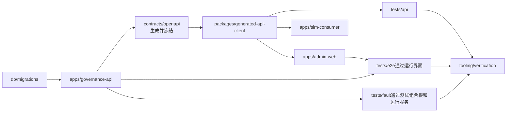

# Phase 01单仓库工作区拓扑

状态：当前根目录单一Git仓库、npm workspaces、应用与权威产物分区、单实现双实例仿真消费者、无额外任务编排框架、governance-api深模块内部结构、领域版本与生命周期所有权、`price-list`与`price-resolution`边界、`release-distribution`统一发布登记与投递、领域内容投影与快照制品seam、领域拥有版本化投影Schema并进入单一TypeBox—OpenAPI契约链、消费者精确版本支持声明与不兼容投递隔离、Phase 01一发布一规范投影一权威快照、投影Schema升级高风险契约治理、投影载荷与完整快照制品双摘要、PostgreSQL `bytea`事务内权威快照存储、仅适用于合成POC的16 MiB单快照容量护栏，以及完整POC派生ZIP的存储、保留/取代及容量检查继续留在既有`release-distribution`、容量实验继续使用既有验证工具链且均不提前进入Phase 01的拓扑边界均已确认

容量环境补充状态：ADR-0110环境配置与回执只进入`phase-plan/environment`证据说明区，不成为应用、workspace或运行时依赖。

容器运行时补充状态：ADR-0111把直接Podman运行模块、机器可读基线和迁移回执限定在`phase-plan/environment`，Testcontainers继续只是既有验证workspace的Podman API客户端，不新增应用或workspace。

更新日期：2026-08-30

## 1. 目标与适用范围

本文定义Phase 01工程初始化时必须建立的物理源码边界。目标是在一个可审计版本历史和一个依赖锁文件中同时管理模块化单体、管理界面、仿真消费者、冻结契约、数据库迁移、自动化测试和证据编排，同时防止“单仓库”退化为任意源码互相导入。

当前目录尚未初始化Git，也没有`package.json`、锁文件或源码工作区。本决策只冻结目标拓扑；执行`git init`、生成工程文件、安装依赖和提交初始版本必须在明确进入工程初始化后进行。

## 2. 根仓库边界

Phase 01以当前项目目录作为唯一Git仓库根。现有`docs`、`phase-plan`、`CONTEXT.md`、项目技能和研究交付材料继续保留在同一版本边界；工程源码不得另建嵌套Git仓库或通过Git submodule形成第二提交权威。

根工作区必须满足：

1. Node.js精确使用`24.18.0`。
2. npm精确使用`11.9.0`，根`package.json`声明`private: true`和`packageManager: "npm@11.9.0"`。
3. 全仓库只有一个根`package-lock.json`；正式安装使用`npm ci`，不得使用浮动安装结果形成证据。
4. npm workspaces只覆盖`apps/*`、`packages/*`、`tests/*`和`tooling/*`；`db`、`contracts`、`docs`及`phase-plan`不是可发布npm包。
5. 根脚本和仓库内TypeScript编排器定义构建、测试、契约、迁移和证据命令，不引入Turborepo、Nx或CI厂商任务图作为第二执行语义。
6. pnpm、Yarn、Bun及工作区局部锁文件不得进入Phase 01仓库。

## 3. 目标目录

```text
Hospital-DataIntelligence-Platform/
├─ apps/
│  ├─ governance-api/
│  ├─ admin-web/
│  └─ sim-consumer/
├─ packages/
│  └─ generated-api-client/
├─ db/
│  └─ migrations/
├─ contracts/
│  └─ openapi/
├─ tests/
│  ├─ api/
│  ├─ e2e/
│  └─ fault/
├─ tooling/
│  └─ verification/
├─ docs/
├─ phase-plan/
├─ CONTEXT.md
├─ package.json
└─ package-lock.json
```

测试fixture可以位于所属测试工作区或后续建立的明确测试资产目录，但不得成为生产应用的运行依赖。正式证据包的存储介质和归档位置不由源码目录决定，仍服从不可覆盖证据规则。

ADR-0108容量画像矩阵、ADR-0109逐字段分布规则及ADR-0110受限本机WSL2环境只约束Phase 01门禁通过后的完整POC容量验证。Phase 01不为其新建fixture目录、生成器、业务配置、表、API、应用、workspace、共享包或空依赖；环境配置与初始化回执只保存在`phase-plan/environment`证据说明区，不成为应用依赖。未来执行时也只能落入既有测试资产/验证工具边界，并由真实`release-distribution`与冻结公共下载API完成集成核验。

## 4. 工作区责任

| 路径 | 责任 | 明确不负责 |
|---|---|---|
| `apps/governance-api` | Fastify模块化单体、按治理能力组织的深模块、领域模块拥有的版本化投影TypeBox Schema、组合根契约装配、TypeBox路由Schema、OIDC适配、本地授权、事务作用域、领域内容投影构造和`release-distribution`快照制品、双摘要、PostgreSQL `bytea`持久化与受控下载、Phase 01合成POC容量校验、版本化订阅支持、兼容预检、隔离阻断、受控重放及同进程派发实现 | 前端页面、消费者内部应用状态、中央投影Schema、独立摘要/快照存储/兼容转换主权、平行OpenAPI、对外共享领域源码、横向技术分层和通用业务基类 |
| `apps/admin-web` | React/Vite管理界面及用户交互 | 业务授权、审批、发布、解析或审计主权 |
| `apps/sim-consumer` | 以独立身份声明精确投影契约支持，并执行正式契约消费、幂等应用、顺序、缺口、水位和回执 | `latest`或范围兼容推断、载荷转换主权、治理数据库访问、治理模块导入、真实业务系统接入 |
| `packages/generated-api-client` | 从冻结OpenAPI生成的类型和访问客户端 | 手写DTO、领域规则、后端内部类型再导出 |
| `db/migrations` | 有序原生SQL迁移及Schema演进权威 | ORM Schema、运行时自动DDL、应用源码生成DDL |
| `contracts/openapi` | 由组合根装配TypeBox定义后生成并批准冻结的OpenAPI 3.1派生产物、Schema清单及摘要 | 可编辑领域Schema源、平行手写契约、后端内部接口 |
| `tests/api` | 通过生成客户端执行公开REST场景 | Fastify内部函数调用、直接业务数据库写入 |
| `tests/e2e` | Playwright真实OIDC和管理界面端到端 | 预置浏览器令牌、静态结果展示 |
| `tests/fault` | 枚举化故障点、Toxiproxy和容器生命周期场景 | 生产故障入口、随机混沌、人工改库 |
| `tooling/verification` | 厂商中立命令编排、报告汇总、清单和证据包完整性 | 业务规则、另一套场景定义、CI厂商专有放行逻辑 |

## 5. 依赖方向



依赖图遵守以下不变量：

1. `apps/governance-api`内部领域模块不发布为供管理界面、消费者或外部测试复用的共享领域包。
2. `apps/admin-web`、`apps/sim-consumer`和`tests/api`只通过`packages/generated-api-client`理解公开API。
3. `packages/generated-api-client`只能依赖冻结契约生成工具及最小运行依赖，不能反向依赖任何`apps/*`源码。
4. `tests/e2e`通过浏览器及公开服务工作；`tests/fault`只能使用测试组合根、容器控制面和公开服务，不得取得生产可用的内部管理入口。
5. `tooling/verification`消费测试和服务证据，不能被生产应用反向依赖。
6. 允许共享的内容限于无业务主权的构建配置、生成产物和测试辅助；不得建立`shared-domain`、`common-service`或`shared-repository`包汇聚跨模块业务逻辑。
7. `apps/governance-api`内的其他模块只能从目标模块唯一公开`index.ts`导入其小型接口；领域投影TypeBox Schema也只能作为该接口的契约产物从此入口提供给组合根，不得深层导入实现、直接查写他模块表或形成循环依赖。

工作区依赖和源码导入方向必须由自动化边界测试验证，不能只依靠目录命名或评审约定。

## 6. 模块化单体与工作区的关系

`apps/governance-api`是一个应用工作区和一个生产部署单元。其源码按治理能力纵向组织深模块，每个模块只经本模块`index.ts`暴露一个小型逻辑接口；HTTP adapter、状态机、规则、SQL映射、数据库类型和内部实现不对其他模块公开。当前已冻结`charge-catalog`、`price-list`、`price-resolution`和`release-distribution`边界；导入、身份授权和审计等其余能力仍是待确认的模块划分候选，不能因当前文档列举就自动冻结为独立模块。

组合根是唯一创建具体实现、注入依赖、注册Fastify路由和生命周期的位置。跨模块协作只经公开接口；跨模块原子命令由事务运行器建立绑定同一PostgreSQL连接和事务的作用域应用上下文，原始`pg`连接或Kysely事务不进入模块接口。任一调用失败时全部本地写入回滚，提交后唤醒和网络动作只在提交成功后发生。

应用根部不得按全部能力横向建立`controllers`、`services`、`repositories`、`models`或承载业务逻辑的`common/shared`层，也不得使用`BaseService`、`BaseRepository`、`BaseController`、通用CRUD继承、服务定位器、通用命令总线或为内存测试制造repository port。少量无业务主权的事务、请求上下文、日志和无损类型基础设施可以放入精确命名的`platform`子模块。

`charge-catalog`目录拥有收费项目稳定身份、收费项目版本、演进关系及生命周期实现；`price-list`目录拥有价表稳定身份、价表发布版本、价格条目及生命周期实现。不得另建`modules/version`、`shared/versioning`、通用版本包、通用版本仓储或配置化生命周期引擎；`governance_release`等发布包络由`release-distribution`拥有，但不能反向成为领域内容版本主权。

`price-resolution`目录拥有固定两级选价、通用/专用判定、规则执行、舍入和三类解析证据。依赖方向只允许`price-resolution -> price-list/index.ts`：`price-list`返回不可变已发布解析视图，解析模块不得深层导入、读取草稿或价表表、回写价表；`price-list`及路由不得复制解析算法。两者位于同一应用工作区和部署进程，不创建内部HTTP调用或共享领域包。

`release-distribution`目录统一拥有发布包络、成员、最终快照制品及元数据、确定性规范序列化、投影载荷摘要、完整制品摘要、PostgreSQL `bytea`不可变存储、受控下载、Outbox、消费者订阅、投递、尝试及平台侧检查点/回执，并从同一`index.ts`提供发布事实登记、快照元数据/字节查询、变化查询、回执和受控重放的逻辑接口。领域模块通过该接口传入从自身权威状态构造且完成语义校验的冻结类型化内容投影；投影不得泄漏数据库/REST传输类型、repository、延迟加载器或事务句柄。`release-distribution`不得查询领域表、解释或补齐领域字段，领域模块不得写快照或Outbox存储。快照字节与发布、元数据、预检、审计和Outbox使用同一本地事务；提交后轮询、租约、网络adapter和重试状态机保持模块内部。不得另建`publication`、`delivery`、`snapshot-builder`、`snapshot-store`、`digest`或独立`outbox`目录，不得创建文件/S3快照adapter或未使用存储port，也不得通过内部HTTP回环或跨模块表访问拼接流程。仿真消费者内部幂等应用和水位仍只存在于`apps/sim-consumer`。

消费者订阅稳定身份、不可变支持版本、精确投影契约集合、逐发布兼容预检、`BLOCKED_INCOMPATIBLE`投递及升级后的受控重放也属于上述同一`release-distribution`实现。不得新增`compatibility`工作区、模块或通用载荷转换包；不兼容投递不得进入租约和网络路径。两个仿真消费者仍各自拥有内部水位，平台只通过新订阅版本及原快照重放恢复对应投递，不改写消费者代码或历史快照来伪造兼容。

每个领域模块在自己的目录内拥有稳定投影类型、字段语义、可执行TypeBox Schema和不可变Schema版本，并只经该模块`index.ts`交给组合根。组合根登记契约身份并确定性地把这些Schema装配进Fastify公开路由；`release-distribution`只核验和携带投影类型、Schema版本及Schema摘要，不拥有领域字段定义。不得建立`modules/projection-schema`、`shared-schemas`或额外workspace集中取得投影语义主权；`contracts/openapi`和生成客户端始终只是同一权威链的冻结派生产物。

`release-distribution`内部必须把发布事实身份与快照制品身份分别保存并在Phase 01执行一对一：每个发布只有一个`CANONICAL`快照，Schema升级形成新发布且旧制品不变。长期扩展不新增工作区、共享包或预留空模块；当前只保持两类身份与既有模块Interface分离。不得创建`projection-registry`、`projection-converter`、`snapshot-variants`、`consumer-snapshot-router`或同义目录/包，也不得在生成客户端或仿真消费者中维护专用快照模型。

平台契约Owner是工作流中的治理角色，不对应新的workspace、模块或Schema编辑包。领域模块目录继续拥有TypeBox投影Schema及语义，既有工作流模块保存领域语义确认、平台契约终审、职责分离策略和四类证据，`release-distribution`只核验批准引用。不得创建`apps/contract-governance`、`modules/contract-governance`、`packages/contract-schemas`或同义边界；兼容矩阵和仿真消费证据由现有冻结契约、版本化订阅和测试/验证工作区生成，消费者代码不得取得审批接口。

完整POC受控导出进入范围后，CSV/ZIP生成、`managed_export_artifact`独立PostgreSQL `bytea`持久化、短事务成功提交、受控取得、保留门禁及只追加取代关系继续位于现有`apps/governance-api`的`release-distribution`深模块内部，不新增`apps/export-service`、`apps/retention-service`、`packages/artifact-store`、独立workspace、文件/S3/MinIO adapter、清理scheduler、删除或存储port。POC环境整体处置位于业务工作区之外。Phase 01工程初始化不得为该后续薄切创建表、目录、空接口或依赖；未来存储迁移按新ADR直接重构模块私有实现，而不是当前预建抽象。

投影载荷摘要和完整快照制品摘要继续由`release-distribution`目录内的私有制品实现生成；无业务主权的SHA-256字节函数可以作为应用内部基础代码复用，但不得建立`apps/digest-service`、`modules/digest`、`packages/hashing-domain`或同义workspace、模块和服务。领域模块已有的版本或成员摘要仍留在各自目录并承担领域等价证明，不能被双摘要替代。

Phase 01快照`bytea`读写和最终规范制品16 MiB容量校验都是`release-distribution`现有PostgreSQL制品实现的一部分，不建立`packages/snapshot-store`、`modules/snapshot-storage`、`modules/snapshot-capacity`、`apps/artifact-service`、S3客户端包、本地文件目录或同义抽象。仿真消费者和生成客户端只实现冻结OpenAPI中的快照下载能力，不能导入数据库类型、表映射或物理位置。16 MiB不得抽成无阶段语义的全平台永久常量；未来对象存储迁移或全院容量上限只有在新ADR及代表性容量验证确认后才允许改变，且不得改变既有快照身份、下载契约、历史字节及双摘要。

完整POC派生制品容量证据继续由既有TypeScript验证工具和证据区承载，运行时容量检查仍是`release-distribution`内部受控导出责任；不得新增`apps/capacity-service`、`packages/export-capacity`、共享容量常量包、独立workspace、scheduler或未使用port。`F00`、`N10`、`N30`、`N50`、`N100`、`W50`和`E50`画像生成器、版本与矩阵编排仅是既有验证工具链中的确定性fixture资产，不是业务模块、公共契约、数据库实体或新的工作区；容量fixture必须与24个收费项目、3个价表快照及业务验收fixture隔离。Phase 01全部门禁通过后，前置可行性实验才可以在既有验证工具内使用一次性隔离试验装置、冻结画像版本和ADR-0110本机WSL2 `Anolis-8.9-HDI-POC`独占运行环境，但不得形成业务工作区、正式迁移、公开接口或运行时依赖；后续数值ADR完成前不得创建受控导出容量实现。业务薄切集成后，第二阶段只允许把完全相同的画像和环境版本经实际`release-distribution`及冻结公共API核验，不保留平行试验实现。Phase 01工作区不预建画像目录、容量fixture、试验装置、依赖或任何空接口。

模块接口测试可以位于`apps/governance-api`对应模块内部，但主要通过该模块唯一公开接口和正式组合方式验证；纯计算规则的内部测试不能形成第二导出入口。外部REST、界面、消费者和故障恢复验收必须继续遵循公开契约或受控测试组合根，不能因为同仓库而导入内部命令、仓储或数据库类型。

内部结构和验证要求见[Phase 01 governance-api深模块结构](phase-01-governance-api-module-structure.md)。

## 7. 单实现双实例仿真消费者

`apps/sim-consumer`只维护一套消费者代码，正式验证时至少以消费者A和消费者B两个实例运行。两者必须分别拥有：

- Keycloak机密客户端和平台服务主体。
- 订阅标识、状态数据库或Schema边界。
- 不可变订阅版本及精确支持的投影类型和Schema版本集合。
- 投递状态、水位、幂等记录、重试和回执。
- 运行配置、日志及证据身份。

两个实例不能共享凭据、运行时水位或“全局已消费”状态；代码复用不表示运行身份和状态合并。不得复制出`sim-consumer-a`与`sim-consumer-b`两个逐渐分叉的源码包来模拟隔离。

## 8. Schema、契约和生成客户端主权

三类产物保持单向关系：

1. `db/migrations`定义PostgreSQL物理Schema，数据库派生类型只能在迁移完成后生成，不能反向改写迁移。
2. 各领域模块拥有的投影TypeBox Schema只经其`index.ts`进入组合根，并与其他Fastify公开路由Schema一起生成`contracts/openapi`冻结产物；组合根负责装配但不取得字段语义主权，不能手写第二份OpenAPI或JSON Schema。
3. `contracts/openapi`生成`packages/generated-api-client`，生成代码不得手工修改或反向成为契约源。

生成客户端源码是否随仓库提交属于工程初始化时的可逆选择，但无论采用提交或构建时生成，正式门禁都必须重新生成、比较摘要并阻断漂移。任何消费者只能使用通过该门禁的结果。

## 9. npm命令与锁文件

根脚本提供稳定的用户入口，并通过npm原生workspace命令或仓库内TypeScript编排器调用各工作区。具体脚本名称可以在工程初始化时确定，但必须至少覆盖安装校验、类型检查、生产构建、迁移、契约生成、生成客户端、单元及集成测试、REST测试、浏览器E2E、故障测试和证据终结。

禁止事项包括：

- 根目录与子工作区并存多个锁文件。
- 在正式验证中使用`npm install`刷新依赖图后直接放行。
- 通过preinstall或postinstall静默修改权威迁移、冻结契约或证据。
- 依赖浮动标签、未锁定Git地址或工作区外本地路径。
- 让Turborepo、Nx、CI YAML或远程缓存决定未在仓库命令中表达的跳过和通过语义。

## 10. Git与产物边界

Git必须跟踪权威源码、文档、ADR、原生迁移、冻结契约、工作区元数据和根锁文件。`node_modules`、构建输出、测试缓存、容器卷、凭据、环境密钥和未终结证据工作目录不得提交。

正式证据包是独立的不可覆盖验收产物，其内容身份由规范化清单决定；Git提交号、源码状态和根锁文件摘要进入证据，但Git仓库本身不替代证据包。现有研究交付材料是否使用普通Git对象或其他大文件管理方式属于初始化时的存储实施选择，不改变单仓库版本边界。

## 11. 工程初始化顺序

目标拓扑确认后，工程初始化应按以下依赖顺序执行：

1. 建立根Git边界、忽略规则、根`package.json`和单一锁文件。
2. 建立空的应用、生成客户端、测试和验证工作区，并验证禁止依赖。
3. 建立`db/migrations`与`contracts/openapi`权威目录及其空基线门禁。
4. 建立`governance-api`组合根、事务运行器，创建已确认的`charge-catalog`、`price-list`、`price-resolution`和`release-distribution`模块入口及边界检查空骨架；在代表性领域模块的唯一`index.ts`预留稳定投影类型、不可变Schema版本和TypeBox Schema接口，由组合根登记契约身份并装配公开契约；在既有工作流模块加入Schema升级高风险分类、领域语义确认、平台契约确认、限定职责分离策略及四类证据引用；在`release-distribution`内部以独立发布与快照身份执行一发布一`CANONICAL`快照，生成冻结算法及序列化规则的投影载荷与完整制品双摘要，对最终逻辑字节执行仅适用于合成POC的16 MiB容量校验，把合格制品保存到同一发布事务的PostgreSQL `bytea`并提供受控下载，同时实现不可变订阅支持版本、发布前兼容预检、`BLOCKED_INCOMPATIBLE`及受控重放状态。不另建`snapshot-builder`、`snapshot-store`、`snapshot-capacity`、文件/S3 adapter、未使用存储port、`projection-schema`、`shared-schemas`、`compatibility`、`contract-governance`、`digest`、投影注册/转换/变体路由或消费者选择模块，也不提前推定其余模块清单和字段。
5. 打通全仓库安装、类型检查、构建和测试命令，不实现业务捷径。
6. 在该骨架上按纵向切片逐步实现收费项目、价表、发布、解析、审计、Outbox和仿真消费。

初始化骨架建立成功不等于ABG门禁通过，也不授权提前扩展完整POC。

## 12. 核心变更与普通变更

以下变化必须重新确认核心架构：拆分为多个Git仓库；更换npm为其他包管理器；引入额外任务图取得执行主权；改变应用、生成客户端、Schema、契约、外部测试或验证工具的责任边界；允许消费者导入治理后端内部类型或领域实现；将两个仿真消费者变成两套分叉源码；把治理模块拆为可被外部直接依赖的共享领域包；取消深模块或每模块唯一小型接口；在`governance-api`建立横向技术层、通用业务基类、服务定位器或通用命令总线；允许跨模块内部导入、查写他模块表、循环依赖或原始事务句柄进入接口；为内存仓储测试建立平行持久化port；将收费项目或价表版本及生命周期移出其拥有模块，建立独立通用版本模块、通用版本基类/仓储/CRUD表或配置化通用状态机；把`price-resolution`并回`price-list`、反转依赖、允许直接读取草稿或价表表/回写价表，或者复制解析算法；把`release-distribution`拆成`publication`、`delivery`或独立`outbox`模块、暴露内部派发器、允许跨模块查写其表或合并发布与网络事务。

让`release-distribution`回查领域表、解释或补齐领域字段，让领域模块直接写快照/Outbox存储或生成最终权威快照字节，新增独立`snapshot-builder`，或者用数据库行、REST DTO、无类型任意JSON、repository、延迟加载器及事务句柄代替冻结类型化投影，同样属于核心架构变更。

把投影Schema主权从领域模块移至`release-distribution`、组合根、独立`projection-schema`/`shared-schemas`模块或额外workspace；修改、删除已被快照引用的Schema版本；绕过模块`index.ts`深层取得Schema；允许平行手写OpenAPI、JSON Schema、DTO或消费者私有契约；或者让版本标签自动决定迁移和兼容性，也属于核心架构变更。

把消费者兼容性拆成独立模块或workspace，允许订阅使用`latest`、通配符、版本范围、SemVer推断或运行时探测，覆盖订阅版本或预检结果，让不兼容投递进入网络及水位路径，因单个不兼容消费者回滚领域发布，或者建立自动降级、转换与Schema迁移包，也属于核心架构变更。

在同一Phase 01发布下生成多个投影、快照或消费者专用变体，合并发布与快照身份，重打包历史快照，Schema升级不建立新发布，或者提前新增投影注册器、变体路由器、消费者选择器、专用快照workspace及未使用多投影port，也属于核心架构变更；未来正式启用该能力必须先建立新ADR和门禁。

把平台契约Owner实现为独立模块、workspace或Schema编辑服务，把Schema主权移出领域模块，省略Schema升级的双责任或四类证据，把提交—终审例外扩展到领域内容变更，赋予消费者审批/否决权，或者在发布时探测消费者，也属于核心架构变更。

把投影载荷与完整制品摘要合并为含义模糊的单一摘要，改变摘要作用域、纳入可变运维状态、自嵌入完整制品摘要、跨Schema推断领域等价、重算历史摘要，或者把摘要责任移出`release-distribution`建立独立模块、workspace或服务，也属于核心架构变更。

把权威快照字节移出PostgreSQL同一发布事务，改用文件/S3、双写、暂存提升或补偿流程，允许消费者直接访问治理数据库或物理位置，建立独立快照存储模块/workspace或未使用存储port，或者在未来迁移时改变历史快照身份、下载契约、字节及双摘要，也属于核心架构变更。

在完整POC把派生ZIP移出既有`release-distribution`，新增导出/制品存储应用、workspace或共享包，写入`release_snapshot`、文件/S3/MinIO，采用双写/暂存提升/跨资源补偿，取消短本地事务原子成功提交，预建存储port，或未来迁移改变历史`artifact_id`、字节、摘要及平台契约，也属于核心架构变更；在Phase 01提前创建相关表、目录、port或adapter则直接违反阶段隔离。

新增独立制品保留/清理应用、workspace、共享包、scheduler或删除port，允许取代、交付完成或撤权触发物理清理，或者把POC环境整体处置实现为治理业务工作区中的API或任务，也属于核心拓扑与生命周期变更；在Phase 01提前创建相关目录、依赖或空接口同样违反阶段隔离。

新增独立派生制品容量应用、workspace、共享包或port，未经前置实验及后续数值ADR便实现容量检查，把一次性试验装置保留为业务或运行时依赖，以其替代集成后实际`release-distribution`及冻结公共API核验，改变最终ZIP精确字节计量或允许规避，或者测量不安全时在既有工作区静默加入流式、对象存储、双写、摘要变体和契约分支，也属于核心拓扑与容量架构变更；在Phase 01提前创建相关目录、依赖或空接口同样违反阶段隔离。

把容量画像生成器、矩阵或fixture拆成独立应用、workspace、共享包、业务模块、表、API或界面；在Phase 01预建其目录或依赖；删除或改变七类画像的身份、精确最终CSV数据行数或比较角色；让两阶段使用不同画像版本；复用业务验收fixture、混入错误记录或允许外部变长字符串无有限最大长度；让`F00`参与上限推断；或者把画像行数解释为真实医院、生产规模、容量上限、SLA或招标参数，也属于核心拓扑、容量证据或阶段隔离变更。

把逐字段分布规则拆成业务配置、数据库实体、公共契约、独立生成器、应用、workspace或共享包；在Phase 01预建任何字段分布资产；改变普通画像70%/30%非空、适用文本70%/25%/5%及20%/50%/85%目标长度、`W50` 100%/90%或`E50`五类各20%；按字段名称或随机决定分布；允许非法LF、无合法字段时静默跳过或类别重分配；或者混同Unicode码点长度与最终ZIP字节容量计量，也属于核心拓扑、容量证据或阶段隔离变更。

改变ADR-0110冻结的WSL发行版身份、Anolis用户空间版本、8 vCPU、4 GiB、无swap、10 GiB根磁盘或独占运行门禁；让其他WSL、Docker Desktop、Podman Machine或其他容器后端并发；把WSL环境内置为应用或workspace依赖；或者把本机WSL证据冒充生产/内网实机证据，也属于核心容量证据环境变更，必须重新确认并重做受影响的两阶段证据。

改变Phase 01最终规范制品16 MiB计量边界、超限失败关闭或禁止规避规则，建立独立容量模块，或者未经代表性容量验证把该数值写成全院初始化、生产容量、性能SLA或招标上限，也属于核心架构变更。

同一npm主版本内的受控补丁升级、具体脚本名称、测试fixture子目录、模块内部文件拆分和私有adapter、生成客户端是否提交、边界检查工具和CI厂商选择，在不改变上述权威链及证据语义时属于普通实施变更。

## 13. 关联决策

- [ADR-0069：模块化单体与独立仿真消费者](../adr/0069-use-modular-monolith-with-independent-simulated-consumers.md)
- [ADR-0071：版本化原生SQL迁移是Schema权威](../adr/0071-use-versioned-native-sql-migrations-as-schema-authority.md)
- [ADR-0076：从TypeBox生成并冻结OpenAPI契约](../adr/0076-generate-and-freeze-openapi-from-typebox-contracts.md)
- [ADR-0077：管理界面使用同源React SPA](../adr/0077-use-a-same-origin-react-spa-for-management-ui.md)
- [ADR-0081：单一TypeScript验证权威和不可覆盖证据包](../adr/0081-use-a-single-typescript-verification-authority-and-immutable-evidence-packages.md)
- [ADR-0082：根目录单一Git仓库和npm工作区](../adr/0082-use-a-single-npm-workspace-repository-for-phase-01.md)
- [ADR-0083：governance-api按治理能力组织深模块](../adr/0083-structure-governance-api-as-deep-capability-modules.md)
- [ADR-0084：版本与生命周期由治理对象模块拥有](../adr/0084-keep-version-and-lifecycle-ownership-in-domain-modules.md)
- [ADR-0085：价格解析与价表治理分离为两个深模块](../adr/0085-separate-price-resolution-from-price-list-governance.md)
- [ADR-0086：发布登记与投递由一个深模块拥有](../adr/0086-unify-release-registration-and-delivery-in-one-deep-module.md)
- [ADR-0087：领域模块构造内容投影，发布分发模块构造快照制品](../adr/0087-domain-projection-and-release-snapshot-packaging.md)
- [ADR-0088：领域模块拥有版本化投影Schema并进入单一契约链](../adr/0088-domain-owned-versioned-projection-schemas.md)
- [ADR-0089：消费者精确声明投影支持且不兼容仅阻断对应投递](../adr/0089-use-exact-consumer-projection-support-and-isolated-delivery-blocking.md)
- [ADR-0090：Phase 01每个发布只有一个规范投影快照](../adr/0090-use-one-canonical-projection-snapshot-per-release-in-phase-01.md)
- [ADR-0091：投影Schema升级按高风险契约变更治理](../adr/0091-govern-projection-schema-upgrades-as-high-risk-contract-changes.md)
- [ADR-0092：发布快照采用投影载荷与完整制品双摘要](../adr/0092-use-separate-projection-payload-and-snapshot-artifact-digests.md)
- [ADR-0093：Phase 01在PostgreSQL事务内保存规范快照字节](../adr/0093-store-canonical-snapshot-bytes-in-postgresql-transactionally.md)
- [ADR-0094：Phase 01规范快照制品上限为16 MiB](../adr/0094-limit-phase-01-canonical-snapshot-artifacts-to-16-mib.md)
- [ADR-0104：完整POC在PostgreSQL中原子保存受控导出派生制品](../adr/0104-store-managed-export-artifacts-in-postgresql-for-complete-poc.md)
- [ADR-0105：完整POC派生制品保留至证据基线整体处置](../adr/0105-retain-managed-export-artifacts-until-poc-evidence-baseline-disposal.md)
- [ADR-0106：派生交付制品容量先测后定并超限失败关闭](../adr/0106-set-managed-export-artifact-capacity-from-representative-measurement.md)
- [ADR-0107：采用前置可行性实验与集成后真实链路核验的两阶段容量证据](../adr/0107-use-two-stage-capacity-evidence-with-integrated-ratification.md)
- [ADR-0108：冻结受控导出容量专用负载画像矩阵](../adr/0108-freeze-managed-export-capacity-workload-profile-matrix.md)
- [ADR-0109：冻结受控导出容量画像字段分布规则](../adr/0109-freeze-managed-export-capacity-field-distribution-rules.md)
- [ADR-0110：采用本机WSL2 Anolis OS 8.9作为受限容量实验环境](../adr/0110-use-local-wsl2-anolis-8-9-for-capacity-simulation.md)
- [ADR-0111：Phase 01采用Podman作为唯一容器运行时](../adr/0111-use-podman-as-the-phase-01-container-runtime.md)
- [Phase 01 governance-api深模块结构](phase-01-governance-api-module-structure.md)
