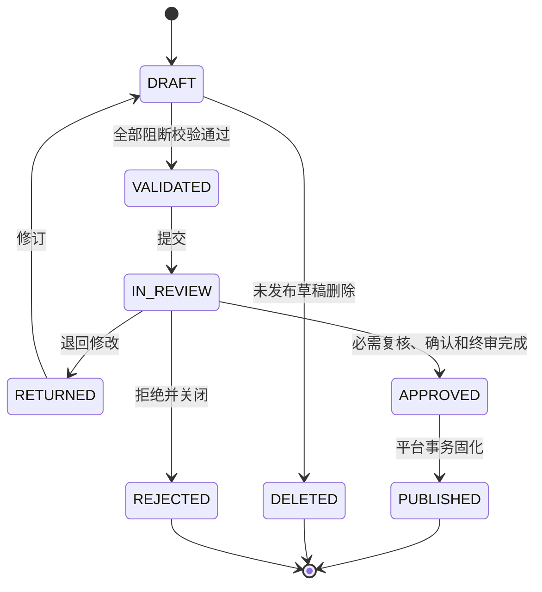
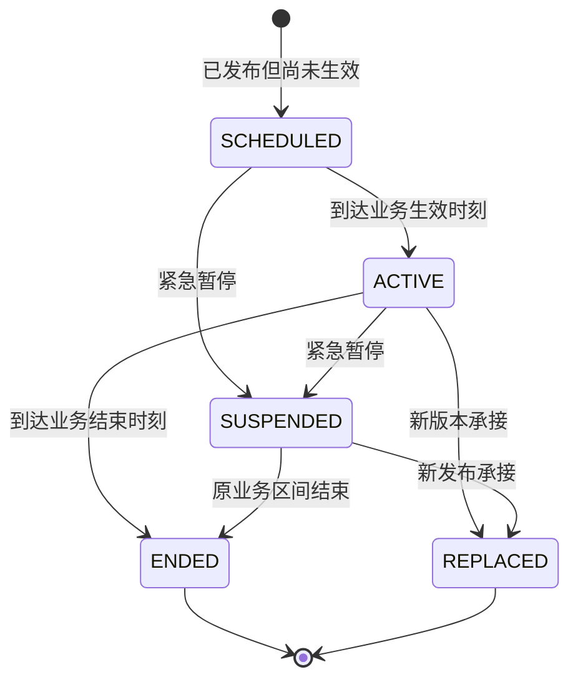
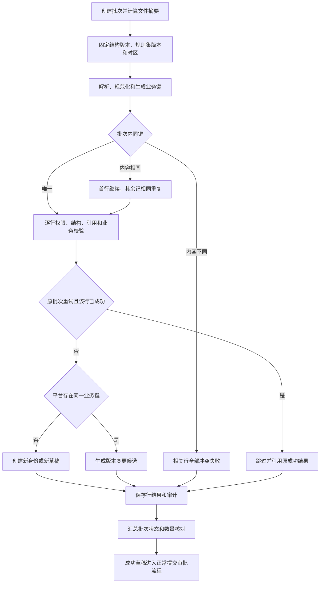
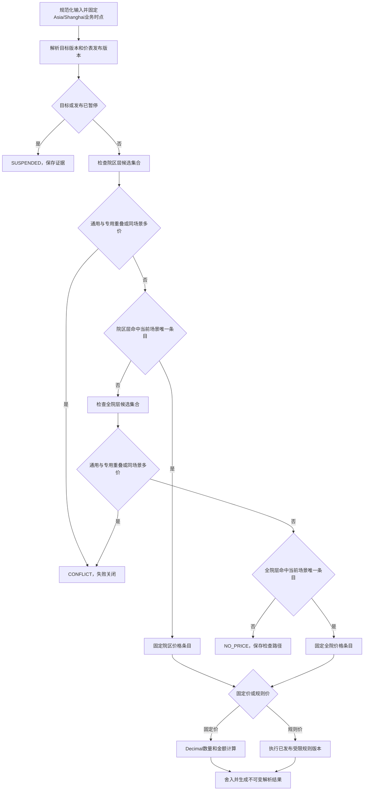
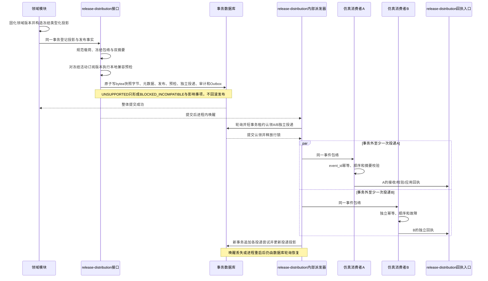
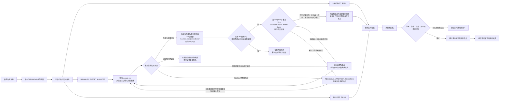

# 价表主数据业务规则与流程

状态：边界、Phase 01技术基线、Keycloak认证、平台本地授权、同进程Outbox派发、单一TypeScript验证与不可覆盖证据、根目录单一npm工作区、governance-api深模块、领域版本与生命周期所有权、`price-list`与`price-resolution`分离、`release-distribution`统一发布登记与投递、领域内容投影与快照制品分工、领域拥有版本化投影Schema并进入单一TypeBox—OpenAPI契约链、消费者精确版本支持声明与不兼容投递隔离、Phase 01一发布一规范投影一权威快照、投影Schema升级高风险契约治理、投影载荷与完整快照制品双摘要、PostgreSQL `bytea`事务内权威快照存储、仅适用于合成POC的16 MiB单快照容量护栏、三种交付模式下初始化与增量分离的统一消费闭环、受控导出的版本化非权威派生交付制品、消费者交付配置的版本化治理主权与冻结执行边界、受控声明式转换与失败关闭验证门禁、任一记录确定性转换失败使整个受控导出作业失败且不形成制品的运行语义、瞬时技术故障在同一冻结作业内有限且完整重建式重试的恢复语义、完整POC受控导出采用确定性无压缩ZIP及内置清单与外置完整制品摘要的格式语义、完整POC派生ZIP使用独立PostgreSQL `bytea`与短事务原子成功提交的存储语义、完成派生制品保留至POC证据基线整体处置且禁止选择性删除的生命周期语义、派生交付制品容量先测后定并按最终ZIP精确字节超限失败关闭的容量语义、“Phase 01只验证快照拉取、完整POC邻接受控导出、逐记录推送长期预留”的阶段范围，以及完整POC采用72个REST和20个界面场景的验收基线均已确认，可作为详细设计、实现和验收规则基线

容量环境补充状态：ADR-0110及PUB-155已确认本机WSL2 Anolis OS 8.9受限独占运行规则与非生产证据边界。

更新日期：2026-08-08

## 1. 目的与适用范围

本文将价表项目已经确认的领域决策转成可执行的业务规则、状态机、失败语义和端到端流程。它覆盖：

- 收费项目、收费组套等可定价对象。
- 价表、完整发布快照和价格条目。
- 政策证据、医保目录、资格规则、计价规则、收费组套、医嘱与执行服务等邻接薄切。
- 外部代码语义映射和运行时操作绑定。
- 人员与服务认证、平台安全主体、显式外部身份绑定和治理对象级授权。
- 导入、草稿CRUD、审批发布、价格解析、紧急暂停、补偿发布和仿真消费闭环。
- 自动化测试、真实依赖集成、受控故障注入、契约门禁和不可覆盖证据。
- 单仓库工作区、包依赖方向、Schema及契约权威目录和单实现双实例仿真消费者。
- governance-api治理能力深模块、唯一公开接口、组合根、事务作用域及模块数据所有权。

本文不把真实患者费用、真实医嘱与执行、真实医保结算或生产消费者纳入POC。管理界面与REST API必须调用同一平台服务，任何业务流程不得绕过服务直接写数据库。

## 2. 规则执行框架

### 2.1 规则编号

| 前缀 | 规则类别 |
|---|---|
| `COM` | 通用身份、版本、时间和数据类型 |
| `IMP` | 批量导入和幂等 |
| `ITM` | 收费项目与可定价对象 |
| `PRC` | 价表、价格条目和价格解析 |
| `MAP` | 外部代码、语义映射和操作绑定 |
| `ELG` | 收费资格 |
| `RUL` | 计价规则 |
| `BND` | 收费组套 |
| `ORD` | 医嘱、执行服务和收费映射 |
| `IAM` | 身份认证、会话、主体绑定和本地授权 |
| `GOV` | 授权、审批、暂停和补偿 |
| `PUB` | 发布、快照、Outbox和消费 |
| `VER` | 自动化验证、故障注入和证据完整性 |
| `MOD` | governance-api模块、接口、装配、事务作用域和数据所有权 |

规则编号是API错误、导入行结果、审批校验、解析证据和验收场景之间的稳定关联标识。规则文字变化形成规则集新版本，不能复用编号表达不同含义。

### 2.2 严重级别

| 级别 | 行为 |
|---|---|
| `ERROR` | 当前行、请求、提交或发布失败；不得降级为默认值 |
| `WARNING` | 允许继续，但必须显式展示、留证并由调用方确认 |
| `INFO` | 记录规范化、命中路径或非阻断提示 |

以下事项固定为`ERROR`：稳定身份复用、已发布内容原位修改、时间区间冲突、通用与专用价格混用、同层多价、操作绑定不唯一、不符合`GOV-014`限定条件的自审批、缺少必需前置确认、未通过规则测试、组套循环、金额不守恒、消费缺口未恢复却推进水位。

### 2.3 错误契约

所有同步API和导入行结果使用同一结构：

| 字段 | 含义 |
|---|---|
| `code` | 稳定错误码，如`PRC_GENERAL_SPECIFIC_OVERLAP` |
| `rule_id` | 触发的规则编号 |
| `severity` | `ERROR`、`WARNING`或`INFO` |
| `object_type/id` | 受影响治理对象 |
| `field_path` | 可空的字段或集合路径 |
| `message` | 面向用户的说明，不作为程序判断条件 |
| `details` | 冲突版本、时段、候选数等结构化最小信息 |
| `correlation_id` | 贯穿API、审计、工作流和Outbox |

建议的HTTP语义为：

- `400`：请求结构或时间格式错误。
- `403`：对象级、操作级或院区范围授权不足。
- `404`：对象不存在或调用者无权知晓。
- `409`：幂等键、版本、时间区间、价格或绑定冲突。
- `422`：结构正确但违反领域规则。
- `503`：受控依赖暂不可用；不得静默使用过期或任意候选。

上述HTTP映射主要用于写入、导入、校验、审批和发布命令。对价格、资格、映射、规则、组套和医嘱收费等解析接口，语法及授权均合法的请求返回`200`和明确的领域状态，包括`SUCCESS`、`NO_PRICE`、`NO_BINDING`、`BLOCK`、`REVIEW`、`SUSPENDED`、`CONFLICT`或`RULE_FAILED`，并始终返回解析证据ID；调用方只有在状态为允许继续的成功状态时才能使用金额或目标。授权失败、对象不可见、请求结构错误和同一幂等键内容不一致仍返回对应4xx。

关键稳定错误或结果码至少包括：

| 代码 | 典型触发 |
|---|---|
| `IDENTITY_REUSE` | 稳定ID或正式代码复用 |
| `PUBLISHED_IMMUTABLE` | 修改或删除已发布内容 |
| `IMPORT_DUPLICATE_CONFLICT` | 同批次同业务键不同内容 |
| `IDEMPOTENCY_CONFLICT` | 同一幂等键对应不同规范化输入 |
| `TEMPORAL_OVERLAP` | 业务区间和记录区间形成非法同时重叠 |
| `PRICE_RELEASE_AMBIGUOUS` | 同一价表在指定双时点命中多个发布 |
| `PRC_GENERAL_SPECIFIC_OVERLAP` | 同层同时间通用与专用价格并存 |
| `PRICE_MULTIPLE_MATCHES` | 同层同实际场景存在多个候选 |
| `NO_PRICE` | 固定两级均未命中价格 |
| `BINDING_CONFLICT` | 操作绑定运行唯一键命中多个目标 |
| `RULE_TEST_FAILED` | 强制测试未全部通过 |
| `BUNDLE_CYCLE_OR_DEPTH` | 组套循环或超过最大深度 |
| `AUTHENTICATION_REQUIRED` | 缺少、失效或无法验证的人员会话或服务令牌 |
| `IDENTITY_BINDING_NOT_FOUND` | 已验证外部身份没有唯一有效的本地安全主体绑定 |
| `AUTHORIZATION_DENIED` | 本地主体对对象、操作、院区范围或时段没有有效授权 |
| `SERVICE_IDENTITY_FORBIDDEN` | 服务身份尝试执行人员专属流程动作 |
| `CSRF_VALIDATION_FAILED` | Cookie认证的状态变更请求未通过Origin或CSRF校验 |
| `DUTY_SEPARATION_VIOLATION` | 普通领域内容变更或不符合限定例外条件的请求由提交人自行终审 |
| `REQUIRED_CONFIRMATION_MISSING` | 跨域必需前置确认缺失 |
| `CONTRACT_EVIDENCE_INCOMPLETE` | 投影Schema升级缺少任一强制差异、兼容、仿真消费或影响分析证据 |
| `SCHEMA_UPGRADE_SCOPE_MISMATCH` | 声称纯契约升级但领域内容、成员、规则或生命周期发生变化 |
| `SNAPSHOT_DIGEST_MISMATCH` | 投影载荷摘要或完整快照制品摘要核验失败 |
| `DIGEST_SCOPE_VIOLATION` | 摘要纳入错误字节范围、完整制品摘要自嵌入，或可变运维元数据进入摘要范围 |
| `HISTORICAL_DIGEST_IMMUTABLE` | 尝试按当前算法或序列化规则重算、覆盖或补写历史快照摘要 |
| `SNAPSHOT_STORAGE_ATOMICITY_VIOLATION` | 快照字节未与发布、快照元数据、审计和Outbox在同一本地事务形成，或出现半发布 |
| `SNAPSHOT_DIRECT_DATABASE_ACCESS_FORBIDDEN` | 消费者或业务调用方尝试绕过平台下载API读取治理数据库或物理存储位置 |
| `SNAPSHOT_EXTERNAL_STORAGE_FORBIDDEN` | Phase 01权威快照尝试写入文件系统、共享文件、S3兼容对象存储或暂存提升流程 |
| `SNAPSHOT_ARTIFACT_TOO_LARGE` | Phase 01合成POC的最终规范制品逻辑字节数大于16,777,216 |
| `SUSPENDED` | 对象或发布已暂停未来解析 |
| `CONSUMER_VERSION_GAP` | 消费者发现版本缺口 |
| `OUTBOX_LEASE_LOST` | 派发执行者的租约已过期或被恢复者取代，当前结果不得覆盖新状态 |
| `DELIVERY_ATTENTION_REQUIRED` | 自动重试耗尽，投递保留并进入人工处置 |
| `TECHNICAL_ATTENTION_REQUIRED` | 受控导出遇到未知技术错误或有限自动重试耗尽，冻结作业保留、保持零个完成制品并等待受控处置 |
| `MANAGED_EXPORT_FORMAT_VIOLATION` | 派生制品的容器、条目、编码、顺序、序列化或清单不符合作业冻结的格式版本 |
| `DERIVED_ARTIFACT_DIGEST_MISMATCH` | `records.csv`或完整派生ZIP的实际字节数、摘要与冻结清单或制品外部元数据不一致 |
| `AUDIT_INTEGRITY_FAILURE` | 审计摘要或哈希链校验失败 |

## 3. 通用不变量

| 编号 | 规则 |
|---|---|
| `COM-001` | 稳定ID和正式内部代码永久不复用；失效、被替代或弃用后仍保留。 |
| `COM-002` | 名称、说明、状态和其他可变语义只存在于不可变版本，不覆盖稳定身份。 |
| `COM-003` | 已发布版本和发布快照只能失效、暂停、结束或被新版本替代，不得修改或物理删除。 |
| `COM-004` | 只有未发布草稿可以删除，删除动作必须追加审计。 |
| `COM-005` | 每个实体版本同时记录业务有效区间和记录有效区间；区间统一使用左闭右开`[from,to)`。 |
| `COM-006` | 同一身份的两个已发布版本不得同时在业务区间和记录区间上重叠；追溯更正关闭旧记录区间并建立新记录时间版本。 |
| `COM-007` | 平台自有业务时间、平台记录时间、调度、日界、消费和界面日期时间均不携带时区或偏移，并固定按IANA `Asia/Shanghai`解释；OIDC/JWT标准`NumericDate`只存在于认证协议边界。 |
| `COM-008` | API和导入日期时间必须使用无`Z`、无偏移的专用本地日期时间格式；带偏移输入失败关闭，不得剥离偏移保存或依赖运行主机本地时区。 |
| `COM-009` | 金额和数量使用Decimal；禁止用二进制浮点保存或计算金额。 |
| `COM-010` | 发布对象引用上游对象时必须冻结稳定ID和明确版本ID；不得动态跟随“最新版”。 |
| `COM-011` | 任一上游版本变化只生成影响事项和显式重审，不自动迁移已发布引用。 |
| `COM-012` | 不同治理对象独立审批、发布和补偿；关联变更不形成跨对象原子发布。 |
| `COM-013` | 需要严格顺序的记录流以显式流内序号为唯一排序权威；序号不复用但允许空洞，日期时间不参与唯一性或最终排序，不建立跨流全局总序。 |

## 4. 双状态机

平台必须将治理流程状态与业务可用状态分离。一个版本可以已发布但尚未到业务生效时间，也可以因紧急暂停而停止未来使用，但其历史内容仍然不可变。

### 4.1 治理流程状态



规则：

1. `DRAFT`和`RETURNED`可以编辑；`PUBLISHED`不可编辑。
2. 校验结果固定记录结构版本和规则集版本。
3. `APPROVED`不是可供消费状态。只有发布事务成功并产生快照、审计和Outbox后才是`PUBLISHED`。
4. 发布事务失败时保持`APPROVED`或进入可重试技术状态，不能留下无快照的半发布对象。

### 4.2 业务生命周期状态



规则：

1. `SUSPENDED`没有返回`ACTIVE`的原地转换。
2. 恢复服务必须发布新的修正版、补偿版本或重新冻结的历史内容。
3. 暂停、结束和替代不改变历史解析结果。
4. 业务状态由业务时间和只追加状态事件共同推导，不能靠覆盖单一“当前状态”字段丢失历史。

## 5. 导入与草稿CRUD

### 5.1 导入规则

| 编号 | 规则 |
|---|---|
| `IMP-001` | 每个导入批次固定治理对象、对象结构版本、校验规则集版本、文件摘要和`Asia/Shanghai`时间解释。 |
| `IMP-002` | 每类治理对象声明业务唯一键；规范化只能执行已发布规则，不得根据名称猜测身份。 |
| `IMP-003` | 同一批次相同业务键且规范化内容相同的行，首行作为候选，其余标记`DUPLICATE_IDENTICAL`并忽略。 |
| `IMP-004` | 同一批次相同业务键但内容不同的所有相关行标记`DUPLICATE_CONFLICT`，不得以行顺序决定结果。 |
| `IMP-005` | 使用原批次ID重试时，已成功行按原行号、业务键和内容摘要跳过，只重新处理失败行。 |
| `IMP-006` | 原批次ID对应的文件摘要、对象类型或结构版本变化时拒绝重试，要求新建批次。 |
| `IMP-007` | 新批次遇到平台既有业务键时生成版本变更候选，不作为重复静默忽略，也不覆盖已发布版本。 |
| `IMP-008` | 单行失败不回滚其他成功行；批次可以完成为`PARTIAL_SUCCESS`，但导入成功不等于发布成功。 |
| `IMP-009` | 每行保留原始行快照、规范化结果、业务键摘要、内容摘要、规则结果和草稿链接。 |
| `IMP-010` | 导入后必须核对总行数等于成功、失败、警告和重复等互斥结果数之和。 |

### 5.2 导入流程



### 5.3 草稿CRUD

1. `Create`只创建稳定身份草稿、实体版本草稿或导入候选，不直接发布。
2. `Read`必须支持当前版本、指定业务时点、指定记录时点、完整历史和版本差异。
3. `Update`只允许修改草稿；对已发布版本的“修改”实际创建新草稿版本。
4. `Delete`只允许未发布草稿，删除后稳定身份是否保留取决于其是否曾被任何审计或关系引用。
5. 失效、停用、替代和调价均通过新版本或新发布表达，不映射为HTTP `DELETE`。

## 6. 收费项目与版本演进

| 编号 | 规则 |
|---|---|
| `ITM-001` | 院内收费项目回答“收取何种服务费用”，不保存价格、外部代码、医嘱身份或患者费用。 |
| `ITM-002` | 名称调整、说明完善和不改变服务边界的规范化沿用稳定身份并创建新版本。 |
| `ITM-003` | 服务内涵、计价单位、包含或除外范围、收费方式发生实质变化时创建新稳定身份。 |
| `ITM-004` | 拆分、合并、替代和派生使用独立演进关系；不得自动迁移价格、映射或历史引用。 |
| `ITM-005` | 院区可以建立扩展收费项目，但不得复用或覆盖全院项目稳定身份。 |
| `ITM-006` | 收费组套是另一类可定价对象；它不改变其组成收费项目的稳定身份。 |

实质变化提交必须列出受影响的价表、外部绑定、医保映射、资格规则、组套和医嘱收费规则。影响清单不要求这些对象与收费项目原子发布，但未关闭的阻断性事项必须影响相应对象的新发布。

## 7. 价表发布与价格条目

### 7.1 价表规则

| 编号 | 规则 |
|---|---|
| `PRC-001` | 每个价表发布版本是完整不可变快照，不是对上一版本的增量补丁。 |
| `PRC-002` | 价格条目目标是冻结版本的可定价对象，即收费项目或收费组套。 |
| `PRC-003` | 固定单价与一个已发布计价规则版本必须二选一。 |
| `PRC-004` | 条目币种必须与价表发布币种一致；计价单位必须与冻结目标版本兼容。 |
| `PRC-005` | 组织范围只有全院默认和经全院价格Owner批准的院区差异两级；不存在数字优先级。 |
| `PRC-006` | 科室、人员、患者类别和支付方式不是普通价格维度。 |
| `PRC-007` | 门诊、住院、急诊、体检是四类实际场景；`GENERAL`只是覆盖四类场景的通配模式。 |
| `PRC-008` | 同一发布、可定价对象、组织范围和重叠业务时段内，`GENERAL`与任何`SPECIFIC`条目严格互斥。 |
| `PRC-009` | 专用模式下同一实际场景和重叠时段最多一条价格；可以只配置四类场景中的一部分。 |
| `PRC-010` | 缺少价格表示`NO_PRICE`，不表示禁止收费；禁止必须由资格规则返回`BLOCK`。 |
| `PRC-011` | 价格使用服务实际发生时间解析，不使用医嘱、入院、记账或结算时间。 |
| `PRC-012` | 同一层级出现多个有效候选时失败关闭，不按更新时间、条件数量或最后写入择优。 |
| `PRC-013` | 院区差异必须只改变价格；若服务内涵或计价单位不同，应创建院区扩展收费项目。 |
| `PRC-014` | 零价格合法但必须填写受控原因；空金额不等于零价格。 |
| `PRC-015` | 追溯调价不覆盖历史结果，只形成新记录时间版本、影响事项和仿真差异。 |
| `PRC-016` | 同一价表在给定业务时点和记录时点只能确定一个已发布完整快照；发布版本不得在业务区间和记录区间上同时重叠。 |

### 7.2 发布集合校验

价表提交审批前和发布事务内必须对完整快照至少执行：

1. 所有目标稳定ID和冻结版本一致、已发布且在所需业务时间可引用。
2. 所有计价规则版本已发布且强制测试全通过。
3. 每条固定价或规则价满足排他约束、金额精度和币种单位约束。
4. 同层同场景无重叠价格。
5. 同层同时间段无通用与专用模式混用。
6. 所有院区差异价具有目标院区确认和全院价格Owner批准。
7. 相较上一完整快照的新增、移除、调价、模式改变、范围改变和引用升级均生成差异清单。
8. 被移除条目必须具有结束、替代、纠错或不再适用原因。
9. 完整快照成员数、成员摘要和总摘要可重算一致。
10. 阻断性影响事项未关闭时拒绝发布。

### 7.3 固定价格解析算法

固定价格解析算法由独立`price-resolution`模块拥有。纯价格解析输入只包含：可定价对象及冻结版本或可确定版本的稳定ID、价表、院区、四类实际就诊场景之一、服务发生时间、可选记录时点、数量和规则所需最小输入。它只通过`price-list`接口取得冻结发布版本、候选条目及引用版本摘要构成的不可变已发布视图，不读取价表草稿、支付方或患者待遇来选择另一价格。



每个组织层级的命中规则为：

1. 对请求实际场景，若当前时段存在唯一`GENERAL`条目，则命中它。
2. 若当前时段采用`SPECIFIC`模式且存在该实际场景唯一条目，则命中它。
3. 若专用模式存在但当前实际场景未配置，则该层为无价格，继续固定两级回退。
4. `GENERAL`和`SPECIFIC`重叠、同场景多条或无法确定唯一价表发布版本均为冲突，不允许回退掩盖冲突。
5. 院区层无价格才查询全院层；任何院区层冲突都不能跳过到全院层。

### 7.4 组合解析与错误区分

平台可以提供组合编排接口，但各领域结果必须独立留证：

```text
医嘱收费映射 -> 收费资格 -> 价格解析 -> 医保待遇（如请求）
```

- 医嘱收费结果回答应产生哪些收费项目或组套及数量。
- 资格结果回答允许、阻断或需要人工复核。
- 价格结果回答在确定范围和时间命中何条价格及金额。
- 待遇结果回答支付、自付或限制，不修改院内价格结果。

`ELIGIBILITY_BLOCKED`、`ELIGIBILITY_REVIEW`、`NO_PRICE`、`PRICE_CONFLICT`、`SUSPENDED`和`RULE_EVALUATION_FAILED`必须是不同状态。

## 8. 外部代码与映射

| 编号 | 规则 |
|---|---|
| `MAP-001` | 外部命名空间、代码身份和代码版本分别治理；代码只能在其命名空间和时间范围内解释。 |
| `MAP-002` | 语义映射允许多对多并显式记录等价、院内更窄、院内更宽或相关。 |
| `MAP-003` | 语义映射用于检索、解释和影响分析，不能直接作为运行时唯一转换。 |
| `MAP-004` | 运行时操作绑定按外部代码版本、用途、方向、院区范围和业务时点必须唯一。 |
| `MAP-005` | 一对多运行转换必须显式绑定到收费组套或版本化映射规则，不能让调用方任意选择。 |
| `MAP-006` | 所有映射和绑定冻结双方版本；任一侧变化只触发重审，不自动迁移。 |
| `MAP-007` | 名称相似度只能形成候选建议，未经确认、审批和发布不得成为映射或绑定。 |
| `MAP-008` | 院区本地命名空间的绑定不得越过其授权院区；全院Owner仍负责终审。 |

运行时解析顺序固定为：命名空间规范化、代码身份和业务版本定位、用途与方向过滤、院区范围过滤、时间过滤、唯一性校验、固定目标版本、保存解析证据。零候选返回`NO_BINDING`，多候选返回`BINDING_CONFLICT`。

POC只使用五个合成命名空间：`SIM_HIS_CHARGE`、`SIM_FINANCE_REVENUE`、`SIM_PHYSICAL_EXAM_ITEM`、`SIM_LEGACY_CHARGE`和`SIM_CAMPUS_LOCAL_CHARGE`。

## 9. 资格、计价规则与收费组套

### 9.1 收费资格

| 编号 | 规则 |
|---|---|
| `ELG-001` | 资格规则独立于价格条目并拥有稳定身份、不可变版本、业务范围和测试。 |
| `ELG-002` | 资格规则可以读取科室、执行单元、人员角色和服务上下文，但只能返回`ALLOW`、`BLOCK`或`REVIEW`。 |
| `ELG-003` | 资格结果不能产生金额、选择价格条目或改变院区到全院的解析顺序。 |
| `ELG-004` | 资格规则未覆盖与明确`ALLOW`必须区分；默认行为由发布的规则集明确声明。 |

### 9.2 计价规则

| 编号 | 规则 |
|---|---|
| `RUL-001` | 计价规则版本只保存受限、类型安全、确定性的AST或决策结构，禁止SQL、脚本和网络调用。 |
| `RUL-002` | 输入、单位、参数、Decimal精度、舍入模式、舍入层级和输出类型在版本内冻结。 |
| `RUL-003` | 每个POC规则版本至少有四个强制测试向量；任一失败阻断提交或发布。 |
| `RUL-004` | 缺少输入、越界、除零、溢出和不支持的表达式返回明确错误，不使用零或旧结果代替。 |
| `RUL-005` | 参数或表达式变化形成新规则版本；价格条目仍引用原版本直至显式发布新价表。 |

规则执行必须保存规则版本、规范化输入摘要、参数摘要、中间步骤或解释码、舍入前金额、舍入后金额和执行结果摘要。

### 9.3 收费组套

| 编号 | 规则 |
|---|---|
| `BND-001` | 组套版本冻结组件目标版本、顺序、数量、必选、选择、替代、嵌套、计价和分摊。 |
| `BND-002` | 发布前必须验证无环、最大深度、选择数、替代关系和所有组件有效性。 |
| `BND-003` | 组件求和模式逐项解析价格并保留每项证据；包价或规则价模式使用组套价格条目。 |
| `BND-004` | 组套金额分摊使用Decimal并满足各明细分配金额之和严格等于组套金额。 |
| `BND-005` | 尾差去向由已发布分摊规则确定并留证，不得静默丢弃。 |
| `BND-006` | 临床替代关系不会自动成为收费替代关系。 |

组套解析失败不能返回部分可收费结果。导入组套组件可以行级部分成功形成草稿，但组套版本只有在完整集合校验通过后才能发布。

## 10. 医嘱、执行服务与收费映射

| 编号 | 规则 |
|---|---|
| `ORD-001` | 临床医嘱目录、执行服务目录和收费项目目录分别拥有稳定身份、版本、Owner和发布。 |
| `ORD-002` | 医嘱或执行服务版本不保存单一收费项目外键；关联只存在于版本化医嘱收费规则。 |
| `ORD-003` | 医嘱收费规则显式声明触发状态、可选执行服务、适用范围、数量算法和零到多目标。 |
| `ORD-004` | 开立医嘱不默认收费；需要执行完成才能收费的规则必须等待合成执行事件。 |
| `ORD-005` | 上游目录变化只产生影响事项和重审，不自动修改已发布收费映射。 |
| `ORD-006` | 医嘱收费解析证据与价格解析证据分开保存，并通过请求关联ID串联。 |

## 11. 政策证据与医保待遇边界

1. 政策原文件、来源元数据和SHA-256原样留存；原文件不能被平台编辑成“修订版”。
2. 政策适用认定是院内Owner的独立版本化结论。政策资料变化只产生影响事项。
3. 政策资料不能自动创建、修改、暂停或发布收费项目和价格。
4. 医保目录和院内收费项目使用版本化多对多映射，医保代码不充当院内项目ID。
5. 医保待遇规则独立解析支付资格、比例、限制和自付，不改写院内价表。
6. 科室与支付方不作为普通价格条目字段；科室进入资格或业务映射，支付方进入待遇或未来明确需求下的合同域。
7. POC不建设完整医保待遇引擎，也不包含真实患者结算。

## 12. 身份、授权、治理审批与紧急暂停

### 12.1 身份认证、会话与本地授权

| 编号 | 规则 |
|---|---|
| `IAM-001` | Phase 01只信任受控Keycloak 26.7.0作为验证身份提供方；产品版本和镜像摘要进入证据基线，不连接医院正式AD、LDAP、统一身份或单点登录。 |
| `IAM-002` | 人员登录由Fastify机密客户端执行Authorization Code、PKCE S256、`state`和`nonce`校验；不得使用Implicit Flow、资源所有者密码模式或浏览器保存的客户端密钥。 |
| `IAM-003` | 人员OIDC令牌只保留在受控服务端；浏览器只接收`HttpOnly`、`Secure`、`SameSite`的不透明会话Cookie，令牌不得进入URL、页面、日志、`localStorage`或`sessionStorage`。 |
| `IAM-004` | Cookie认证的状态变更请求必须同时校验有效会话、允许的Origin和CSRF令牌；登录轮换会话标识，注销、到期、主体失效或安全处置时服务端撤销会话。 |
| `IAM-005` | 应用服务和每个仿真消费者分别使用独立机密客户端及Client Credentials；人员会话、服务客户端、密钥和本地服务主体不得共享。 |
| `IAM-006` | 认证适配器必须校验令牌签名、发行者、受众、主体、客户端和标准时效声明；缺少必需声明、未知签名密钥或验证失败时不得创建或恢复平台主体。 |
| `IAM-007` | 人员只按已验证`(issuer, subject)`、服务只按已验证`(issuer, client_id)`显式绑定本地安全主体；姓名、工号、邮箱、显示名称、Keycloak组或角色不能自动绑定或授权。 |
| `IAM-008` | 每个命令和查询均以平台本地授权为权威，校验安全主体、治理对象、操作、院区范围、有效期和流程状态；认证成功不等于具备任何治理权限。 |
| `IAM-009` | 人员主数据身份、人员任职角色、平台安全主体和治理权限生命周期分离；职责分离按本地人员安全主体及其显式人员绑定判断，服务身份不能提交、复核或审批。 |
| `IAM-010` | OIDC/JWT的`iat`、`exp`、`nbf`和`auth_time`保持标准数字`NumericDate`，只在认证适配器校验；不得转换为平台公开日期时间字段或在治理Schema引入时区感知类型。 |

认证失败返回`401`且不解析本地权限；认证成功但主体未绑定或本地授权不足时按信息隐藏策略返回`403`或`404`，并追加不包含令牌、密钥或敏感声明的安全审计。Keycloak厂商数据库和迁移独立于治理Schema，不能成为业务授权或人员主数据的第二权威。

### 12.2 普通和高风险发布

| 编号 | 规则 |
|---|---|
| `GOV-001` | 权限按治理对象、操作和院区范围授予；域级角色不自动获得域内全部对象权限。 |
| `GOV-002` | 每个治理对象在同一业务时点只有一个最终Owner。 |
| `GOV-003` | 普通领域内容变更的提交人与最终审批人不得相同；唯一例外由`GOV-014`限定。 |
| `GOV-004` | 跨域对象在终审前取得所有必需端点Owner的前置确认；确认不构成联合Owner。 |
| `GOV-005` | 高风险变更先专业复核，再由唯一对象Owner终审。 |
| `GOV-006` | 审批完成后由平台服务发布；不存在可绕过服务的人工发布员或数据库发布路径。 |
| `GOV-007` | 院区数据管家可以维护获授权对象的草稿，但院区差异价必须由全院价格Owner批准。 |
高风险至少包括收费项目实质语义变化、价表发布、批量调价、追溯更正、院区差异价、计价规则、收费组套、会改变运行输出的一对多操作绑定或医嘱收费规则，以及任何投影Schema结构、约束或字段解释变化。投影Schema升级使用`GOV-013`至`GOV-016`的专门责任与限定例外，不把该例外反向应用于前述领域内容变更。

### 12.3 审批模板与工作流执行

| 编号 | 规则 |
|---|---|
| `WFL-001` | 审批模板使用稳定身份和不可变版本；治理对象保存默认模板身份，变更请求提交时冻结明确的已发布模板版本。 |
| `WFL-002` | 模板只能组合平台已知的单级Owner审批、专业复核、端点前置确认、领域语义确认、平台契约确认和Owner终审阶段，不得包含BPMN、任意脚本或可执行表达式。 |
| `WFL-003` | 变更请求提交时同时冻结变更分类、风险判定结果、职责分离策略、必需阶段、提交内容摘要、强制证据和审批模板版本。 |
| `WFL-004` | 模板发布新版本只影响后续新请求；进行中的请求不得自动迁移、重算阶段或更换审批深度。 |
| `WFL-005` | 每次状态转换、审批动作和审计在同一事务中提交；非法跳级、倒序、重复动作和并发过期写入必须失败。 |
| `WFL-006` | 最终批准不等于已发布；发布、PostgreSQL `bytea`快照字节及元数据、审计和Outbox全部成功后才能进入`PUBLISHED`。 |
| `WFL-007` | 超时只能追加提醒、升级待办或影响事项，不得自动确认、自动批准或绕过职责分离。 |
| `WFL-008` | 投影Schema升级请求提交时必须冻结变更分类、旧/新契约身份、领域内容及成员摘要、TypeBox/OpenAPI差异、兼容矩阵、仿真消费验证运行和影响分析证据；缺少任一项不得终审或发布。 |
| `WFL-009` | 同一人员兼任纯契约升级的提交人、领域语义确认人或平台契约终审人时，每个动作仍须重新校验相应对象级权限并以不同动作序号只追加审计，不能合并成一次自我声明。 |
| `WFL-010` | 兼容矩阵只基于平台冻结的活动订阅精确支持版本和登记Schema摘要生成；仿真消费使用冻结契约生成客户端在受控验证运行中执行，不得在发布时调用消费者、字段试读或运行时协商。 |

Phase 01的`change_request`就是工作流实例，由模块化单体内的工作流领域模块执行，不建立外部流程引擎中的第二状态源。

### 12.4 紧急暂停

| 编号 | 规则 |
|---|---|
| `GOV-008` | 一名拥有对象级`EMERGENCY_SUSPEND`权限的授权人可以立即暂停明确的已发布版本和范围。 |
| `GOV-009` | 紧急暂停只能追加事件、阻断未来新解析并生成影响事项，不能修改、删除或重写历史。 |
| `GOV-010` | 平台自动创建高优先级事后复核、受影响消费者通知和回执追踪。 |
| `GOV-011` | 暂停恢复只能通过正常审批的新修正版、补偿发布或重新发布经验证历史内容。 |
| `GOV-012` | 紧急操作者不能审批自己提交的恢复变更。 |

紧急暂停事务必须原子保存暂停事件、审计、影响事项和Outbox。消费者通知失败不回滚平台暂停，但必须重试并保持未闭环状态。

### 12.5 投影Schema升级契约治理

| 编号 | 规则 |
|---|---|
| `GOV-013` | 任何投影Schema结构、约束或字段解释变化均为高风险契约变更；所属领域Owner确认字段语义和投影含义，平台契约Owner终审TypeBox/OpenAPI外部结构、契约身份及证据完整性。 |
| `GOV-014` | 仅当请求冻结为纯投影Schema契约升级且领域内容版本、成员集合、规则及生命周期均未变化时，提交人可以兼任平台契约终审人；领域语义确认与平台契约确认仍须作为分别授权、分别审计的动作完成。 |
| `GOV-015` | 若Schema升级请求同时改变任何领域内容、成员、规则或生命周期，限定例外立即失效并恢复普通提交—终审分离；请求不得靠自报变更类型绕过摘要及差异校验。 |
| `GOV-016` | 消费者Owner只能维护精确支持版本和迁移准备声明，不拥有投影Schema升级的批准、否决或延期权；不兼容仅阻断该消费者投递。 |

### 12.6 追溯更正和补偿发布

1. 声明受影响的业务时间、对象版本、发布版本和消费者。
2. 保留错误版本，生成新的记录时间版本或补偿发布草稿。
3. 重新执行结构、业务、时间、引用、规则测试和影响校验。
4. 按风险等级完成专业复核、端点确认和Owner终审。
5. 发布新完整快照和补偿事件；不得“切回”或重新激活旧发布记录。
6. 两个仿真消费者分别重放受影响样例，原结果与新结果并列保存。
7. 只有通知、接收、校验、应用和回执闭环后才关闭治理事项。
8. POC只展示仿真差异，不修改任何真实患者费用。

## 13. 发布、Outbox和消费闭环

本节平台侧发布登记、快照、Outbox、投递和回执规则由一个`release-distribution`深模块封装。领域模块在同一事务作用域内构造并传入冻结、类型化且已完整物化的内容投影；`release-distribution`从该值生成通用包络、规范载荷字节、最终制品字节、投影载荷摘要、完整制品摘要和不可变快照。它们共享所有权和一个逻辑接口，但发布登记、提交后激活、租约认领、网络发送、结果持久化及回执处理继续使用明确分离的事务阶段。

| 编号 | 规则 |
|---|---|
| `PUB-001` | 治理发布、完整快照字节及元数据、发布审计和Outbox事件在同一数据库事务中提交。 |
| `PUB-002` | 事件携带稳定事件ID、对象内版本、发布ID、快照ID、投影载荷摘要、完整快照制品摘要及各自算法，以及冻结的`projection_type`、`projection_schema_version`和`projection_schema_digest`；不把可变“当前记录”或未标识Schema的载荷当真相。 |
| `PUB-003` | POC允许至少一次投递；消费者以事件ID幂等并按对象版本维护独立水位。 |
| `PUB-004` | 重复事件不得重复应用；相同幂等键不同内容返回冲突。 |
| `PUB-005` | 发现版本缺口时停止推进应用水位，先重放缺失事件或拉取完整快照恢复。 |
| `PUB-006` | 每次接收、校验、应用、失败、重试和恢复均产生只追加回执。 |
| `PUB-007` | 两个仿真消费者拥有独立订阅、故障、重试、水位和回执，不能共享“全局已消费”状态。 |
| `PUB-008` | 暂停、失效、补偿和重新发布使用相同契约，不建立POC专用捷径。 |
| `PUB-009` | 审计事件只追加并使用哈希链或等价防篡改机制；校验失败形成阻断性审计事项。 |
| `PUB-010` | 发布事务只写发布、PostgreSQL `bytea`快照字节及元数据、审计和不可变Outbox事件，不得调用消费者、外部快照存储、等待网络或依据消费者可用性决定提交。 |
| `PUB-011` | 一个Outbox事件按`event_id + consumer_subscription_id`分别形成消费者投递；事件上不得保存能够代表所有消费者的全局`dispatched_at`或成功标志。 |
| `PUB-012` | 派发器运行在同一Fastify/Node进程；提交后进程内信号只用于降低延迟，数据库周期轮询是丢失唤醒、进程重启和积压恢复的可靠来源。 |
| `PUB-013` | 派发器在短事务中使用有限租约及`FOR UPDATE SKIP LOCKED`认领投递并立即提交；租约持有人和并发版本不匹配时禁止写入结果。 |
| `PUB-014` | 网络投递必须在认领事务提交后执行，不能在消费者响应期间持有数据库事务或行锁。 |
| `PUB-015` | 每次发送都追加具有投递内`attempt_no`的尝试证据；消费者成功后结果落库前崩溃允许再次投递同一`event_id`，不得伪称恰好一次。 |
| `PUB-016` | 同一消费者和治理对象按`aggregate_version`顺序投递；前序未成功或未进入明确恢复流程时阻断后续版本，`next_attempt_at`和租约时间不承担顺序权威。 |
| `PUB-017` | 每个消费者的投递、重试、顺序阻断、水位和回执独立；一个消费者失败不得阻塞另一个消费者或回滚平台发布。 |
| `PUB-018` | 自动重试耗尽后不得删除事件或标记全局成功；投递进入待人工处置，创建影响事项，并允许受控重放追加新尝试。 |
| `PUB-019` | Phase 01不使用独立Worker进程、数据库触发器、`LISTEN/NOTIFY`、CDC或外部消息中间件触发Outbox派发。 |
| `PUB-020` | 每个消费者订阅以不可变版本显式声明精确支持的`projection_type + projection_schema_version`集合，并解析到平台登记的唯一Schema摘要；禁止`latest`、通配符、版本范围、SemVer推断、运行时探测或字段试读。 |
| `PUB-021` | 领域发布提交前必须对当时适用的活动订阅版本执行本地确定性兼容预检，并随发布事实冻结订阅版本、投影契约、规则版本和逐订阅结果；预检不得调用消费者。 |
| `PUB-022` | `UNSUPPORTED`不得阻断或回滚领域发布，只使对应投递进入`BLOCKED_INCOMPATIBLE`并生成影响事项；该投递不得被认领、发送、追加尝试或推进平台及消费者水位，其他兼容消费者继续独立投递。 |
| `PUB-023` | 消费者升级必须形成新的订阅支持版本；受控重放使用新版本重新校验原事件和原不可变快照，通过后才恢复投递。原不兼容结果、影响事项、事件、快照和摘要不得覆盖，新结果与尝试只追加。 |
| `PUB-024` | `release-distribution`不得为兼容消费者自动降级、转换、迁移、重解释载荷或选择另一投影版本；Phase 01不得在同一发布下生成替代版本。 |
| `PUB-025` | Phase 01每个`governance_release`必须且只能冻结一个规范投影契约并形成一个`CANONICAL`权威快照；全部消费者预检、事件、查询和重放引用同一制品。 |
| `PUB-026` | 发布事实身份与快照制品身份必须分离且在Phase 01保持严格一对一；不得合并ID、使用可覆盖的当前快照指针，或把消费者身份写入规范制品。 |
| `PUB-027` | 投影Schema升级必须建立新的显式发布、新发布序号、契约身份、快照、投影载荷摘要和完整制品摘要；领域内容未变化时可以引用相同不可变版本或成员集合，但契约升级原因、审批和兼容预检必须重新留证。 |
| `PUB-028` | 历史发布的快照字节、投影契约身份、双摘要、算法、序列化规则和事件引用不得重打包、覆盖、补写或迁移；消费者升级只能重放原制品或消费新的显式发布。 |
| `PUB-029` | Phase 01不得生成消费者专用快照、并行Schema快照、降级副本或其他发布变体；未来若启用多投影或专用快照必须另立ADR和门禁，且任何派生制品不得取得领域主权或成为第二份主数据真相。 |
| `PUB-030` | 契约升级发布必须引用已完成的领域语义确认、平台契约终审及四类强制证据；缺失或范围不符阻断发布。某个消费者`UNSUPPORTED`只形成对应投递阻断，不能被当作契约审批否决。 |
| `PUB-031` | `release-distribution`必须为每个权威快照分别计算`projection_payload_digest`与`snapshot_artifact_digest`；Phase 01两者初始算法均为SHA-256并分别冻结算法标识。 |
| `PUB-032` | `projection_payload_digest`只覆盖冻结投影Schema下按已登记序列化规则形成的投影载荷规范字节；通用包络或运维状态变化不得改变它。 |
| `PUB-033` | `snapshot_artifact_digest`覆盖最终落盘的冻结包络与投影载荷完整字节；摘要值必须保存在制品外部元数据、事件和查询契约中，不得自嵌入。存储位置、投递、尝试、回执、审计链状态及其他可变运维元数据不得进入制品字节或双摘要范围。 |
| `PUB-034` | 领域版本摘要或成员集合摘要是领域内容等价的独立证据；跨Schema版本不得根据投影载荷摘要或完整制品摘要的相等或不等推断领域语义等价。 |
| `PUB-035` | 两类摘要共同冻结`serialization_profile_version`并各自冻结算法标识；历史快照只能按其发布时记录核验，不得按当前算法或规则重算、覆盖或补写。 |
| `PUB-036` | Phase 01每个`CANONICAL`权威快照的最终制品字节必须原样保存于`release_snapshot`拥有的非空PostgreSQL `bytea`；该逻辑字节序列与`snapshot_artifact_digest`覆盖范围完全一致。 |
| `PUB-037` | `artifact_bytes`、快照元数据、发布事实、成员、兼容预检、按消费者独立投递登记、发布审计和Outbox必须在同一本地PostgreSQL事务全部提交或全部回滚；不得以暂存、提升或补偿代替原子性。 |
| `PUB-038` | 事件只携带稳定快照ID或等价平台获取引用；消费者只能经受控下载API取得字节，契约不得暴露表名、列名、连接信息、物理行位置或完整快照正文。 |
| `PUB-039` | Phase 01不得为权威快照使用本地/共享文件系统、S3兼容对象存储、跨资源双写、暂存提升、补偿状态机或未被当前实现需要的存储port；PostgreSQL内部TOAST不改变应用读取到的规范字节。 |
| `PUB-040` | 未来改变权威快照存储介质必须另立ADR并追加迁移及验证门禁；稳定快照身份、平台下载契约、历史制品字节及双摘要不得改变。 |
| `PUB-041` | Phase 01合成POC中，每个`CANONICAL`规范快照以最终规范制品逻辑字节计量，`artifact_byte_length`必须小于或等于16,777,216；大于该值以`SNAPSHOT_ARTIFACT_TOO_LARGE`失败关闭。 |
| `PUB-042` | 容量计量发生在确定性规范序列化之后，并以写入`artifact_bytes`及由`snapshot_artifact_digest`覆盖的同一字节序列为准；TOAST、HTTP内容编码或其他物理压缩不得改变计量值。 |
| `PUB-043` | 超限不得自动拆分、截断、改变序列化、压缩规避、生成替代快照、回退文件/对象存储或只提交部分发布事实；发布事务不得形成已发布结果，消费投递及水位不得推进。 |
| `PUB-044` | 16 MiB只作为当前合成POC护栏，不是全院初始化、生产容量、性能SLA或招标参数；未来必须基于代表性全院规模、版本保留、并发、WAL、备份恢复、下载和消费恢复验证另立ADR，不得未经验证直接继承。 |
| `PUB-045` | 一次治理内容只有一个权威发布和一个`CANONICAL`规范快照；`SNAPSHOT_PULL`、`MANAGED_EXPORT_HANDOFF`和`RECORD_PUSH`只能交付该固定来源，不得各自产生领域版本、治理发布、权威快照或第二份主数据真相。 |
| `PUB-046` | 消费者初始化必须形成独立初始化交付作业并冻结消费者及订阅版本、来源发布、规范快照和一种交付模式；日常增量继续由订阅、Outbox事件和逐消费者投递承载，两者不得共享可覆盖的执行进度。 |
| `PUB-047` | `SNAPSHOT_PULL`的正式自动化入口是服务身份调用平台API取得完整规范制品；下载完成只证明交付动作发生，不证明消费者已经校验、导入或应用，也不得直接推进检查点。 |
| `PUB-048` | `MANAGED_EXPORT_HANDOFF`只能由获授权医院操作员针对固定发布和快照发起，并记录操作者、目标消费者、用途、来源身份、制品摘要、下载及交接证据；不得向第三方开放管理界面、网页链接契约或数据库访问，导出及交接完成不等于消费闭环。 |
| `PUB-049` | `RECORD_PUSH`必须按固定快照成员集合和显式作业内成员序号保存逐条进度与只追加尝试；单条成员不是治理发布或Outbox治理事件，单条或全部HTTP成功也不等于下游应用成功。 |
| `PUB-050` | 三种模式都必须取得可追溯回执并执行交付对账，比较固定来源的范围、版本、数量、摘要和下游应用证据；只有对账通过且不存在未解释缺口时，才可关闭初始化作业并建立或推进消费者检查点。 |
| `PUB-051` | 初始化失败、重试、模式执行中的部分进度（例如`RECORD_PUSH`已成功成员）、差异及人工处置证据只追加保留；不得通过覆盖状态、删除失败成员或人工勾选成功绕过对账，日常增量仍须服从既有对象版本顺序、缺口和受控重放规则。本规则不授权`MANAGED_EXPORT_HANDOFF`形成部分成功制品。 |
| `PUB-052` | 三种模式的执行状态可以独立，但回执、对账和检查点必须进入同一发布消费闭环并可追溯到同一权威发布及规范快照；模式切换或恢复不得改写既有作业、回执、对账或水位证据。 |
| `PUB-053` | `MANAGED_EXPORT_HANDOFF`允许从固定权威发布及其唯一规范快照生成厂商专用派生交付制品；派生制品不得建模为`release_snapshot`、使用`CANONICAL`角色、形成治理发布或取得领域主权。 |
| `PUB-054` | 每个成功的受控导出作业必须且只能关联一个不可变派生交付制品；生成失败可以没有完成制品，但不得留下多个可被交接的候选。任何变更都创建新作业和新制品。 |
| `PUB-055` | 派生交付制品清单必须冻结目标消费者及订阅版本、用途、来源`release_id`和`snapshot_id`、来源快照摘要、适用的精确消费者交付配置版本、交付契约版本、模板版本、映射版本、记录数量及非权威声明。缺少任一已适用引用不得完成制品。 |
| `PUB-056` | 派生交付制品必须使用独立摘要算法及摘要覆盖最终派生字节，摘要保存在其覆盖字节之外；不得复用、覆盖、改名使用或等同`projection_payload_digest`与`snapshot_artifact_digest`。 |
| `PUB-057` | 已形成派生制品的字节、媒体类型、记录数量、摘要、清单和来源引用不可修改；内容、格式、配置、模板或映射变化必须形成新导出作业和新制品，旧证据继续保留。 |
| `PUB-058` | 管理界面、下载响应、清单和交接证据必须明确标识派生制品的目标消费者及非权威性质，不得以“官方原版”“平台规范快照”“最新权威价表文件”或同义表述冒称规范制品。 |
| `PUB-059` | 派生制品生成、下载或交接成功只形成交付证据；仍须以清单、独立摘要、消费者回执和下游结果完成来源—派生制品—消费结果对账，无未解释差异后才能关闭作业及推进检查点。 |
| `PUB-060` | 消费者交付配置必须作为独立版本化治理对象管理，稳定身份与不可变版本分离；它不是领域投影Schema、消费者订阅、初始化作业、派生制品或规范快照，不能取得来源领域主权。 |
| `PUB-061` | 每个消费者交付配置版本必须冻结目标消费者、交付用途、精确来源`projection_type + projection_schema_version`、交付契约版本、模板版本和映射版本；未知、不完整或与来源快照契约不匹配时失败关闭。 |
| `PUB-062` | 来源领域Owner必须强制前置确认配置未静默改变字段含义、约束或来源投影语义，集成交付Owner是配置的唯一最终内容Owner；只有两项动作均完成并留痕的冻结版本才可执行，既有对象级授权及职责分离规则不变。 |
| `PUB-063` | 使用厂商专用转换的初始化作业、派生制品和清单必须固定引用一个已批准的精确消费者交付配置版本；不得在作业执行、重试、下载、交接或对账时解析`latest`、当前模板或当前映射。 |
| `PUB-064` | 配置、来源投影契约、交付契约、模板或映射变化必须形成新的消费者交付配置版本；新版不得自动传播到既有作业、制品、摘要、清单、回执或对账证据，也不得触发历史重生成。 |
| `PUB-065` | `release-distribution`只能针对固定规范快照执行作业所冻结的已批准配置，并封装派生制品、独立摘要、清单和消费闭环；不得编辑配置或映射、查询当前领域表、推断含义、自动替换版本或凭生成结果取得语义主权。 |
| `PUB-066` | 消费者交付配置默认只能组合字段选择、排序、重命名、明确且确定的格式或类型转换、空值与默认值策略、常量元数据，以及引用已发布代码映射版本这组受控表示转换。 |
| `PUB-067` | 每项受控转换必须声明操作类型、输入、输出及失败行为，并在配置版本中冻结；未知操作、隐式类型推断或通过多个操作组合绕过高风险禁区均失败关闭。 |
| `PUB-068` | 代码映射只能引用已发布的精确版本，不得读取当前映射、自动迁移新版或借映射隐式改变记录基数；映射输出不满足声明目标时失败关闭。 |
| `PUB-069` | 行过滤、记录拆分、记录合并、聚合、计算字段和一对多展开属于高风险语义转换，默认不可用于消费者交付配置。 |
| `PUB-070` | 启用任何高风险语义转换前，必须对该能力完成独立显式高风险审批并提供固定测试向量；普通配置终审、操作员导出或实现侧白名单不得代替。本规则不批准任何具体高风险能力。 |
| `PUB-071` | 任意脚本、SQL、网络调用及运行时回查当前领域表、当前映射或其他当前业务状态绝对禁止，不能通过高风险审批开放。 |
| `PUB-072` | 配置版本终审前必须针对精确`projection_type + projection_schema_version`和固定样例向量验证全部转换；未知字段/类型、无效映射、预期不一致或任一错误均阻断批准，Schema身份、向量集合及逐项结果作为只追加证据冻结。 |
| `PUB-073` | `release-distribution`运行时遇到未批准能力或契约不匹配时必须失败关闭，不得回退脚本、SQL、网络调用或查询当前数据。 |
| `PUB-074` | 固定规范快照中任一来源记录因值、类型、必需映射或声明约束无法完成确定性转换时，整个`MANAGED_EXPORT_HANDOFF`作业必须进入终态转换失败；不得把其他已转换记录判为作业成功。 |
| `PUB-075` | 转换失败作业必须保持零个完成的派生交付制品；生成过程中的临时或部分字节不取得`managed_export_artifact`身份，不得下载、交接或作为初始化基线。 |
| `PUB-076` | 转换失败不得产生成功交接、消费者应用回执、对账通过结论或检查点推进；既有来源发布、规范快照及其他交付作业不被回滚或改写。 |
| `PUB-077` | 平台必须只追加保留作业级失败事实和每个已发现的行级转换错误，至少关联来源发布与快照、精确配置版本、来源成员身份或作业内序号、失败字段或操作、稳定错误码及安全诊断摘要；只保存一个笼统失败标志不合格。 |
| `PUB-078` | 不得通过静默丢弃、删除错误、人工跳过、人工补值或交付“成功记录＋错误清单”把不完整成员集合冒充完成制品；错误清单只属于失败证据，不是派生制品清单。 |
| `PUB-079` | 修正来源内容、代码映射或消费者交付配置时，必须按相应对象既有语义形成新的发布或版本，并创建新的初始化导出作业；新作业不得覆盖、改换来源或续写原失败作业。 |
| `PUB-080` | 受控导出整作业失败只适用于固定输入下可重复的数据转换错误，不改变导入批次“单行失败不回滚其他成功行”的既有语义；技术故障必须进入独立错误分类与恢复路径，不得伪装成数据修正或部分成功。 |
| `PUB-081` | Phase 01只实现并验证`SNAPSHOT_PULL`及其发布通知、受控API下载、回执、对账和检查点链路；不得实现或预建`MANAGED_EXPORT_HANDOFF`、`RECORD_PUSH`及其专用配置、转换、制品或推送adapter，也不得增加或改写ABG-01至ABG-40。 |
| `PUB-082` | 只有ABG-01至ABG-40全部通过后，完整POC扩展才把`MANAGED_EXPORT_HANDOFF`作为邻接薄切加入同一工程基线；薄切必须形成固定规范快照、冻结配置、不可变非权威制品、下载或交接、回执、对账和检查点的完整闭环，不能退化为静态文件或界面演示。 |
| `PUB-083` | 完整POC的受控导出只连接合成仿真消费者，不连接真实厂商或真实消费系统；仿真消费者仍通过正式公共契约和独立身份参与回执及对账。 |
| `PUB-084` | 完整POC受控导出只允许`PUB-066`确认的默认受控表示转换；`PUB-069`列出的高风险语义转换全部保持禁用，即使具备概念上的高风险审批门禁也不得在本次POC启用。 |
| `PUB-085` | `RECORD_PUSH`继续只保留长期架构模型和扩展接缝，不进入Phase 01或本次完整POC；不得实现成员级进度、第三方HTTP推送、接口幂等、暂存激活或相关未使用port。 |
| `PUB-086` | 完整POC保留A01至F08共60个既有REST场景和U01至U16共16个既有界面场景，并为受控导出新增G01至G12和U17至U20，形成72个REST及20个界面场景；不得替换、抵扣、重排或用参数化子用例减少16个新增编号，任一必需子用例失败即判定对应场景失败。 |
| `PUB-087` | 值、类型、必需映射或声明约束错误属于确定性转换错误，当前作业终态失败且不得在同一作业内重试；修正必须形成相应新发布或版本并创建新作业。进程、临时存储、数据库、I/O及同类错误属于技术故障，必须与转换错误稳定区分。 |
| `PUB-088` | 只有作业冻结的重试策略版本明确列为可重试的瞬时技术错误才可自动重试；未知、未分类或明确不可重试的技术错误不得自动重试。 |
| `PUB-089` | 初始化导出作业必须冻结一个不可变重试策略版本，该版本声明稳定错误分类、有限自动尝试额度及退避规则；具体次数和时长属于版本化配置，不得成为硬编码领域常量，也不得在作业执行中切换。 |
| `PUB-090` | 每次执行必须以正数且不复用的`attempt_no`追加独立尝试证据，尝试序号是作业内唯一排序权威；尝试记录及错误分类不得覆盖，日期时间不得替代显式序号决定先后。 |
| `PUB-091` | 同一作业内每次自动或受控重试必须从冻结的来源发布、规范快照、消费者、订阅、交付配置、重试策略、格式和算法完整重建；不得从上次成员位置、成功记录或部分字节续跑，失败尝试的临时字节不得取得制品身份、下载或交接。 |
| `PUB-092` | 有限自动尝试耗尽或出现未知技术错误时，作业进入`TECHNICAL_ATTENTION_REQUIRED`、生成影响事项并保持零个完成制品。具备该作业对象级权限的人员可在确认技术条件恢复后发起一次受控重试；该动作只追加新尝试，不重置自动额度、不改换任何冻结输入，失败则重新进入待处置。 |
| `PUB-093` | 任一后续尝试成功时，一个初始化导出作业仍只能形成一个完整、不可变、非权威派生交付制品，并保留全部失败与成功尝试、分类、授权动作和影响事项。任何冻结输入变化都必须新建作业。 |
| `PUB-094` | 完整POC中每个成功的`MANAGED_EXPORT_HANDOFF`作业只形成一个完整、不可分段的`application/zip`派生制品；ZIP根目录必须且只能包含`manifest.json`和`records.csv`，两个条目均使用`STORE`且不得加密、压缩、分片或产生同作业格式变体。 |
| `PUB-095` | `records.csv`必须使用UTF-8无BOM和LF；字段引用、分隔及双引号转义采用RFC 4180语义，但记录终止符明确固定为LF。不得由操作系统、电子表格软件或HTTP层改写BOM、换行、引号或编码。 |
| `PUB-096` | 消费者交付配置版本必须冻结CSV列名、列序及形成全序的记录排序规则；稳定来源成员身份作为最终并列消解键。不得依赖数据库自然顺序、生成时间、最后写入时间或区域设置决定行列顺序。 |
| `PUB-097` | CSV字段表示必须由冻结契约确定：Decimal使用`.`且不含千位分隔、指数或隐式精度，日期时间使用`Asia/Shanghai`无时区本地表示且不含`Z`或偏移，空值与文本换行策略不得由运行环境或操作员临时推断。 |
| `PUB-098` | `manifest.json`必须使用冻结的派生交付格式版本和确定性JSON序列化，至少冻结非权威角色、来源发布/规范快照及摘要、消费者/订阅、精确交付配置及契约/模板/映射/格式/算法版本、CSV列及排序规则身份、记录数，以及`records.csv`的媒体类型、编码、字节数和SHA-256。 |
| `PUB-099` | `manifest.json`不得包含完整ZIP摘要，也不得包含作业、尝试、制品稳定身份、生成时间、下载/交接状态或存储位置等运行信息。平台必须在制品外部元数据保存完整ZIP精确字节的SHA-256、字节数和媒体类型，并在API、界面及交接证据中明确公开。 |
| `PUB-100` | ZIP条目顺序固定为`manifest.json`后`records.csv`；文件名、UTF-8标志、`STORE`方法、头字段、固定时间戳、文件属性、额外字段、注释及其他非内容元数据全部由不可变格式版本规范化。禁止加密、数据描述符或依赖ZIP库默认值。 |
| `PUB-101` | 相同来源发布、规范快照、消费者、订阅、交付配置、重试策略、格式和算法版本必须产生逐字节相同的`records.csv`、`manifest.json`和完整ZIP；同作业重试或相同冻结输入的新作业不得因运行身份、尝试号、时间、主机或库默认值改变字节。 |
| `PUB-102` | XLSX、裸CSV、压缩ZIP成员、其他容器和同一作业多格式并行不进入完整POC。以后新增或改变格式必须形成新的消费者交付配置版本和新作业，不自动传播到既有作业或制品，也不要求重新发布权威主数据。 |
| `PUB-103` | 下载、界面取得和交接必须针对同一完整ZIP精确字节及其外置摘要；平台服务、反向代理和浏览器不得转码、补BOM、改变换行、应用HTTP内容编码后改写摘要作用域或将两个内部条目作为两个可独立交付制品。 |
| `PUB-104` | 完整POC必须把成功受控导出的精确ZIP字节保存于`release-distribution`拥有、与`release_snapshot`分离的`managed_export_artifact`持久化关系，并使用非空PostgreSQL `bytea`；派生制品不得复用规范快照身份、表记录、角色或双摘要。 |
| `PUB-105` | ZIP必须先在最终提交事务外从全部冻结输入完整生成并计算完整制品摘要；生成中的进程内临时字节无`artifact_id`、不可下载、不可交接且不得成为后续重试的部分起点。只有完整字节和摘要均已形成后才可开启成功提交事务。 |
| `PUB-106` | 一个短PostgreSQL本地事务必须原子写入派生制品稳定身份、精确`bytea`、媒体类型、字节数、外置摘要、成功尝试终态、作业成功终态、审计及可交付资格；任一写点失败必须整体回滚，不得留下可下载字节、成功尝试、成功作业或半登记制品。 |
| `PUB-107` | 一个初始化导出作业最多对应一个派生制品。提交前崩溃或回滚必须按冻结重试规则完整重建；提交成功后的重复请求或恢复只能返回既有`artifact_id`和相同字节，不得创建第二个制品、覆盖既有字节或复用成功尝试序号。 |
| `PUB-108` | 管理界面和平台API只能凭稳定`artifact_id`经`release-distribution`取得同一精确ZIP并逐字节核验外置摘要；浏览器、仿真消费者和第三方不得直读治理数据库，也不得取得表、列、连接、文件路径或其他物理位置。 |
| `PUB-109` | 完整POC派生制品不得写入文件系统、共享目录、S3、MinIO或其他对象存储，不得与PostgreSQL双写、暂存对象后提升或以跨资源补偿拼接成功，也不得建立独立制品存储模块、服务、workspace或未使用存储port。 |
| `PUB-110` | 未来内部存储迁移必须先完成代表性容量验证并形成新ADR，同时保持历史`artifact_id`、精确ZIP字节、媒体类型、字节数、摘要、平台获取契约、回执、对账及证据语义不变；物理位置不得进入制品身份或外部契约。 |
| `PUB-111` | PostgreSQL `bytea`方案只约束架构门禁通过后的合成完整POC，不授权Phase 01提前实现，也不继承规范快照16 MiB上限。派生制品具体容量数值及未来全院或生产存储仍是独立决策，不得把本规则外推为SLA或招标参数。 |
| `PUB-112` | 完整POC中成功提交的派生制品、清单、独立摘要及相关下载、交接、回执、对账和检查点证据，必须在隔离合成POC环境存续期间完整保留；交付完成、对账通过或检查点推进均不产生单制品删除资格。 |
| `PUB-113` | 管理界面、业务API、后台作业和日常运维不得对单个完成派生制品执行物理删除、自动过期、覆盖、重打包、原位脱敏或选择性清理，也不得提供可以组合出这些效果的旁路。 |
| `PUB-114` | 来源、配置、格式、模板、映射或用途变化必须创建新作业和新制品；同一消费者及用途存在后续制品时，只能追加可追溯取代事实，旧制品的身份、精确字节、媒体类型、清单、摘要和证据保持不变。 |
| `PUB-115` | 取代关系只表达推荐使用顺序，不把旧制品变成失效、过期或可删除对象。对象级授权撤销只阻断取得，不改变制品存在性；恢复授权后必须仍可按原`artifact_id`取得相同字节。 |
| `PUB-116` | 失败尝试的进程内临时字节从未取得制品身份，尝试结束或恢复时必须丢弃；该清理不是对完成派生制品的删除或过期，失败作业、尝试及错误证据继续只追加保留。 |
| `PUB-117` | 只有完整POC不可覆盖证据包已经导出并通过清单、摘要、场景覆盖和关键制品字节复核，才允许启动隔离合成POC环境的整体处置；前置条件、操作者和结果必须保存在被处置环境之外。 |
| `PUB-118` | POC环境整体处置是验收后的独立受控运维动作，必须一次性覆盖该隔离环境内全部合成数据，不得经平台管理界面或业务API发起，也不得借环境处置选择性删除某个制品。 |
| `PUB-119` | 本生命周期规则不表示永久保存，也不决定生产法定保留、隐私删除、诉讼保全、归档分层、备份恢复、密码学销毁或容量；它不进入Phase 01，并只在G05、G07、G12和U18增加参数化子用例而不改变72/20总量。 |
| `PUB-120` | 完整POC必须为单个派生交付制品设置明确硬上限，但不得凭经验指定数值或继承Phase 01规范快照16 MiB护栏；受控导出实施前必须先完成代表性合成容量实验，再由后续ADR冻结具体上限。 |
| `PUB-121` | 派生制品容量只按确定性ZIP完整形成且由外置摘要覆盖的最终精确字节计量；CSV行数、成员未打包大小、数据库物理或TOAST大小、HTTP传输编码大小和证据包压缩大小均不得替代该计量对象。 |
| `PUB-122` | 容量实验必须使用事先冻结且可重复生成的容量专用合成负载画像，并记录最终ZIP大小、进程峰值内存、生成耗时、PostgreSQL写入耗时与WAL增量、平台下载耗时及摘要核验结果和证据包总体积；字段长度、非空、字符与转义分布由ADR-0109冻结，受限本机WSL2环境由ADR-0110冻结，重复次数和通过阈值仍须后续确认。 |
| `PUB-123` | 具体上限冻结后，必须在完整ZIP与摘要形成后、成功提交事务开始前检查最终精确字节；超限时不得形成派生制品、成功尝试、成功作业终态或可交付资格，临时字节继续按失败尝试处理。 |
| `PUB-124` | 不得以压缩ZIP成员、分片、截断、裁剪、改换确定性表示、自动切换存储或临时放宽上限规避派生制品容量门禁。 |
| `PUB-125` | 代表性实验若证明一次性生成、内存承载或当前持久化方案不能满足后续冻结的资源与时间阈值，必须在受控导出实施前重新确认流式生成或读取、替代存储架构，不得静默改变格式、存储、摘要或契约边界。 |
| `PUB-126` | 本容量方法不进入Phase 01，也不增加ABG、REST或界面场景编号；它不确定生产或全院容量、性能SLA和存储方案，后续具体数值不得外推为招标参数。 |
| `PUB-127` | 派生制品容量证据必须分为前置可行性实验和集成后真实链路核验两个阶段；两个阶段引用同一冻结负载画像、运行环境、测量方法和判定阈值，并保存可追溯差异。 |
| `PUB-128` | 前置实验在Phase 01全部门禁通过后、受控导出业务薄切实施前，由既有TypeScript验证工具链中的一次性隔离试验装置执行候选ZIP生成、同物理形态PostgreSQL写入/读取及受控下载核验；该装置不得成为业务API、正式DDL权威、运行时制品或第二套实现。 |
| `PUB-129` | 前置实验结果可以支撑后续ADR冻结业务薄切实施上限，但不能单独授予完整POC容量验收资格。 |
| `PUB-130` | 业务薄切集成完成后，必须以同一冻结画像、环境、测量方法和阈值，通过实际`release-distribution`及冻结公共下载API重跑全部容量指标；只有该阶段通过，容量基线才取得最终验收资格。 |
| `PUB-131` | 集成后核验未通过时，完整POC失败关闭；不得选择较优轮次、替换画像或静默放宽。任何上限调整必须有新证据和新ADR，提高上限须重做受影响的两阶段证据，降低上限也须重跑边界用例。 |
| `PUB-132` | 两阶段的输入身份、代码与生成器版本、环境摘要、原始测量、汇总、差异解释、判定和ADR引用进入同一不可覆盖证据链；不新增Phase 01 ABG、REST或界面场景编号。 |
| `PUB-133` | 容量负载画像矩阵固定为`F00=24`、`N10=10,000`、`N30=30,000`、`N50=50,000`、`N100=100,000`、`W50=50,000`和`E50=50,000`个最终`records.csv`数据行；行数不含表头，也不表示领域身份、数据库行或生产规模。 |
| `PUB-134` | `F00`只作小样本链路与确定性对照，不参与容量上限推导；它也不得直接复用24个收费项目和3个价表快照的业务验收fixture。 |
| `PUB-135` | `N10`、`N30`、`N50`和`N100`必须使用同一普通字段生成规则且只改变最终行数；`N50`是数万条初始化的合成主要参考点，`N100`只观察高记录数余量，两者都不是生产承诺。 |
| `PUB-136` | `W50`必须让全部可选输出字段有值，并把变长字符串目标长度固定为冻结合法最大长度的90%，以隔离行宽压力；唯一后缀必须包含在该长度预算内。 |
| `PUB-137` | `E50`使用与`N50`相同的非空比例及Unicode码点长度分布，并把适用文本字段精确分为五类各20%，确定性覆盖中文、多字节字符及CSV逗号、双引号和LF换行转义，以隔离编码与转义压力。 |
| `PUB-138` | 所有画像使用独立容量身份空间、来源投影和消费者交付配置；记录必须合法、业务键唯一、引用完整、排序稳定且可成功转换，不得混入重复、缺失映射、非法值或其他错误记录。 |
| `PUB-139` | 每个画像版本冻结画像身份、来源投影Schema、消费者交付配置与格式版本、生成器/代码摘要、随机种子、行数、字段分布、记录全序及字符/转义集合；两阶段必须引用同一画像版本，修改只形成新版本和新证据运行。 |
| `PUB-140` | 所有进入派生制品的变长字符串必须在冻结外部契约中具有可执行的有限最大长度；任一字段无最大长度、画像超出Schema合法范围或字符集合不确定时，画像不得冻结且容量实验失败关闭。 |
| `PUB-141` | 画像矩阵只服务合成完整POC容量证据，不扩大24个收费项目、3个价表快照、72/20或ABG-01至ABG-40；各行数不是容量上限、生产SLA、部署规格或招标参数。 |
| `PUB-142` | 四个普通`N`画像中，每个可选输出字段必须按该字段分别精确形成70%非空值和30%冻结空值表示；必需字段始终有值，不得以全表随机比例近似逐字段分布。 |
| `PUB-143` | 对每个允许普通合成文本且具有有限最大长度的适用变长字符串字段，其非空值必须分别精确形成70%短值、25%中值和5%长值。 |
| `PUB-144` | 短、中、长值的目标长度分别为字段冻结合法最大长度的20%、50%和85%，按画像版本冻结的确定性取整规则收敛到合法最小与最大长度范围；运行时不得改变取整或收敛规则。 |
| `PUB-145` | 普通`N`画像的适用文本使用不含CSV结构字符的安全单字节基线字符集；身份、代码、枚举、引用、摘要及严格格式或模式字符串继续使用各自合法确定性生成器，不进入短中长文本分布。 |
| `PUB-146` | `W50`中所有可选输出字段均须有值；每个变长字符串字段以合法最大长度的90%为目标并收敛到合法范围，业务键或唯一字段的确定性后缀必须包含在该预算内，不得追加后超限。 |
| `PUB-147` | `W50`中的金额、数字、日期、日期时间、布尔值及其他非字符串字段使用各自最长合法冻结序列化表示；字符串继续使用安全单字节基线，使宽度画像不同时混入多字节压力。 |
| `PUB-148` | `E50`逐字段复用`N50`的70%可选非空比例、30%空值比例和20%/50%/85%的Unicode码点长度分布，只改变适用文本内容，以保持行数、非空和逻辑字符长度可比较。 |
| `PUB-149` | `E50`每个适用文本字段的非空单元格按稳定记录全序精确分成五组各20%：纯中文、中文与ASCII混合、中文混合且含逗号、中文混合且含双引号、中文混合且同时含逗号/双引号/LF。 |
| `PUB-150` | 多字节与转义字段资格必须由画像版本按精确输出列身份显式冻结；自由文本或展示文本只有在格式、枚举和模式约束允许全部五类字符时才可成为`E50`适用字段，LF只允许进入契约明确允许多行文本的字段。不允许LF的单行文本字段整体排除在五组压力清单之外并保持普通内容，不得只跳过第五组。 |
| `PUB-151` | 身份、代码、枚举、引用、摘要、金额、数字、日期、日期时间、布尔值及不允许相应字符的模式字段不得参与`E50`压力注入；不得按列名、显示名或当前内容推断资格。 |
| `PUB-152` | `E50`任一压力组没有合法目标字段、字段资格清单与冻结Schema不一致或生成内容不合法时，画像冻结失败关闭；不得静默跳过、用不合法字符强行填充或重新分配比例。 |
| `PUB-153` | 容量字段长度按冻结OpenAPI 3.1所采用的JSON Schema Unicode码点语义判定，最终容量仍只按确定性ZIP精确字节计量；`E50`由此测量等逻辑长度下UTF-8与CSV转义的字节增量。 |
| `PUB-154` | 非空分布、长度类别、字符类别及字段资格均按每个字段和稳定记录全序确定性精确分配；画像版本冻结资格清单、比例、目标长度计算及取整、字符集合和分配算法，禁止运行时随机近似或漂移。 |
| `PUB-155` | 两阶段容量证据必须在ADR-0110固定的本机WSL2 `Anolis-8.9-HDI-POC`独占运行：8个逻辑处理器、4 GiB共享WSL2内存、swap关闭、10 GiB来宾根磁盘和`Asia/Shanghai`。运行前须停止全部WSL并证明只有目标发行版活动；任何并发WSL、Docker Desktop、Podman Machine或其他容器后端，或者配置漂移、磁盘扩容、环境摘要缺失，均使本轮失格。该环境只证明受限Anolis用户空间POC，不得冒充生产、内网实机、全院容量、SLA、部署或招标证据。 |

容量实验环境由ADR-0110冻结为本机独占运行的WSL2 Anolis OS 8.9受限环境。声明式规则具体语法、编译或解释方式、私有执行组件物理位置，以及容量实验重复次数、峰值RSS/磁盘余量/时间阈值、结果聚合判定和最终数值上限仍是后续独立决策。`RECORD_PUSH`接口幂等与暂存激活契约只保留为长期待决事项，不进入本次POC设计。完整POC派生ZIP虽使用独立PostgreSQL `bytea`，仍不自动继承Phase 01规范快照的16 MiB护栏；两阶段容量证据、冻结画像矩阵、字段分布规则和环境版本是受控导出实施和最终验收的分层门禁，容量基线与超限失败关闭由G04、G05、G12和U19作参数化验证，不增加编号。存储原子性由G05、G06、G07、G12和U18验证，生命周期由G05、G07、G12和U18验证，确定性ZIP由G05、G06和U18验证，瞬时技术故障恢复由G05和U19验证，均不改变G01至G12、U17至U20及72/20总量。



初始化交付在同一权威来源上选择一种模式，并在交付后重新汇入统一闭环：



## 14. 事务边界与失败语义

| 操作 | 原子边界 | 不得发生 |
|---|---|---|
| 单行草稿创建或修改 | 当前草稿及其审计 | 影响同批次其他成功行 |
| 导入批次 | 行级独立结果＋批次汇总一致 | 因一行失败回滚所有成功行 |
| 受控导出确定性转换 | 固定快照全部成员成功后一次形成完整派生制品；任一记录失败则整个作业终态失败并只追加行级错误证据 | 部分制品、成功记录加错误清单、跳过错误成员、失败后推进回执/对账/检查点 |
| 受控导出技术重试 | 每次尝试只追加一条显式序号证据及一次作业状态迁移；成功前零制品，每次均从同一组冻结输入完整重建 | 部分记录或字节续跑、覆盖旧尝试、未知错误自动重试、无限重试、重置自动额度、在原作业内替换冻结输入 |
| 受控导出容量检查 | 完整ZIP及摘要形成后、成功事务开始前按作业冻结的容量基线检查最终精确字节；超限作业保持零制品和零成功资格 | 继承16 MiB、使用替代计量对象、先提交后检查、压缩/分片/截断/表示切换/存储回退/临时放宽 |
| 两阶段容量证据 | 前置实验支撑实施上限ADR但不授予最终验收；集成后用同一冻结画像、环境、方法和阈值经真实链路核验，结果及差异进入同一证据链 | 单次模拟直接验收、不同画像比较、内部基准替代公共API、选择较优轮次、静默调整上限 |
| 完成派生制品保留与取代 | 制品持续存在；后续作业形成新制品并追加取代事实，访问授权独立判定 | 单制品删除、自动过期、覆盖、原位脱敏、以取代或权限撤销改变旧字节及证据 |
| 完整POC环境整体处置 | 不可覆盖证据包导出并复核后，由业务平台外的受控流程一次性处置整个隔离合成环境 | 通过管理界面/API发起、前置证据未通过、选择性清除单个制品或把该流程解释为生产保留策略 |
| 单治理对象发布 | 领域版本及冻结投影、`release-distribution`生成并写入PostgreSQL `bytea`的快照制品与元数据、冻结订阅版本及逐订阅兼容预检、独立投递、审计、Outbox | 跨域原子发布、分发模块回查领域表、领域模块直写快照存储、文件/S3双写或暂存提升、因`UNSUPPORTED`回滚领域发布 |
| Outbox认领 | 一个短事务内选择、写租约和条件更新 | 在网络调用期间持有事务或行锁 |
| 单次网络投递 | 事务外发送，随后新事务追加尝试并更新投递投影 | 把发送成功等同于消费者应用成功 |
| 价格解析 | 输入、步骤和结果证据一起保存 | 只返回金额不留命中路径 |
| 规则或组套解析 | 完整成功结果或完整失败证据 | 返回未经守恒验证的部分金额 |
| 紧急暂停 | 暂停事件、影响事项、审计、Outbox | 等待第二人导致暂停未生效 |
| 消费应用 | 单事件幂等应用和本消费者水位 | 因一个消费者失败回滚平台发布 |

## 15. POC流程边界

### 15.1 本阶段必须实现

- 24个合成收费项目及其版本、3个完整价表快照、价格条目和价格解析证据。
- Keycloak人员OIDC服务端会话、人员与服务本地安全主体、显式外部身份绑定以及对象/操作/院区/有效期授权；不接医院正式身份体系。
- 同进程Outbox后台模块、提交后唤醒、数据库轮询恢复、短事务租约认领、事务外至少一次投递、消费者独立投递与尝试、重试耗尽影响事项。
- 两个消费者的不可变订阅支持版本、精确投影契约集合、发布前兼容预检、`BLOCKED_INCOMPATIBLE`隔离和升级后原快照受控重放；不实现自动降级或载荷转换。
- 草稿增删改查、发布后不可变、失效、双时态、导入判重、原批次幂等重试和新批次版本变更。
- 对象级授权、职责分离、普通及高风险审批、跨域确认、紧急单人暂停和补偿发布。
- 五个合成外部代码命名空间、语义映射和确定性操作绑定。
- 已确认数量的政策、医保、资格、计价规则、收费组套、医嘱和执行服务薄切。
- PostgreSQL `bytea`内的完整快照字节、受控下载API、Outbox、两个同契约仿真消费者、水位、缺口恢复、回执和审计闭环。
- Phase 01门禁通过后的`MANAGED_EXPORT_HANDOFF`邻接薄切：只对合成仿真消费者执行默认受控表示转换，形成冻结配置、不可变非权威派生制品、交接证据、回执、对账和检查点闭环；完成制品保留至POC证据基线整体处置，新作业只追加新制品和取代事实，平台不提供单制品删除或自动过期；不连接真实厂商或启用高风险语义转换。

### 15.2 仅保留架构和契约

- 真实患者资格、医嘱、执行、费用、账单和结算事实。
- 完整医保待遇引擎、全量临床目录和真实外部代码接入。
- 生产Kafka或Debezium、生产缓存、SLA、容量、跨机房灾备、影子计费和真实对账。
- 没有明确业务需求和合同身份的协议价、支付方价或科室价。
- `RECORD_PUSH`逐记录初始化推送及其成员进度、第三方HTTP幂等、暂存和激活实现。

### 15.3 明确禁止的捷径

- 管理界面或脚本直写数据库。
- 浏览器保存治理API令牌、服务复用人员账号、Keycloak角色直接授予业务权限，或按姓名、工号、邮箱自动绑定人员主数据。
- 在发布事务中调用消费者，以全局`dispatched_at`表示多个消费者成功，网络调用期间持有数据库锁，或用独立Worker、触发器、`LISTEN/NOTIFY`、CDC及外部消息中间件绕过已确认派发边界。
- 以Postman/Newman、Cucumber、第二套通用测试运行器、SQLite、内存数据库、伪造IAM、生产可启用故障开关、外部混沌平台或CI厂商专有结果替代已确认验证权威。
- 建立嵌套Git、额外包管理器或锁文件、Turborepo/Nx任务权威、共享领域包，或让界面、消费者及外部测试直接导入治理后端内部实现。
- 在`governance-api`建立横向controller/service/repository/model层、通用业务基类、服务定位器或通用命令总线，跨模块导入内部路径或查写他模块表，向模块接口暴露事务句柄，或以内存repository代替真实PostgreSQL门禁。
- 建立独立通用版本模块、版本基类/仓储/CRUD表或配置化生命周期引擎，或者让工作流、发布、审计直接修改收费项目或价表版本。
- 让`price-resolution`直接读取`price-list`表或草稿、回写价表，或者由`price-list`、路由或组合编排复制固定两级选择和金额算法。
- 把`release-distribution`拆成`publication`、`delivery`或独立`outbox`公开模块，允许其他模块直接查写其表，或者把内部轮询、租约、发送和重试步骤暴露给调用者拼装。
- 把权威快照写入本地/共享文件或S3兼容对象存储，建立数据库与外部存储双写、暂存提升、补偿状态机或未使用的`SnapshotStore`抽象；允许消费者直接读`bytea`、治理表或获得物理存储位置。
- 让`release-distribution`查询领域表、调用延迟加载器或按当前版本补全快照内容，或者让领域模块直接写快照存储、`release_snapshot`、Outbox及生成最终权威快照字节。
- 用数据库行、Kysely/`pg`类型、REST DTO、无类型任意JSON、repository或事务句柄代替冻结的类型化内容投影。
- 把全部领域投影字段集中到独立`projection-schema`或`shared-schemas`模块，修改或删除已被快照引用的Schema版本，或者让`release-distribution`选择版本、解释语义或自动迁移载荷。
- 维护平行手写OpenAPI、JSON Schema、DTO或消费者私有契约，或者仅凭版本号大小、范围或SemVer外观推断投影兼容性。
- 让订阅使用`latest`、通配符、版本范围或运行时消费者探测声明支持，或者覆盖已经用于发布预检的订阅版本和结果。
- 认领、发送`BLOCKED_INCOMPATIBLE`投递或推进其水位，因某消费者不兼容回滚领域发布或阻断其他消费者，或者通过自动降级、载荷转换和隐式Schema迁移掩盖不兼容。
- 用名称、层级或来源系统代码自动推断并发布身份或映射。
- 用数字优先级解决价格或绑定冲突。
- 让通用价格与专用场景价格在同一范围和时段共存。
- 覆盖、删除或重新激活已发布内容。
- 用缺少价格代替收费资格阻断。
- 把医保待遇、支付方或科室写进普通价格选择条件。
- 将报告中的生产吞吐、真实系统集成或政策示例自动变成POC验收承诺。

## 16. 自动化验证、故障注入与证据

| 编号 | 规则 |
|---|---|
| `VER-001` | TypeScript是测试用例、fixture、场景编排和证据汇总的唯一实现语言；不得以另一语言或人工用例形成平行通过结论。 |
| `VER-002` | Vitest 4.1.6是Phase 01唯一通用TypeScript测试运行器；Playwright Test 1.61.0只负责真实浏览器端到端，不承担数据库、领域或REST场景的第二套定义。 |
| `VER-003` | Fastify模块与路由测试使用实际应用构建入口和`inject()`；REST验收只使用冻结OpenAPI生成客户端调用公开服务，不能调用内部函数或维护测试专用DTO。 |
| `VER-004` | 正式集成运行由Testcontainers从空环境启动真实PostgreSQL 18.4、Keycloak 26.7.0和Toxiproxy，数据库必须执行全部权威迁移并校验Schema及派生类型。 |
| `VER-005` | SQLite、内存数据库、内存Outbox、伪造IAM、预置消费者成功和直接业务数据库写入不得进入架构门禁或验收结论。 |
| `VER-006` | 事务及崩溃窗口只通过稳定枚举、测试组合根注入的故障点验证；公开API、请求头、Cookie、浏览器和生产配置不得触发，生产发现启用请求必须失败启动。 |
| `VER-007` | 网络、依赖停止和重启通过Toxiproxy及Testcontainers生命周期显式构造，故障条件、持续时间、恢复动作和预期不变量必须可重复，不使用随机混沌作为通过条件。 |
| `VER-008` | 每次正式运行都从TypeBox重生成OpenAPI 3.1，依次执行冻结摘要比较、Redocly规范校验和oasdiff破坏性变更检查；任一未批准差异阻断客户端生成和后续验收。 |
| `VER-009` | 每次正式验证创建新的运行身份及流内序号，冻结应用、契约、迁移、规则、fixture、依赖和镜像基线；补跑或重跑不得复用旧身份。 |
| `VER-010` | 运行结束时生成规范化清单，按稳定路径记录每项产物的大小、媒体类型和SHA-256，并以清单摘要形成证据包身份；终态后不得覆盖、补写或删除。 |
| `VER-011` | Vitest、Playwright、契约、迁移、故障注入和业务副作用均输出机器可读证据并关联场景、请求及规则；覆盖率、截图、trace、录像或测试总数不能独立证明通过。 |
| `VER-012` | 仓库命令定义测试语义和通过条件；CI厂商只负责编排及保存原始产物，Postman/Newman、Cucumber、人工Excel或厂商面板不能成为第二放行权威。 |
| `VER-013` | Phase 01以当前项目根目录作为唯一Git仓库；不得建立嵌套Git仓库、submodule或另一源码提交权威。 |
| `VER-014` | 根`package.json`固定Node.js 24.18.0及npm 11.9.0并管理全部workspaces；全仓库只有一个根`package-lock.json`，正式验证必须由`npm ci`从空环境安装。 |
| `VER-015` | `apps/governance-api`、`apps/admin-web`、`apps/sim-consumer`和`packages/generated-api-client`责任分离；管理界面、消费者及外部测试不得导入治理后端内部类型、命令、仓储或领域实现。 |
| `VER-016` | `db/migrations`是物理Schema权威，`contracts/openapi`是冻结外部契约权威；npm脚本、生成器、应用启动和测试不得反向改写或建立平行权威。 |
| `VER-017` | `apps/sim-consumer`只维护一套源码，但正式验证以两个独立服务身份、配置和状态运行；不得共享水位，也不得复制为两套分叉代码模拟隔离。 |
| `VER-018` | 根npm脚本和仓库内TypeScript编排器定义任务语义；pnpm、Yarn、Bun、工作区局部锁文件、Turborepo、Nx及CI专有任务图不得决定安装、跳过或放行。 |

Phase 01只执行纵向切片、`SNAPSHOT_PULL`及ABG门禁所需的代表性场景子集；完整POC扩展必须在同一工具链中执行A01至G12共72个REST场景和U01至U20共20个界面场景，任一场景失败均不得出具完整POC通过结论。详细工具、环境和证据边界见[Phase 01自动化验证、故障注入与证据基线](phase-01-verification-toolchain.md)。

## 17. governance-api模块、接口和事务作用域

| 编号 | 规则 |
|---|---|
| `MOD-001` | `apps/governance-api`必须按治理能力纵向组织深模块；一个模块应以小型接口封装完整命令、查询、不变量、权限、版本、错误和事务语义，不能只是controller、service和repository之间的转发层。 |
| `MOD-002` | 每个模块只能通过本模块唯一公开`index.ts`暴露一个逻辑外部接口；HTTP adapter、状态机、SQL映射、数据库行类型、内部实现和测试辅助不得从该入口泄漏。 |
| `MOD-003` | 组合根是创建具体实现、注入依赖、注册Fastify路由及生命周期的唯一位置；模块不得访问全局可变容器、服务定位器或按字符串取得任意依赖。 |
| `MOD-004` | 跨模块协作只能调用目标模块公开接口并传递稳定身份、冻结版本引用或类型化命令；不得导入内部路径、直接查写目标模块拥有的表或形成循环源码依赖。 |
| `MOD-005` | 跨模块原子命令必须由事务运行器提供绑定同一PostgreSQL连接和事务的作用域模块集合；原始`pg`连接、Kysely事务、SQL或repository不得进入模块外部接口。 |
| `MOD-006` | 事务作用域内任一模块失败必须回滚全部本地写入；模块不得自行提交、吞掉失败后继续部分提交或开启不受协调的嵌套事务，提交后唤醒及网络动作只能在事务成功后执行。 |
| `MOD-007` | `governance-api`根部不得按全部能力横向建立`controllers`、`services`、`repositories`、`models`或承载业务规则的`common/shared`层；不得使用`BaseService`、`BaseRepository`、`BaseController`、通用CRUD继承、通用命令总线或反射容器。 |
| `MOD-008` | 只有真实外部依赖或已知变化点才建立seam和adapter；Phase 01不得为单一PostgreSQL实现给每张表创建repository port，也不得以SQLite、内存repository或PGLite替代正式持久化门禁。 |
| `MOD-009` | 模块接口是主要内部测试面；涉及持久化的命令、查询、约束、并发和回滚必须使用真实PostgreSQL 18.4验证，Fastify `inject()`只验证HTTP adapter和协议映射，外部验收仍通过冻结OpenAPI生成客户端。 |
| `MOD-010` | 原生SQL迁移继续集中位于`db/migrations`，但每项表、约束、索引和迁移必须登记逻辑拥有模块；集中物理目录不授权其他模块直接访问，正式证据必须包含模块导出、依赖、表所有权、跨模块SQL和事务运行器检查。 |
| `MOD-011` | Phase 01不得建立独立`version`模块、`VersionService`、`BaseVersion`、`VersionedRepository`、通用版本CRUD表或以配置驱动所有治理对象生命周期的通用状态机。 |
| `MOD-012` | `charge-catalog`独占收费项目稳定身份、收费项目版本、演进关系及业务生命周期的创建和状态转换；其他模块只能通过其接口校验或冻结明确版本引用。 |
| `MOD-013` | `price-list`独占价表稳定身份、完整发布版本、价格条目及业务生命周期的创建和状态转换；其他模块只能通过其接口取得已发布视图或冻结明确发布版本。 |
| `MOD-014` | 工作流最终批准只形成不可伪造的审批决定引用；`release-distribution`只处理`governance_release`包络、成员、快照制品和Outbox，审计能力只追加证据，三者均不得直接写入收费项目或价表版本及生命周期表。 |
| `MOD-015` | 领域模块必须在同一事务作用域内验证审批决定、执行自身状态转换并调用发布与审计接口；任一步失败全部回滚。共同的版本号、双时态、摘要和流内序号实现可以共享无业务主权的值类型，但不能共享领域状态机或写入口。 |
| `MOD-016` | `price-resolution`是与`price-list`并列的独立深模块，但两者继续运行于同一模块化单体、同一应用进程和同一PostgreSQL事务数据库；该边界不产生HTTP回环或微服务。 |
| `MOD-017` | `price-list`独占按价表身份、服务发生时间和记录时点确定权威已发布版本，并通过小型接口提供不可变已发布价格解析视图；视图不得暴露草稿、数据库行、SQL、Kysely/`pg`类型或写句柄。 |
| `MOD-018` | `price-resolution`独占输入规范化、院区到全院固定两级选择、通用/专用判定、冲突失败关闭、规则执行、Decimal计算、舍入及`price_resolution`、`price_resolution_step`、`price_resolution_result`证据表。 |
| `MOD-019` | 已发布解析视图和解析证据必须冻结请求摘要、价表发布版本及摘要、相关条目ID及摘要、目标与规则版本引用、有序步骤和结果摘要；后续新增条目或发布新版不得改变既有解析证据，重放不得改读当前最新版。 |
| `MOD-020` | `price-list`不得预先执行院区回退、通用/专用择优或金额计算使解析模块退化为转发层；`price-resolution`不得查写价表表或草稿、回写价格主数据，路由、组合编排和消费者也不得复制解析算法。任何视图选择、候选冲突、暂停或规则失败都必须失败关闭并由解析模块留证。 |
| `MOD-021` | Phase 01只建立一个`release-distribution`深模块，不再建立独立`publication`、`delivery`或`outbox`模块；该模块仍位于同一模块化单体和应用进程。 |
| `MOD-022` | `release-distribution`独占`governance_release`、`release_member`、`release_snapshot`、`outbox_event`、`consumer_subscription`、`outbox_delivery`、`outbox_delivery_attempt`及平台侧`consumer_checkpoint`、`consumer_receipt`的写入和状态语义。 |
| `MOD-023` | `release-distribution`通过一个小型逻辑接口承接事务内不可变分发事实登记、快照/变化/投递查询、回执接收和受控重放；不得暴露SQL、数据库行、租约认领、轮询批次或内部状态机步骤，也不得取得领域版本、工作流或审计主权。 |
| `MOD-024` | 模块统一不改变事务隔离：发布登记留在领域发布事务；提交后唤醒不承担可靠性；认领使用独立短事务；网络发送位于事务外；尝试和投递投影在新事务写入；回执与检查点另行原子处理。任一阶段不得自行跨阶段持有长事务。 |
| `MOD-025` | 领域模块、审计、路由和后台任务不得直接查写`release-distribution`表或通过内部HTTP回环调用它；内部派发器不得形成第二公开接口，平台检查点不得替代仿真消费者自己的幂等与应用水位。 |
| `MOD-026` | 每个领域模块从自己拥有的权威状态构造冻结、类型化且已完整物化的发布内容投影，并在跨越模块seam前完成领域语义、引用、状态和集合完整性校验。 |
| `MOD-027` | 发布内容投影只能包含稳定身份、明确版本、冻结字段及证据引用；不得泄漏数据库行、SQL、Kysely/`pg`类型、repository、事务句柄、延迟加载器、稍后查询当前数据的回调或直接复用公开REST DTO。 |
| `MOD-028` | `release-distribution`独占通用发布包络、确定性规范序列化、最终快照字节、投影载荷摘要、完整制品摘要和不可变存储；它不得查询领域表、理解或推断领域字段、修补领域语义，领域模块也不得直接写入快照或Outbox存储。 |
| `MOD-029` | 相同冻结投影、相同通用包络输入、算法和序列化规则必须产生逐字节相同的载荷、快照制品及双摘要；领域版本已有摘要可以作为领域等价证据，但不能冒充投影载荷摘要或完整制品摘要。 |
| `MOD-030` | 每个领域模块拥有稳定`projection_type`、投影字段及语义、可执行TypeBox Schema和不可变`projection_schema_version`；结构、约束或解释发生变化都必须建立新版本，不能原位改义。 |
| `MOD-031` | 投影跨越发布seam时必须冻结`projection_type`、`projection_schema_version`、`projection_schema_digest`及摘要算法；已经用于发布的Schema版本只要仍被快照引用就不得修改或删除，并须保持可执行定义和冻结外部契约证据可追溯。 |
| `MOD-032` | `release-distribution`只核验投影契约身份与组合根登记的不可变定义完全一致并携带到快照、事件和查询结果；未知身份或同类型同版本摘要冲突必须失败关闭，不得由该模块选版、迁移、重解释或自动升降级。 |
| `MOD-033` | 领域模块只经自己的唯一`index.ts`导出投影Schema，组合根确定性装配这些TypeBox定义进入Fastify公开路由Schema并生成冻结OpenAPI 3.1；所有消费者只从该冻结产物生成客户端。 |
| `MOD-034` | 不得建立集中拥有全部领域字段的投影Schema模块、平行手写OpenAPI/JSON Schema/DTO或消费者私有契约，也不得仅凭版本标签、大小或SemVer外观推断兼容性。 |
| `MOD-035` | 消费者订阅版本、精确支持集合、逐发布兼容预检、`BLOCKED_INCOMPATIBLE`状态和升级后受控重放继续由`release-distribution`同一深模块及逻辑接口封装；不得拆建独立兼容模块、转换服务或可被调用者拼装的降级seam。 |
| `MOD-036` | `release-distribution`必须保留发布事实与快照制品的独立身份并执行Phase 01一对一基数；长期扩展只保留这一现有结构接缝，不预建投影注册器、变体路由器、消费者选择器、专用快照接口或未使用的多投影port。 |
| `MOD-037` | 平台契约Owner是工作流中的治理角色，不产生独立`contract-governance`模块或Schema编辑入口；领域模块继续拥有投影Schema，工作流模块拥有确认及证据状态，`release-distribution`只核验批准引用并封装制品。 |
| `MOD-038` | 双摘要继续作为`release-distribution`内部制品责任实现，不建立`digest`、`hashing`或同义独立领域模块、服务或workspace；领域模块继续拥有领域版本及成员摘要，双方不得用摘要字段交换内容主权。 |
| `MOD-039` | Phase 01的快照`bytea`读写是`release-distribution`内部PostgreSQL持久化职责，不建立文件/对象存储adapter、独立快照存储模块或未使用的存储port；模块外只暴露按稳定快照身份授权查询元数据和下载字节的逻辑能力。 |
| `MOD-040` | `release-distribution`在最终规范字节形成后统一执行Phase 01容量护栏；领域模块、路由和消费者不得通过裁剪投影、改换序列化、压缩或拆分快照自行规避，也不得把16 MiB抽象为未经容量验证的全平台永久常量。 |
| `MOD-041` | 三种交付模式的初始化作业、模式动作、逐记录进度、回执、对账和检查点继续由`release-distribution`统一封装；模式adapter只在进入已确认范围时作为内部seam实现，不拆新服务或workspace，不把逐条成员变成治理发布事件，也不预建未使用port。 |
| `MOD-042` | `release-distribution`统一封装受控导出作业、派生制品身份、独立摘要、清单、下载/交接证据、回执和对账状态，但不得把派生制品写成`release_snapshot`或借此理解和改写领域字段；厂商专用表示必须来自独立治理且被作业冻结的消费者交付配置版本。 |
| `MOD-043` | 消费者交付配置是独立治理对象：来源领域模块只提供语义前置确认，集成交付Owner拥有终审主权；`release-distribution`只经其现有逻辑接口执行作业冻结的已批准配置，不得提供配置/映射编辑权、回查领域表或自动选版。具体声明式语法和私有执行组件位置未确认前，不得预建通用转换平台、独立服务或未使用port。 |
| `MOD-044` | 受控导出执行面只接受经精确Schema与固定向量验证的声明式转换计划；不得建立通用ETL、脚本/SQL执行器、网络扩展点或当前状态查询seam。具体语法及私有编译/解释组件位置未确认前，仍不得预建独立服务或未使用port。 |
| `MOD-045` | `release-distribution`必须把任一记录确定性转换错误收敛为整个受控导出作业终态失败，保存作业级及行级只追加证据并保证零个完成制品；不得提供部分导出、人工跳过、同作业数据修正重试或成功记录加错误清单的恢复分支。 |
| `MOD-046` | Phase 01的`release-distribution`只实现`SNAPSHOT_PULL`所需能力，不建立受控导出或逐记录推送adapter；ABG门禁通过后才在同一深模块内部为完整POC加入受控导出最小adapter和合成仿真消费者闭环，仍不拆新服务或workspace。`RECORD_PUSH`相关port继续不得预建。 |
| `MOD-047` | 完整POC中的`release-distribution`统一拥有受控导出技术错误分类、重试策略版本引用、初始化尝试序列、`TECHNICAL_ATTENTION_REQUIRED`状态和受控重试动作；每次重试必须在同一冻结作业内完整重建。不得拆建独立重试/恢复模块、服务、workspace或通用重试框架，Phase 01也不得提前实现这些未进入本阶段的能力。 |
| `MOD-048` | 完整POC中的`release-distribution`在同一受控导出内部adapter内统一执行CSV、清单、确定性ZIP及外置完整制品摘要生成，领域模块和消费者交付配置只提供冻结内容与格式身份；不得拆建独立`export-packaging`、`csv`、`zip`或摘要服务/workspace，也不得在Phase 01预建该adapter。 |
| `MOD-049` | 完整POC中的`release-distribution`直接拥有与`release_snapshot`分离的`managed_export_artifact` PostgreSQL持久化和短事务成功提交，不建立独立存储模块、服务、workspace或抽象port。ZIP及摘要在事务外完整生成，最终事务原子写入字节、元数据、成功状态、审计与可交付资格；Phase 01不得提前实现，未来迁移通过新ADR重构而不是当前预建扩展点。 |
| `MOD-050` | 完整POC中的`release-distribution`继续拥有完成派生制品的保留门禁和只追加取代关系，不建立独立保留/清理模块、服务、workspace、定时过期器或删除port。对象级授权只控制取得；POC环境整体处置位于业务应用之外且不得形成模块接口。Phase 01不得预建相关表、任务或空抽象。 |
| `MOD-051` | 完整POC中的`release-distribution`只能在确定性ZIP及摘要完整形成后、成功事务开始前按已冻结上限执行容量检查；代表性容量实验及证据汇总继续使用既有验证工具链，不建立独立容量模块、服务、workspace或未使用port。后续数值ADR完成前不得实现该受控导出薄切，Phase 01也不得预建容量检查。 |
| `MOD-052` | 前置容量实验由既有验证工具链内的一次性隔离试验装置承载，不形成业务模块、公开接口、正式迁移或运行时依赖；集成后核验必须调用实际`release-distribution`及冻结公共下载API。两阶段共享冻结参数和证据身份，试验装置不得成为平行实现。 |
| `MOD-053` | 容量画像生成器、画像版本及矩阵编排属于既有TypeScript验证工具链的fixture资产，不建立容量业务模块、领域表、管理界面、公开API、独立应用、workspace或共享包；集成后画像仍通过真实业务链路消费，不能绕过`release-distribution`。 |
| `MOD-054` | 容量字段资格清单、非空/长度/字符分布和确定性分配算法继续属于既有画像fixture资产；不得把它们实现为业务配置、领域表、公共契约编辑能力、独立规则引擎或共享包，Phase 01不得预建，集成后仍须经真实`release-distribution`执行交付。 |

当前已确认`price-resolution -> price-list`只读已发布视图的单向依赖、发布登记与提交后投递统一归`release-distribution`、领域模块构造冻结内容投影而`release-distribution`构造快照制品的seam、领域投影Schema主权与单一TypeBox—OpenAPI权威链、精确消费者支持声明与不兼容投递隔离、Phase 01“一发布一规范投影一权威快照、Schema升级形成新发布、历史不重打包”的基数语义、“领域Owner确认语义、平台契约Owner终审结构与证据、消费者无否决权、纯契约升级可由提交人兼任终审”的高风险契约治理、“投影载荷摘要与完整快照制品摘要分离、领域等价证据独立”的摘要语义、“PostgreSQL `bytea`同事务存储、只经平台API下载”的权威快照物理边界、“16 MiB仅作合成POC护栏、不得未经验证外推全院”的规范快照容量边界、“三种交付模式、初始化与增量分离、统一回执—对账—检查点”的长期交付模型、“一个受控导出作业一个版本化、不可变、非权威派生交付制品”、“消费者交付配置由来源领域Owner前置确认、集成交付Owner终审并冻结到作业”、“默认只允许受控表示转换、高风险语义转换默认禁止、绝对禁止任意执行源、Schema与固定向量验证失败关闭”、“确定性转换错误新建作业、明确瞬时技术故障在同一冻结作业内有限完整重建、未知或耗尽进入受控待处置”的恢复语义、“一个确定性无压缩ZIP固定包含清单与CSV、清单冻结数据摘要而完整ZIP摘要外置、格式变化只建新配置与新作业”的派生格式语义、“完整POC派生ZIP独立PostgreSQL `bytea`、事务外完整生成、短事务原子成功提交、只经平台按稳定制品身份取得且无平行存储”的物理语义、“完成制品保留至POC证据基线整体处置、新作业只追加、取代及权限变化不产生选择性删除资格”的生命周期语义、“以最终ZIP精确字节先测后定、数值冻结后超限失败关闭、测量不安全则重新确认架构”的派生容量语义、“前置隔离可行性实验支撑实施上限、集成后真实链路核验授予最终验收资格”的两阶段容量证据语义、“F00/N10/N30/N50/N100/W50/E50容量专用规模与压力矩阵”的负载画像语义、“N画像70%非空及70/25/5长度分布、W50目标90%、E50五类各20%且显式字段资格”的字段分布语义、“本机WSL2 Anolis OS 8.9、8 vCPU、4 GiB、无swap、10 GiB且独占运行”的受限容量环境语义、“Phase 01只验证快照拉取、完整POC邻接受控导出、逐记录推送长期预留”的阶段范围，以及“A01至G12共72个REST场景、U01至U20共20个界面场景且不得替换抵扣”的完整POC验收基线。下一项只确认容量实验重复次数；峰值RSS/磁盘余量/时间阈值、结果聚合、声明式规则语法和执行组件位置仍分别保留为后续独立决策。详细结构见[Phase 01 governance-api深模块结构](phase-01-governance-api-module-structure.md)。

容量负载画像的规模、压力类型和精确字段分布已经确认；下一项优先冻结前置与集成后容量实验的可比较运行环境基线。

## 18. 关联文档

- [Phase 01：POC可执行架构基线](../../phase-plan/01-poc-executable-architecture-baseline.md)
- [Phase 01自动化验证、故障注入与证据基线](phase-01-verification-toolchain.md)
- [Phase 01单仓库工作区拓扑](phase-01-workspace-topology.md)
- [Phase 01 governance-api深模块结构](phase-01-governance-api-module-structure.md)
- [价表项目架构](price-list-project-architecture.md)
- [价表逻辑数据模型](price-list-logical-data-model.md)
- [价表治理责任与流程](price-list-governance-workflow.md)
- [价表POC验收方案](price-list-poc-acceptance.md)
- [ADR-0011：导入判重与幂等重试](../adr/0011-import-deduplication-and-idempotent-retry.md)
- [ADR-0079：Keycloak认证与平台对象级授权分离](../adr/0079-separate-keycloak-authentication-from-platform-authorization.md)
- [ADR-0080：Outbox使用同进程派发与持久化轮询](../adr/0080-run-outbox-dispatch-in-process-with-durable-polling.md)
- [ADR-0081：Phase 01使用单一TypeScript验证权威和不可覆盖证据包](../adr/0081-use-a-single-typescript-verification-authority-and-immutable-evidence-packages.md)
- [ADR-0082：Phase 01使用根目录单一Git仓库和npm工作区](../adr/0082-use-a-single-npm-workspace-repository-for-phase-01.md)
- [ADR-0083：governance-api按治理能力组织深模块](../adr/0083-structure-governance-api-as-deep-capability-modules.md)
- [ADR-0084：版本与生命周期由治理对象模块拥有](../adr/0084-keep-version-and-lifecycle-ownership-in-domain-modules.md)
- [ADR-0085：价格解析与价表治理分离为两个深模块](../adr/0085-separate-price-resolution-from-price-list-governance.md)
- [ADR-0086：发布登记与投递由一个深模块拥有](../adr/0086-unify-release-registration-and-delivery-in-one-deep-module.md)
- [ADR-0087：领域模块构造内容投影，发布分发模块构造快照制品](../adr/0087-domain-projection-and-release-snapshot-packaging.md)
- [ADR-0088：领域模块拥有版本化投影Schema并进入单一契约链](../adr/0088-domain-owned-versioned-projection-schemas.md)
- [ADR-0089：消费者精确声明投影支持且不兼容仅阻断对应投递](../adr/0089-use-exact-consumer-projection-support-and-isolated-delivery-blocking.md)
- [ADR-0090：Phase 01每个发布只有一个规范投影快照](../adr/0090-use-one-canonical-projection-snapshot-per-release-in-phase-01.md)
- [ADR-0091：投影Schema升级按高风险契约变更治理](../adr/0091-govern-projection-schema-upgrades-as-high-risk-contract-changes.md)
- [ADR-0092：发布快照采用投影载荷与完整制品双摘要](../adr/0092-use-separate-projection-payload-and-snapshot-artifact-digests.md)
- [ADR-0093：Phase 01在PostgreSQL事务内保存规范快照字节](../adr/0093-store-canonical-snapshot-bytes-in-postgresql-transactionally.md)
- [ADR-0094：Phase 01规范快照制品上限为16 MiB](../adr/0094-limit-phase-01-canonical-snapshot-artifacts-to-16-mib.md)
- [ADR-0095：一个规范快照支持三种交付模式并统一消费闭环](../adr/0095-support-three-delivery-modes-with-one-consumption-closure.md)
- [ADR-0096：受控导出允许版本化非权威派生交付制品](../adr/0096-allow-versioned-non-authoritative-derived-artifacts-for-managed-export.md)
- [ADR-0097：消费者交付配置由集成交付Owner治理并冻结执行](../adr/0097-govern-consumer-delivery-profiles-with-integration-owner-and-domain-confirmation.md)
- [ADR-0098：消费者交付转换只允许受控声明式能力并在验证失败时关闭](../adr/0098-restrict-consumer-delivery-transformations-to-declarative-validated-capabilities.md)
- [ADR-0099：任一记录转换失败使整个受控导出作业失败](../adr/0099-fail-the-entire-managed-export-job-on-any-record-conversion-error.md)
- [ADR-0100：Phase 01只验证快照拉取，受控导出延后为完整POC邻接薄切](../adr/0100-stage-managed-export-after-phase-01-and-reserve-record-push.md)
- [ADR-0101：完整POC采用72个REST场景和20个界面场景](../adr/0101-expand-managed-export-acceptance-baseline-to-72-rest-and-20-ui-scenarios.md)
- [ADR-0102：瞬时技术故障在同一冻结导出作业内有限重试](../adr/0102-retry-transient-managed-export-failures-within-the-same-frozen-job.md)
- [ADR-0103：受控导出使用确定性无压缩ZIP派生制品](../adr/0103-use-deterministic-uncompressed-zip-for-managed-export-artifacts.md)
- [ADR-0104：完整POC在PostgreSQL中原子保存受控导出派生制品](../adr/0104-store-managed-export-artifacts-in-postgresql-for-complete-poc.md)
- [ADR-0105：完整POC派生制品保留至证据基线整体处置](../adr/0105-retain-managed-export-artifacts-until-poc-evidence-baseline-disposal.md)
- [ADR-0106：派生交付制品容量先测后定并超限失败关闭](../adr/0106-set-managed-export-artifact-capacity-from-representative-measurement.md)
- [ADR-0107：采用前置可行性实验与集成后真实链路核验的两阶段容量证据](../adr/0107-use-two-stage-capacity-evidence-with-integrated-ratification.md)
- [ADR-0108：冻结受控导出容量专用负载画像矩阵](../adr/0108-freeze-managed-export-capacity-workload-profile-matrix.md)
- [ADR-0109：冻结受控导出容量画像字段分布规则](../adr/0109-freeze-managed-export-capacity-field-distribution-rules.md)
- [ADR-0110：采用本机WSL2 Anolis OS 8.9作为受限容量实验环境](../adr/0110-use-local-wsl2-anolis-8-9-for-capacity-simulation.md)
- [ADR-0063：单一Owner与紧急单人暂停](../adr/0063-single-owner-approval-and-one-person-emergency-suspension.md)
- [ADR-0067：通用与专用价格互斥](../adr/0067-mutually-exclusive-general-and-specific-encounter-pricing.md)
