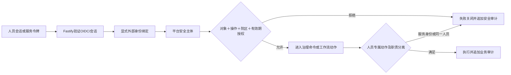
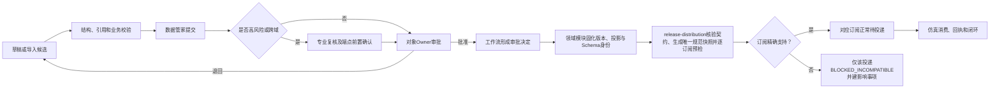
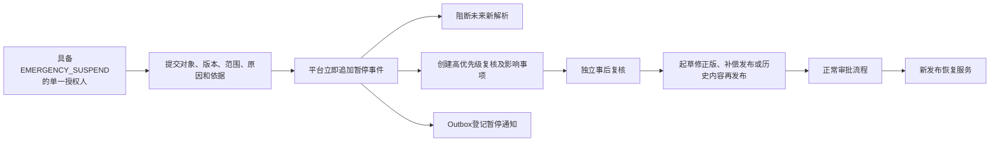

# 价表主数据治理责任与流程

状态：Owner、平台本地对象级授权、Keycloak认证边界、普通审批、高风险审批、版本化审批模板、内置工作流模块、紧急暂停、同进程Outbox派发、版本与生命周期归领域模块所有、`release-distribution`统一发布登记与投递、领域内容投影与快照制品分工、领域版本化投影Schema与单一TypeBox—OpenAPI契约链、消费者精确支持声明与不兼容投递隔离、Phase 01一发布一规范投影一权威快照、投影Schema升级高风险契约治理、投影载荷与完整快照制品双摘要、PostgreSQL `bytea`事务内权威快照存储、仅适用于合成POC的16 MiB单快照容量护栏、三种交付模式下初始化与增量分离的统一消费闭环、受控导出的版本化非权威派生交付制品、消费者交付配置的混合主权、受控声明式转换与失败关闭验证门禁、任一记录确定性转换失败使整个受控导出作业失败且不形成制品的运行语义、瞬时技术故障在同一冻结作业内有限且完整重建式重试的恢复流程、完整POC受控导出采用确定性无压缩ZIP并以内置清单和外置完整制品摘要核验的格式流程、完整POC派生ZIP的独立PostgreSQL `bytea`与短事务原子提交流程、完成派生制品保留至POC证据基线整体处置且取代不覆盖的生命周期流程、派生制品容量先测后定并在事务前超限失败关闭的容量流程、“Phase 01只验证快照拉取、完整POC邻接受控导出、逐记录推送长期预留”的阶段范围，以及72个REST与20个界面场景的量化验收边界均已确认

容量环境补充状态：ADR-0110已确认受限本机WSL2容量环境；环境漂移或并发WSL使对应容量证据失格。

更新日期：2026-08-08

## 1. 治理原则

1. 每个治理对象在同一业务时点只有一个最终内容Owner。
2. 跨域对象由受影响端点Owner提供前置确认，唯一对象Owner终审。
3. 权限按治理对象、操作和院区范围组合，不因属于价表域而获得全部对象权限。
4. 普通领域内容变更的提交人与最终审批人不得相同；只有经证据证明未改变领域内容或成员集合的纯投影Schema升级，才允许模板显式配置提交人兼任平台契约终审人。高风险领域内容流程仍须满足专业复核职责分离。
5. 审批后由平台服务执行发布，业务角色和管理员均不能绕过服务直接写库或发布。
6. 各治理对象独立版本、独立审批、独立发布和独立回退，只通过主题、映射和影响事项关联。
7. 紧急暂停是独立对象级权限，不从普通维护、审批或发布权限自动继承。
8. Keycloak认证成功只证明外部人员或服务身份，不授予任何治理权限；所有流程动作必须重新解析平台安全主体并校验本地对象级授权。

### 1.1 身份与授权前置门禁

人员只通过已验证发行者和`subject`绑定，服务只通过已验证发行者和`client_id`绑定；Keycloak角色、组、姓名、邮箱和工号不参与业务授权。人员主数据稳定身份和平台人员安全主体可以显式关联，但不得自动合并；同一人员使用另一个外部账号仍视为同一职责分离主体。服务身份不能提交、专业复核、Owner终审或审批恢复发布。

## 2. 责任矩阵

| 治理对象 | 提交或维护主体 | 必需前置确认 | 唯一最终Owner |
|---|---|---|---|
| 收费项目及项目版本 | 收费项目数据管家 | 实质语义变化时相关专业复核 | 全院价格Owner |
| 价表、发布版本和价格条目 | 价格数据管家 | 院区差异价需要目标院区业务确认 | 全院价格Owner |
| 政策来源资料 | 政策证据管理员 | 原文完整性或来源核验 | 政策证据Owner |
| 政策适用认定 | 对象数据管家或政策管理员 | 政策证据Owner及受影响专业确认 | 被约束对象的Owner |
| 外部代码命名空间及代码版本 | 对应系统或集成数据管家 | 来源系统语义确认 | 命名空间Owner |
| 收费项目语义映射及操作绑定 | 映射数据管家 | 外部命名空间Owner和收费项目Owner | 映射Owner |
| 医保目录项目及版本 | 医保数据管家 | 来源证据核验 | 医保目录Owner |
| 收费项目医保映射 | 医保或映射数据管家 | 收费项目Owner和医保目录Owner | 医保映射Owner |
| 医保待遇规则 | 医保规则数据管家 | 相关业务或合规复核 | 医保待遇Owner |
| 收费资格规则 | 专业或价格数据管家 | 被约束服务、科室或角色Owner | 资格规则Owner |
| 计价规则及版本 | 价格规则数据管家 | 相关专业复核 | 全院价格Owner |
| 收费组套及版本 | 组套数据管家 | 相关临床或执行专业复核 | 全院价格Owner |
| 临床医嘱目录 | 临床目录数据管家 | 相关专业复核 | 临床目录Owner |
| 执行服务目录 | 专业服务数据管家 | 提供服务的专业复核 | 对应执行服务Owner |
| 医嘱收费映射规则 | 映射或收费数据管家 | 医嘱、执行服务和收费项目Owner | 医嘱收费映射Owner |
| 投影Schema升级 | 所属领域Schema维护者或获授权数据管家 | 所属领域Owner确认字段语义、约束和投影含义 | 平台契约Owner确认TypeBox/OpenAPI结构、契约身份和强制证据 |
| 消费者交付配置及版本 | 获该配置对象级授权的维护者 | 来源领域Owner确认字段含义、约束及来源投影语义未被静默改写 | 集成交付Owner确认目标消费者、用途、交付契约、模板与映射组合 |

上述角色是平台治理功能责任，不是Keycloak角色或人员主数据中的任职角色，也不预设医院实际部门名称。一个人可以组合获得不同对象的多项权限。普通领域内容流程和消费者交付配置仍执行提交人与最终审批人分离；纯投影Schema升级中，同一人若同时持有提交、领域语义确认和平台契约确认的对象级权限，可以分别执行这些动作，包括提交后兼任平台契约终审，但每个动作仍须独立授权和审计。一旦内容、规则、成员或生命周期同时变化，该例外失效。消费者交付配置没有新增例外，来源领域Owner前置确认也不能代替集成交付Owner终审。

## 3. 工作流定义与实例

1. 审批模板具有稳定身份和不可变版本，治理对象保存默认模板身份。
2. 模板版本只能组合平台预先定义的单级Owner审批、专业复核、端点前置确认和Owner终审阶段，不接受BPMN、任意脚本或可执行表达式。
3. `change_request`是工作流实例；提交时冻结审批模板版本、风险判定、必需阶段、目标内容摘要和提交人。
4. 模板发布新版只影响后续新请求，进行中的请求继续使用原冻结版本，不自动迁移或重算。
5. 每次确认、退回、拒绝和批准均原子写入状态转换、只追加审批动作和审计。
6. 最终批准后由领域模块固化自身版本，完成领域语义校验并只构造一个冻结、类型化且完整物化的规范发布投影，同时冻结其`projection_type`、不可变`projection_schema_version`、`projection_schema_digest`、摘要算法及领域版本/成员摘要；同一事务中由`release-distribution`核验契约身份、生成唯一`CANONICAL`快照及投影载荷/完整制品双摘要，对最终规范制品逻辑字节执行Phase 01合成POC的16,777,216字节上限校验，再把合格字节原样写入PostgreSQL `bytea`，并以当时适用的活动订阅版本执行本地逐订阅兼容预检及留证。超限以`SNAPSHOT_ARTIFACT_TOO_LARGE`失败关闭，不拆分、截断、压缩规避或回退其他存储；`UNSUPPORTED`不改变批准结论或回滚领域发布，只生成对应`BLOCKED_INCOMPATIBLE`投递和影响事项；兼容消费者继续。快照字节、元数据、发布、成员、预检、独立投递、审计或Outbox任一失败都导致事务整体回滚；分发模块不得回查领域表、调用消费者或外部存储、解释字段、迁移载荷或生成消费者专用变体。16 MiB不得未经代表性容量验证解释为全院初始化或生产上限。
7. 超时只能生成提醒、升级待办或影响事项，不能自动审批。
8. Phase 01由模块化单体内的工作流领域模块执行，不运行外部流程引擎，也不建立第二份流程状态。
9. 工作流模块只拥有审批模板、变更请求、前置确认和审批动作；它不拥有收费项目或价表的内容版本和业务生命周期，最终批准只产生供领域模块验证的审批决定引用。
10. 投影Schema升级必须作为高风险契约变更和新的显式治理发布处理；领域Owner确认语义，平台契约Owner确认外部结构、契约身份和证据。终审前冻结TypeBox/OpenAPI差异、基于精确支持声明的兼容矩阵、冻结契约生成客户端执行的仿真消费测试及影响分析。即使领域内容版本或成员集合未变化，也要形成新发布序号、契约身份、规范快照、投影载荷摘要、完整制品摘要和兼容预检，原发布制品及双摘要不得重打包或重算。
11. 纯投影Schema升级允许提交人兼任平台契约终审人，但两个确认动作不能合并或省略；是否改变领域内容只依据冻结的领域版本/成员摘要、规则及生命周期证据，不依据投影载荷或完整制品摘要。若领域内容证据变化，则改走普通领域内容流程并恢复提交—终审分离。消费者Owner只维护精确支持版本和迁移准备声明，不参与批准或否决；不兼容只按既有规则阻断其自身投递。
12. 消费者交付配置具有稳定身份和不可变版本。配置版本提交时冻结目标消费者、交付用途、精确来源`projection_type + projection_schema_version`、交付契约版本、模板版本和映射版本；来源领域Owner强制完成语义前置确认后，集成交付Owner才可终审。任何已适用引用缺失、冲突或未批准均阻断版本进入可执行状态。
13. 配置新版只供后续作业显式选择，不能迁移进行中或已完成作业。初始化作业必须在执行前冻结精确配置版本及匹配的规范快照契约；重试、恢复、下载、交接和对账继续使用原版本，不解析`latest`或当前模板。
14. 普通消费者交付配置只能组合字段选择、排序、重命名、确定的格式或类型转换、空值与默认值策略、常量元数据和已发布代码映射版本引用；每项操作必须显式声明输入、输出和失败行为，不能通过组合操作规避门禁。
15. 行过滤、拆分、合并、聚合、计算字段和一对多展开默认不得配置；确有需要时，必须先对相应能力完成独立高风险审批并提供固定测试向量。任意脚本、SQL、网络调用及运行时当前状态查询属于绝对禁止能力，高风险流程也不能开放。
16. 集成交付Owner终审前，平台必须针对配置冻结的精确来源投影Schema和固定样例向量验证全部转换，并冻结Schema身份、向量集合、逐项预期/实际结果和失败明细。任一错误阻断终审；修正形成新配置版本或按既有只追加验证语义重验，不能覆盖原失败证据。

## 4. 普通及高风险流程

高风险变更至少包括：

- 收费项目服务内涵、计价单位、包含或除外范围及收费方式的实质变化。
- 价表发布、价格批量调整、追溯更正和院区差异价。
- 计价规则表达式、参数、舍入层级或输入结构变化。
- 收费组套组成、选择替代、计价或分摊方式变化。
- 会改变运行操作绑定或医嘱收费输出的一对多规则。
- 政策、医保目录或上游项目变化引发的重大适用性重审。
- 任何投影Schema结构、约束或字段解释变化；即使领域内容不变，也必须完成领域语义确认、平台契约确认和四类强制证据。
- 新增或启用任何会过滤、拆分、合并、聚合、计算或一对多展开的消费者交付高风险语义转换能力；普通配置终审不能隐式批准该能力。

## 5. 紧急单人暂停

紧急暂停必须满足：

1. 权限单独授予到治理对象和可操作范围。
2. 操作者只能选择已发布的明确对象版本和未来停止解析的生效时刻。
3. 平台记录原因、依据、操作者、角色、授权范围、请求关联ID、记录时间和哈希链。
4. 暂停不修改对象内容，不删除版本，不改变历史解析结果。
5. 暂停事务只通过`release-distribution`登记Outbox，不直接调用消费者；该模块内部派发器提交后按消费者独立投递，任一消费者失败不回滚平台暂停，并形成重试和影响事项。
6. 事后复核只能确认处置结论或要求新变更，不能原地取消暂停。
7. 恢复必须形成新的发布版本；紧急操作者不能审批自己提交的恢复变更。

## 6. 追溯更正与补偿

1. 追溯更正先声明所影响的业务时间区间，并生成当前及历史引用清单。
2. 更正内容形成新的对象版本或价表发布版本，冻结新规则和上游引用版本。
3. 专业复核确认业务解释，Owner最终批准。
4. 平台保留错误版本，发布新的补偿版本，不覆盖历史。
5. 仿真消费者根据新事件重新解析指定样例，历史原结果和新结果并列保存。
6. POC只生成影响事项和仿真差异，不自动修改患者费用。

## 7. 消费者初始化交付与增量衔接

消费者初始化不属于价表内容审批或发布流程的附属步骤，而是在既有权威发布完成后启动的独立交付作业：

1. 获授权主体创建初始化交付作业，冻结目标消费者及订阅版本、治理对象范围、来源发布、唯一规范快照和`SNAPSHOT_PULL`、`MANAGED_EXPORT_HANDOFF`或`RECORD_PUSH`中的一种模式；使用厂商专用转换时，还须冻结已批准、验证通过且来源投影契约完全匹配的精确消费者交付配置版本，以及不可变重试策略、格式和算法版本。创建作业不得重新发布、重打包历史规范快照、读取领域当前表或运行时选择当前配置。
2. `SNAPSHOT_PULL`由消费者服务身份调用平台API；`MANAGED_EXPORT_HANDOFF`由医院操作员在管理界面发起，`release-distribution`只能机械执行作业所冻结的声明式计划、派生交付格式版本和容量基线，不得编辑映射、推断领域含义、回查当前表或调用脚本、SQL和网络扩展。遇到未批准能力、契约或格式不匹配时必须失败关闭且不能回退禁止能力。完整POC先在最终提交事务外完整生成只含`manifest.json`和`records.csv`的确定性无压缩ZIP及其外置摘要；生成中的进程内临时字节无制品身份。生成完成后按最终ZIP精确字节检查已冻结容量上限，合格时才以短PostgreSQL事务原子写入独立`managed_export_artifact`字节、元数据、成功尝试/作业终态、审计及可交付资格，任一写点失败全部回滚。`RECORD_PUSH`由平台按固定快照成员序号逐条调用第三方接口并保存进度与尝试。
3. `MANAGED_EXPORT_HANDOFF`执行中，只要任一来源记录因值、类型、必需映射或声明约束无法完成确定性转换，整个作业收敛为终态转换失败。失败作业不形成完成的派生交付制品；临时或部分字节不得下载、交接，也不得以成功记录加错误清单、人工跳过、静默丢弃或人工补值继续原作业。本决策不规定发现首个错误后是否继续扫描其余记录。
4. 转换失败必须只追加保留作业级失败事实和每个已发现的行级错误，关联固定来源、精确配置版本、来源成员身份或作业内序号、失败字段或操作、稳定错误码及安全诊断摘要；不得用一个笼统失败标志替代逐行追溯，也不得改换原作业来源。
5. 每次受控导出执行都以正数且不复用的`attempt_no`追加尝试证据，并从作业冻结的全部输入完整重建；显式序号决定顺序。失败尝试的临时成员、进度或部分字节不能作为下一次起点，也不能取得制品身份。
6. 只有冻结重试策略明确列为可重试且仍有自动额度的瞬时技术故障，才在同一作业内按冻结退避规则追加下一次完整重建尝试；未知、未分类或明确不可重试的技术错误不得自动重试。
7. 自动额度耗尽或出现未知技术错误时，作业进入`TECHNICAL_ATTENTION_REQUIRED`、生成影响事项并保持零个完成制品。具备该作业对象级权限的人员可在确认技术条件恢复后发起一次受控重试；该动作追加新尝试，但不重置自动额度、不改变冻结输入，失败则重新进入待处置。
8. 确定性转换错误的修正以及来源、代码映射、消费者交付配置、重试策略、格式、算法或其他冻结输入的任何变化，都必须形成相应新发布或版本并创建新作业；格式变化形成新消费者交付配置版本但不要求重新发布权威主数据，不得借技术重试改换原作业输入。任一后续尝试成功时，一个作业仍只形成一个完整ZIP；提交成功后的重复恢复只能返回既有`artifact_id`和相同字节，不得形成第二制品。全部失败与成功尝试、错误分类、授权动作和影响事项继续保留。
9. 下载、导出、交接或HTTP响应只形成交付动作证据。消费者仍须提交可追溯的接收、校验和应用回执，人工通道可以通过受控回执录入或证据上传进入同一闭环，但不能由操作员直接勾选“已应用”。转换失败或技术待处置作业不得产生成功交接、消费者应用回执、对账通过或检查点推进。
10. 平台以固定来源的发布、快照、范围、版本、数量及摘要对照消费者回执和实际应用证据；任何未解释缺口、失败成员或摘要不一致都阻断作业关闭和检查点推进，并生成差异或影响事项。
11. 对账通过后，平台只追加关闭结论并建立该消费者及治理对象的基线检查点；随后日常增量订阅从该检查点按对象版本顺序、缺口、幂等和受控重放规则继续。初始化作业状态不得覆盖日常增量投递状态，反之亦然。
12. 任何恢复或改换交付模式都保留原作业、配置版本、制品、摘要、清单、尝试、回执和对账证据；除冻结输入完全不变的受控技术重试外，任何修正或变更都由新的作业和新制品显式引用，不得覆盖、续写或自动迁移历史，也不得把逐条推送成员变成治理发布事件或用新作业改写旧检查点来源。
13. 同一消费者及用途出现后续派生制品时，平台只能追加从先前制品到后续制品的取代事实；取代只说明推荐使用顺序，不能修改先前制品的字节、清单、摘要、交付与消费证据，也不能使其过期或可删除。
14. 完成制品在隔离合成POC环境存续期间持续存在。管理界面、业务API和后台作业不提供单制品删除、自动过期、覆盖、重打包或原位脱敏；撤销对象级授权只阻断当前取得，授权恢复后仍解析到原`artifact_id`及相同字节。
15. POC环境整体处置不属于初始化交付工作流。只有不可覆盖证据包完成导出并通过清单、摘要、场景覆盖和关键制品字节复核后，才可由平台外的受控运维流程一次性处置整个隔离合成环境；不得选择性删除某个制品，处置前置条件、操作者和结果保存在被处置环境之外。
16. Phase 01全部架构门禁通过后、容量实验执行前，必须先冻结`F00`、`N10`、`N30`、`N50`、`N100`、`W50`和`E50`七个容量专用画像版本及其来源Schema、交付配置、生成器摘要、种子、最终行数、字段分布和全序规则；修改只能形成新画像版本。
17. 完整POC受控导出实施前，既有TypeScript验证工具链必须以一次性隔离试验装置、冻结画像矩阵及精确字段分布完成前置可行性实验，记录最终ZIP、进程内存与生成时间、PostgreSQL写入与WAL、受控下载与摘要核验和证据包体积；只有后续ADR冻结具体实施上限后才可进入业务薄切实现。运行环境由ADR-0110冻结为独占运行的本机WSL2 Anolis OS 8.9受限环境；重复次数、通过阈值和聚合判定仍待确认。
18. 具体上限冻结后，每个作业必须冻结容量基线身份与数值；超过上限时在成功事务开始前失败关闭，保持零个完成制品、零个成功尝试、非成功作业终态和零可交付资格，不能把临时字节提升为制品。
19. 分片、压缩成员、截断、裁剪、表示切换、存储回退或临时放宽均不能绕过容量门禁。若实验表明一次性生成、内存承载或当前存储不安全，必须先重新确认流式或替代存储架构，再继续完整POC。
20. 前置试验装置只承担候选确定性ZIP生成、同物理形态PostgreSQL写入/读取及受控下载核验，不得成为业务API、正式DDL权威、运行时制品、第二套实现或最终验收证据。
21. 业务薄切完成集成后，必须使用与前置实验相同的冻结画像版本、环境、测量方法和阈值，通过实际`release-distribution`完成生成及原子持久化，并经冻结公共下载API取得和核验制品。
22. 只有集成后真实链路核验通过，容量基线才取得完整POC最终验收资格；内部函数基准、数据库直读、非公开测试路径或前置实验均不能替代。
23. 集成后核验失败时，完整POC失败关闭，不得替换画像、选择较优轮次或静默放宽。任何上限调整必须形成新证据和新ADR；提高上限须重做受影响的两阶段证据，降低上限须重跑边界用例。
24. 两阶段的画像版本、输入身份、生成器与代码版本、环境摘要、原始测量、汇总、差异解释、判定和ADR引用必须汇入同一不可覆盖证据链。
25. 七个画像必须使用容量专用身份空间并只包含Schema合法、业务键唯一、引用完整、顺序稳定且可成功转换的记录；不得复用业务验收fixture或混入重复、缺失映射、非法值和其他错误记录。
26. 任一导出变长字符串缺少冻结契约最大长度、画像越过Schema或合法字符集合不明确时，画像冻结和容量实验都必须失败关闭。
27. 四个普通`N`画像的每个可选输出字段分别精确70%有值、30%使用冻结空值表示；每个适用非空变长文本字段分别精确70%短值、25%中值、5%长值，目标长度为合法最大长度的20%、50%和85%，并按画像版本冻结规则收敛到合法范围。
28. 普通`N`画像适用文本使用不含CSV结构字符的安全单字节基线；身份、代码、枚举、引用、摘要及严格格式或模式字符串只走各自合法确定性生成器，不参与文本分布。
29. `W50`全部可选输出字段有值，变长字符串以合法最大长度的90%为目标且唯一后缀包含在预算内；非字符串字段使用最长合法冻结序列化表示，字符串仍用单字节基线。
30. `E50`逐字段复用`N50`的非空及Unicode码点长度分布；每个适用文本字段按稳定记录全序形成五组各20%：纯中文、中文/ASCII混合、含逗号、含双引号、同时含逗号/双引号/LF的中文混合文本。
31. 多字节与转义字段资格必须按精确输出列身份显式冻结，不能按名称或内容推断；只有允许全部五类字符的多行自由/展示文本才能成为`E50`适用字段，不允许LF的单行文本整体排除在五组压力清单之外并保持普通内容，不得只跳过第五组。身份、代码、枚举、引用、摘要、金额、数字、日期时间、布尔和不兼容模式字段排除。
32. 任一`E50`压力组找不到合法字段、资格清单与冻结Schema不一致或内容生成非法时，画像冻结失败关闭，不得静默跳过、强填或重新分配比例。
33. 全部非空、长度与字符类别必须按字段和稳定记录全序精确确定，不能运行时随机近似；字符串长度按冻结契约的Unicode码点语义判定，容量仍只按最终ZIP精确字节计量。

Phase 01只执行`SNAPSHOT_PULL`，不建立受控导出或逐记录推送流程；全部ABG门禁通过、七画像矩阵及字段分布冻结、前置容量实验完成且后续数值ADR冻结后，完整POC才以合成仿真消费者和默认受控表示转换执行`MANAGED_EXPORT_HANDOFF`邻接薄切，并完整走完本节的作业、重试、ZIP生成、容量检查、PostgreSQL原子固化、保留与取代、交接、回执、对账和检查点步骤；薄切集成后还必须以相同画像、字段分布和环境版本完成真实链路核验，才获得最终容量验收资格。`RECORD_PUSH`继续只作长期预留。本节不授权连接真实消费系统或启用高风险语义转换，也不改变导入批次“单行失败不回滚其他成功行”的语义。受控导出流程由G01至G12和U17至U20验证，使完整POC总基线为72/20；瞬时技术故障恢复作为G05和U19、确定性ZIP作为G05/G06和U18、存储原子性作为G05/G06/G07/G12和U18、生命周期作为G05/G07/G12和U18、画像矩阵/字段分布/两阶段容量证据及超限失败关闭作为G04/G05/G12/U19的必需参数化子用例，均不增加场景编号。容量实验环境由ADR-0110冻结；声明式规则具体语法、执行组件位置，以及重复次数、峰值RSS/磁盘余量/时间阈值、聚合判定和最终数值上限仍须分别确认。三种交付模式及统一消费闭环见[ADR-0095](../adr/0095-support-three-delivery-modes-with-one-consumption-closure.md)，受控导出的派生交付制品见[ADR-0096](../adr/0096-allow-versioned-non-authoritative-derived-artifacts-for-managed-export.md)，消费者交付配置的版本、主权和冻结执行边界见[ADR-0097](../adr/0097-govern-consumer-delivery-profiles-with-integration-owner-and-domain-confirmation.md)，受控转换能力、高风险禁区和验证门禁见[ADR-0098](../adr/0098-restrict-consumer-delivery-transformations-to-declarative-validated-capabilities.md)，任一记录转换失败时的整作业失败、零制品和错误证据语义见[ADR-0099](../adr/0099-fail-the-entire-managed-export-job-on-any-record-conversion-error.md)，阶段范围见[ADR-0100](../adr/0100-stage-managed-export-after-phase-01-and-reserve-record-push.md)，验收场景总量见[ADR-0101](../adr/0101-expand-managed-export-acceptance-baseline-to-72-rest-and-20-ui-scenarios.md)，瞬时技术故障在同一冻结作业内有限重试见[ADR-0102](../adr/0102-retry-transient-managed-export-failures-within-the-same-frozen-job.md)，完整POC确定性无压缩ZIP格式见[ADR-0103](../adr/0103-use-deterministic-uncompressed-zip-for-managed-export-artifacts.md)，完整POC派生ZIP的独立PostgreSQL `bytea`及短事务原子提交见[ADR-0104](../adr/0104-store-managed-export-artifacts-in-postgresql-for-complete-poc.md)，完成派生制品保留至证据基线整体处置及禁止选择性删除见[ADR-0105](../adr/0105-retain-managed-export-artifacts-until-poc-evidence-baseline-disposal.md)，派生制品容量先测后定及超限失败关闭见[ADR-0106](../adr/0106-set-managed-export-artifact-capacity-from-representative-measurement.md)，两阶段容量证据见[ADR-0107](../adr/0107-use-two-stage-capacity-evidence-with-integrated-ratification.md)，容量专用负载画像矩阵见[ADR-0108](../adr/0108-freeze-managed-export-capacity-workload-profile-matrix.md)，容量字段分布规则见[ADR-0109](../adr/0109-freeze-managed-export-capacity-field-distribution-rules.md)，本机WSL2容量仿真环境见[ADR-0110](../adr/0110-use-local-wsl2-anolis-8-9-for-capacity-simulation.md)。

责任与紧急处置决策见[ADR-0063](../adr/0063-single-owner-approval-and-one-person-emergency-suspension.md)，工作流实现边界见[ADR-0078](../adr/0078-implement-workflow-as-an-internal-domain-module.md)，版本与生命周期模块所有权见[ADR-0084](../adr/0084-keep-version-and-lifecycle-ownership-in-domain-modules.md)，发布登记与投递模块边界见[ADR-0086](../adr/0086-unify-release-registration-and-delivery-in-one-deep-module.md)，领域内容投影与快照制品边界见[ADR-0087](../adr/0087-domain-projection-and-release-snapshot-packaging.md)，投影Schema主权与单一契约链见[ADR-0088](../adr/0088-domain-owned-versioned-projection-schemas.md)，消费者兼容与隔离投递见[ADR-0089](../adr/0089-use-exact-consumer-projection-support-and-isolated-delivery-blocking.md)，一发布一规范投影一权威快照及历史不可重打包见[ADR-0090](../adr/0090-use-one-canonical-projection-snapshot-per-release-in-phase-01.md)，Schema升级高风险契约治理及限定职责分离例外见[ADR-0091](../adr/0091-govern-projection-schema-upgrades-as-high-risk-contract-changes.md)，投影载荷与完整制品双摘要见[ADR-0092](../adr/0092-use-separate-projection-payload-and-snapshot-artifact-digests.md)，Phase 01快照`bytea`事务内存储及受控下载见[ADR-0093](../adr/0093-store-canonical-snapshot-bytes-in-postgresql-transactionally.md)，仅用于合成POC的16 MiB单制品容量护栏及禁止外推边界见[ADR-0094](../adr/0094-limit-phase-01-canonical-snapshot-artifacts-to-16-mib.md)。
