# 价表主数据逻辑数据模型

状态：逻辑模型已确认；Phase 01物理实现采用PostgreSQL 18.4、`pgcrypto`、`btree_gist`、固定`Asia/Shanghai`无时区日期时间、与Keycloak认证分离的平台本地授权模型、同进程可恢复Outbox派发模型、治理对象模块拥有版本与生命周期、`price-list`与`price-resolution`分离、`release-distribution`统一发布登记与投递所有权、领域内容投影与快照制品分工、领域拥有版本化投影Schema并进入单一TypeBox—OpenAPI契约链、消费者精确版本支持声明与不兼容投递隔离、Phase 01一发布一规范投影一权威快照、投影Schema升级高风险契约治理、投影载荷与完整快照制品双摘要、PostgreSQL `bytea`事务内权威快照存储结构、仅适用于合成POC的16 MiB单快照容量护栏、三种交付模式下初始化与增量分离的统一消费闭环、受控导出的版本化非权威派生交付制品、消费者交付配置、受控声明式转换与失败关闭验证门禁、任一记录确定性转换失败使整个受控导出作业失败且不形成制品的运行语义、瞬时技术故障在同一冻结作业内有限且完整重建式重试的恢复模型、完整POC受控导出的确定性无压缩ZIP及内置清单与外置完整制品摘要模型、完整POC派生ZIP的独立PostgreSQL `bytea`与短事务原子成功提交模型、完成派生制品保留至POC证据基线整体处置且取代不覆盖的生命周期模型、派生制品以最终ZIP精确字节先测后定并超限失败关闭的容量模型、“Phase 01只验证快照拉取、完整POC邻接受控导出、逐记录推送长期预留”的阶段范围，以及完整POC 72个REST与20个界面场景的验收基线

容量环境补充状态：ADR-0110已确认本机WSL2 Anolis OS 8.9环境；该环境决定不新增逻辑实体或物理DDL。

更新日期：2026-08-08

## 1. 建模约定

### 1.1 身份、版本与发布

所有受治理对象遵循三层结构：

1. **稳定身份表**：回答对象“是谁”，ID永久不复用。
2. **不可变版本表**：回答对象在某段业务时间内“是什么”。
3. **发布表及成员表**：回答哪些版本经过一次审批形成一致发布边界。

稳定关系同样采用“关系身份＋关系版本”。已发布版本不覆盖；修订形成新版本，回退形成补偿发布。

### 1.2 通用字段

| 字段 | 逻辑类型 | 规则 |
|---|---|---|
| `*_id` | UUID | 平台稳定主键，不使用外部业务代码 |
| `version_no` | Positive Integer | 同一稳定身份内唯一且递增 |
| `business_valid_from` | Local DateTime | 业务有效区间左端，无时区且固定按`Asia/Shanghai`解释 |
| `business_valid_to` | Nullable Local DateTime | 右开区间；无时区且空值表示尚未计划结束 |
| `recorded_from` | Local DateTime | 平台开始知道该版本的院内本地日期时间 |
| `recorded_to` | Nullable Local DateTime | 平台不再把该知识版本视为当前的院内本地记录时间 |
| `governance_status` | Fixed State | 草稿、审批中、驳回、批准、已发布等流程状态 |
| `business_status` | Fixed State | 计划生效、生效中、暂停、结束、被替代等业务状态 |
| `release_id` | UUID FK | 版本首次发布所在治理对象发布 |
| `content_hash` | SHA-256 | 规范化内容摘要 |
| `created_by` | Platform Principal ID | 已解析的本地人员安全主体或服务身份，不保存外部显示名称作为权威 |
| `created_at` | Local DateTime | 记录创建的院内本地日期时间 |

`Local DateTime`不携带时区或UTC偏移，唯一解释为IANA `Asia/Shanghai`。业务有效区间统一使用左闭右开`[from, to)`；API、文件导入和仿真消费使用不带`Z`或偏移的ISO 8601本地日期时间字符串，带偏移输入必须拒绝而不是剥离。日期型字段保持日历日期语义。对双时态版本的唯一性约束以“业务区间和记录区间不能同时重叠”为准，允许追溯更正关闭旧记录区间后，为同一历史业务时段建立新的知识版本。

`recorded_to`和`business_status`是逻辑查询字段，不授权覆盖已发布版本内容。严格只追加实现应由版本记录关闭事件和业务生命周期事件推导这两个值；若为查询性能物化到版本行，也只能由平台服务在受控事务中更新投影，并保留不可变原内容摘要和对应事件。

### 1.3 排序权威

需要严格顺序的记录采用“流标识＋正数`bigint`流内序号”；组合必须唯一，序号单调且永久不复用，但允许因回滚、失败或并发分配产生空洞。院内本地日期时间只用于业务有效性、展示和筛选，不参与唯一性或最终排序；不同流的序号不能比较，跨流只通过请求或事务关联标识建立关系。

| 有序记录流 | 规范顺序字段 |
|---|---|
| 稳定实体版本 | `stable_identity_id + version_no` |
| 治理对象发布 | `governance_object_id + release_no` |
| 审计事件 | `audit_stream_id + audit_sequence` |
| Outbox变化 | `aggregate_id + aggregate_version` |
| 导入行执行 | `import_row_id + execution_sequence` |
| 消费处理尝试 | `consumer_id + event_id + attempt_no` |

### 1.4 金额与数量

- 金额使用定点十进制，逻辑精度至少`Decimal(18,4)`。
- 数量、权重和倍率使用定点十进制，逻辑精度至少`Decimal(18,6)`。
- 禁止二进制浮点金额计算。
- 币种使用ISO 4217代码；POC样本使用`CNY`，模型不把币种硬编码为字段常量。
- 每个计算规则明确舍入精度、舍入模式和舍入层级。

### 1.5 引用原则

- 跨治理对象关系保存目标稳定ID，并额外冻结发布时实际校验的目标版本ID。
- 运行解析直接使用冻结版本，不动态跟随“最新版”。
- 多态目标使用数据库可约束的超类型或排他子类型表，不使用无法建立外键的自由`target_type + target_id`。

### 1.6 模块所有权

逻辑上的共同字段不表示存在通用版本模块或共享版本表：

- `charge-catalog`拥有`charge_item`、`charge_item_version`、收费项目演进关系，以及收费项目草稿、发布、暂停、结束、替代和追溯更正语义。
- `price-list`拥有`price_list`、`price_list_release`、`price_entry`，以及价表草稿、完整发布、暂停、结束和补偿语义。
- `price-resolution`拥有`price_resolution`、`price_resolution_step`、`price_resolution_result`及排他目标子类型，独占固定两级解析、通用/专用判定、规则执行、舍入和解析证据语义。
- `release-distribution`拥有`governance_release`、`release_member`、最终发布快照制品及元数据、Outbox事件、消费者订阅、投递、尝试以及平台侧检查点和回执；内部事务阶段分离，但不拆成`publication`、`delivery`或独立`outbox`模块。
- 通用`governance_release`、`release_member`、发布快照和Outbox只表达一次发布的包络、成员、证据与分发，不取代领域内容版本，也不得直接改变领域生命周期。
- 工作流只拥有模板、请求、确认和审批动作状态；最终批准由对应领域模块在同一事务作用域中解释并转成领域状态变化。
- 审计事件只保存只追加证据，不作为收费项目或价表当前状态的第二来源。

因此，`version_no`、双时态字段、内容摘要和生命周期字段可以遵守共同格式，但其不变量、允许转换和写入路径仍由拥有模块定义。物理设计不得引入`VersionService`、`BaseVersion`、通用版本CRUD表或配置化通用状态机绕过这些模块。

## 2. 总体关系

```mermaid
erDiagram
    SECURITY_PRINCIPAL ||--o{ EXTERNAL_IDENTITY_BINDING : authenticates_as
    SECURITY_PRINCIPAL ||--o{ AUTHORIZATION_ASSIGNMENT : receives
    GOVERNANCE_OBJECT ||--o{ OBJECT_PERMISSION_GRANT : protects
    OBJECT_PERMISSION_GRANT ||--o{ AUTHORIZATION_ASSIGNMENT : assigned_through
    GOVERNANCE_OBJECT ||--o{ GOVERNANCE_RELEASE : publishes
    GOVERNANCE_RELEASE ||--o{ RELEASE_MEMBER : contains

    PRICED_OBJECT ||--|| CHARGE_ITEM : subtype
    PRICED_OBJECT ||--|| CHARGE_BUNDLE : subtype
    CHARGE_ITEM ||--o{ CHARGE_ITEM_VERSION : versions
    CHARGE_BUNDLE ||--o{ CHARGE_BUNDLE_VERSION : versions

    PRICE_LIST ||--o{ PRICE_LIST_RELEASE : releases
    PRICE_LIST_RELEASE ||--o{ PRICE_ENTRY : contains
    PRICED_OBJECT ||--o{ PRICE_ENTRY : priced
    PRICING_RULE ||--o{ PRICING_RULE_VERSION : versions
    PRICING_RULE_VERSION ||--o{ PRICE_ENTRY : calculates

    EXTERNAL_NAMESPACE ||--o{ EXTERNAL_CODE : contains
    EXTERNAL_CODE ||--o{ EXTERNAL_CODE_VERSION : versions
    EXTERNAL_CODE_VERSION ||--o{ SEMANTIC_MAPPING_VERSION : maps
    CHARGE_ITEM_VERSION ||--o{ SEMANTIC_MAPPING_VERSION : maps
    EXTERNAL_CODE_VERSION ||--o{ OPERATIONAL_BINDING_VERSION : binds

    POLICY_SOURCE ||--o{ POLICY_SOURCE_VERSION : versions
    POLICY_SOURCE_VERSION ||--o{ POLICY_APPLICABILITY_VERSION : supports

    ORDERABLE ||--o{ ORDERABLE_VERSION : versions
    EXECUTION_SERVICE ||--o{ EXECUTION_SERVICE_VERSION : versions
    ORDER_CHARGE_RULE ||--o{ ORDER_CHARGE_RULE_VERSION : versions
    ORDERABLE_VERSION ||--o{ ORDER_CHARGE_RULE_VERSION : source
    EXECUTION_SERVICE_VERSION ||--o{ ORDER_CHARGE_RULE_VERSION : context

    PRICE_LIST_RELEASE ||--o{ PRICE_RESOLUTION : resolves
    PRICE_RESOLUTION ||--o{ PRICE_RESOLUTION_STEP : explains
    PRICE_RESOLUTION ||--o{ PRICE_RESOLUTION_RESULT : returns

    GOVERNANCE_RELEASE ||--o{ OUTBOX_EVENT : notifies
    GOVERNANCE_RELEASE ||--|| RELEASE_SNAPSHOT : freezes
    OUTBOX_EVENT ||--o{ OUTBOX_DELIVERY : delivered_to
    CONSUMER_SUBSCRIPTION ||--o{ OUTBOX_DELIVERY : receives
    OUTBOX_DELIVERY ||--o{ OUTBOX_DELIVERY_ATTEMPT : attempts
    CONSUMER_SUBSCRIPTION ||--o{ CONSUMER_RECEIPT : receives
```

## 3. 通用治理结构

### 3.1 `governance_object`

登记一个独立授权、审批和发布的治理对象。

| 字段 | 约束或含义 |
|---|---|
| `governance_object_id` | PK |
| `object_code` | 全平台唯一、不可复用 |
| `object_type` | 收费项目目录、价表、规则、组套、映射等 |
| `display_name` | 当前管理名称，不替代版本快照名称 |
| `owner_role_id` | 唯一最终Owner角色 |
| `schema_version_id` | 当前允许的结构版本 |
| `rule_set_id` | 当前默认校验规则集 |
| `approval_template_id` | 默认审批模板稳定身份；提交时解析并冻结其已发布版本 |
| `campus_scope_policy` | 全院、指定院区或允许院区维护草稿 |
| `status` | 启用、暂停治理、退役 |

### 3.2 `governance_release`

`governance_release`与3.3节成员表由`release-distribution`拥有，只表达经领域模块固化后的通用发布事实。领域模块通过该模块接口登记，不能直接写表；`release-distribution`也不能据此创建或改变领域内容版本。

| 字段 | 约束或含义 |
|---|---|
| `release_id` | PK |
| `governance_object_id` | FK |
| `release_no` | 对象内唯一、递增 |
| `release_kind` | 普通、补偿、历史内容再发布、契约升级发布 |
| `governance_status` | 固定状态机 |
| `business_valid_from/to` | 发布的业务适用区间 |
| `recorded_from/to` | 平台记录区间 |
| `submitted_by` | 提交人 |
| `approved_by` | 最终审批人；普通领域内容变更不能等于提交人，纯投影Schema契约升级按冻结例外策略可以相同 |
| `approved_at` | `Asia/Shanghai`院内本地日期时间 |
| `change_reason` | 必填 |
| `supersedes_release_id` | 可空，自引用 |
| `compensates_release_id` | 补偿发布时必填 |
| `content_hash` | 完整成员清单及内容摘要 |

唯一约束：`(governance_object_id, release_no)`。

### 3.3 `release_member`

| 字段 | 约束或含义 |
|---|---|
| `release_member_id` | PK |
| `release_id` | FK |
| `entity_type` | 受控枚举 |
| `stable_entity_id` | 通过受控子类型表建立真实FK |
| `entity_version_id` | 通过受控子类型表建立真实FK |
| `snapshot_name` | 发布时展示名称 |
| `member_hash` | 版本内容摘要 |

同一发布中同一稳定实体只能出现一次。物理设计应为主要对象建立排他成员子类型表，避免无外键的自由多态。

### 3.4 工作流定义、实例与审计

| 表 | 核心字段 |
|---|---|
| `approval_template` | 模板稳定身份、模板代码、名称、状态 |
| `approval_template_version` | 模板、版本号、治理状态、版本说明、内容摘要、提交人与终审人职责分离策略 |
| `approval_stage_definition` | 模板版本、阶段序号、已知阶段类型、必需角色或确认类型、通过条件；包括领域语义确认和平台契约确认 |
| `change_request` | 对象、目标版本、冻结变更分类、模板版本、风险判定快照、职责分离策略、必需阶段摘要、提交内容摘要、领域内容摘要、提交人、原因、状态 |
| `required_confirmation` | 请求、端点Owner、确认类型、结果、意见、时间 |
| `approval_action` | 请求、动作序号、审批阶段、操作者、结果、理由、所见内容摘要 |
| `projection_contract_change_evidence` | 请求、旧/新投影契约身份、TypeBox/OpenAPI差异摘要、兼容矩阵摘要、仿真消费验证运行、影响分析摘要、领域Owner确认动作、平台契约Owner终审动作 |
| `version_record_closure` | 被关闭版本、记录结束时刻、原因、替代知识版本、操作者、哈希 |
| `business_lifecycle_event` | 对象版本、生命周期序号、计划生效/结束/替代/暂停、业务生效时刻、原因、来源请求、哈希 |
| `emergency_suspension_event` | 对象、版本、范围、生效时刻、单一操作者、原因、依据、哈希 |
| `impact_issue` | 来源变化、受影响对象、严重级别、阻断范围、Owner、状态、关闭证据 |
| `audit_event` | 审计流、审计序号、对象、版本、动作、前后摘要、主体、角色、范围、时间、请求ID、上一哈希、当前哈希 |

`change_request`本身就是本阶段的工作流实例，不另建无领域含义的通用流程实例。已发布`approval_template_version`及其阶段定义不可修改；阶段类型只允许单级Owner审批、专业复核、端点前置确认、领域语义确认、平台契约确认和Owner终审等平台已知类型，不保存BPMN、可执行脚本或任意表达式。请求提交后固定引用变更分类、模板版本、风险结果、职责分离策略、必需阶段、内容摘要和强制证据，模板新版只供新请求使用。

每次流程转换必须在同一事务中校验当前状态及权限，并追加`approval_action`和对应审计；批准触发发布时，发布事务继续原子写入发布、PostgreSQL `bytea`快照字节及元数据、审计和Outbox。流程超时只能追加提醒或升级事项，不产生批准动作。

投影Schema升级固定为高风险契约变更。领域Owner必须以独立动作确认字段语义和领域投影含义，平台契约Owner必须以独立动作确认外部结构、契约身份及四类证据完整；同一安全主体同时持有两类对象级权限时可以分别执行两个动作。只有变更分类为纯契约升级且冻结领域内容摘要及成员集合均与基线相同时，模板才允许`submitted_by = approved_by`；内容、规则、成员或生命周期任一变化都使例外失效并恢复普通职责分离。消费者支持版本和准备声明只进入兼容矩阵，不形成审批动作或否决权。

`audit_event`、`approval_action`、`version_record_closure`、`business_lifecycle_event`和`emergency_suspension_event`只追加。紧急暂停的恢复引用新的`release_id`，不能更新暂停事件为“取消”。

审计哈希输入必须包含`audit_stream_id`、`audit_sequence`和上一哈希，唯一约束为`(audit_stream_id, audit_sequence)`；相同本地日期时间的并发审计事件仍按序号确定流内顺序。

### 3.5 导入

| 表 | 核心字段 |
|---|---|
| `import_job` | 批次ID、治理对象、结构版本、规则集版本、文件摘要、状态、提交人 |
| `import_row` | 批次、源行号、业务键摘要、内容摘要、原始行快照 |
| `import_row_result` | 行、执行序号、成功/警告/失败/重复、错误代码、字段路径、消息 |
| `import_draft_link` | 成功行、草稿实体版本 |

约束：

- `(import_job_id, source_row_no)`唯一。
- 同一批次重试复用原`import_job_id`。
- 已成功行不重复创建草稿版本。
- 新批次同业务键进入版本变更，不按重复跳过。

### 3.6 身份、会话与本地授权

身份提供方、人员主数据和平台业务授权是三个独立边界。Keycloak只保存和验证外部账号、客户端、凭据及OIDC会话；以下逻辑对象属于平台治理Schema，不复制Keycloak凭据或把Keycloak角色作为业务权限：

| 表 | 核心字段 |
|---|---|
| `security_principal` | 平台主体稳定ID、主体类型`HUMAN`或`SERVICE`、状态、显示标签、创建与失效依据 |
| `external_identity_binding` | 平台主体、绑定类型、OIDC发行者、人员`subject`或服务`client_id`、绑定状态、有效区间、核验依据 |
| `principal_person_binding` | 人员安全主体、人员主数据稳定ID、显式核验依据、有效区间；服务主体禁止进入 |
| `server_auth_session` | 会话稳定ID、人员安全主体、会话标识摘要、创建/到期/撤销本地时间、轮换序号、撤销原因 |
| `object_permission_grant` | 授权稳定ID、治理对象、受控操作、院区范围、业务有效区间、授权状态、批准依据 |
| `authorization_assignment` | 平台安全主体、对象权限授予、有效区间、授予/撤销请求、只追加审计关联 |

`external_identity_binding`对人员使用已验证的`(issuer, subject)`，对服务使用已验证的`(issuer, client_id)`；同一有效外部身份只能绑定一个平台安全主体。姓名、工号、邮箱、外部角色和显示名称只可作为辅助展示或人工核验材料，不参与唯一匹配。一个人员主数据身份与一个人员安全主体可以显式关联，但二者生命周期和内容主权独立；职责分离比较本地人员安全主体及其人员绑定，不能通过第二个外部账号绕过。服务主体不能绑定人员主数据，也不能取得提交、专业复核、Owner终审或紧急恢复审批等人员专属操作。

人员浏览器会话由Fastify持有，浏览器Cookie只保存不透明随机会话标识；访问及刷新令牌不得进入业务表、审计正文或浏览器存储。若服务端确需持久化令牌材料，必须加密并与领域数据、日志及导出隔离。每次请求先完成OIDC或会话验证并解析`security_principal`，再查询当时有效的本地授权；Keycloak角色、组或令牌内自定义业务权限声明不参与授权决定。

OIDC/JWT的`iat`、`exp`、`nbf`及`auth_time`是认证适配器必须按标准处理的数字协议声明，不映射为平台`Local DateTime`或PostgreSQL日期时间列。平台会话创建、到期、撤销、授权有效期和审计时间仍以`timestamp without time zone`保存并固定按`Asia/Shanghai`解释。Keycloak厂商数据库位于治理Schema之外，由产品自身迁移和协议时间语义管理。

## 4. 收费项目与可定价对象

### 4.1 `priced_object`

为收费项目和收费组套提供受约束的统一定价目标。

| 字段 | 约束或含义 |
|---|---|
| `priced_object_id` | PK |
| `object_kind` | `CHARGE_ITEM`或`CHARGE_BUNDLE` |
| `created_at/by` | 审计字段 |

`charge_item`和`charge_bundle`分别使用与`priced_object`共享主键的一对一子类型；对象类型不可改变。

### 4.2 `charge_item`

| 字段 | 约束或含义 |
|---|---|
| `charge_item_id` | PK兼FK至`priced_object` |
| `internal_code` | 全院命名空间内唯一、永久不复用 |
| `origin_scope` | `HOSPITAL`或`CAMPUS_EXTENSION` |
| `origin_campus_id` | 院区扩展时必填，否则为空 |
| `created_at/by` | 记录字段 |

院区扩展项目不得复用全院项目代码或稳定ID。

### 4.3 `charge_item_version`

| 字段 | 约束或含义 |
|---|---|
| `charge_item_version_id` | PK |
| `charge_item_id` | FK |
| `version_no` | 同一项目唯一 |
| `formal_name` | 正式名称 |
| `short_name` | 可空 |
| `service_definition` | 服务内涵 |
| `included_scope` | 包含内容，结构化文本 |
| `excluded_scope` | 除外内容，结构化文本 |
| `billing_unit_code` | 冻结计价单位版本 |
| `charging_method_code` | 次数、时长、数量等收费方式 |
| `business_status` | 计划生效、生效、暂停、结束、被替代 |
| `business_valid_from/to` | 业务区间 |
| `recorded_from/to` | 记录区间 |
| `release_id` | 首次发布版本 |
| `supersedes_version_id` | 同一身份内版本承接 |
| `content_hash` | 摘要 |

同一项目的两个已发布版本不得同时在业务有效区间和记录有效区间上重叠；这使追溯更正可以关闭旧记录区间并用新记录区间表达同一历史业务时段。服务内涵、计价单位、包含或除外范围、收费方式发生实质变化时不创建同一项目的新版本，而是新建收费项目身份。

### 4.4 `charge_item_evolution`

| 字段 | 约束或含义 |
|---|---|
| `evolution_id` | PK |
| `predecessor_item_id` | FK |
| `successor_item_id` | FK |
| `relation_type` | 替代、拆分来源、合并来源、派生 |
| `business_effective_at` | 业务时间 |
| `reason` | 必填 |
| `change_request_id` | FK |

前身和后继不能相同。拆分、合并允许多对多关系，但不得自动迁移价格条目或历史引用。

## 5. 价表与价格条目

### 5.1 `price_list`

| 字段 | 约束或含义 |
|---|---|
| `price_list_id` | PK |
| `price_list_code` | 全院唯一、永久不复用 |
| `created_at/by` | 记录字段 |

价表名称、币种和适用说明随发布版本冻结，不在稳定身份表覆盖修改。

### 5.2 `price_list_release`

| 字段 | 约束或含义 |
|---|---|
| `price_list_release_id` | PK |
| `price_list_id` | FK |
| `release_no` | 价表内唯一 |
| `display_name` | 发布时名称 |
| `currency_code` | ISO 4217 |
| `business_valid_from/to` | 价表发布业务区间 |
| `recorded_from/to` | 平台记录区间 |
| `governance_status` | 流程状态 |
| `business_status` | 计划生效、生效、暂停、结束 |
| `governance_release_id` | FK至通用发布 |
| `supersedes_release_id` | 可空 |
| `content_hash` | 完整价格条目快照摘要 |

已发布价表版本是完整快照，不提供增量覆盖语义。

同一`price_list_id`的两个已发布版本不得同时在业务有效区间和记录有效区间上重叠。正常视图在给定业务时点和记录时点只能确定一个价表发布版本；追溯更正通过关闭原记录区间并记录新的完整发布快照实现。

### 5.3 `price_entry`

| 字段 | 约束或含义 |
|---|---|
| `price_entry_id` | PK |
| `price_list_release_id` | FK |
| `priced_object_id` | FK至收费项目或收费组套超类型 |
| `scope_level` | `HOSPITAL`或`CAMPUS` |
| `campus_id` | `CAMPUS`时必填，`HOSPITAL`时为空 |
| `encounter_mode` | `GENERAL`或`SPECIFIC` |
| `encounter_type` | 专用模式为门诊、住院、急诊或体检；通用模式为空 |
| `pricing_method` | `FIXED`或`RULE` |
| `fixed_unit_price` | 固定价时必填且非负 |
| `pricing_rule_version_id` | 规则价时必填 |
| `currency_code` | 必须等于价表币种 |
| `billing_unit_code` | 必须与冻结目标版本兼容 |
| `business_valid_from/to` | 条目业务区间 |
| `price_nature` | 标准、院区差异等受控值 |
| `zero_price_reason` | 金额为零时必填 |
| `content_hash` | 摘要 |

排他目标表：

- `price_entry_charge_item_target(price_entry_id, charge_item_id, charge_item_version_id)`
- `price_entry_bundle_target(price_entry_id, charge_bundle_id, charge_bundle_version_id)`

每个`price_entry`恰好存在一个目标子类型。稳定ID和冻结版本必须属于同一对象。

关键约束：

1. `FIXED`要求`fixed_unit_price`非空且规则版本为空；`RULE`相反。
2. 全院范围要求`campus_id`为空；院区范围要求非空。
3. 通用模式要求`encounter_type`为空；专用模式要求是四类实际场景之一。
4. 同一发布、可定价对象、组织范围、相同专用场景的有效期不得重叠。
5. 同一发布、可定价对象、组织范围和相交有效期内，通用模式与任一专用模式不得并存。
6. 价格条目业务区间必须落在或被价表发布业务区间覆盖。
7. 院区差异价只能由全院价格Owner批准的发布包含。
8. 数字优先级字段不存在。

第5项通常需要范围排他约束与发布前集合校验共同实现，不能只依赖单行`CHECK`。

### 5.4 `price_resolution`

该表及5.5、5.6节的解析证据表由`price-resolution`模块拥有。模块不得直接查询`price-list`表或草稿，只能消费`price-list`接口返回的不可变已发布价格解析视图。`price-list`负责按价表身份、服务发生时间和记录时点确定唯一权威发布版本并返回相关候选集合；`price-resolution`负责院区到全院、通用/专用、冲突、规则执行、金额及舍入，二者不得复制对方主权。

| 字段 | 约束或含义 |
|---|---|
| `price_resolution_id` | PK |
| `request_id` | 调用方幂等键 |
| `request_hash` | 规范化输入摘要 |
| `priced_object_id` | 请求目标 |
| `price_list_id` | 请求或默认价表 |
| `price_list_release_id` | 可唯一确定时冻结权威发布版本；无版本或发布冲突失败时为空并由选择证据解释 |
| `published_view_hash` | `price-list`返回的不可变发布视图规范摘要 |
| `campus_id` | 当前院区 |
| `encounter_type` | 四类实际场景之一 |
| `service_occurred_at` | 计价基准时间 |
| `record_as_of` | 审计复现时可指定 |
| `resolution_status` | 成功、无价格、冲突、暂停、规则失败 |
| `resolved_at` | 平台记录时刻 |
| `input_context_hash` | 最小上下文摘要 |

唯一约束：同一调用方契约下`(request_id, request_hash)`唯一；同一`request_id`不同输入必须报幂等冲突。

目标使用排他子类型表：

- `price_resolution_charge_item_target(price_resolution_id, charge_item_id, charge_item_version_id)`
- `price_resolution_bundle_target(price_resolution_id, charge_bundle_id, charge_bundle_version_id)`

每次解析恰好存在一个目标子类型，且子类型稳定ID必须等于`priced_object_id`。主表不保存无外键约束的通用版本ID，完全由两个子类型表表达冻结版本。

无论成功、无价格、暂停、冲突或规则失败，解析证据都必须冻结请求摘要、发布视图选择结果、候选发布或条目引用及摘要、目标版本、规则版本和有序步骤。这里定义逻辑证据要求，不冻结Phase 01物理DDL的列拆分方式。

### 5.5 `price_resolution_step`

记录固定算法的每一步，而不是保存不透明日志。

| 字段 | 约束或含义 |
|---|---|
| `price_resolution_step_id` | PK |
| `price_resolution_id` | FK |
| `step_no` | 请求内唯一 |
| `scope_checked` | 院区或全院 |
| `encounter_mode_checked` | 通用或专用 |
| `candidate_count` | 候选数 |
| `decision` | 命中、无候选、冲突、暂停 |
| `price_entry_id` | 命中时FK |
| `candidate_set_hash` | 本步骤所见候选条目ID、版本引用和内容摘要的规范摘要 |
| `explanation_code` | 稳定错误或解释码 |

### 5.6 `price_resolution_result`

| 字段 | 约束或含义 |
|---|---|
| `price_resolution_result_id` | PK |
| `price_resolution_id` | FK且成功请求唯一 |
| `price_entry_id` | FK |
| `price_list_release_id` | FK |
| `price_list_release_hash` | 冻结发布内容摘要 |
| `price_entry_hash` | 冻结命中条目摘要 |
| `matched_scope_level` | 院区或全院 |
| `matched_encounter_mode` | 通用或专用 |
| `pricing_rule_version_id` | 固定价为空 |
| `pricing_rule_version_hash` | 规则价时冻结，固定价为空 |
| `unit_price` | 规则解析前或固定单价 |
| `quantity` | Decimal |
| `amount_before_rounding` | Decimal |
| `final_amount` | Decimal |
| `currency_code` | ISO代码 |
| `result_hash` | 结果摘要 |

## 6. 外部代码与映射

### 6.1 `external_code_namespace`

| 字段 | 约束或含义 |
|---|---|
| `namespace_id` | PK |
| `namespace_code` | 全平台唯一 |
| `system_kind` | HIS、财务、体检、历史、院区本地等 |
| `object_kind` | 收费代码、收入科目、体检项目等 |
| `scope_level` | 全院或院区 |
| `campus_id` | 院区范围时必填 |
| `code_pattern` | 校验模式 |
| `case_policy` | 保持、转大写或转小写 |
| `trim_policy` | 规范化规则 |
| `reuse_policy` | 禁止复用或允许带时间复用 |
| `owner_role_id` | 唯一Owner |
| `status` | 生命周期 |

POC固定五个`SIM_*`命名空间。

### 6.2 `external_code`与`external_code_version`

`external_code`保存命名空间内稳定代码身份；`external_code_version`保存名称、说明、来源状态和双时态。

关键约束：

- `(namespace_id, normalized_code, identity_sequence)`唯一。
- 禁止复用的命名空间中`identity_sequence`固定为1。
- 允许历史复用时，不同身份的业务有效区间不得重叠。
- 同一代码身份的两个版本不得同时在业务有效区间和记录有效区间上重叠。

### 6.3 语义映射

| 表 | 核心字段 |
|---|---|
| `charge_item_semantic_mapping` | 稳定映射ID、创建信息 |
| `charge_item_semantic_mapping_version` | 外部代码稳定ID及冻结版本、收费项目稳定ID及冻结版本、关系类型、依据、范围、双时态、审批、发布 |

关系类型固定为：

- `EQUIVALENT`
- `INTERNAL_NARROWER`
- `INTERNAL_BROADER`
- `RELATED`

多对多合法；同一双方版本、关系类型、范围和重叠时段不得出现重复发布关系。

### 6.4 操作绑定

| 表 | 核心字段 |
|---|---|
| `charge_item_operational_binding` | 稳定绑定ID |
| `charge_item_operational_binding_version` | 命名空间、外部代码及冻结版本、用途、方向、院区范围、业务区间、目标类型、审批和发布 |

用途固定包括导入、导出、查询、历史解释和仿真消费；方向包括入站、出站和双向。

目标使用排他子类型表：

- `binding_target_charge_item`
- `binding_target_charge_bundle`
- `binding_target_order_charge_rule`

运行唯一键为：

`外部代码版本 + 用途 + 方向 + 院区范围 + 业务有效时间`

该键的已发布有效区间不得重叠。需要一对多时必须目标为规则或组套。

## 7. 政策证据与医保邻接模型

### 7.1 政策来源

| 表 | 核心字段 |
|---|---|
| `policy_source` | 稳定资料身份、来源机构、来源标识 |
| `policy_source_version` | 标题、文号、发布日期、生效信息、来源URL、获取时间、原文件对象键、媒体类型、大小、SHA-256、摘要、双时态 |
| `policy_source_relation` | 修订、替代、废止、补充等资料间关系 |

原文件不可覆盖。相同文件摘要可以共享底层二进制对象，但每条来源证据记录独立保留。

### 7.2 政策适用认定

| 表 | 核心字段 |
|---|---|
| `policy_applicability` | 稳定认定ID |
| `policy_applicability_version` | 冻结政策版本、关系类型、条款定位、解释结论、适用范围、双时态、Owner、审批 |

目标使用排他子类型表，至少支持收费项目版本、价表发布版本和计价规则版本。关系类型包括依据、参考、限制和解释。政策变化只产生影响事项。

### 7.3 医保目录与待遇

| 表 | 核心字段 |
|---|---|
| `insurance_catalog` | 稳定目录身份 |
| `insurance_catalog_release` | 不可变完整目录快照 |
| `insurance_catalog_item` | 稳定医保项目身份 |
| `insurance_catalog_item_version` | 代码、名称、语义、有效期、来源版本 |
| `charge_item_insurance_mapping` | 稳定多对多映射ID |
| `charge_item_insurance_mapping_version` | 双方稳定ID及冻结版本、关系、范围、双时态、审批 |
| `benefit_rule` | 稳定待遇规则ID |
| `benefit_rule_version` | 支付资格、限制、比例、自付、封顶等受控结构及测试 |
| `benefit_resolution` | 独立待遇解析证据 |

`benefit_resolution`可以引用`price_resolution_id`，但不得更新价格解析或价表。

## 8. 资格规则、计价规则与收费组套

### 8.1 收费资格

| 表 | 核心字段 |
|---|---|
| `charge_eligibility_rule` | 稳定规则ID |
| `charge_eligibility_rule_version` | 目标项目版本、条件AST、结果ALLOW/BLOCK/REVIEW、范围、双时态、Owner、审批 |
| `charge_eligibility_test_case` | 输入、预期结果、执行结果、规则版本 |

条件可以读取科室、执行单元、人员角色和服务上下文，但输出不能包含价格。

### 8.2 计价规则

| 表 | 核心字段 |
|---|---|
| `pricing_rule` | 稳定规则ID、规则代码 |
| `pricing_rule_version` | 输入模式、受限表达式AST、参数、输出类型、精度、舍入模式、舍入层级、双时态、内容摘要 |
| `pricing_rule_input` | 输入名称、类型、单位、必填性、范围 |
| `pricing_rule_test_case` | 输入JSON、预期金额或错误、执行结果、测试摘要 |

规则版本只有在全部强制测试通过后才能提交审批。表达式AST由白名单节点组成，不保存可执行源代码。

### 8.3 收费组套

`charge_bundle`与`priced_object`共享主键。

| 表 | 核心字段 |
|---|---|
| `charge_bundle` | 稳定ID、内部代码 |
| `charge_bundle_version` | 名称、说明、定价方式、分摊方式、最大深度、双时态、审批 |
| `bundle_component` | 组套版本、顺序、数量、必选、选择组、替代组、是否包含于包价、分摊权重 |
| `bundle_component_charge_item` | 组件、收费项目稳定ID及冻结版本 |
| `bundle_component_nested_bundle` | 组件、子组套稳定ID及冻结版本 |
| `bundle_selection_group` | 最小选择数、最大选择数 |
| `bundle_substitution_group` | 首选组件、允许替代及顺序 |
| `bundle_resolution` | 请求、组套版本、输入摘要、结果和状态 |
| `bundle_resolution_line` | 实际组件、数量、价格条目、商业金额、分摊金额、替代依据 |

每个组件恰好存在一个目标子类型。发布前验证：

- 嵌套无环。
- 深度不超过版本限制。
- 必选组件有效。
- 选择数合法。
- 收费替代必须显式批准，不从临床替代自动推断。
- 分配金额总和等于组套金额。

## 9. 医嘱、执行服务与收费映射

### 9.1 临床医嘱和执行服务

| 表 | 核心字段 |
|---|---|
| `orderable` | 稳定医嘱目录ID、内部代码 |
| `orderable_version` | 名称、参数模式、适用约束、双时态、Owner |
| `execution_service` | 稳定执行服务ID、内部代码 |
| `execution_service_version` | 名称、方法、完成语义、能力约束、双时态、Owner |

两者均不保存价格或收费项目外键。

### 9.2 医嘱收费规则

| 表 | 核心字段 |
|---|---|
| `order_charge_rule` | 稳定规则ID |
| `order_charge_rule_version` | 冻结医嘱版本、可选执行服务版本、触发状态、条件AST、数量AST、范围、双时态、测试、审批 |
| `order_charge_rule_target` | 规则版本、目标序号、目标排他子类型 |
| `order_charge_rule_test_case` | 输入、预期目标和数量、执行结果 |

目标子类型支持收费项目版本和收费组套版本。规则不保存价格。

### 9.3 解析证据

| 表 | 核心字段 |
|---|---|
| `order_charge_resolution` | 请求ID、医嘱版本、执行服务版本、上下文摘要、规则集版本、状态、记录时刻 |
| `order_charge_rule_trace` | 匹配或拒绝规则、原因、顺序 |
| `order_charge_result_line` | 目标项目或组套版本、数量、触发依据 |

实际患者标识使用不可逆请求标识或合成ID；不复制完整病历。价格解析引用`order_charge_result_line`，但两类证据分别保存。

## 10. 发布、快照与消费

本节平台侧表和最终快照制品全部由`release-distribution`拥有。领域模块只通过该模块的逻辑接口传入冻结、类型化且已完整物化的内容投影；`release-distribution`封装包络、确定性规范序列化、投影载荷摘要、快照制品摘要、PostgreSQL事务内不可变字节存储、快照与变化查询、投递状态、回执和受控重放。轮询、租约、网络发送和重试状态机留在实现内部。仿真消费者自身的幂等记录和实际应用水位仍位于独立消费者，不属于这些平台侧表。

### 10.1 `release_snapshot`

| 字段 | 约束或含义 |
|---|---|
| `release_snapshot_id` | 独立且稳定的快照制品PK，不得复用`release_id` |
| `release_id` | FK；Phase 01唯一且非空，使每个发布恰有一个快照制品 |
| `artifact_role` | Phase 01固定为`CANONICAL`，不定义消费者专用或其他变体角色 |
| `envelope_contract_version` | `release-distribution`通用快照包络契约版本 |
| `projection_type` | 领域模块拥有的稳定投影类型标识 |
| `projection_schema_version` | 领域模块拥有且一经发布不可修改的投影Schema版本 |
| `projection_schema_digest_algorithm` | 投影Schema摘要算法标识 |
| `projection_schema_digest` | 对该版本规范化TypeBox Schema计算的不可变摘要 |
| `serialization_profile_version` | `release-distribution`使用的确定性规范序列化规则标识 |
| `artifact_media_type` | 完整制品媒体类型；随快照冻结，不由下载请求动态改写 |
| `artifact_byte_length` | `artifact_bytes`精确逻辑字节数；Phase 01合成POC必须小于或等于16,777,216字节 |
| `artifact_bytes` | 最终不可变快照的精确逻辑字节序列；Phase 01非空映射为PostgreSQL `bytea` |
| `projection_payload_digest_algorithm` | 投影载荷摘要算法标识；Phase 01初始为SHA-256 |
| `projection_payload_digest` | 只覆盖冻结Schema下规范序列化投影载荷字节的不可变摘要 |
| `snapshot_artifact_digest_algorithm` | 完整快照制品摘要算法标识；Phase 01初始为SHA-256 |
| `snapshot_artifact_digest` | 覆盖最终落盘冻结包络与投影载荷完整字节的不可变摘要；不得自嵌入所覆盖字节 |
| `item_count` | 成员数 |
| `created_at` | 发布事务记录时刻 |

领域模块必须在调用`release-distribution`前完成领域状态转换、引用冻结、集合完整性和字段语义校验，并交付不含数据库行、SQL、repository、事务句柄、延迟加载器或“稍后查询当前数据”回调的值。它可以把领域版本已有摘要作为投影证据，但不得写入本节表或快照存储，也不得自行生成最终快照字节、投影载荷摘要或快照制品摘要。

`release-distribution`不得查询领域表或理解、推断、补齐领域字段；它只对通用包络、可序列化性、确定性规范字节、双摘要和不可变存储负责。它先按冻结`serialization_profile_version`形成投影载荷规范字节并计算`projection_payload_digest`，再形成最终冻结包络与载荷的完整制品字节并计算`snapshot_artifact_digest`。最终字节原样写入同一`release_snapshot`记录的`artifact_bytes`；摘要保存在制品外部元数据、事件和查询结果中，不嵌入其自身覆盖的制品字节。相同冻结投影、相同包络输入和相同序列化规则必须生成逐字节相同的载荷、制品及两类摘要。PostgreSQL内部TOAST或物理压缩对应用读取到的`bytea`逻辑值透明，不形成第二种制品编码。

数据库表名、列名、行位置、投递状态、尝试、回执、审计链状态和其他可变运维元数据不属于快照制品字节，也不进入任一摘要。领域模块提供的领域版本摘要或成员集合摘要是独立证据；跨Schema版本不得根据`projection_payload_digest`或`snapshot_artifact_digest`的相等或不等推断领域内容等价。载荷结构变化可以在领域成员摘要不变时改变投影载荷摘要。两类算法标识和序列化规则版本随快照冻结，历史只能按原记录核验，不能以当前算法或规则重算、覆盖或补写。

`projection_type + projection_schema_version + projection_schema_digest`构成快照冻结的投影契约身份。领域模块拥有TypeBox定义及字段语义；`release-distribution`只核对三者与组合根登记的不可变契约完全一致并携带到包络、事件和查询结果，未知身份或同类型同版本摘要不一致必须失败关闭。版本号格式不能承担兼容性判断；仍被快照引用的Schema版本及其冻结OpenAPI证据不得删除或改写。上述名称是逻辑字段，不锁定物理DDL命名。

Phase 01中，`governance_release`与`release_snapshot`必须分别建模、分别标识并在同一发布事务中形成，但执行严格一对一：一个发布只接受一个`CANONICAL`投影快照，全部订阅预检、事件、快照获取和重放共同引用该制品；尝试登记第二个快照、另一Schema版本或消费者专用变体必须失败关闭。该事务必须同时提交领域发布事实、`artifact_bytes`及元数据、发布成员、兼容预检及独立投递登记、发布审计和Outbox；任一写入失败全部回滚。不能把快照字段并入发布记录、把两种ID互相替代，或把消费者身份写入规范制品。

消费者、管理界面和外部测试只能使用稳定`release_snapshot_id`经平台受控下载API取得`artifact_bytes`；事件中的快照引用和查询响应不得返回数据库表、列、连接信息或物理行位置，任何消费者不得直接连接治理数据库。Phase 01不为权威快照建立文件系统、共享文件、S3兼容对象存储、暂存提升、跨资源补偿或未使用的存储port。未来改变存储介质必须另立ADR并保持快照身份、下载契约、历史字节和双摘要不变。

`release-distribution`必须对完成规范序列化后的最终制品逻辑字节计量：`artifact_byte_length <= 16,777,216`才允许进入发布持久化，`artifact_byte_length > 16,777,216`以`SNAPSHOT_ARTIFACT_TOO_LARGE`失败关闭并使发布事务不形成已发布结果。TOAST、HTTP内容编码或其他物理压缩不改变计量对象；不得拆分、截断、改变序列化、压缩规避、生成替代快照或回退外部存储。该16 MiB护栏只约束当前合成POC，不是全院初始化、生产容量、SLA或招标上限；未来必须以代表性全院容量和性能验证结果另立ADR，不得直接继承。

投影Schema升级必须以新的`CONTRACT_SCHEMA_UPGRADE`类发布事实表达，取得新的`release_id`、对象内`release_no`、`release_snapshot_id`、投影契约身份、投影载荷摘要和快照制品摘要。若领域内容未变化，新发布可以重新引用完全相同的不可变领域版本或成员集合，其领域成员摘要可以相同，但载荷结构变化仍可能产生不同的投影载荷摘要；契约升级原因、领域Owner语义确认、平台契约Owner终审、TypeBox/OpenAPI差异、精确版本兼容矩阵、仿真消费、影响分析、兼容预检和新双摘要仍必须独立留证。消费者Owner没有发布审批或否决字段。原发布、原快照字节、原契约身份和原双摘要不得重打包、覆盖或补写。

这一分离是后续扩展接缝而不是Phase 01多投影实现。未来只有经新ADR和追加迁移，才可放宽当前`release_id`唯一约束并定义第二个`release_snapshot`、多投影或专用规范快照的角色、受众、路由、退役和语义等价门禁；现阶段不得预建规范快照变体表、消费者选择器、投影转换器或未使用的专用快照接口。ADR-0096允许的厂商专用派生交付制品位于初始化交付模型，不属于`release_snapshot`且不放宽上述唯一约束；它只能追溯到规范发布与快照，不能取得领域内容主权或成为第二份主数据真相。

### 10.2 `outbox_event`

| 字段 | 约束或含义 |
|---|---|
| `event_id` | PK及消费者幂等键 |
| `aggregate_type/id` | 治理对象或稳定实体 |
| `aggregate_version` | 对象内单调递增 |
| `event_type` | 发布、暂停、失效、补偿等 |
| `release_id` | FK |
| `snapshot_id` | FK及稳定快照获取引用；消费者据此调用平台下载API，不表示物理位置 |
| `projection_contract` | 冻结的投影类型、Schema版本和Schema摘要引用 |
| `projection_payload_digest` | 冻结引用目标快照的投影载荷摘要及算法 |
| `snapshot_artifact_digest` | 冻结引用目标快照的完整制品摘要及算法，用于消费者取得字节后的完整性校验 |
| `created_at` | 发布事务时刻 |

唯一约束：`(aggregate_id, aggregate_version)`。

`outbox_event`是发布事务内形成的一次不可变变化事实，不保存全局`dispatched_at`或全局成功状态，也不携带数据库位置或完整快照正文。一个事件是否以及如何交付给多个消费者，由下面按订阅独立的投递对象表达。

### 10.3 投递与消费者

| 表 | 核心字段 |
|---|---|
| `consumer_subscription` | 订阅稳定身份、平台服务主体、治理对象及消费范围；不直接保存可覆盖的“当前支持版本” |
| `consumer_subscription_version` | 不可变订阅版本、启停状态、适用范围、记录序号和发布证据；支持集合变化形成新版本 |
| `consumer_projection_support` | 订阅版本、精确`projection_type`和`projection_schema_version`，并引用平台登记的唯一Schema摘要；禁止`latest`、通配符和版本范围 |
| `release_consumer_compatibility` | 发布、事件、订阅稳定身份及冻结订阅版本、投影契约身份、兼容规则版本、`SUPPORTED`或`UNSUPPORTED`结果、结果序号、证据和影响事项引用 |
| `outbox_delivery` | 投递ID、事件、消费者订阅、兼容预检引用、状态、`next_attempt_at`、租约持有人、租约到期、并发版本 |
| `outbox_delivery_attempt` | 投递、尝试序号、开始/结束时间、结果、错误码、响应状态、响应摘要、关联ID |
| `consumer_checkpoint` | 消费者、治理对象、最后接收/校验/应用版本 |
| `consumer_receipt` | 消费者、事件、发布、回执序号、接收/校验/应用结果、错误、处理摘要、处理时间 |

每个活动订阅版本的支持集合必须只包含平台已经登记且摘要唯一的精确投影契约；未知类型、未知版本或同类型同版本摘要冲突使该订阅版本不能发布。订阅支持变化创建新版本，不能覆盖旧集合。领域发布提交前，`release-distribution`使用候选投影契约和当时适用的活动订阅版本执行本地确定性预检，并把输入、规则版本及逐订阅结果随发布事实留证；预检不得调用消费者。

`outbox_delivery`对`(event_id, consumer_subscription_id)`唯一，状态限定为待投递、租约中、等待重试、已投递、`BLOCKED_INCOMPATIBLE`或待人工处置。它是由兼容预检、只追加尝试和回执推导并受控更新的派发投影，不得把一个消费者的结果写回`outbox_event`或覆盖其他消费者状态。`UNSUPPORTED`仍允许领域发布提交，但对应投递直接进入`BLOCKED_INCOMPATIBLE`并关联影响事项；该状态不得取得租约、产生网络尝试或推进平台及消费者水位。`outbox_delivery_attempt`在同一投递内以正数`attempt_no`唯一、单调、不复用且只追加；平台完成HTTP发送只说明一次投递尝试结束，不等于消费者已经校验或应用，后者必须由独立`consumer_receipt`证明。

同进程派发器通过以下步骤运行：

1. 发布事务提交后发送进程内唤醒信号；无论信号是否到达，周期轮询都只查询兼容、已到`next_attempt_at`且无有效租约的投递。
2. 在短事务中按消费者、治理对象和`aggregate_version`筛选可投递记录，明确排除`BLOCKED_INCOMPATIBLE`，使用`FOR UPDATE SKIP LOCKED`认领并写入有限租约后立即提交；数据库锁不得跨网络调用。
3. 在事务外发送正式事件包络。进程在消费者成功后、平台记录结果前崩溃时，租约到期后重新投递同一`event_id`。
4. 每次结果以新事务追加`outbox_delivery_attempt`并更新投递投影；若租约已经丢失，过期执行者不得覆盖新持有者的投递状态。
5. 同一消费者和治理对象的前一`aggregate_version`未成功或未进入明确恢复流程时，后续版本保持阻断；另一消费者可以独立继续。
6. 自动重试耗尽后状态进入待人工处置并创建影响事项，事件、投递和失败尝试全部保留，可通过受控重放形成新尝试。
7. 消费者升级时先发布新的订阅版本，再以受控重放对原事件和原快照重新预检；通过后才把对应投递置为待投递。原订阅版本、原`UNSUPPORTED`结果、影响事项和快照摘要继续保留，新预检与后续尝试只追加。

`next_attempt_at`、租约到期和尝试时间均为`Asia/Shanghai`无时区本地日期时间，只用于调度、超时和展示；投递规范顺序由`aggregate_version`和`attempt_no`决定。Phase 01不以数据库触发器、`LISTEN/NOTIFY`、CDC、外部消息中间件或独立Worker进程触发派发。

`consumer_receipt`只追加。`consumer_checkpoint`只是平台根据回执形成的可核验观察投影，不代替消费者内部幂等状态；水位只能单调推进，缺口未恢复前不得跳过应用后续版本。

### 10.4 初始化交付作业与统一闭环

初始化交付作业和日常增量订阅是两个相邻但不同的逻辑模型。前者为指定消费者建立固定基线，后者从已建立检查点持续处理后续发布；两者都引用同一`governance_release`、`release_snapshot`、消费者订阅版本、回执和检查点语义，但不得共用可覆盖的执行状态。以下名称是逻辑对象，不锁定物理DDL，也不要求在尚未确认范围的Phase 01中预建未使用表或adapter：

| 逻辑对象 | 核心信息与约束 |
|---|---|
| `consumer_delivery_profile` | 消费者交付配置稳定身份、治理责任和只追加版本关系；它独立于领域投影Schema、消费者订阅、初始化作业和派生交付制品，不取得任何来源领域内容主权 |
| `consumer_delivery_profile_version` | 不可变配置版本，冻结目标消费者、交付用途、精确来源`projection_type + projection_schema_version`、交付契约版本、模板版本、映射版本、派生交付格式版本、CSV列名/列序/字段表示/空值策略/全序记录排序规则、声明式转换计划、交付转换测试向量集合、来源领域Owner语义前置确认、集成交付Owner终审及审计引用；未完成必需确认、验证和终审的版本不可执行 |
| `consumer_delivery_profile_validation` | 配置版本的只追加验证证据，冻结精确来源投影Schema身份、固定测试向量集合及摘要、逐向量预期与实际结果、失败明细和结论；任一失败都阻断配置批准，后续重验追加新证据而不覆盖原结果 |
| `managed_export_format_version` | 不可变派生交付格式身份，冻结`application/zip`容器、根条目集合与顺序、`STORE`方法、CSV编码/换行/引用/字段表示规则、清单Schema及确定性JSON规则、ZIP头字段与非内容元数据规范，以及各摘要算法与作用域；已被配置版本引用后不得原位修改 |
| `consumer_initialization_retry_policy_version` | 不可变重试策略版本，冻结稳定技术错误分类、明确可自动重试的瞬时分类、有限自动尝试额度和退避规则；具体次数与时长属于配置版本，不是硬编码领域常量，未知或未分类错误不在自动重试集合内 |
| `consumer_initialization_job` | 初始化作业稳定身份、消费者及冻结订阅版本、治理对象范围、来源`release_id`、唯一规范`snapshot_id`、三选一`delivery_mode`、适用时的精确`consumer_delivery_profile_version`、重试策略版本、格式与算法版本、作业内显式序号、状态、发起依据及审计引用；作业执行及技术重试期间不得改换任何冻结输入或解析当前最新版；成功的`MANAGED_EXPORT_HANDOFF`作业恰有一个派生交付制品，未知技术错误或自动额度耗尽时可进入`TECHNICAL_ATTENTION_REQUIRED` |
| `consumer_initialization_item` | 仅供`RECORD_PUSH`表达固定快照内的有序交付成员，至少关联作业、正数`item_no`、来源成员身份或摘要及独立进度；它不是领域实体版本、发布成员副本或Outbox治理事件 |
| `consumer_initialization_attempt` | 针对快照拉取、受控导出交接或逐记录推送发生的一次只追加动作证据，至少冻结正数且不复用的`attempt_no`、自动或受控尝试类型、结果、稳定错误分类及错误码；受控尝试还须引用授权动作，逐记录推送还须关联明确`item_no`。显式序号决定顺序，重复尝试不得覆盖先前结果，失败尝试的临时字节不得取得制品身份 |
| `managed_export_conversion_error` | `MANAGED_EXPORT_HANDOFF`确定性转换失败的只追加行级证据，至少关联失败作业、固定来源发布与快照、精确消费者交付配置版本、来源成员身份或作业内序号、失败字段或转换操作、稳定错误码、安全诊断摘要和证据序号；不得成为部分交付清单或可删除的人工跳过理由 |
| `managed_export_artifact` | 与一个成功的`MANAGED_EXPORT_HANDOFF`作业一对一的派生制品稳定身份、非权威角色、来源发布及快照、目标消费者、精确消费者交付配置和格式版本、交付契约/模板/映射版本、固定`application/zip`媒体类型、记录数量、最终ZIP非空PostgreSQL `bytea`、字节长度、外置SHA-256及算法，以及作业冻结的容量基线身份与上限；归`release-distribution`独立拥有且不得复用`release_snapshot_id`、`release_snapshot`记录或规范快照双摘要 |
| `managed_export_artifact_supersession` | 派生制品之间只追加的取代事实，关联先前制品、后续制品、相同消费者及用途、依据和显式序号；只表达推荐使用先后，不改变任一制品身份、字节、清单、摘要、证据、访问授权或保留生命周期，也不得被解释为删除或失效状态 |
| `managed_export_manifest` | ZIP内固定`manifest.json`条目的不可变逻辑内容，与派生制品一对一，冻结非权威角色、来源快照及摘要、目标消费者和订阅、用途、精确消费者交付配置及交付契约/模板/映射/格式/算法版本、CSV列及排序规则身份、记录数量，以及`records.csv`媒体类型、编码、字节数和SHA-256；不得包含完整ZIP摘要、作业/尝试/制品身份、生成时间、交接状态或存储位置 |
| `consumer_delivery_reconciliation` | 初始化作业的预期发布、快照、范围、数量及摘要，与消费者回执、下游应用证据、差异清单和对账结论；结论及其序号只追加，不得用人工成功标记覆盖差异 |
| `consumer_checkpoint` | 初始化对账通过后建立的基线位置，或日常增量回执对账后单调推进的位置；必须可追溯到对应初始化作业或增量发布证据 |

消费者交付配置遵守以下版本与主权关系：

1. 来源领域Owner必须确认配置引用的来源投影字段含义、约束和语义未被静默改写；集成交付Owner是配置的唯一最终内容Owner，确认面向消费者的契约、模板和映射组合。两项动作分别授权、分别留痕，并继续适用既有职责分离规则。
2. 默认声明式转换计划只能组合字段选择、排序、重命名、明确且确定的格式或类型转换、空值与默认值策略、常量元数据，以及对已发布代码映射版本的引用；引用映射不得运行时解析当前版本，也不得借映射改变记录基数或绕过高风险门禁。
3. 行过滤、拆分、合并、聚合、计算字段和一对多展开属于高风险语义转换，默认不可配置。确有需要时，必须先形成独立高风险能力审批和固定测试向量；普通配置审批、实现白名单或操作员动作均不能代替，且当前决策未批准任何具体高风险能力。
4. 任意脚本、SQL、网络调用，以及运行时回查当前领域表、当前映射或其他当前业务状态绝对禁止，不存在高风险审批后开放的路径。
5. 只有已完成必需前置确认、精确Schema与固定向量验证和终审的冻结配置版本才可进入作业。作业固定的规范快照所携带`projection_type + projection_schema_version`必须与配置版本声明完全相同；未知操作、字段/类型不匹配、映射版本无效、向量不一致、未知或冲突契约均失败关闭。
6. 配置、来源投影契约、交付契约、模板、映射或转换计划变化必须形成新的配置版本。既有初始化作业、派生制品、摘要、清单、回执和对账继续引用原版本，不解析`latest`，也不因新版发布而重生成或迁移。
7. `release-distribution`只从固定规范快照机械执行已批准且验证通过的配置版本，并封装派生制品、独立摘要、清单和闭环证据；不得编辑配置或映射、查询当前领域表、推断含义、替换来源版本或从生成结果取得语义主权。遇到未批准能力或契约不匹配时必须失败关闭，不能回退任何被禁止的执行源。
8. 固定规范快照中的任一来源记录因值、类型、必需映射或声明约束无法完成确定性转换时，整个`MANAGED_EXPORT_HANDOFF`作业进入终态转换失败；失败作业必须保持零个完成的`managed_export_artifact`。
9. 转换失败时，生成过程中的临时或部分字节不取得派生交付制品身份，不得下载、交接或进入消费者应用回执、对账通过和检查点推进；不得以“成功记录＋错误清单”、静默丢弃、人工跳过或人工补值把不完整成员集合冒充初始化基线。
10. 作业级失败事实和每个已发现的行级转换错误只追加保留并可追溯到固定来源、配置版本、来源成员、失败位置、稳定错误码和安全诊断摘要；不得只留下一个笼统失败标志，也不得覆盖、删除或改换来源。
11. 修正来源内容、代码映射或消费者交付配置时，必须按相应对象既有语义形成新的发布或版本，并创建新的初始化导出作业；新作业不得回写原失败作业。
12. 确定性数据转换错误与技术故障必须使用稳定分类分离；确定性转换错误终止当前作业且只能通过修正版本和新建作业恢复，不得在同一作业内重试，也不改变导入批次“单行失败不回滚其他成功行”的语义。
13. 只有作业冻结的重试策略版本明确列为可重试的瞬时技术故障才可在同一冻结作业内自动重试；未知、未分类或明确不可重试的技术错误不得自动重试，自动额度和退避规则不得在作业执行中改变。
14. 每次执行都必须追加正数且不复用的`attempt_no`并从固定来源发布、规范快照、消费者、订阅、交付配置、重试策略、格式和算法完整重建；不得从已处理成员、成功记录或部分字节续跑，日期时间不承担尝试排序权威。
15. 自动尝试额度耗尽或遇到未知技术错误时，作业进入`TECHNICAL_ATTENTION_REQUIRED`并生成影响事项，仍保持零个完成制品；不得删除失败尝试、人工标记成功或推进交接、回执、对账和检查点。
16. 具备作业对象级权限的人员可在确认技术条件恢复后发起一次受控重试；该动作追加一个新尝试但不重置自动额度，也不得改变任何冻结输入，失败则重新进入待处置。
17. 任一后续尝试成功时，同一作业仍只形成一个完整派生交付制品，并保留所有失败与成功尝试、错误分类、授权动作和影响事项。
18. 任何冻结输入需要改变时都必须新建作业；不得利用技术重试路径替换来源、配置、重试策略、格式或算法。
19. 完整POC的每个成功受控导出作业只形成一个完整、不可分段的`application/zip`制品，根目录必须且只能有`manifest.json`和`records.csv`两个`STORE`条目；不得加密、压缩、分片或形成同作业格式变体。
20. `records.csv`使用UTF-8无BOM和LF，字段引用及双引号转义采用RFC 4180语义，但记录终止符固定为LF；HTTP、浏览器和交接不得改变编码、BOM、换行或引用字节。
21. CSV列名、列序和记录全序由精确消费者交付配置版本冻结；稳定来源成员身份是最终并列消解键，不得使用数据库自然顺序、生成时间、最后写入或区域设置排序。
22. Decimal、日期时间、空值和文本换行表示按冻结字段契约确定；Decimal使用`.`且无千位分隔、指数或隐式精度，日期时间使用`Asia/Shanghai`无时区本地形式且不含`Z`或偏移。
23. `manifest.json`使用格式版本冻结的确定性JSON序列化，只包含可由冻结来源与配置重算的交付事实，并保存`records.csv`精确字节数及SHA-256；它不得自嵌入完整ZIP摘要。
24. 完整ZIP的SHA-256、字节数、媒体类型、作业/尝试/制品身份、生成时间、下载/交接状态和存储位置保存在制品外部元数据及审计中；其中运行信息不得进入ZIP，完整ZIP摘要不得因可变交付状态变化。
25. ZIP条目顺序固定为清单后数据；UTF-8标志、`STORE`方法、头字段、固定时间戳、文件属性、额外字段、注释和其他非内容元数据由不可变格式版本规范化，禁止数据描述符和依赖库默认值。
26. 相同冻结来源、消费者、订阅、交付配置、重试策略、格式和算法必须产生逐字节相同的CSV、清单及ZIP；作业身份、尝试号、运行时间、主机和实现库不得造成漂移。
27. XLSX、裸CSV、其他容器和多格式并行不属于完整POC；格式变化只形成新消费者交付配置版本和新作业，不自动传播、重生成历史制品或要求重发权威主数据。
28. 完整POC的最终ZIP精确字节必须保存于`managed_export_artifact`对应的非空PostgreSQL `bytea`，并与`release_snapshot`的身份、记录、摘要和写入时点严格分离；使用同一数据库不改变两类制品的权威角色。
29. ZIP和完整制品摘要必须在最终提交事务外从全部冻结输入完整生成；临时字节只存在于执行上下文，不取得`artifact_id`、不可下载或交接，也不得持久化为可恢复的部分制品。
30. 只有完整ZIP及摘要均已形成后，才能开启短本地事务，原子登记`managed_export_artifact`身份、字节、媒体类型、字节数、摘要、成功尝试终态、作业成功终态、审计及可交付资格；任一写点失败必须整体回滚。
31. 作业与派生制品间的一对一关系必须由数据库唯一约束及条件状态转换共同保证；提交前崩溃或回滚追加新尝试并完整重建，提交成功后的重复请求只能解析到既有`artifact_id`和相同字节。
32. 授权下载和管理界面只能凭稳定`artifact_id`经`release-distribution`读取完整字节；物理表、列、连接和位置不进入事件、API、清单、回执或对账身份。
33. 完整POC不得出现文件、共享目录、S3、MinIO、外部对象存储、数据库双写、暂存提升、跨资源补偿、独立制品存储模块或未使用存储port；`release-distribution`直接拥有其私有PostgreSQL持久化。
34. 未来存储迁移必须保持历史`artifact_id`、精确ZIP字节、媒体类型、字节数、摘要、平台获取契约、回执、对账及证据语义，并在代表性容量验证后以新ADR批准。
35. 本存储模型只适用于合成完整POC，不授权Phase 01提前建立受控导出持久化，也不继承规范快照16 MiB上限；容量方法、画像规模、字段分布和ADR-0110实验环境已经确认，但重复次数、阈值、聚合判定和数值上限仍待独立决策。
36. 成功提交的派生制品、清单、摘要以及下载、交接、回执、对账和检查点证据，在隔离合成POC环境存续期间不得物理删除、自动过期、覆盖、重打包、原位脱敏或选择性清理。
37. 新来源、配置、格式、模板、映射或用途必须通过新作业形成新制品；同一消费者及用途的后续制品只能以只追加取代事实关联先前制品，先前制品的字节、摘要、清单和证据保持不变。
38. 制品存在性与对象级访问授权分离。撤销授权只阻断当前取得，不改变制品记录或字节；授权恢复后必须仍能按原`artifact_id`取得相同精确内容。
39. 失败尝试的进程内临时字节没有`artifact_id`并在尝试结束或恢复时丢弃；该清理不建立制品删除事实，失败作业、尝试序列及错误证据仍只追加保留。
40. 只有完整POC不可覆盖证据包已经导出并通过清单、摘要、场景覆盖和关键制品字节复核，才允许进入隔离合成环境整体处置；处置前置条件、操作者和结果必须保存在被处置环境之外。
41. 环境整体处置是业务平台外的一次性受控运维动作，覆盖该隔离环境内全部合成数据；不得提供管理界面、业务API、后台清理任务或模块port选择性处置单个制品。
42. 上述生命周期不是永久或生产保留策略，不决定法定保留、隐私删除、诉讼保全、归档、备份恢复、密码学销毁或容量；不进入Phase 01，也不增加现有ABG或72/20编号。
43. 完整POC必须为单个派生制品设置明确硬上限；受控导出实施前必须先完成代表性合成容量实验，再由后续ADR冻结数值，不得凭经验指定或继承规范快照16 MiB。
44. 容量计量对象是确定性ZIP完整形成且由外置摘要覆盖的最终精确字节；记录数、CSV未打包大小、数据库物理或TOAST大小、HTTP编码大小和证据包压缩大小均不是容量权威。
45. 容量实验必须使用事先冻结且可重复生成的容量专用合成负载画像，记录最终ZIP大小、进程峰值内存、生成时间、PostgreSQL写入与WAL、平台下载及摘要核验和证据包体积；精确字段长度、非空、字符及转义分布和ADR-0110环境已冻结，重复次数、阈值和聚合判定仍待确认。
46. 数值上限冻结后，作业必须冻结所用容量基线身份与数值，并在ZIP及摘要完整形成后、成功事务开始前检查；超限时制品、成功尝试、成功作业终态和可交付资格基数都必须为零。
47. 分片、压缩成员、截断、裁剪、表示切换、存储回退和临时放宽上限不得改变容量判定或提供绕过路径。
48. 如果代表性实验表明当前一次性生成、内存承载或`bytea`持久化不满足后续冻结阈值，必须先以新决策重开流式或替代存储架构，既有格式、摘要、身份和外部契约不得被静默改变。
49. 本容量方法不进入Phase 01、不增加ABG或72/20编号，也不确定全院初始化、生产容量、性能SLA和存储方案。
50. 容量证据必须包含前置可行性实验和集成后真实链路核验两个阶段；两者引用同一冻结负载画像、环境、测量方法和阈值，并形成可比较的成对结果。
51. 前置阶段由既有验证工具链中的一次性隔离试验装置承载，覆盖候选确定性ZIP生成、与目标物理形态一致的PostgreSQL写入/读取和受控下载核验；试验装置不属于业务模型、正式DDL、公开契约或运行时依赖。
52. 前置结果只用于支撑数值ADR和业务薄切实施上限，不授予完整POC最终验收资格。
53. 集成后阶段必须通过实际`release-distribution`及冻结公共下载API，按同一画像、环境、方法和阈值重采全部指标；只有该结果通过，容量基线才取得最终验收资格。
54. 集成后核验失败时不得更换画像、选择较优结果或静默放宽；任何上限调整均须新证据和新ADR，提高上限须重做受影响的两阶段证据，降低上限须重跑边界用例。
55. 两阶段输入身份、代码与生成器版本、环境摘要、原始测量、差异解释、判定和ADR引用必须保存在同一不可覆盖证据链。
56. 容量画像矩阵固定为`F00=24`、`N10=10,000`、`N30=30,000`、`N50=50,000`、`N100=100,000`、`W50=50,000`及`E50=50,000`个最终CSV数据行，计数不含表头。
57. `F00`只作容量链路对照并排除在上限推导之外；它使用独立容量fixture，不复用24个收费项目和3个价表快照的业务验收数据。
58. `N10`至`N100`使用同一普通字段规则，只改变最终行数；`N50`是数万条初始化的合成参考点，`N100`只作高记录数压力观察。
59. `W50`全部可选输出字段有值，变长字符串以冻结合法最大长度的90%为目标；`E50`保持`N50`的非空及Unicode码点长度分布并覆盖Schema允许的中文、多字节及CSV逗号、双引号、LF转义。两者不得合并为无法解释压力来源的画像。
60. 所有画像数据必须符合冻结Schema、业务键唯一、引用完整、顺序稳定且可成功转换；重复、错误值、缺失映射和其他失败记录不得进入容量画像。
61. 画像版本必须冻结稳定身份、来源投影Schema、消费者交付配置与格式版本、生成器/代码摘要、随机种子、精确行数、字段分布、全序规则和适用字符/转义集合；两阶段引用同一版本，修改只建立新版本。
62. 所有导出变长字符串必须在冻结外部契约中具有可执行有限最大长度；缺少上限、画像越过Schema或合法字符集合不明确时，画像不能冻结且容量实验失败关闭。
63. 容量画像、版本和生成规则属于验证证据模型，不新增业务领域身份、治理对象、数据库表、API资源或发布类型。
64. 画像矩阵不扩大业务POC或Phase 01范围，10,000至100,000只表示合成测量点，不是容量上限、生产规模、SLA、部署或招标参数。
65. 四个普通`N`画像中，每个可选输出字段分别精确70%有值、30%使用冻结空值表示，必需字段始终有值；比例不得只在整表层面近似满足。
66. 每个允许普通合成文本且具有有限最大长度的适用变长字符串字段，在非空值中分别精确形成70%短值、25%中值和5%长值。
67. 短、中、长值目标长度分别为冻结合法最大长度的20%、50%和85%，并按画像版本冻结的确定性取整规则收敛到合法最小及最大长度范围。
68. 普通`N`画像适用文本使用不含CSV结构字符的安全单字节基线；身份、代码、枚举、引用、摘要及严格格式或模式字符串使用各自合法确定性生成器并排除在短中长分布外。
69. `W50`全部可选字段有值，变长字符串以合法最大长度的90%为目标并收敛到合法范围；唯一性所需确定性后缀必须包含在该长度预算内。
70. `W50`非字符串字段使用各自最长合法冻结序列化表示，字符串继续使用安全单字节基线，使字段宽度与多字节编码压力保持可区分。
71. `E50`逐字段复用`N50`的可选非空比例以及20%/50%/85%的Unicode码点长度分布，只改变适用文本内容。
72. `E50`每个适用文本字段的非空单元格按稳定记录全序精确形成五组各20%：纯中文、中文/ASCII混合、含逗号、含双引号、同时含逗号/双引号/LF的中文混合文本。
73. 多字节与转义资格由画像版本中的字段资格清单按精确输出列身份冻结；不得按名称、显示名或当前内容推断。
74. 只有契约明确允许自由或展示文本且约束允许全部五类字符的字段可以成为`E50`适用字段；LF只进入明确允许多行文本的字段。不允许LF的单行文本字段整体排除在五组压力清单之外并保持普通内容，不得只跳过第五组。身份、代码、枚举、引用、摘要、金额、数字、日期、日期时间、布尔值及受不兼容模式约束的字段排除。
75. `E50`任一压力组无合法字段、资格清单与冻结Schema不一致或生成内容非法时，画像冻结失败关闭，不得跳过、强填或重新分配比例。
76. 字符串长度按冻结OpenAPI 3.1所采用的JSON Schema Unicode码点语义判定，容量仍按最终确定性ZIP精确字节计量。
77. 容量字段资格、非空与长度比例、字符类别及确定性分配规则属于画像验证证据，不形成业务对象、领域版本、数据库表、API资源或公共规则引擎；画像版本冻结全部规则且两阶段使用同一版本。

三种交付模式共享以下关系：

1. `SNAPSHOT_PULL`由消费者服务身份经平台API取得完整规范制品；下载响应只形成交付证据，不能直接形成已应用回执或检查点。
2. `MANAGED_EXPORT_HANDOFF`由获授权的医院操作员从固定发布及快照发起；使用厂商专用转换时必须同时冻结一个已批准的精确消费者交付配置版本及其格式版本。完整POC每个成功作业只形成一个版本化、不可变、非权威且确定性的无压缩ZIP派生交付制品；其精确字节在事务外完整生成后，以独立PostgreSQL `bytea`和短事务原子固化成功状态，并保存外置完整ZIP摘要、生成、下载和交接证据。完成制品保留至POC证据基线整体处置，新作业只追加新制品和取代事实，授权变化只影响取得。第三方不因此取得管理界面账号、网页链接契约或数据库访问。
3. `RECORD_PUSH`以固定快照成员集合和显式`item_no`记录逐条进度与尝试；单条HTTP成功、全部请求完成或作业完成百分比均不能替代消费者应用回执和最终对账。第三方接口幂等、暂存及激活契约留待后续决策。
4. 初始化作业和`outbox_delivery`分别拥有状态、尝试、恢复和失败证据；逐条推送成员不得复制成数万条`governance_release`或`outbox_event`。日常增量仍按`aggregate_version`、缺口和受控重放规则运行。
5. 任一模式只有在回执与对账证明固定来源范围不存在未解释缺口后，才可关闭作业并建立或推进检查点；失败、重试、差异和人工处置记录全部保留。

派生交付制品不得作为`release_snapshot`的第二条记录，也不得使用`CANONICAL`角色。ZIP内`manifest.json`同时冻结来源`release_id`、`snapshot_id`、来源`snapshot_artifact_digest`、目标消费者和订阅、精确消费者交付配置及格式版本、交付契约版本、模板版本、映射版本、记录数量、`records.csv`摘要及非权威声明；覆盖最终ZIP精确字节的独立摘要保存在制品之外。完整POC以`managed_export_artifact`独立非空`bytea`保存相同精确字节，不能因物理产品相同而复用`release_snapshot`记录或摘要。内容、格式、配置、模板、映射或用途改变时必须创建新的初始化导出作业和新制品；旧制品、摘要与清单不得覆盖，只能以独立取代关系指向后续制品并继续保持可追溯。

本模型已经确认消费者交付配置由来源领域Owner强制语义前置确认、集成交付Owner单一终审，只允许受控声明式表示转换，对高风险语义转换默认禁止，并由`release-distribution`执行验证通过的冻结版本；任一记录确定性转换失败会终止整个导出作业且不形成完成制品；明确可重试的瞬时技术故障则在同一冻结作业内有限完整重建，未知错误或自动额度耗尽进入受控待处置；成功结果是固定包含清单和CSV、完整ZIP摘要外置的确定性无压缩ZIP，并在完整POC以独立PostgreSQL `bytea`和短事务原子提交；完成制品保留至证据基线整体处置，取代、交付完成和权限变化均不产生选择性删除资格；容量以最终ZIP精确字节先测后定，前置隔离可行性实验支撑实施上限，集成后真实链路核验授予最终验收资格，数值冻结后超限失败关闭，并使用F00/N10/N30/N50/N100/W50/E50容量专用画像矩阵、冻结字段分布及ADR-0110受限本机WSL2 Anolis OS 8.9环境。尚不确定声明式规则具体语法、编译或解释方式、私有执行组件的物理位置，以及容量实验重复次数、峰值RSS/磁盘余量/时间阈值、聚合判定和最终数值上限。Phase 01规范快照16 MiB护栏不自动适用于派生交付制品，也不能被派生制品反向规避。

阶段范围已经冻结：Phase 01只实现`SNAPSHOT_PULL`；全部架构门禁通过后，完整POC以合成仿真消费者和默认受控表示转换实现`MANAGED_EXPORT_HANDOFF`邻接薄切；`RECORD_PUSH`继续只保留逻辑边界，不建立成员进度或推送adapter。完整POC保留既有60/16并以G01至G12和U17至U20验证本节逻辑对象及不变量，最终基线为72个REST和20个界面场景。

## 11. 不变量与实现位置

| 不变量 | 首选实现位置 |
|---|---|
| 稳定ID和内部代码不复用 | 唯一约束＋领域服务 |
| 已发布版本不可修改删除 | 数据库权限＋领域服务＋审计 |
| 同一身份版本不得在业务时间和记录时间同时重叠 | 二维范围排他约束或等价事务校验 |
| 通用与专用价格模式互斥 | 发布集合校验＋范围约束 |
| 同层同场景价格唯一 | 范围排他约束 |
| 解析只消费不可变已发布价表视图 | 模块依赖门禁＋`price-list`接口测试＋跨模块SQL扫描 |
| 解析证据可按冻结视图重放 | 发布/条目/规则摘要＋有序步骤＋`price-resolution`模块测试 |
| 固定价和规则价二选一 | 单行`CHECK` |
| 院区范围与`campus_id`一致 | 单行`CHECK`＋FK |
| 操作绑定运行唯一 | 复合范围排他约束 |
| 普通领域内容变更提交人与最终审批人不同 | 工作流服务＋按变更分类的数据库约束 |
| 纯投影Schema升级可以由提交人兼任平台契约终审人 | 冻结变更分类、领域内容/成员摘要相等断言、模板例外策略＋分别授权和只追加动作 |
| 投影Schema升级证据完整且消费者无否决权 | 工作流发布门禁＋证据摘要FK；消费者支持声明只读进入兼容矩阵 |
| 同一人员不能通过另一外部账号自审批 | 人员安全主体/人员绑定比较＋工作流服务 |
| 有效外部身份只绑定一个本地主体 | 按绑定类型的部分唯一约束＋状态机 |
| 服务身份不能承担人员流程动作 | 主体类型与操作类型约束＋授权服务 |
| Keycloak角色不能产生业务权限 | 认证适配器声明白名单＋平台本地授权服务 |
| 对象、操作、院区和时段授权全部命中 | 本地权限授予查询＋范围约束＋每请求校验 |
| 请求冻结审批模板版本且不自动迁移 | 不可变模板版本FK＋工作流服务 |
| 审批阶段只能使用平台已知类型 | 受控枚举＋模板发布校验 |
| 流程转换、动作和审计一致 | 同一数据库事务＋只追加动作 |
| 紧急暂停不能原地恢复 | 状态机＋仅追加事件 |
| 组套无环和深度限制 | 发布前图校验 |
| 分摊金额守恒 | 解析事务校验 |
| Outbox与发布原子 | 同一数据库事务 |
| 权威快照字节与发布事实原子 | `artifact_bytes`、快照元数据、发布、审计、兼容预检、独立投递登记和Outbox在同一PostgreSQL事务；任一故障全回滚 |
| 快照只经平台API获取且不泄露物理存储 | 稳定快照ID＋服务授权＋下载契约测试＋消费者数据库连接与存储位置字段扫描 |
| Phase 01无外部快照存储双写 | 文件/S3/暂存提升/补偿及未使用存储port扫描＋数据库故障注入 |
| 发布、快照、Outbox与投递状态表归一个模块 | `release-distribution`表所有权清单＋禁止拆分模块及跨模块SQL扫描 |
| 领域发布内容只由领域模块构造 | 领域模块接口测试＋禁止数据库/传输类型泄漏扫描 |
| 快照包络、规范序列化、双摘要和存储只由`release-distribution`完成 | 模块所有权清单＋禁止领域表读取及反向存储写入扫描 |
| 投影载荷摘要只覆盖规范载荷字节 | 固定投影载荷向量＋包络变化不影响载荷摘要测试 |
| 快照制品摘要覆盖最终落盘完整字节且不自嵌入 | 制品逐字节篡改测试＋摘要元数据外置断言 |
| 可变运维元数据不进入双摘要 | 数据库物理位置、投递、尝试、回执和审计状态变化前后摘要不变测试 |
| 跨Schema领域等价只看领域证据 | 领域版本/成员摘要断言＋禁止用双摘要推断语义的规则测试 |
| 相同冻结输入产生相同快照制品 | 固定投影、包络、算法和序列化规则的逐字节及双摘要重复性测试 |
| 历史摘要不按当前算法或规则重算 | 快照冻结算法/规则版本＋历史核验及更新删除阻断测试 |
| 投影Schema语义由领域模块拥有 | 领域模块Interface及TypeBox定义所有权扫描 |
| 发布Schema版本不可修改删除 | Schema身份登记、引用保护及冻结契约摘要校验 |
| 快照契约身份不可歧义 | 投影类型＋Schema版本＋Schema摘要完全匹配；未知或冲突身份失败关闭 |
| 外部投影Schema无平行权威 | TypeBox重生成OpenAPI门禁＋手写OpenAPI/JSON Schema/DTO扫描 |
| 订阅支持只使用精确已登记契约 | 订阅版本＋精确类型/Schema版本FK或等价引用＋Schema摘要一致性校验 |
| 兼容预检随发布事实可复现 | 发布、订阅版本、投影契约及规则版本冻结＋逐订阅只追加结果 |
| 不兼容不回滚领域发布 | 预检结果与发布事务测试＋`BLOCKED_INCOMPATIBLE`独立投递状态 |
| 不兼容投递不发生网络与水位推进 | 租约候选排除约束＋无尝试断言＋检查点/回执不变测试 |
| 升级恢复不改写原事件和快照 | 新订阅版本＋受控重放决定及尝试只追加＋原摘要一致性校验 |
| 不自动降级或迁移投影 | `release-distribution`接口/依赖扫描＋无转换器及替代Schema选择门禁 |
| 发布登记与提交后投递阶段隔离 | 事务故障注入＋租约/网络/结果落库分段测试 |
| 发布事务不得执行消费者网络调用 | 应用服务事务边界＋故障注入测试 |
| 同一事件按消费者独立投递 | `outbox_delivery(event_id, consumer_subscription_id)`唯一约束 |
| 同一投递尝试序号唯一且只追加 | `(delivery_id, attempt_no)`唯一约束＋最小权限 |
| 三种交付模式共用同一发布和规范快照真相 | 初始化作业冻结`release_id + snapshot_id`＋禁止模式产生领域发布或规范快照变体 |
| 初始化作业与日常增量状态分离 | 独立作业/投递身份、尝试和状态＋共同检查点来源证据 |
| 逐记录推送成员不是治理发布事件 | `item_no`作业内唯一＋禁止写入`governance_release`或按成员复制`outbox_event` |
| 消费者交付配置版本不可覆盖且审批主权唯一 | 不可变版本引用＋来源领域Owner前置确认＋集成交付Owner终审＋动作审计 |
| 作业只使用精确且契约匹配的交付配置版本 | 作业冻结配置版本＋来源投影类型/Schema版本完全匹配＋禁止`latest`解析 |
| 配置新版不传播到既有作业及制品 | 既有外键/等价不可变引用＋历史字节、摘要、清单和对账不变测试 |
| 默认转换只使用受控表示能力 | 声明式能力白名单＋输入/输出类型校验＋禁止组合绕过及记录基数变化 |
| 高风险语义转换默认不可用 | 行过滤/拆分/合并/聚合/计算字段/一对多识别＋独立高风险审批及固定向量前置引用 |
| 转换不能执行任意外部逻辑或读取当前状态 | 禁止脚本、SQL、网络及当前表访问的语法/依赖/运行时门禁 |
| 配置发布前验证失败关闭 | 精确来源Schema＋固定向量逐项结果＋任一失败阻断终审＋重验结果只追加 |
| 分发模块只执行冻结配置且不取得语义主权 | 模块接口与依赖扫描＋禁止配置/映射写入、领域表查询、含义推断和自动选版 |
| 一个成功受控导出作业只有一个派生交付制品 | 作业一对一制品身份＋成功基数约束＋新作业替代覆盖式重生成 |
| 任一记录确定性转换失败使整个受控导出作业失败 | 作业终态门禁＋完整成员转换成功计数断言＋固定错误向量 |
| 转换失败作业不形成任何完成制品 | 失败作业到`managed_export_artifact`零基数约束＋临时字节不可下载/交接测试 |
| 导出转换错误证据只追加且可逐行追溯 | 作业/成员/配置/字段或操作/稳定错误码引用＋序号唯一约束＋更新删除阻断 |
| 修正后必须新建版本及新作业 | 原失败作业不可改换来源或配置＋新发布/配置/映射版本引用＋新作业身份测试 |
| 瞬时技术故障只在同一冻结作业内有限重试 | 作业冻结重试策略版本＋明确可重试错误集合＋有限自动额度＋每次尝试从固定输入完整重建 |
| 初始化尝试只追加且顺序明确 | `(job_id, attempt_no)`唯一约束＋正数不复用＋自动/受控类型及结果分类冻结＋日期时间不参与权威排序 |
| 未知技术错误或自动额度耗尽进入待处置 | `TECHNICAL_ATTENTION_REQUIRED`状态＋影响事项＋零制品约束＋对象级授权的单次受控重试＋自动额度不可重置 |
| 完整POC派生制品固定为一个无压缩ZIP | 成功作业一对一制品约束＋`application/zip`＋精确两个根条目＋`STORE`＋无分片/多格式断言 |
| CSV表示确定且与地域无关 | UTF-8无BOM＋LF＋冻结列序/全序行规则＋Decimal/本地日期时间/空值固定向量 |
| ZIP内清单可重算且不自引用 | 确定性清单Schema＋`records.csv`字节数/SHA-256＋禁止完整ZIP摘要和运行字段 |
| 完整ZIP摘要位于制品外部 | 制品元数据SHA-256及字节数＋下载/交接逐字节核验＋可变状态不改摘要 |
| 相同冻结输入生成逐字节相同派生制品 | CSV/清单/ZIP黄金向量＋ZIP头及元数据规范化＋跨重试和新作业重放 |
| 派生ZIP字节与规范快照物理身份分离 | `managed_export_artifact`独立非空`bytea`＋禁止复用`release_snapshot_id`/记录/双摘要＋角色约束 |
| 派生制品成功提交原子且事务短 | 事务外完整生成与摘要＋单本地事务写入字节/元数据/成功状态/审计/可交付资格＋逐写点全回滚故障注入 |
| 崩溃恢复不会形成第二制品 | 作业一对一唯一约束＋条件状态转换＋提交前完整重建＋提交后按既有`artifact_id`幂等返回 |
| 派生制品只能经平台取得 | `artifact_id`对象级授权＋API/UI逐字节核验＋无数据库凭据和物理位置泄露 |
| 完整POC不存在平行制品存储 | 文件/S3/MinIO/双写/暂存提升/跨资源补偿/独立存储模块及未使用port扫描为零 |
| 完成派生制品不能被选择性清除 | 无删除/过期/覆盖/重打包/原位脱敏业务动作＋生命周期负向契约测试＋历史字节持续核验 |
| 新制品只取代而不覆盖旧制品 | 独立新作业及新`artifact_id`＋只追加取代关系＋旧字节/摘要/清单/证据不变 |
| 授权变化不改变制品存在性 | 撤权后拒绝取得＋恢复授权后按原身份返回相同字节＋无级联删除或清理副作用 |
| 环境整体处置受证据前置门禁约束 | 不可覆盖证据包导出与复核证明＋业务API/UI/模块port为零＋外部受控处置记录 |
| 派生制品容量必须有代表性证据后才能冻结 | 容量实验身份与摘要＋后续ADR引用＋具体上限配置一致性＋受控导出实施前置门禁 |
| 派生制品只按最终ZIP精确字节计量 | 完整ZIP字节数及外置摘要＋数据库/API逐字节一致＋排除记录数、TOAST和传输编码大小 |
| 超过冻结容量上限不形成成功结果 | 作业冻结容量基线＋事务前边界检查＋制品、成功尝试、成功作业及可交付资格零基数 |
| 前置容量实验不能替代最终验收 | 前置阶段标识＋一次性隔离试验装置＋数值ADR引用＋最终验收资格为否 |
| 容量基线须经集成真实链路核验 | 同一冻结画像/环境/方法/阈值＋实际`release-distribution`与公共API证据＋两阶段差异和最终判定 |
| 容量画像矩阵身份与规模固定 | F00/N10/N30/N50/N100/W50/E50画像清单＋最终CSV数据行计数＋表头排除证明 |
| 容量画像与业务验收数据隔离 | 独立身份空间/来源/交付配置＋F00非业务24项复用证明＋业务对象和72/20计数不变 |
| 容量画像只包含合法成功记录 | Schema全量校验＋业务键唯一/引用完整/全序结果＋错误、重复和缺失映射基数为零 |
| 变长输出字段具有有限契约上限 | 冻结Schema逐字段`maxLength`检查＋无界字段使画像冻结失败的负向向量 |
| 普通画像逐字段非空与长度分布精确 | 每字段70%非空/30%空值及非空字符串70/25/5计数＋20%/50%/85%目标长度固定向量＋禁止随机近似 |
| 宽字段画像只隔离字段宽度 | 全部可选字段非空＋变长字符串90%合法最大长度＋唯一后缀预算内＋非字符串最长合法表示＋安全单字节字符 |
| 编码画像保持普通逻辑长度 | `E50`与`N50`逐字段非空及Unicode码点长度计数一致＋最终UTF-8/CSV字节差异证据 |
| 编码画像五类压力精确且合法 | 每个适用字段五类各20%计数＋逗号/引号/LF黄金向量＋生成后Schema和CSV复核 |
| 字段压力资格不按名称推断 | 冻结精确列身份资格清单＋Schema约束一致性＋身份/代码/枚举/引用/金额/时间等排除清单 |
| 无合法压力字段时失败关闭 | 任一类别零合法目标、资格漂移或非法内容负向向量＋无跳过及比例重分配证据 |
| 派生交付制品不是规范快照 | 独立身份及非权威角色＋禁止复用`release_snapshot_id`、`CANONICAL`角色或规范双摘要 |
| 派生制品来源和转换版本可追溯 | 不可变清单冻结发布、快照、消费者、契约、模板、映射、数量及非权威声明 |
| 派生制品摘要只覆盖自身最终字节 | 独立算法及摘要＋摘要外置＋禁止复用规范快照摘要 |
| 交付动作成功不等于消费者应用成功 | 模式动作证据、消费者回执和对账结论分离 |
| 无完整对账不得推进检查点 | 对账结论及差异门禁＋检查点来源引用＋未解释缺口阻断 |
| 租约过期执行者不能覆盖新持有者 | 租约令牌/并发版本条件更新 |
| 一个消费者失败不阻塞另一个消费者 | 候选查询按订阅隔离＋独立投递状态 |
| 消费者内对象版本不跳跃 | 前序状态校验＋`aggregate_version`水位 |
| 消费幂等和顺序 | 消费者唯一键＋水位 |
| 审计不可修改 | 只追加权限＋哈希链 |
| 流内规范顺序 | 流标识与正数`bigint`序号复合唯一约束＋并发安全事务分配 |

## 12. 索引与数据增长建议

POC不以生产性能为验收目标，但逻辑模型应支持以下访问路径：

- 稳定代码和名称查询。
- 指定业务时点及记录时点的版本查询。
- 项目、价表、院区、场景和时间的价格解析。
- 命名空间、外部代码、用途和范围的操作绑定解析。
- 发布版本成员和差异查询。
- 对象、操作者和时间维度的审计查询。
- 审计流、Outbox聚合和处理尝试的流内序号查询。
- 待投递时间、租约到期、消费者、对象版本及待人工处置状态查询。
- 消费者、对象和版本维度的水位及失败查询。

`audit_event`、`import_row_result`、解析证据、Outbox投递尝试和消费回执属于高增长表；长期可以按记录时间分区。收费项目、价表和规则主表规模较小，不应为POC过度分区。

## 13. 删除与保留

| 数据 | 物理删除规则 |
|---|---|
| 未发布草稿版本 | 可以删除，必须追加删除审计 |
| 错误导入原文件或批次 | 按项目保留策略清理；删除动作审计 |
| 已发布稳定身份和版本 | 永不物理删除 |
| 发布快照字节及元数据、审批、解析和回执 | 不覆盖；POC保留期按验收周期，生产期限另定 |
| 完整POC派生制品、清单、取代及消费闭环证据 | 隔离合成POC环境存续期间不选择性删除、过期、覆盖或原位脱敏；证据包导出复核后只允许环境整体处置，生产期限另定 |
| Outbox事件、消费者投递和投递尝试 | 不因成功或重试耗尽物理删除；投递投影可受控更新，尝试只追加 |
| 政策原始证据 | 已被发布引用后不得删除 |
| 审计事件 | 永不修改或删除 |

## 14. Phase 01物理设计映射

Phase 01已经确定使用PostgreSQL 18.4，并允许`pgcrypto`和`btree_gist`。逻辑能力按以下原则映射：

| 逻辑能力 | PostgreSQL 18.4映射 |
|---|---|
| 平台记录日期时间 | `timestamp without time zone`，固定按`Asia/Shanghai`解释，不表示可跨时区还原的Instant |
| 业务有效区间 | 起止列使用`timestamp without time zone`；需要排他校验时构造右开`tsrange` |
| 时间与身份组合不重叠 | `tsrange`、`btree_gist`和`EXCLUDE USING gist`，并由发布集合校验补强 |
| 稳定身份 | `uuid`主键及不可复用唯一约束 |
| 金额和数量 | 明确定义精度的`numeric`，禁止`real`和`double precision`承载金额 |
| 排他目标与二选一 | 真实外键、排他子类型表和`CHECK` |
| 规则AST与证据结构 | `jsonb`只承载已定义结构，仍需应用层模式校验和必要数据库约束 |
| 内容摘要 | 规范化内容后使用明确算法；需要数据库摘要时使用`pgcrypto` |
| 发布快照双摘要 | 投影载荷和完整制品分别使用冻结算法标识；Phase 01初始使用SHA-256，完整制品摘要保存在制品外部元数据中 |
| 权威快照字节 | `release_snapshot`中的非空`bytea`保存摘要所覆盖的精确逻辑字节；同事务写入，不建立文件或对象存储键 |
| 对象级授权 | 应用服务为主，数据库角色、Schema权限及必要RLS作为纵深防御 |
| 外部身份绑定 | 治理Schema中的显式本地关系；Keycloak厂商Schema和凭据不复制、不由治理迁移管理 |
| 人员服务端会话 | 不透明会话标识摘要及本地到期/撤销时间；令牌材料如需持久化必须独立加密且不得进入审计或导出 |
| OIDC/JWT协议时间 | `NumericDate`只在认证适配器内按标准数字校验，不映射为平台日期时间列或公开业务字段 |
| 只追加审计和回执 | 最小权限数据库角色、禁止业务更新删除及完整性验证 |
| 发布、快照字节、审计与Outbox原子性 | 同一PostgreSQL本地事务 |
| 完整POC派生ZIP成功原子性 | ZIP及摘要在事务外完整生成；短PostgreSQL事务原子写入独立`bytea`、元数据、尝试/作业成功终态、审计与可交付资格 |
| 完整POC派生制品生命周期 | 只在完整POC加入无选择性删除/过期业务能力、只追加取代关系及授权与存在性分离；环境整体处置留在业务应用之外，Phase 01不预建表、任务或port |
| 完整POC派生制品容量 | 既有验证工具链以冻结F00/N10/N30/N50/N100/W50/E50画像矩阵、逐字段非空/长度分布及显式字符资格清单完成前置实验并支撑数值ADR；集成后通过实际`release-distribution`与公共API按相同画像版本核验；运行时在成功事务前失败关闭，Phase 01不预建 |
| Outbox并发认领 | 短事务`FOR UPDATE SKIP LOCKED`、有限租约和条件更新；网络调用必须位于事务外 |
| Outbox触发 | 同进程提交后唤醒加数据库周期轮询兜底；不使用触发器、`LISTEN/NOTIFY`、CDC或外部消息中间件 |
| 物理结构演进 | 有序、版本化的原生SQL迁移为唯一权威；应用和ORM只校验或使用既有结构，不得自动DDL |
| 数据库访问 | `pg`驱动和Kysely查询/显式事务；`kysely-codegen`从迁移后数据库派生并验证TypeScript类型 |
| 驱动精度边界 | `numeric`、`int8`和数据库日期时间值保持字符串，由显式领域适配器转换；金额不得成为JavaScript `number`，日期时间不得成为JavaScript `Date` |
| 禁止的时间类型 | 治理Schema不得出现`timestamp with time zone`、`timestamptz`或`tstzrange` |
| 流内规范顺序 | 正数`bigint`序号、流内复合唯一约束和并发安全分配；允许空洞但禁止复用 |

历史交付包中的PostgreSQL DDL只证明相关能力可用，不是本模型的物理基线。新迁移必须从空库安装并核验扩展、约束、索引、数据库角色和回退路径；任何物理简化不得取消本文列出的业务不变量。迁移进入正式架构证据包前可以修订，进入后其文件和内容摘要冻结，后续纠正只能追加新迁移。迁移执行器、查询库或类型生成器不得反向生成或改写权威Schema。

数据库决策见[ADR-0070](../adr/0070-use-postgresql-18-4-for-phase-01.md)，数据库结构主权见[ADR-0071](../adr/0071-use-versioned-native-sql-migrations-as-schema-authority.md)，数据库访问和类型派生策略见[ADR-0073](../adr/0073-use-pg-kysely-and-database-derived-types.md)，无时区日期时间策略见[ADR-0074](../adr/0074-use-asia-shanghai-local-datetimes-without-time-zone.md)，流内排序权威见[ADR-0075](../adr/0075-use-explicit-per-stream-sequences-as-canonical-order.md)，认证与平台授权边界见[ADR-0079](../adr/0079-separate-keycloak-authentication-from-platform-authorization.md)，Outbox派发边界见[ADR-0080](../adr/0080-run-outbox-dispatch-in-process-with-durable-polling.md)，版本与生命周期模块所有权见[ADR-0084](../adr/0084-keep-version-and-lifecycle-ownership-in-domain-modules.md)，价表与解析模块边界见[ADR-0085](../adr/0085-separate-price-resolution-from-price-list-governance.md)，发布登记与投递模块边界见[ADR-0086](../adr/0086-unify-release-registration-and-delivery-in-one-deep-module.md)，领域内容投影与快照制品边界见[ADR-0087](../adr/0087-domain-projection-and-release-snapshot-packaging.md)，投影Schema主权与单一契约链见[ADR-0088](../adr/0088-domain-owned-versioned-projection-schemas.md)，消费者精确支持声明与不兼容投递隔离见[ADR-0089](../adr/0089-use-exact-consumer-projection-support-and-isolated-delivery-blocking.md)，一发布一规范投影一权威快照及其未来扩展接缝见[ADR-0090](../adr/0090-use-one-canonical-projection-snapshot-per-release-in-phase-01.md)，投影Schema升级高风险契约治理和限定职责分离例外见[ADR-0091](../adr/0091-govern-projection-schema-upgrades-as-high-risk-contract-changes.md)，投影载荷与完整快照制品双摘要见[ADR-0092](../adr/0092-use-separate-projection-payload-and-snapshot-artifact-digests.md)，Phase 01快照`bytea`事务内存储及受控下载见[ADR-0093](../adr/0093-store-canonical-snapshot-bytes-in-postgresql-transactionally.md)，仅用于合成POC的16 MiB单制品容量护栏及禁止外推边界见[ADR-0094](../adr/0094-limit-phase-01-canonical-snapshot-artifacts-to-16-mib.md)。

三种交付模式与统一消费闭环见[ADR-0095](../adr/0095-support-three-delivery-modes-with-one-consumption-closure.md)。

受控导出的版本化非权威派生交付制品见[ADR-0096](../adr/0096-allow-versioned-non-authoritative-derived-artifacts-for-managed-export.md)。

消费者交付配置的版本、主权与冻结执行边界见[ADR-0097](../adr/0097-govern-consumer-delivery-profiles-with-integration-owner-and-domain-confirmation.md)。

消费者交付转换的受控能力、高风险禁区和验证门禁见[ADR-0098](../adr/0098-restrict-consumer-delivery-transformations-to-declarative-validated-capabilities.md)。

受控导出任一记录确定性转换失败时的整作业失败、零制品和只追加错误证据语义见[ADR-0099](../adr/0099-fail-the-entire-managed-export-job-on-any-record-conversion-error.md)。

三种交付模式的阶段范围见[ADR-0100](../adr/0100-stage-managed-export-after-phase-01-and-reserve-record-push.md)。

完整POC 72个REST与20个界面场景的验收基线见[ADR-0101](../adr/0101-expand-managed-export-acceptance-baseline-to-72-rest-and-20-ui-scenarios.md)。

受控导出瞬时技术故障在同一冻结作业内有限重试的恢复语义见[ADR-0102](../adr/0102-retry-transient-managed-export-failures-within-the-same-frozen-job.md)。

完整POC受控导出的确定性无压缩ZIP、内置清单和外置完整制品摘要见[ADR-0103](../adr/0103-use-deterministic-uncompressed-zip-for-managed-export-artifacts.md)。

完整POC派生ZIP的独立PostgreSQL `bytea`、短事务原子提交、平台受控取得及未来迁移不变量见[ADR-0104](../adr/0104-store-managed-export-artifacts-in-postgresql-for-complete-poc.md)。

完整POC派生制品保留至证据基线整体处置、只追加取代、禁止选择性删除以及权限与存在性分离见[ADR-0105](../adr/0105-retain-managed-export-artifacts-until-poc-evidence-baseline-disposal.md)。

完整POC派生制品以最终ZIP精确字节先测后定、数值冻结后超限失败关闭及测量不安全时重新确认架构见[ADR-0106](../adr/0106-set-managed-export-artifact-capacity-from-representative-measurement.md)。

前置可行性实验与集成后真实链路核验组成的两阶段容量证据见[ADR-0107](../adr/0107-use-two-stage-capacity-evidence-with-integrated-ratification.md)。

容量专用负载画像矩阵、业务数据隔离和有界字符串前置条件见[ADR-0108](../adr/0108-freeze-managed-export-capacity-workload-profile-matrix.md)。

容量画像逐字段非空、长度、字符与转义分布及字段资格清单见[ADR-0109](../adr/0109-freeze-managed-export-capacity-field-distribution-rules.md)。

受限本机WSL2 Anolis OS 8.9容量环境、独占运行门禁及证据边界见[ADR-0110](../adr/0110-use-local-wsl2-anolis-8-9-for-capacity-simulation.md)。
