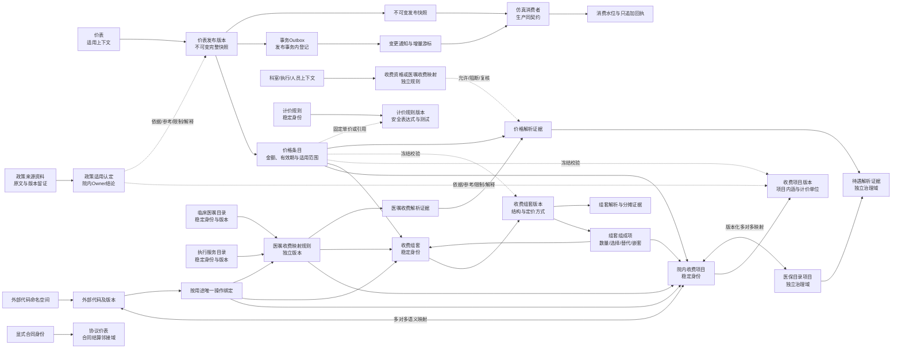

# 价表字典POC方向

状态：架构边界、治理流程、POC三层范围、完整POC 72个REST与20个界面场景的量化验收基线、可执行架构基线、模块化单体、PostgreSQL 18.4、TypeScript/Node.js 24/Fastify 5后端基线、pg/Kysely数据库访问策略、Asia/Shanghai无时区日期时间、显式流内排序权威、TypeBox到冻结OpenAPI的契约主权、React/Vite同源SPA、内置版本化工作流模块、Keycloak认证与平台本地授权边界、同进程Outbox派发边界、单一TypeScript验证与不可覆盖证据、根目录单一npm工作区拓扑、governance-api深模块内部结构、领域版本与生命周期所有权、价表与解析模块边界、`release-distribution`统一发布登记与投递、领域内容投影与快照制品分工、领域拥有版本化投影Schema并进入单一TypeBox—OpenAPI契约链、消费者精确版本支持声明与不兼容投递隔离、Phase 01一发布一规范投影一权威快照、投影Schema升级高风险契约治理、投影载荷与完整快照制品双摘要、PostgreSQL `bytea`事务内权威快照存储、仅适用于合成POC的16 MiB单快照容量护栏、三种交付模式下初始化与增量分离的统一消费闭环、受控导出的版本化非权威派生交付制品、消费者交付配置的版本化治理主权与冻结执行边界、受控声明式转换与失败关闭验证门禁、任一记录确定性转换失败使整个受控导出作业失败且不形成制品的运行语义、瞬时技术故障在同一冻结作业内有限且完整重建式重试的恢复语义、完整POC受控导出的确定性无压缩ZIP及清单/摘要分层格式语义、完整POC派生ZIP使用独立PostgreSQL `bytea`和短事务原子成功提交的存储语义、完成派生制品保留至POC证据基线整体处置且取代不覆盖的生命周期语义、派生制品容量先测后定并超限失败关闭的容量语义，以及“Phase 01只验证快照拉取、完整POC邻接受控导出、逐记录推送长期预留”的阶段范围均已确认

容量环境补充状态：ADR-0110已确认本机WSL2 Anolis OS 8.9受限容量环境；下一项只确认容量实验重复次数。

更新日期：2026-08-08

## 1. 已有边界

- 价表字典是五类POC治理对象之一。
- 本阶段不接真实消费系统和真实价格系统，只使用合成数据与仿真消费者。
- 价表价格金额和业务生效时间分别作为代表性数据元执行错误级强制校验。
- 草稿可删除；已发布数据只能到期、失效或被替代，不能物理删除或覆盖历史。
- 治理对象独立发布，相关变更通过影响事项关联，不做跨对象原子发布。

价表政策证据、院内价格主权和映射边界见[价表政策证据、院内价格主权与映射边界](../research/price-list-internal-authority-boundary.md)。

## 2. 基础对象模型

| 对象 | 身份与时间 | 主要内容 | 明确排除 |
|---|---|---|---|
| `charge_item` | 稳定ID永久不复用 | 医院采纳的收费项目身份 | 金额、外部代码、患者收费事实 |
| `charge_item_version` | 不可变、双时态 | 名称、服务内涵、包含或除外内容、计价单位和约束 | 价格金额 |
| `price_list` | 稳定集合ID | 一套价格的适用上下文身份 | 收费项目语义、具体患者账单 |
| `price_list_release` | 不可变完整快照 | 发布依据、业务有效期和完整价格条目集合 | 动态最新版、覆盖式补丁 |
| `price_entry` | 随价表发布冻结 | 收费项目或收费组套的冻结版本、固定单价或计价规则版本二选一、币种、计价单位、价格性质、有效期、全院默认或显式院区差异范围，以及通用或专用场景模式 | 可定价对象身份、内嵌表达式、医保报销比例、数字优先级 |
| `external_code_namespace` | 稳定命名空间ID | 系统、对象类型、组织范围、代码规范、Owner和生命周期 | 无归属代码、跨类型混用 |
| `external_code` | 命名空间内稳定代码ID | 外部代码身份 | 院内收费项目ID、当前显示名称 |
| `external_code_version` | 不可变、双时态 | 代码、名称、说明、来源状态、有效期和摘要 | 覆盖式更新、无命名空间代码 |
| `charge_item_semantic_mapping` | 独立版本、多对多 | 等同、院内更窄、院内更宽或仅相关的语义关系 | 运行时唯一路由、价格、政策适用 |
| `charge_item_operational_binding` | 按用途和范围唯一 | 导入、导出、查询、历史解释或仿真消费的确定目标 | 多目标随机返回、数字优先级 |
| `policy_source_evidence` | 原文版本不可覆盖 | 政策来源元数据、原始文件、条款索引和数字摘要 | 院内价格、院内项目身份、自动发布权限 |
| `policy_applicability` | 独立版本、双时态 | 院内Owner对证据与收费项目版本、价表发布版本或规则版本之间的适用认定 | 外部代码转换、政策自动传播、跨对象原子发布 |
| `insurance_catalog_item` | 邻接域稳定ID、不可变版本 | 医保目录项目身份、版本、来源和生命周期 | 院内收费项目身份、院内价格、患者报销结果 |
| `charge_item_insurance_map` | 独立版本、双时态 | 院内收费项目与医保目录版本之间的多对多映射 | 价格条目、待遇规则、按名称自动匹配 |
| `benefit_rule` | 邻接域独立规则版本 | 支付资格、比例、限制、自付和封顶等待遇口径 | 院内价格、患者结算事实 |
| `price_resolution_evidence` | 只追加解析快照 | 院内价格解析输入、冻结版本、命中条目和解释 | 医保报销结论、患者账单 |
| `benefit_resolution_evidence` | 邻接域只追加快照 | 待遇解析输入、映射与规则版本和输出 | 对价表或价格条目的写入权限 |
| `charge_eligibility_rule` | 邻接域独立规则版本 | 科室、执行单元或人员角色对收费项目的允许、阻断或复核要求 | 价格金额、价格条目优先级 |
| `contract_price_list` | 邻接域稳定合同身份及版本 | 明确合同下的协议价格、签约方和有效期 | 普通`payer_class`条件、标准价覆盖、患者临时议价 |
| `pricing_rule` | 稳定规则ID | 一项可复用计价定义的身份 | 规则当前内容、价格条目、任意代码 |
| `pricing_rule_version` | 不可变、双时态 | 受限表达式、类型、参数、Decimal精度、舍入、测试向量和审批 | SQL、脚本、覆盖式参数 |
| `charge_bundle` | 稳定组套ID | 收费组合身份 | 临床医嘱组套、患者费用实例 |
| `charge_bundle_version` | 不可变、双时态 | 组套结构、计价方式、分摊方式和约束 | 动态最新组件、发布后原位修改 |
| `charge_bundle_component` | 随组套版本冻结 | 目标版本、数量、顺序、必选、选择组、替代组和嵌套 | 无外键的自由多态引用、临床替代自动收费 |
| `pricing_resolution_evidence` | 只追加解析快照 | 公式输入、规则版本、中间结果、舍入和输出 | 重新执行后覆盖旧结果 |
| `bundle_resolution_evidence` | 只追加解析快照 | 组件选择、替代、数量、价格、分摊和尾差 | 只保存组套总额 |
| `release_outbox_event` | 发布事务内只追加 | 事件ID、对象、发布版本、序号、投影载荷摘要、完整制品摘要、稳定快照ID及冻结投影契约身份 | 完整主数据第二副本、数据库物理位置、未提交先发送、未标识Schema的载荷 |
| `release_snapshot` | 不可变完整快照制品 | 领域模块构造冻结类型化内容投影及其`projection_type`、不可变Schema版本、Schema摘要和领域成员摘要，`release-distribution`核验身份后生成通用包络、确定性规范字节、双摘要，并把最终字节原样保存于同一发布事务的PostgreSQL `bytea`，只经平台API下载 | 动态当前查询、分发模块回查领域表或定义字段、领域模块直写快照、文件/S3双写或暂存提升、数据库直读、可覆盖导出、以双摘要推断跨Schema领域等价 |
| `consumer_subscription` | 稳定订阅身份＋不可变支持版本 | 消费者身份、订阅对象、精确`projection_type + projection_schema_version`集合、登记Schema摘要和启停状态；支持变化形成新版本 | 业务角色授权、数据库账号、`latest`、通配符、范围或SemVer推断 |
| `release_consumer_compatibility` | 发布前逐订阅只追加预检 | 发布、冻结订阅版本、投影契约、规则版本、`SUPPORTED`/`UNSUPPORTED`结果及影响事项 | 网络探测、覆盖结果、把不兼容变成发布失败 |
| `outbox_delivery` | 事件与消费者订阅维度独立 | 待投递、不兼容阻断、租约、重试、成功或人工处置投影；`BLOCKED_INCOMPATIBLE`不得发送或推进水位 | 事件级全局`dispatched_at`、共享消费者状态、把不兼容当网络失败 |
| `outbox_delivery_attempt` | 只追加发送证据 | 投递内尝试序号、结果、错误和响应摘要 | 覆盖失败尝试、以时间戳决定顺序 |
| `consumer_checkpoint` | 消费者及对象维度单调推进 | 已接收、已校验和已应用的游标或发布版本 | 单个全局成功标志、覆盖历史 |
| `consumer_receipt` | 只追加处理证据 | 事件、版本、结果、错误、重试、处理时间和摘要 | 回写或修改发布版本 |
| `orderable` | 邻接临床域稳定ID | 临床请求定义的身份 | 收费项目、实际患者医嘱、价格 |
| `orderable_version` | 不可变、双时态 | 名称、参数结构、适用约束和生命周期 | 单一收费项目外键、实际开立事实 |
| `execution_service` | 邻接执行域稳定ID | 可提供服务定义的身份 | 临床请求、收费项目、实际执行记录 |
| `execution_service_version` | 不可变、双时态 | 方法、能力、结果和完成语义 | 价格、患者执行事实 |
| `order_charge_mapping_rule` | 独立规则ID及不可变版本 | 源医嘱、可选执行服务、目标项目或组套、触发、数量、范围和测试 | 价格金额、任意脚本、名称自动匹配 |
| `order_charge_resolution_evidence` | 只追加解析快照 | 输入版本、上下文摘要、规则集、命中拒绝、目标、数量和触发依据 | 患者完整病历、价格解析结果 |

## 3. 身份与版本规则

1. 院内收费项目回答“收取的服务是什么”，价格金额不是其身份组成。
2. 同一收费项目可以在不同价表、不同有效期中拥有多个价格条目，不复制项目身份。
3. 单纯调价只形成新的价格条目或价表发布版本，不改变收费项目稳定ID。
4. 名称勘误或不改变收费边界的说明调整形成收费项目新版本。
5. 服务内涵、计价单位、包含或除外内容、计费方式发生实质变化时，新建收费项目稳定ID，并记录替代或派生关系。
6. 外部或历史系统项目代码是有命名空间、有版本的互操作映射标识，不直接充当平台稳定ID或价格来源。
7. 价格条目发布时冻结收费项目或收费组套的稳定ID、所校验的明确版本、金额数据元版本和业务时间规则版本。
8. 上游项目或规则新版只产生影响事项，不自动迁移既有价格条目或改写历史价表。
9. 已发布收费项目、项目版本、价表发布版本和价格条目不得物理删除或覆盖。
10. 政策资料原样留证，其发布方对原文及版本负责；医院Owner对院内适用解释负责。
11. 政策适用认定与收费项目、价表分别版本化和发布，政策变化只产生影响事项，不自动改变院内价格。
12. 医保目录项目与院内收费项目分别拥有稳定身份和版本，通过独立版本化多对多映射衔接。
13. 价格解析只确定院内价格；医保待遇在邻接域另行解析并独立留证，不得按支付身份选择或覆盖另一套院内价格。
14. 科室、执行单元、人员角色和支付身份不进入普通价格选择；它们分别进入资格、映射、待遇或显式合同治理。
15. 全院价格Owner可以显式批准院区差异价；差异价和全院默认价按固定两级解析，不使用数字优先级。
16. 复杂计价规则和收费组套分别拥有稳定身份及不可变版本；价格条目只引用规则版本，组套组成和分摊随组套版本冻结。
17. 规则、组套及其价表引用独立发布，相关变更只产生影响事项，不做跨对象原子发布或自动迁移。
18. 平台发布、Outbox登记和快照固化属于同一本地发布事务；下游消费采用幂等、顺序、缺口检测和最终一致，不参与平台发布事务。
19. 变更通知不是权威主数据副本，消费者必须能按发布版本获取并验证不可变快照。
20. 医嘱目录、执行服务目录、收费项目目录和医嘱收费映射规则分别版本化、授权、审批和发布，不共用身份或跨对象原子发布。
21. 医嘱收费映射解析先确定收费项目或组套及数量，价格解析随后独立确定金额，两份证据不能合并成不可解释的黑盒结果。
22. 外部代码语义映射允许多对多，但运行操作绑定必须按代码版本、用途、方向、院区范围和业务时点唯一。
23. 操作上确需一对多时只能绑定已发布规则或组套，不能把多条语义映射当作运行候选并依赖顺序择优。
24. 每个治理对象只有一个最终Owner；跨域端点Owner提供前置确认，高风险变更执行专业复核和Owner批准两级流程。
25. 获得独立对象级紧急权限的一名授权人员可以立即暂停未来新解析；恢复只能通过正常审批后的新发布，不能原地激活。
26. POC外部代码固定使用HIS收费、财务收入、体检项目、历史收费和院区本地收费五个合成命名空间。

该基础模型见[ADR-0051](../adr/0051-separate-charge-item-identity-from-price-entries.md)。

## 4. 价格适用与时间语义

### 4.1 适用范围

1. POC只支持全院、院区扩展两类组织范围，以及门诊、住院、急诊、体检四类实际就诊场景。
   通用是覆盖这四类场景的通配价格模式，不是第五类实际业务事实。
2. 不按科室、人员、患者类别、医保身份或支付方式选择普通院内价格，也不允许自由条件表达式。
3. 科室、执行单元和人员角色的限制由独立收费资格或医嘱收费映射规则处理，只能允许、阻断或要求复核，不能改变金额。
4. 支付身份进入待遇治理；未来确有合同价格时使用具有显式合同身份的独立协议价表，不在普通价格条目增加`payer_class`。
5. 全院价表是默认价格来源；确有业务依据时，全院价格Owner可以为同一收费项目发布显式院区差异价。院区数据管家只能申请或维护草稿，不能审批、发布或自行覆盖。
6. 解析先查唯一有效的院区差异价，不存在时回退到唯一有效的全院默认价，并在解析证据中保存命中或回退路径。
7. 同一收费项目、价表、同一组织范围层级、就诊场景和业务时段最多存在一个当前有效价格条目；同层多重命中失败关闭并生成价格冲突事项。
8. 不采用数字优先级、“最具体规则自动获胜”、最后写入或更新时间择优。固定两级解析是封闭的组织范围算法，不扩展为通用优先级引擎。
9. 如果院区差异涉及服务内涵、计价单位、包含或除外范围，应创建院区扩展收费项目及其价格，不能用院区差异价掩盖语义变化。
10. 同一收费项目、价表、组织范围和业务时段必须在通用模式与专用场景模式中二选一；通用覆盖四类实际场景，专用模式缺项时才进入下一组织层级回退。
11. 同层通用与专用混用或同一专用场景多价均在导入及发布阶段失败关闭，不能采用特异性优先级。

### 4.2 业务时间与记录时间

1. 价格统一以服务实际发生时间作为计价基准，不使用医嘱开立、入院、记账或结算时间。
2. 有效区间采用左闭右开`[valid_from, valid_to)`，按`Asia/Shanghai`解释；相邻调价版本可以连续衔接但不得重叠。
3. 业务时间表达政策规定何时应当适用，平台记录时间表达平台何时获知、审批和发布。
4. 正常消费按服务发生时点解析当前已知的适用价表；审计复现显式指定业务时点和记录时点。
5. 允许以后发布的院内追溯更正作用于过去业务时点，但必须形成新的价表发布版本；旧版本继续可查。
6. 追溯更正只生成对仿真消费结果的影响事项，不自动修改患者历史费用。
7. 币种、金额精度、计价单位一致性和有效区间继续使用已确认的数据元及错误级规则强制校验。
8. 平台自有业务时间、平台记录时间、调度、消费和界面日期时间均不携带时区或偏移，并固定按IANA `Asia/Shanghai`解释；业务API和导入拒绝含`Z`或偏移的值，不得剥离后保存或从运行环境猜测时区。OIDC/JWT标准`NumericDate`只在认证协议边界校验。

该语义见[ADR-0052](../adr/0052-use-hospital-default-and-service-time-for-price-resolution.md)。

全系统日期时间策略见[ADR-0074](../adr/0074-use-asia-shanghai-local-datetimes-without-time-zone.md)。

## 5. 生产目标与POC消费边界

### 5.1 长期目标架构

1. 领域模块在同一本地事务中固化发布版本并构造冻结内容投影，`release-distribution`生成最终快照制品及元数据、投影载荷摘要和完整制品摘要，把精确字节写入PostgreSQL `bytea`并登记Outbox，审计事件同时追加；任一步失败全部回滚。
2. 变更通知至少包含`event_id`、治理对象、发布版本、对象序号、事件类型、投影载荷摘要、完整制品摘要及各自算法、稳定快照ID、`projection_type`、`projection_schema_version`、`projection_schema_digest`及记录时间；不包含数据库物理位置或快照正文。
3. 消费者按`event_id`幂等，按治理对象或聚合版本顺序应用；发现版本缺口时暂停该对象后续应用并请求缺失版本或完整快照。
4. 每个消费者分别保存订阅范围、水位、接收结果、校验结果、应用结果、失败原因和重试历史。
5. 发布事件只用于通知，完整权威内容由版本化API或不可变发布快照提供。
6. 消费失败不回滚平台已完成发布；通过重试、重放、补偿发布和影响事项闭环，不使用跨系统两阶段提交。
7. 真实消费者只能通过平台服务、快照或受控变更接口访问，不能直接读取或写入平台业务数据库。
8. 一个发布事件按消费者订阅分别形成投递、尝试和回执；平台发送成功、消费者接收成功和消费者应用成功是三种不同证据，不建立全局派发成功标志。
9. 一个权威发布和一个规范快照可以通过`SNAPSHOT_PULL`、`MANAGED_EXPORT_HANDOFF`或`RECORD_PUSH`交付；模式只改变送达方式，不产生消费者私有领域版本、治理发布、规范快照或第二份主数据真相。
10. 初始化交付作业冻结消费者及订阅版本、来源发布、规范快照和一种模式；日常增量订阅使用独立投递状态，但两者都必须通过回执、对账和检查点进入同一消费闭环。
11. 下载、导出交接、单条或全部HTTP请求成功都不代表下游已经应用；只有固定来源的范围、版本、数量、摘要和差异对账通过，才可关闭初始化并建立检查点。
12. 每个成功的受控导出作业只形成一个版本化、不可变、明确非权威的厂商专用派生交付制品，冻结来源发布/快照、目标消费者、适用的精确消费者交付配置及其交付契约/模板/映射版本、记录数量、独立摘要和清单；它不是规范快照，变化必须新建作业和制品。
13. 消费者交付配置是独立版本化治理对象：每版冻结目标消费者、用途、精确来源投影类型/Schema版本及交付契约、模板和映射版本，由来源领域Owner强制语义前置确认、集成交付Owner单一终审；作业固定引用精确版本，`release-distribution`只执行，不编辑、补义、回查当前表或自动传播新版。
14. 普通消费者交付配置只允许受控声明式表示转换；过滤、拆分、合并、聚合、计算字段和一对多展开默认禁止并须独立高风险能力审批，脚本、SQL、网络和运行时当前状态查询绝对禁止。配置终审前必须以精确来源Schema及固定向量验证。
15. 固定规范快照中任一记录确定性转换失败会使整个受控导出作业终态失败并保持零个完成制品；平台逐行只追加留证，禁止部分制品、跳过错误或成功记录加错误清单。修正必须以新发布或版本和新作业重建，导入行级部分成功不受影响。
16. 受控导出作业冻结精确重试策略版本；只有明确列为可重试的瞬时技术故障才可在同一冻结作业内有限自动重试。每次尝试以显式序号只追加留痕并从全部冻结输入完整重建；未知错误或自动额度耗尽进入`TECHNICAL_ATTENTION_REQUIRED`和影响事项，授权人员仅能在输入不变时发起一次受控重试且不得重置额度。最终成功仍只有一个制品，任何冻结输入变化必须新建作业。
17. 完整POC每个成功受控导出作业只形成一个确定性无压缩ZIP，根目录固定只有`manifest.json`和`records.csv`。CSV使用UTF-8无BOM、LF、冻结列序与全序记录规则以及确定的Decimal和`Asia/Shanghai`无时区表示；清单保存来源/配置链和CSV摘要，完整ZIP摘要及运行信息位于制品外部。ZIP条目和元数据全部规范化，相同冻结输入逐字节一致；XLSX、裸CSV、分片和多格式并行不进入POC，格式变化只建立新配置版本和新作业。

### 5.2 现阶段POC

1. 只接隔离仿真消费者，不连接真实HIS、LIS、PACS、医保、财务或体检系统。
2. 仿真消费者使用未来生产消费者相同的API、事件包络、幂等键、对象版本、快照、游标、回执和错误语义。
3. POC必须验证重复事件、乱序或缺口、失败重试、快照恢复、补偿发布、回执审计和消费者不可越权。
4. 传输可以使用POC内的轻量实现，不强制部署生产Kafka、Debezium或其他指定中间件。
5. 生产缓存、P95/P99目标、容量、跨机房灾备、真实CDC、影子计费和真实对账不进入POC验收。
6. Phase 01派发器在同一Fastify/Node进程内运行：提交后唤醒、数据库轮询兜底、短事务租约和`FOR UPDATE SKIP LOCKED`认领、事务外至少一次投递；不使用独立Worker、触发器、`LISTEN/NOTIFY`、CDC或外部消息中间件。
7. 自动化验证使用单一TypeScript测试资产：Vitest承担通用测试，Playwright仅负责浏览器端到端；Testcontainers提供真实PostgreSQL、Keycloak和Toxiproxy，枚举化故障点与网络/容器故障双层注入，每次正式运行生成新的不可覆盖SHA-256证据包，CI厂商不取得放行主权。
8. Phase 01在当前根目录建立单一Git仓库，使用Node.js 24.18.0、npm 11.9.0 workspaces和一个根锁文件；应用、生成客户端、迁移、冻结契约、外部测试及验证工具明确分区，不引入其他包管理器、Turborepo或Nx。
9. `governance-api`内部按治理能力组织深模块，每模块只公开一个小型接口，组合根统一装配具体依赖；跨模块原子操作在同一事务作用域内通过接口协调，不建立横向技术层、通用业务基类或模拟仓储port。
10. `charge-catalog`拥有收费项目身份、版本、演进和生命周期，`price-list`拥有价表身份、完整发布版本、价格条目和生命周期；不建立独立通用版本模块，工作流、发布和审计只协调或留证。
11. `price-list`通过公开接口提供双时点不可变已发布解析视图，独立`price-resolution`拥有固定两级选择、通用/专用判定、规则执行、舍入和解析证据；两者仍位于同一模块化单体，不直接查写对方表或复制算法。
12. 发布包络、最终快照制品及元数据、Outbox、消费者订阅、投递、尝试和平台侧回执统一由`release-distribution`深模块拥有；不拆`publication`、`delivery`或独立`outbox`模块，内部仍严格隔离发布事务与提交后投递状态机。
13. 领域模块从自身权威状态构造经语义校验、冻结、类型化且完整物化的发布内容投影；`release-distribution`只从该值生成通用包络、确定性规范字节、投影载荷摘要、完整制品摘要并不可变存储。双方不得直接查写对方表，也不得用数据库/REST类型、repository、延迟加载器或事务句柄跨越seam。
14. 每个代表性领域模块拥有稳定投影类型、字段语义、可执行TypeBox Schema和不可变Schema版本，并只经模块`index.ts`交给组合根装配进冻结OpenAPI 3.1；`release-distribution`只核验和携带类型、版本及Schema摘要，不选版、不迁移、不补义。
15. 两个仿真消费者分别以不可变订阅版本精确声明投影支持；发布前本地逐订阅预检并留证。某订阅不兼容时领域发布仍成功，只将对应投递置为`BLOCKED_INCOMPATIBLE`并生成影响事项，不发送、不产生尝试或推进水位；兼容消费者继续。升级后通过新订阅版本和受控重放原快照恢复，禁止自动降级、转换及迁移。
16. `release-distribution`分别生成只覆盖冻结Schema下规范载荷的`projection_payload_digest`和覆盖最终冻结包络加载荷完整字节的`snapshot_artifact_digest`；完整制品摘要外置，两者初始使用SHA-256并冻结算法与序列化规则。领域等价仍由领域版本/成员摘要证明，可变运维状态不入摘要，历史不重算。
17. Phase 01只实现并验证`SNAPSHOT_PULL`，不实现消费者交付配置编辑、`MANAGED_EXPORT_HANDOFF`或`RECORD_PUSH`adapter，也不增加ABG-01至ABG-40。全部架构门禁通过、按冻结容量负载画像矩阵、逐字段分布规则和ADR-0110环境完成派生制品容量实验且后续数值ADR冻结后，完整POC才把`MANAGED_EXPORT_HANDOFF`作为邻接薄切，以合成仿真消费者、默认受控表示转换、确定性无压缩ZIP、独立PostgreSQL `bytea`短事务原子固化、容量超限失败关闭、完成制品保留与只追加取代以及完整回执—对账—检查点闭环验证；不启用高风险语义转换或连接真实厂商。`RECORD_PUSH`继续只作长期预留。完整POC保留既有60/16并新增G01至G12和U17至U20，形成72/20强制验收基线；技术重试作为G05/U19、ZIP格式作为G05/G06/U18、存储原子性作为G05/G06/G07/G12/U18、生命周期作为G05/G07/G12/U18、容量画像/字段分布/基线与超限失败作为G04/G05/G12/U19的必需参数化子用例而不新增编号。声明式规则语法和执行组件位置仍未锁定；容量实验重复次数、峰值RSS/磁盘余量/时间阈值、结果聚合、最终数值上限及生产部署仍须后续确认。

该分层边界见[ADR-0059](../adr/0059-retain-production-consumption-contracts-with-simulated-poc.md)。

## 6. POC三层实施范围

### 6.1 核心完整实现层

以下对象及能力必须完成完整实现：

1. 院内收费项目、收费项目版本及身份替代关系。
2. 价表、价表发布版本、价格条目及全院默认与院区差异价。
3. 五个合成外部代码命名空间、代码版本、语义映射和按用途唯一的操作绑定。
4. 固定价和规则价的价格解析、固定两级组织范围解析及不可变证据。
5. 文件和API导入、行级校验、批次幂等、草稿、审批、发布、失效、影响分析和补偿发布。
6. 只追加审计、事务Outbox、不可变快照、增量游标、仿真消费者不可变支持版本、逐发布兼容预检、不兼容投递隔离、受控重放、水位和回执。
7. 管理界面和REST API共同执行对象级权限、版本化职责分离策略、版本和审计规则；纯投影Schema契约升级的限定同人终审例外必须由服务端冻结策略判定。

进入本层的对象必须支持新增、查询、版本化修改、草稿删除、发布后失效和完整历史查询；“删除”不得用于已发布记录。

### 6.2 邻接薄切验证层

以下对象只建立少量代表数据，但不能退化为只读种子或静态桩：

1. 政策来源资料及政策适用认定。
2. 医保目录项目、收费项目医保映射和代表性待遇规则。
3. 收费资格规则。
4. 计价规则及规则版本。
5. 收费组套、组套版本、组成项和解析分摊证据。
6. 临床医嘱目录、执行服务目录、医嘱收费映射规则和解析证据。
7. `MANAGED_EXPORT_HANDOFF`受控导出闭环：以固定规范快照和已批准配置版本生成一个不可变非权威派生制品，通过合成仿真消费者完成下载或交接证据、回执、对账和检查点；只允许默认受控表示转换，任一记录转换失败时整作业失败且零制品。

每类代表对象仍须验证新增、查询、版本化修改、草稿删除、发布后失效、对象级授权、提交审批分离、完整审计、影响事项以及适用的解析或消费闭环。

### 6.3 长期架构预留层

以下内容只保留对象边界、接口位置或扩展点，不实现生产能力：

- 真实患者资格、医嘱、执行、账单和结算事实。
- 完整医保待遇引擎、全量医嘱和执行服务目录。
- 真实HIS、LIS、PACS、医保、财务和体检系统接入。
- 生产消息集群、CDC、缓存、容量和SLA、跨机房灾备。
- 影子计费、真实费用对账和生产切换。
- 当前没有明确合同需求的协议价表。
- `RECORD_PUSH`逐记录初始化推送，包括成员级进度、第三方HTTP调用、接口幂等、暂存和激活。

该范围见[ADR-0061](../adr/0061-tier-price-poc-into-core-adjacent-and-reserved-scope.md)。

## 7. 治理责任与流程

价表对象采用单一Owner终审、跨域前置确认和按风险分层审批：

1. 收费项目、价表、计价规则和收费组套由全院价格Owner终审。
2. 政策资料由证据Owner治理，政策适用认定由被约束对象的Owner终审。
3. 医保目录及待遇、医嘱目录、执行服务分别由对应领域Owner终审。
4. 跨域映射需要双方端点Owner前置确认，再由唯一映射Owner最终批准。
5. 收费项目实质语义变化、价表发布、追溯更正、院区差异价、计价规则和收费组套执行两级审批。
6. 普通证据登记和低风险映射可以由对象审批模板配置单级Owner审批。
7. 普通领域内容变更的提交人与最终审批人必须不同，平台在批准后自动发布；不改变领域内容的纯投影Schema升级按专门契约流程允许提交人兼任平台契约终审人。
8. 紧急单人暂停只阻断未来新解析并自动创建事后复核及影响事项；任何恢复都形成新发布版本。

完整责任矩阵、普通流程、紧急流程及补偿流程见[价表主数据治理责任与流程](price-list-governance-workflow.md)，决策见[ADR-0063](../adr/0063-single-owner-approval-and-one-person-emergency-suspension.md)。

## 8. 报告扩展能力的讨论边界

研究报告（5）中的下列能力不再预先归为排除项，而是分别判断“长期架构是否保留”和“POC是否实现”：

1. 政策资料留证及政策适用认定。
2. 医保目录、院内项目映射以及独立待遇治理。
3. 科室及支付方等上下文与价格的边界。
4. 院区差异价、固定两级解析及同层冲突处理。
5. 独立计价规则、收费组套、选择组、替代项和金额分摊。
6. 生产消费目标契约及现阶段同契约仿真。
7. 临床医嘱、执行服务与收费项目三目录分离及规则化映射。

上述七项的概念、架构边界和POC样本范围均已确认。报告中的示例表、字段、规则优先级、真实对接和性能指标仍不能因报告存在而自动进入验收范围。

## 9. 决策状态

### 9.1 已确认

1. 收费项目稳定身份、项目语义版本、价表发布版本和价格条目相互分离。
2. 单纯调价不改变项目身份，收费边界实质变化时新建项目身份。
3. 外部或历史系统项目代码使用命名空间化、版本化映射，不代替院内稳定ID或价格来源。
4. 价表发布版本是不可变完整快照，历史按冻结版本复现。
5. 全院价表默认；全院价格Owner可显式批准院区差异价，按“院区差异价、全院默认价”固定两级解析，同层唯一命中且无数字优先级；服务发生时间和双时态追溯保持不变。
6. 就诊业务事实固定为门诊、住院、急诊和体检四类；通用是覆盖四类场景的价格模式。
7. 收费项目、价表和价格金额均由医院唯一内容Owner维护，外部系统代码只用于互操作映射。
8. 政策资料可以原样留证，政策的院内适用性由Owner显式认定；政策来源不直接取得院内价格发布主权，变化不自动传播。
9. 价表主数据与医保目录及待遇治理分域；院内项目和医保目录通过版本化多对多映射衔接，价格解析与待遇解析分别执行、分别留证。
10. 科室与支付方不是普通价格维度；科室进入资格或映射规则，支付方进入待遇或显式合同域，均不得暗中改变院内价格。
11. 院区不能自行覆盖全院价格；全院价格Owner可以显式发布院区差异价，语义差异必须另建院区扩展收费项目。
12. 复杂计价规则和收费组套保留为独立版本化治理对象；普通价格条目不得内嵌公式，临床组套与收费组套分域。
13. 长期保留生产消费契约；POC只以隔离仿真消费者验证相同快照、事件、幂等、顺序、恢复、回执和审计语义，不接真实系统或承诺生产运行指标。
14. 医嘱目录、执行服务目录和收费项目目录相互分离，以独立版本化医嘱收费规则映射；实际业务事实不进入主数据。
15. POC采用核心对象完整实现、邻接对象少量但完整闭环、生产业务事实与设施仅作长期预留的三层范围。
16. 外部代码语义映射允许多对多，运行操作绑定按用途确定且唯一；一对多生成必须通过规则或组套。
17. 每个对象由单一Owner终审，跨域端点前置确认，高风险两级审批；紧急暂停允许单一专权人员立即执行，但只能通过新发布恢复。
18. 外部代码使用`SIM_HIS_CHARGE`、`SIM_FINANCE_REVENUE`、`SIM_PHYSICAL_EXAM_ITEM`、`SIM_LEGACY_CHARGE`和`SIM_CAMPUS_LOCAL_CHARGE`五个合成命名空间。
19. 完整POC使用24个收费项目、至少36个项目版本、3个完整价表快照、A01至G12共72个REST场景和U01至U20共20个界面场景；A01至F08及U01至U16保持既有口径，G01至G12及U17至U20专门验证受控导出，不得替换或抵扣。
20. 平台自有业务时间、平台记录时间、执行调度、消费和展示日期时间固定按`Asia/Shanghai`解释且不携带时区或偏移；OIDC/JWT标准`NumericDate`只在认证协议边界校验，不进入平台日期时间字段。
21. 通用价格覆盖门诊、住院、急诊和体检，但同一组织范围和时段内通用模式与专用场景模式严格互斥。
22. 实施先建立收费项目—价表—解析—审计—仿真消费纵向切片，通过全部架构门禁后再扩展完整POC；基线通过不等于完整POC或生产验收。
23. Phase 01治理应用采用模块化单体，内部模块保持明确边界；仿真消费者位于应用外部并使用正式契约，本阶段不拆微服务。
24. Phase 01治理事务数据库采用PostgreSQL 18.4，并允许`pgcrypto`和`btree_gist`；新DDL依据当前逻辑模型设计，不将该选择外推为生产或招标选型。
25. 物理Schema以有序、版本化的原生SQL迁移为唯一权威；应用和ORM不得自动DDL，纳入正式架构证据包的迁移冻结，后续只能追加纠正迁移。
26. Phase 01治理后端采用严格模式TypeScript、Node.js 24 LTS和Fastify 5，首个证据基线精确固定Node.js 24.18.0；仿真消费者可以使用同一运行时，但保持独立进程、身份和状态。
27. 数据库访问采用`pg`底层驱动、Kysely查询与显式事务以及`kysely-codegen`数据库派生类型；禁止Kysely Schema/Migration能力、运行时DDL、拼接SQL和金额有损转换。
28. PostgreSQL日期时间和范围使用`timestamp without time zone`与`tsrange`，治理Schema禁止时区感知日期时间类型；API使用专用无偏移本地日期时间字符串，数据库驱动保持字符串且不转换为JavaScript `Date`。
29. 版本、发布、审计、Outbox、导入执行和消费尝试等有序记录流使用显式流内序号决定规范顺序；序号不复用但允许空洞，日期时间不承担排序权威，不建立跨流全局总序。
30. Fastify公开路由的TypeBox Schema是API契约唯一可编辑定义源，并单向生成及冻结OpenAPI 3.1 JSON；管理界面、仿真消费者和测试只从冻结产物生成客户端，禁止平行手写契约或导入后端内部TypeScript类型。
31. 管理界面采用React 19、Vite 8、React Router 7 Data Mode和TanStack Query 5，以独立工程包构建并由Fastify同源提供；使用`openapi-typescript`和`openapi-fetch`访问API，浏览器不承载治理主权，本阶段不引入第二套服务端前端框架。
32. 工作流作为模块化单体内的独立领域模块，以不可变审批模板版本、固定阶段和显式状态机执行；变更请求冻结模板版本、风险结果和内容摘要，本阶段不引入外部流程引擎、BPMN、任意脚本或超时自动批准。
33. Keycloak 26.7.0作为独立验证身份提供方，现有Fastify执行人员Authorization Code、PKCE S256和服务端会话，每个仿真消费者使用独立Client Credentials；Keycloak不承载业务授权，平台以显式外部身份绑定解析本地安全主体，并按对象、操作、院区和有效期逐请求授权。人员主数据与IAM分离，服务身份不得执行人员审批，OIDC/JWT `NumericDate`只作协议边界例外。
34. Outbox派发器作为同一Fastify/Node进程内的后台基础设施模块运行；发布事务只登记事件，提交后以进程内信号唤醒并由数据库周期轮询兜底，通过短事务租约及`FOR UPDATE SKIP LOCKED`认领、事务外至少一次投递、消费者独立投递状态和只追加尝试实现恢复；不用独立Worker、触发器、`LISTEN/NOTIFY`、CDC或外部消息中间件。
35. Phase 01以TypeScript测试资产和证据编排为唯一自动化验证权威：Vitest 4.1.6作为通用测试运行器，Playwright Test 1.61.0仅负责浏览器端到端，REST测试使用冻结OpenAPI生成客户端；Testcontainers提供真实PostgreSQL 18.4、Keycloak 26.7.0和Toxiproxy，枚举化故障点与网络/容器故障形成双层受控注入；Redocly和oasdiff执行契约门禁，每次正式运行生成新的不可覆盖SHA-256证据包，CI厂商不得另定通过条件。
36. 当前项目根目录作为Phase 01唯一Git仓库，以Node.js 24.18.0、npm 11.9.0 workspaces和单一根锁文件管理`apps/governance-api`、`apps/admin-web`、单实现双实例`apps/sim-consumer`、生成客户端、API/E2E/故障测试及验证工具；`db/migrations`和`contracts/openapi`分别保持Schema与契约权威，不建立额外包管理/任务编排权威或可供外部绕过契约的共享领域包。
37. `apps/governance-api`按治理能力形成深模块，每个模块只经唯一`index.ts`公开一个小型接口；路由、状态机、SQL映射和持久化均留在模块内部，组合根是唯一具体装配位置。跨模块只经接口协作且不得查写他模块表，原子命令由绑定同一数据库事务的作用域模块集合协调；禁止横向controller/service/repository/model层、通用业务基类、服务定位器、通用命令总线及仅为内存仓储测试建立的port。
38. 不建立独立通用版本模块、版本基类/仓储/CRUD表或配置化生命周期状态机；收费项目稳定身份、内容版本、演进及生命周期归`charge-catalog`，价表稳定身份、完整发布版本、价格条目及生命周期归`price-list`。工作流只产生审批决定，`release-distribution`只处理发布包络、快照制品和Outbox，审计只追加证据，均不得直接写领域版本。
39. `price-resolution`是独立深模块：只通过`price-list`公开接口取得按服务发生时间和记录时点确定的不可变已发布解析视图，独占院区到全院固定两级选择、通用/专用判定、冲突失败关闭、规则执行、舍入以及`price_resolution`、`price_resolution_step`和`price_resolution_result`。两者同进程、同数据库但依赖只允许`price-resolution -> price-list`；禁止读取草稿或对方表、回写价表、预先择优使解析退化为转发层，以及在路由或其他模块复制算法。
40. `release-distribution`是发布登记与投递的单一深模块和逻辑接口，拥有`governance_release`、`release_member`、`release_snapshot`、Outbox、订阅、投递、尝试及平台侧检查点/回执；内部派发器不得成为独立模块或公开接口。领域发布事务只登记分发事实，提交后由轮询恢复、短事务租约认领、事务外至少一次发送和新事务结果/回执留证，模块统一不得形成长事务，也不得取得领域版本、工作流、审计或消费者内部状态主权。
41. 领域模块从自身权威状态构造经语义校验、冻结、类型化且完整物化的发布内容投影；`release-distribution`经唯一接口接收该值，独占通用包络、确定性规范序列化、最终快照字节、投影载荷摘要、完整制品摘要、不可变存储和分发。分发模块不得查询领域表或补义，领域模块不得写快照/Outbox存储或生成最终权威字节；相同投影、包络输入、算法和序列化规则必须得到逐字节相同载荷、制品及双摘要。
42. 每个领域模块拥有稳定`projection_type`、投影字段语义、可执行TypeBox Schema和一经发布不可修改的`projection_schema_version`；快照冻结类型、版本、Schema摘要及算法。Schema只经模块`index.ts`进入组合根并纳入唯一TypeBox—冻结OpenAPI 3.1权威链；`release-distribution`只核验和携带契约身份，不定义字段、选版、迁移或自动升降级。禁止中央投影Schema模块、平行手写OpenAPI/JSON Schema/DTO、消费者私有契约及按版本标签猜测兼容性。
43. 每个消费者订阅以不可变版本精确声明支持的`projection_type + projection_schema_version`集合，并引用登记Schema摘要；禁止`latest`、通配符、范围、SemVer推断或运行时探测。平台发布前逐订阅本地预检并冻结结果；`UNSUPPORTED`不回滚领域发布，只阻断该消费者投递且无网络、尝试或水位推进，其他消费者继续。升级须形成新订阅版本并受控重放原事件及快照，原证据不覆盖；`release-distribution`不得自动降级、转换或迁移。
44. Phase 01每个领域发布只冻结一个规范投影并形成一个`CANONICAL`权威快照；发布事实与快照制品分别标识且严格一对一。投影Schema升级必须形成新显式发布，即使复用相同领域内容也产生新契约、新快照和新双摘要，历史不重打包。本阶段不实现多投影或消费者专用快照，只保留未来经新ADR放宽基数的结构接缝。
45. 投影Schema升级一律按高风险契约变更治理：所属领域Owner确认字段语义、约束和投影含义，平台契约Owner终审TypeBox/OpenAPI结构、契约身份及TypeBox/OpenAPI差异、精确支持兼容矩阵、冻结客户端仿真消费和影响分析。纯契约升级允许提交人兼任终审但动作分别授权和审计；任何领域内容、成员、规则或生命周期变化都恢复普通职责分离。消费者Owner只声明支持与迁移准备，不拥有批准或否决权。
46. 每个权威快照使用投影载荷与完整制品双摘要：`projection_payload_digest`只覆盖冻结Schema下规范载荷，`snapshot_artifact_digest`覆盖最终冻结包络加载荷完整字节且不自嵌入。两者初始使用SHA-256并冻结算法和序列化规则；存储、投递、回执、审计和运维状态不入摘要，跨Schema领域等价只由领域版本/成员摘要证明，历史摘要不得重算。
47. Phase 01将每个唯一`CANONICAL`快照的最终精确字节保存于`release_snapshot`非空PostgreSQL `bytea`，并与发布事实、成员、兼容预检、独立投递登记、审计和Outbox同一本地事务提交。消费者只凭稳定快照ID经平台受控下载API取得；不使用文件/S3、双写、暂存提升、跨资源补偿或预建存储port。未来迁移不得改变历史身份、下载契约、字节及双摘要。
48. Phase 01合成POC的单个`CANONICAL`规范快照以最终逻辑字节计量，上限为16 MiB（16,777,216字节）；超限返回`SNAPSHOT_ARTIFACT_TOO_LARGE`且发布事务不形成已发布结果，禁止拆分、截断、压缩规避、替代快照或外部存储回退。该数值不是全院初始化、生产容量、性能SLA或招标参数；未来必须先完成代表性全院容量与性能验证，再以新ADR确认上限、分片或存储策略。
49. 一个权威治理发布和一个`CANONICAL`规范快照支持`SNAPSHOT_PULL`、`MANAGED_EXPORT_HANDOFF`及`RECORD_PUSH`三种交付模式；初始化交付作业与日常增量订阅分别保存状态，但三种模式均须经回执、对账和检查点进入同一发布消费闭环，且不自动扩大当前阶段验收范围。
50. `MANAGED_EXPORT_HANDOFF`允许从固定规范快照生成版本化、不可变、非权威的厂商专用派生交付制品；每个成功导出作业只形成一个制品并冻结来源、消费者、适用的精确消费者交付配置及其交付契约/模板/映射版本、记录数量、独立摘要和清单，不复用规范双摘要、不冒称规范制品，仍须回执和对账。
51. 消费者交付配置建立稳定身份和不可变版本，由来源领域Owner强制语义前置确认、集成交付Owner单一终审；配置版本冻结目标消费者、用途、精确来源`projection_type + projection_schema_version`、交付契约、模板和映射版本，作业与制品固定引用且新版不自动传播。`release-distribution`只执行已批准版本并封装制品及闭环，不得编辑配置/映射、补义、回查当前表或自动选版。
52. 消费者交付配置默认只允许字段选择/排序/重命名、确定格式或类型转换、空值/默认值、常量元数据和已发布代码映射版本引用；过滤、拆分、合并、聚合、计算字段和一对多展开默认禁止，启用前必须独立高风险审批并提供固定测试向量。任意脚本、SQL、网络和运行时当前状态查询绝对禁止；配置须按精确来源Schema及固定向量验证，任一发布前验证错误均失败关闭。
53. `MANAGED_EXPORT_HANDOFF`执行固定规范快照和冻结配置时，任一来源记录因值、类型、必需映射或声明约束无法完成确定性转换，整个导出作业进入终态失败且不形成完成制品、成功交接、应用回执、对账通过或检查点推进；临时字节没有制品身份。平台只追加保留可追溯到来源、配置、成员、失败位置及稳定错误码的作业级和行级证据，禁止静默丢弃、人工跳过或“成功记录＋错误清单”。修正必须形成相应新发布或版本并创建新作业，原失败作业不改写；导入单行失败不回滚批次成功行的语义保持不变。
54. Phase 01只实现和验证`SNAPSHOT_PULL`，不实现`MANAGED_EXPORT_HANDOFF`或`RECORD_PUSH`且不增加ABG-01至ABG-40；门禁通过后的完整POC扩展以邻接薄切实现`MANAGED_EXPORT_HANDOFF`，仅连接合成仿真消费者、仅启用默认受控表示转换并完成规范快照—派生制品—交接—回执—对账—检查点闭环，不启用高风险语义转换或接入真实厂商。`RECORD_PUSH`继续只保留长期架构边界。
55. 完整POC保留A01至F08共60个既有REST场景和U01至U16共16个既有界面场景，不替换、不抵扣、不重排；新增G01至G12共12个受控导出REST场景和U17至U20共4个界面场景，使最终最低基线为72/20。参数化子用例不能减少新增编号，任一必需子用例失败即判定所属场景失败。
56. `MANAGED_EXPORT_HANDOFF`必须区分确定性转换错误与技术故障：前者只能修正版本并新建作业；后者只有被作业冻结重试策略明确列为瞬时可重试时，才可在同一冻结作业内有限重试。每次执行使用正数且不复用的`attempt_no`追加证据并从全部冻结输入完整重建，禁止部分续跑。未知错误或自动额度耗尽进入`TECHNICAL_ATTENTION_REQUIRED`、影响事项和零制品状态；对象级授权人员可在输入不变时发起一次受控重试，但不得重置自动额度。任一后续成功仍只形成一个制品并保留全部尝试；该语义加入G05和U19子用例，不改变72/20或Phase 01 ABG-01至ABG-40。
57. 完整POC的`MANAGED_EXPORT_HANDOFF`每个成功作业只生成一个完整、不可分段、不可变、非权威且确定性的无压缩ZIP，固定只含`manifest.json`和`records.csv`。CSV冻结UTF-8无BOM、LF、RFC 4180字段转义、列序、全序记录规则及地域无关字段表示；清单冻结来源和配置链、记录数及CSV摘要但不自嵌入完整ZIP摘要，完整ZIP字节数和SHA-256位于制品外部。ZIP条目顺序及头/时间戳/属性/额外字段等元数据规范化，相同冻结输入跨重试或新作业逐字节一致。XLSX、裸CSV、压缩成员、分片和同作业多格式不进入POC；格式变化只能形成新消费者交付配置版本和新作业，不要求重发权威主数据。该语义加入G05、G06和U18子用例，不改变72/20或ABG-01至ABG-40。
58. 完整POC的派生ZIP及摘要在最终成功事务外从冻结输入完整生成，临时字节无制品身份；随后`release-distribution`以短PostgreSQL事务把与`release_snapshot`分离的`managed_export_artifact`稳定身份、非空`bytea`、媒体类型、字节数、外置摘要、成功尝试/作业终态、审计及可交付资格原子提交。一个作业最多一个制品，提交前失败完整重建，提交后重复恢复只返回既有`artifact_id`。平台只按该身份受控提供精确字节；完整POC无文件/S3/MinIO、双写、暂存提升、跨资源补偿、独立存储模块或预建port。该规则不进入Phase 01、不继承16 MiB，也不决定具体容量数值或未来生产存储；以G05、G06、G07、G12和U18子用例验证且不改变72/20。
59. 完整POC中成功提交的派生制品、清单、独立摘要及下载、交接、回执、对账和检查点证据保留到隔离合成POC环境整体处置。平台不得提供单制品删除、自动过期、覆盖、重打包、原位脱敏或选择性清理；新作业只形成新制品，同一消费者及用途可追加取代事实但旧制品保持不变。撤权只阻断取得，恢复授权后仍按原`artifact_id`返回相同字节。只有不可覆盖证据包完成导出并通过清单、摘要、场景覆盖和关键制品字节复核，才可由业务平台外的受控流程一次性处置整个环境。该规则不表示永久或生产保留，不决定具体容量数值，不进入Phase 01，并只在G05、G07、G12和U18增加子用例而不改变72/20。
60. 完整POC必须为单个派生交付制品建立明确硬上限，但数值不得凭经验确定或继承Phase 01规范快照16 MiB。受控导出业务薄切实施前先以事先冻结且可重复生成的容量负载画像矩阵及逐字段分布规则开展实验，按最终确定性ZIP精确字节计量，并记录进程峰值内存与生成时间、PostgreSQL写入与WAL、平台下载与摘要核验和证据包体积；后续ADR再冻结具体上限。上限冻结后，作业冻结容量基线，在ZIP及摘要完整形成后、成功事务开始前检查；超限保持零制品及零成功资格，禁止压缩、分片、截断、表示切换、存储回退或临时放宽绕过。若测量不安全，必须先重新确认流式或替代存储架构。该方法不进入Phase 01、不增加72/20编号，也不决定生产容量；环境由ADR-0110冻结，重复次数、峰值RSS/磁盘余量/时间阈值、结果聚合和数值仍待逐项确认。
61. 派生制品容量采用两阶段证据：Phase 01全部门禁通过后，既有TypeScript验证工具链先以一次性隔离试验装置执行候选确定性ZIP、同物理形态PostgreSQL写入/读取及受控下载，结果只支撑后续ADR冻结实施上限，不形成业务API、正式DDL、运行时制品、第二套实现或最终验收资格。业务薄切集成后，必须用完全相同的画像身份、字段分布版本、ADR-0110环境、方法和阈值，通过实际`release-distribution`及冻结公共下载API重跑；只有该阶段通过才取得最终容量验收资格。两阶段输入、版本、原始测量、汇总、差异与判定进入同一不可覆盖证据链；集成后失败不得更换画像、选择较优轮次或静默放宽，任何上限调整须新证据和新ADR，提高上限须重做受影响的两阶段证据，降低上限须重跑边界用例。本决策不新增ABG或72/20编号，也不确定重复次数、阈值、聚合或数值。
62. 容量负载画像矩阵固定为`F00`、`N10`、`N30`、`N50`、`N100`、`W50`和`E50`：最终`records.csv`数据行数分别为24、10,000、30,000、50,000、100,000、50,000和50,000，均不含表头。`F00`只作功能与实验装置控制且不参与容量上限推断；四个`N`画像使用同一正常字段分布并只改变行数，`N50`是“通常数万条”的合成主参考而非真实医院统计，`N100`只检验高行数余量；`W50`隔离行宽压力；`E50`隔离正常逻辑宽度下中文多字节和合法CSV转义压力。容量fixture与24个收费项目、3个价表快照及业务验收fixture隔离，所有记录必须有效、唯一、引用完整、顺序稳定且可确定转换；每个画像冻结身份/版本、来源投影Schema身份、消费者交付配置及格式版本、生成器/代码摘要、种子、行数、分布、全序和允许字符/转义集合，两阶段使用同一版本。任何外部变长字符串缺少有限可执行最大长度均使画像冻结和实验失败关闭。画像行数不代表领域身份、数据库行、生产规模、容量上限、SLA或招标参数。
63. 容量字段分布按精确输出列身份和稳定记录顺序确定，不使用运行时随机近似。四个`N`画像的每个可选字段精确70%有值、30%使用冻结空值表示；每个适用非空变长文本精确70%短、25%中、5%长，目标为冻结合法最大Unicode码点长度的20%、50%和85%，取整、最小值与夹取规则随画像版本冻结。普通画像使用不含CSV结构字符的安全单字节基线；身份、代码、枚举、引用、摘要及严格模式字符串改用合法确定性生成器并排除出文本长度分布。`W50`填满全部可选字段，字符串目标90%合法最大长度且唯一后缀计入预算，非字符串取最长合法序列化值，字符串仍为单字节。`E50`保持`N50`逐字段70%/30%与Unicode码点短中长分布；每个适用文本字段的非空单元格按稳定顺序恰分为纯中文、中文+ASCII、含逗号、含双引号、含逗号/双引号/LF五组各20%。适用字段必须按身份显式冻结，只允许Schema容许的自由/展示文本且LF只进入多行字段；身份、代码、枚举、引用、摘要、金额、数值、日期、日期时间、布尔及不兼容模式字段排除。缺少任一合法E50字段、映射与Schema不一致、静默跳过或重分配均失败关闭。字符串长度遵循OpenAPI 3.1/JSON Schema Unicode码点语义，容量仍只按最终确定性ZIP字节计量；`F00`只作控制。该规则不确定重复次数、阈值、结果聚合、最终MiB上限或生产部署，也不进入Phase 01实现。
64. 两阶段容量证据的当前运行环境固定为本机WSL2 `Anolis-8.9-HDI-POC`，使用Anolis OS 8.9 x86_64用户空间、Microsoft WSL2内核、8个逻辑处理器、4 GiB共享WSL2内存、swap关闭、10 GiB来宾根磁盘和`Asia/Shanghai`。资源设置作用于全部WSL2发行版，因此每次容量运行必须先停止全部WSL并只启动目标发行版；其他WSL或Docker Desktop后端并发时结果失格。10 GiB与4 GiB是故意受限的合成POC实验包络，不是生产、全院、SLA、部署或招标参数；初始化回执不代表应用栈已安装或容量实验已完成。

`E50`适用文本字段必须合法容纳全部五类字符；不允许LF的单行文本列整体排除在五组压力清单之外并保持普通内容，不能只跳过第五组或转移比例。

政策边界见[ADR-0054](../adr/0054-separate-policy-evidence-from-internal-price-sovereignty.md)。ADR-0053中完全排除政策证据的部分已被取代。

医保边界见[ADR-0055](../adr/0055-separate-price-master-from-insurance-benefit-governance.md)。

定价维度边界见[ADR-0056](../adr/0056-separate-pricing-context-from-eligibility-and-settlement.md)。

院区差异价边界见[ADR-0057](../adr/0057-owner-approved-campus-price-exceptions.md)。该决策修订ADR-0052的院区价格范围，并澄清ADR-0023。

复杂计价与收费组套边界见[ADR-0058](../adr/0058-govern-pricing-rules-and-charge-bundles-separately.md)。

生产目标与POC消费边界见[ADR-0059](../adr/0059-retain-production-consumption-contracts-with-simulated-poc.md)。

医嘱、执行服务与收费项目边界见[ADR-0060](../adr/0060-separate-orderable-execution-and-charge-catalogs.md)。

POC三层范围见[ADR-0061](../adr/0061-tier-price-poc-into-core-adjacent-and-reserved-scope.md)。

外部代码映射边界见[ADR-0062](../adr/0062-separate-semantic-mappings-from-operational-bindings.md)。

治理责任与紧急流程见[ADR-0063](../adr/0063-single-owner-approval-and-one-person-emergency-suspension.md)及[价表主数据治理责任与流程](price-list-governance-workflow.md)。

POC外部代码命名空间见[ADR-0064](../adr/0064-five-synthetic-external-code-namespaces-for-price-poc.md)。

量化验收范围见[ADR-0065](../adr/0065-price-poc-quantitative-acceptance-scope.md)，全系统日期时间策略见[ADR-0074](../adr/0074-use-asia-shanghai-local-datetimes-without-time-zone.md)。

就诊场景价格模式见[ADR-0067](../adr/0067-mutually-exclusive-general-and-specific-encounter-pricing.md)。

实施阶段顺序见[ADR-0068](../adr/0068-establish-executable-architecture-baseline-before-full-poc.md)。

Phase 01应用形态见[ADR-0069](../adr/0069-use-modular-monolith-with-independent-simulated-consumers.md)。

Phase 01事务数据库见[ADR-0070](../adr/0070-use-postgresql-18-4-for-phase-01.md)。

数据库结构主权见[ADR-0071](../adr/0071-use-versioned-native-sql-migrations-as-schema-authority.md)。

Phase 01后端技术基线见[ADR-0072](../adr/0072-use-typescript-node-24-and-fastify-5-for-phase-01.md)。

数据库访问与类型派生策略见[ADR-0073](../adr/0073-use-pg-kysely-and-database-derived-types.md)。

Asia/Shanghai无时区日期时间策略见[ADR-0074](../adr/0074-use-asia-shanghai-local-datetimes-without-time-zone.md)。

流内排序权威见[ADR-0075](../adr/0075-use-explicit-per-stream-sequences-as-canonical-order.md)。

API契约主权见[ADR-0076](../adr/0076-generate-and-freeze-openapi-from-typebox-contracts.md)。

管理界面技术与部署边界见[ADR-0077](../adr/0077-use-a-same-origin-react-spa-for-management-ui.md)。

工作流实现边界见[ADR-0078](../adr/0078-implement-workflow-as-an-internal-domain-module.md)。

认证与平台授权边界见[ADR-0079](../adr/0079-separate-keycloak-authentication-from-platform-authorization.md)。

Outbox派发进程与触发边界见[ADR-0080](../adr/0080-run-outbox-dispatch-in-process-with-durable-polling.md)。

自动化验证、故障注入与证据边界见[ADR-0081](../adr/0081-use-a-single-typescript-verification-authority-and-immutable-evidence-packages.md)及[Phase 01自动化验证、故障注入与证据基线](phase-01-verification-toolchain.md)。

单仓库工作区、应用和权威产物分区见[ADR-0082](../adr/0082-use-a-single-npm-workspace-repository-for-phase-01.md)及[Phase 01单仓库工作区拓扑](phase-01-workspace-topology.md)。

governance-api内部深模块、接口、组合根和事务作用域边界见[ADR-0083](../adr/0083-structure-governance-api-as-deep-capability-modules.md)及[Phase 01 governance-api深模块结构](phase-01-governance-api-module-structure.md)。

版本与生命周期模块所有权见[ADR-0084](../adr/0084-keep-version-and-lifecycle-ownership-in-domain-modules.md)。

价表与解析模块边界见[ADR-0085](../adr/0085-separate-price-resolution-from-price-list-governance.md)。

发布登记与投递模块边界见[ADR-0086](../adr/0086-unify-release-registration-and-delivery-in-one-deep-module.md)。

领域内容投影与快照制品边界见[ADR-0087](../adr/0087-domain-projection-and-release-snapshot-packaging.md)。

投影Schema主权与单一契约链见[ADR-0088](../adr/0088-domain-owned-versioned-projection-schemas.md)。

消费者精确支持声明与不兼容投递隔离见[ADR-0089](../adr/0089-use-exact-consumer-projection-support-and-isolated-delivery-blocking.md)。

一发布一规范投影一权威快照及未来扩展接缝见[ADR-0090](../adr/0090-use-one-canonical-projection-snapshot-per-release-in-phase-01.md)。

投影Schema升级高风险契约治理及限定职责分离例外见[ADR-0091](../adr/0091-govern-projection-schema-upgrades-as-high-risk-contract-changes.md)。

投影载荷与完整快照制品双摘要见[ADR-0092](../adr/0092-use-separate-projection-payload-and-snapshot-artifact-digests.md)。

Phase 01权威快照的PostgreSQL事务内存储与受控下载见[ADR-0093](../adr/0093-store-canonical-snapshot-bytes-in-postgresql-transactionally.md)。

Phase 01合成POC的16 MiB单快照容量护栏及禁止外推边界见[ADR-0094](../adr/0094-limit-phase-01-canonical-snapshot-artifacts-to-16-mib.md)。

三种交付模式、初始化与增量分离及统一消费闭环见[ADR-0095](../adr/0095-support-three-delivery-modes-with-one-consumption-closure.md)。

受控导出的版本化非权威派生交付制品见[ADR-0096](../adr/0096-allow-versioned-non-authoritative-derived-artifacts-for-managed-export.md)。

消费者交付配置的版本、主权与冻结执行边界见[ADR-0097](../adr/0097-govern-consumer-delivery-profiles-with-integration-owner-and-domain-confirmation.md)。

消费者交付转换的受控能力、高风险禁区和验证门禁见[ADR-0098](../adr/0098-restrict-consumer-delivery-transformations-to-declarative-validated-capabilities.md)。

受控导出任一记录确定性转换失败时的整作业失败、零制品和只追加错误证据语义见[ADR-0099](../adr/0099-fail-the-entire-managed-export-job-on-any-record-conversion-error.md)。

三种交付模式的阶段范围见[ADR-0100](../adr/0100-stage-managed-export-after-phase-01-and-reserve-record-push.md)。

完整POC 72个REST及20个界面场景的验收基线见[ADR-0101](../adr/0101-expand-managed-export-acceptance-baseline-to-72-rest-and-20-ui-scenarios.md)。

受控导出瞬时技术故障在同一冻结作业内有限重试的恢复语义见[ADR-0102](../adr/0102-retry-transient-managed-export-failures-within-the-same-frozen-job.md)。

完整POC受控导出的确定性无压缩ZIP、内置清单与外置完整制品摘要见[ADR-0103](../adr/0103-use-deterministic-uncompressed-zip-for-managed-export-artifacts.md)。

完整POC派生ZIP的独立PostgreSQL `bytea`、短事务原子成功提交、平台受控取得及未来迁移不变量见[ADR-0104](../adr/0104-store-managed-export-artifacts-in-postgresql-for-complete-poc.md)。

完整POC派生制品保留至证据基线整体处置、只追加取代和禁止选择性删除见[ADR-0105](../adr/0105-retain-managed-export-artifacts-until-poc-evidence-baseline-disposal.md)。

完整POC派生制品容量以最终ZIP精确字节先测后定、数值冻结后超限失败关闭及测量不安全时重开架构见[ADR-0106](../adr/0106-set-managed-export-artifact-capacity-from-representative-measurement.md)。

前置可行性实验与集成后真实链路核验组成的两阶段容量证据见[ADR-0107](../adr/0107-use-two-stage-capacity-evidence-with-integrated-ratification.md)。

七类容量专用合成负载画像、精确最终CSV数据行数及业务fixture隔离边界见[ADR-0108](../adr/0108-freeze-managed-export-capacity-workload-profile-matrix.md)。

容量画像的逐字段非空、文本长度、宽度、字符/CSV转义类别及适用字段资格见[ADR-0109](../adr/0109-freeze-managed-export-capacity-field-distribution-rules.md)。

受限本机WSL2 Anolis OS 8.9容量环境、独占运行门禁及证据边界见[ADR-0110](../adr/0110-use-local-wsl2-anolis-8-9-for-capacity-simulation.md)。

### 9.2 后续变更规则

价表方向和POC范围已经完成确认。后续新增或改变范围时，应建立新的ADR并显式说明对现有决策的修订关系。改变模块及消费者边界、governance-api按治理能力组织深模块或每模块唯一小型接口、组合根唯一装配、跨模块仅经接口及同一事务作用域协调的原则，允许横向技术分层、跨模块查写表、通用业务基类、服务定位器、通用命令总线或模拟仓储port，改变数据库产品或精确版本基线、数据库结构主权、核心数据库不变量、后端语言、Node.js或Fastify主版本、React/Vite同源SPA或React/Vite主版本、工作流本地领域模块或审批模板冻结语义、Keycloak认证产品边界、Fastify服务端会话、人员与服务身份分离、显式身份绑定或平台本地对象级授权主权、同进程Outbox派发边界、数据库轮询恢复权威、事务外至少一次投递或消费者独立状态、单一TypeScript验证权威、真实依赖集成策略、双层故障注入、证据不可覆盖语义或CI厂商中立边界、单Git仓库、npm包管理主权、已确认工作区责任、单实现双实例消费者或无额外任务编排边界、事务边界、`Asia/Shanghai`无时区日期时间契约、OIDC/JWT协议时间隔离、流内序号排序权威、TypeBox到冻结OpenAPI的单向契约主权，以及身份、版本、权限、发布、审计或消费契约语义，均属于核心架构变更，必须在实施前重新确认；出现跨时区机构、地域或消费者也必须触发该确认。既定边界内的迁移执行器、查询库、模块内部文件拆分和私有adapter、在不改变契约权威链前提下的客户端生成器、同一主版本内的受控补丁升级、生成客户端是否提交、边界检查工具、CI平台选择和不改变语义的索引调优，可以按普通实施变更评审，不需要取代已有架构决策。

允许受控导出在任一记录确定性转换失败后形成部分制品、跳过错误成员、继续原失败作业或推进消费闭环，同样属于核心语义变更，必须重新确认。

允许未知或未分类技术错误自动重试、无限重试、覆盖尝试、重置自动额度、从部分成员或字节续跑、在同一作业内改换冻结输入、待处置状态人工标记成功，或者使一次成功作业产生多个完成制品，同样属于核心恢复语义变更，必须重新确认。

把完整POC派生制品改为XLSX、裸CSV、压缩或分片包，允许同一作业多格式输出，改变ZIP条目集合/顺序、CSV编码/换行/排序/字段表示、清单或摘要作用域，把运行身份或时间写入ZIP导致相同冻结输入字节漂移，或者在不建立新配置版本和新作业的情况下切换格式，同样属于核心交付契约变更，必须重新确认。

把`MANAGED_EXPORT_HANDOFF`提前加入Phase 01、把`RECORD_PUSH`加入本次完整POC、连接真实厂商、启用高风险语义转换，或者把邻接薄切降为静态文件或界面演示，同样属于阶段或验收边界变更，必须重新确认。

删除、合并、重排或用参数化子用例抵扣A01至G12或U01至U20中的任一独立编号，或者把72/20降回60/16，同样属于完整POC验收边界变更，必须重新确认。

将收费项目或价表版本及生命周期移出其拥有模块，新增独立通用版本模块、通用版本基类/仓储/CRUD表、配置化生命周期状态机，或允许工作流、发布、审计直接修改领域版本，同样属于核心架构变更。

将16 MiB未经代表性容量验证直接设为全院初始化、生产运行、性能SLA或招标上限，或者改变Phase 01的计量字节范围、超限失败关闭和禁止规避语义，同样属于核心架构变更；未来容量结论必须另立ADR。

把`price-resolution`并回`price-list`、反转单向依赖、允许解析读取草稿或价表表/回写价表、让价表预先完成择优，或在路由、组合编排和消费者复制解析算法，同样属于核心架构变更。

把`release-distribution`拆成`publication`、`delivery`或独立`outbox`模块，允许跨模块查写其表、暴露内部派发状态机，或把事务内发布登记和事务外网络投递合并，同样属于核心架构变更。

让`release-distribution`回查领域表、解释或补齐领域字段，让领域模块直接写快照/Outbox存储或生成最终权威快照字节，新增独立`snapshot-builder`，或者用数据库行、REST DTO、无类型任意JSON、repository、延迟加载器及事务句柄代替冻结类型化投影，同样属于核心架构变更。

把投影Schema主权移出领域模块，修改或删除已被快照引用的Schema版本，新增中央`projection-schema`/`shared-schemas`模块或平行手写契约，绕过组合根与冻结OpenAPI权威链，或者让`release-distribution`按版本标签自动迁移、升降级或解释字段，同样属于核心架构变更。

允许订阅使用`latest`、通配符、范围、SemVer推断或消费者探测，覆盖订阅版本及预检结果，让不兼容投递进入网络或水位路径，因一个不兼容消费者回滚领域发布或阻断其他消费者，或者引入自动降级、转换和Schema迁移，同样属于核心架构变更。

允许同一Phase 01发布生成多个投影、快照或消费者专用变体，合并发布事实与快照制品身份，重打包历史快照，Schema升级不建立新显式发布，或者预建投影注册器、变体路由、消费者选择器和未使用的多投影port，同样属于核心架构变更；未来正式启用多投影或专用快照必须另立ADR和验收门禁。

把厂商专用派生交付制品写成`release_snapshot`或`CANONICAL`、复用规范快照双摘要、允许一个成功导出作业对应多个可交接制品、覆盖历史制品/摘要/清单、取消来源及转换版本追溯、以交接成功替代回执和对账，或者把Phase 01规范快照16 MiB护栏直接套用于派生制品，同样属于核心交付语义变更，必须重新确认。

在完整POC把派生ZIP改存文件/S3/MinIO、采用双写/暂存提升/跨资源补偿、拆出存储模块或预建port，取消事务外完整生成与短事务原子成功提交，让提交后恢复生成第二制品，允许绕过平台按物理位置取得字节，或在未来迁移时改变历史`artifact_id`、精确字节、摘要、媒体类型、平台契约和回执证据，同样属于核心架构变更。

允许完成派生制品被单独删除、自动过期、覆盖、重打包、原位脱敏或选择性清理，以取代、交付完成、对账通过、检查点推进或权限撤销改变其存在性，或者在证据包完成导出复核前处置环境、把环境整体处置做成业务API/UI/后台任务/模块port，同样属于核心生命周期变更。

未经代表性容量实验和后续数值ADR便实施受控导出，改变最终ZIP精确字节计量对象，使超限形成任何成功制品或资格，通过压缩、分片、截断、表示切换、存储回退或临时放宽绕过，或者在测量不安全时静默改变流式、存储、摘要或外部契约边界，同样属于核心容量架构变更。

以前置隔离试验直接替代集成后真实链路核验，使用不同画像、环境、方法或阈值制造不可比较结果，以内部函数、数据库直读或非公开路径替代实际`release-distribution`与冻结公共API，选择较优轮次、覆盖差异、静默调整上限，或者把一次性试验装置变成业务模块、正式DDL、公开契约或运行时依赖，同样属于核心容量证据架构变更。

删除或改变`F00`、`N10`、`N30`、`N50`、`N100`、`W50`、`E50`任一画像的身份、精确最终CSV数据行数或比较角色；让两阶段使用不同画像版本；用业务验收fixture替代容量fixture；混入重复、错误、缺失映射或不确定转换记录；允许外部变长字符串无有限最大长度；让`F00`参与上限推断；或者把画像行数写成领域身份、数据库行、真实医院统计、生产规模、容量上限、SLA或招标参数，同样属于容量证据边界变更，必须先建立新ADR。

改变普通画像逐字段70%/30%非空、适用文本70%/25%/5%及20%/50%/85%目标长度，改变`W50`的全部可选字段、90%目标长度、唯一后缀预算或单字节隔离，改变`E50`复用`N50`逻辑分布及五类各20%，按字段名称或运行时随机决定分布，允许非法LF、无合法字段时静默跳过或类别重分配，或者混同Unicode码点长度和最终ZIP字节计量，同样属于容量证据边界变更，必须先建立新ADR。

取消消费者交付配置的独立版本身份、来源领域Owner语义前置确认或集成交付Owner单一终审，允许作业解析`latest`、让配置新版自动迁移既有作业/制品，或者让`release-distribution`编辑配置或映射、回查当前领域表、推断含义及自动选版，同样属于核心治理与交付语义变更，必须重新确认。

允许普通消费者交付配置执行行过滤、拆分、合并、聚合、计算字段或一对多展开，缺少独立高风险能力审批及固定测试向量，开放任意脚本、SQL、网络或运行时当前状态查询，或者省略精确Schema/向量验证，同样属于核心交付语义变更，必须重新确认。

取消投影Schema升级的高风险分类、领域语义确认、平台契约终审或四类证据，把提交—终审例外应用于领域内容变更，赋予消费者批准/否决权，允许发布时消费者探测，或者建立独立契约治理模块，同样属于核心架构变更。

把投影载荷摘要与完整制品摘要合并为含义模糊的单一摘要，改变摘要字节范围、纳入可变运维状态、自嵌入完整制品摘要、跨Schema推断领域等价、按当前规则重算历史摘要，或者建立独立摘要模块/服务，同样属于核心架构变更。

把权威快照字节移出PostgreSQL同一发布事务，改用文件/S3、双写、暂存提升或跨资源补偿，允许消费者直接读治理数据库或物理位置，建立独立快照存储模块/workspace或未使用存储port，或者未来迁移时改变历史快照身份、下载契约、字节及双摘要，同样属于核心架构变更。

## 10. 详细设计

- [Phase 01：POC可执行架构基线](../../phase-plan/01-poc-executable-architecture-baseline.md)
- [Phase 01自动化验证、故障注入与证据基线](phase-01-verification-toolchain.md)
- [Phase 01单仓库工作区拓扑](phase-01-workspace-topology.md)
- [Phase 01 governance-api深模块结构](phase-01-governance-api-module-structure.md)
- [价表项目架构](price-list-project-architecture.md)
- [价表逻辑数据模型](price-list-logical-data-model.md)
- [价表业务规则与流程](price-list-business-rules-and-processes.md)
- [价表POC验收方案](price-list-poc-acceptance.md)
