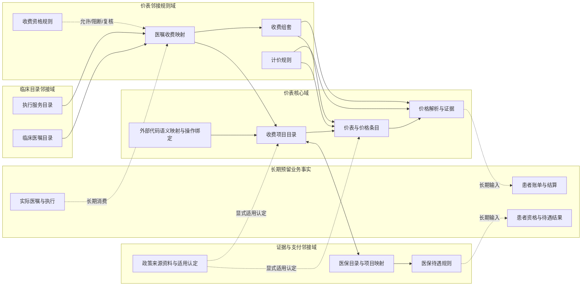
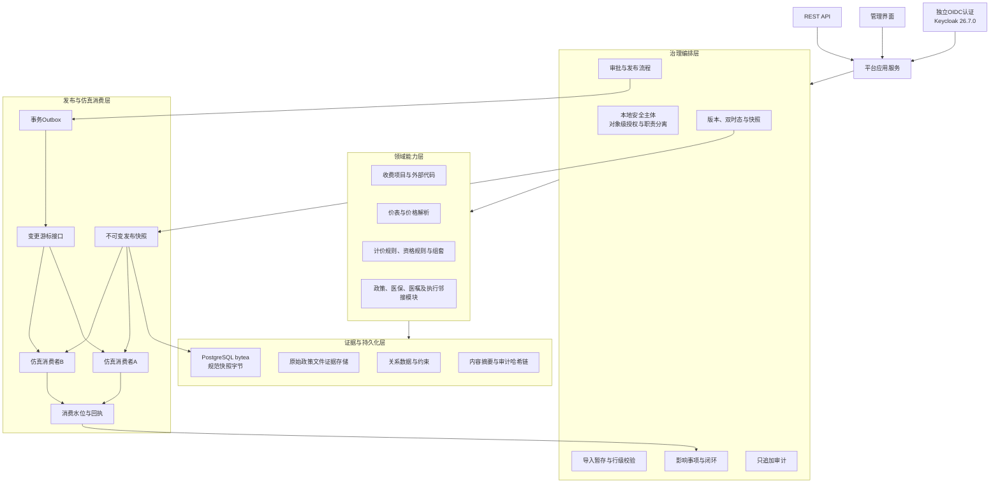
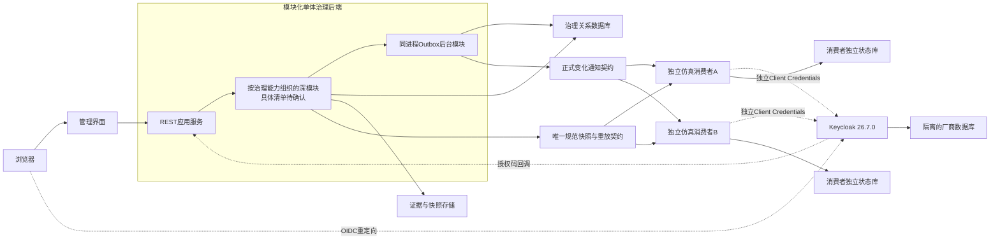
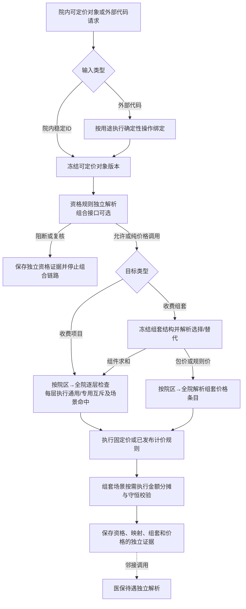
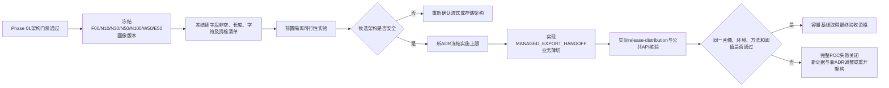
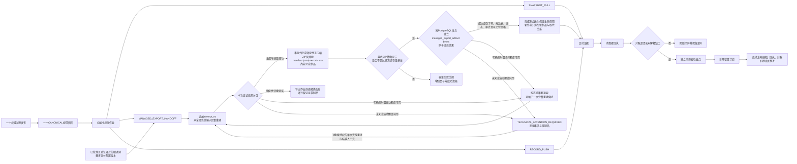

# 价表主数据项目架构

状态：架构边界、Phase 01技术基线、Keycloak认证、平台本地授权、同进程Outbox派发、单一TypeScript验证与不可覆盖证据、根目录单一npm工作区拓扑、governance-api深模块内部结构、领域版本与生命周期所有权、`price-list`与`price-resolution`分离、`release-distribution`统一发布登记与投递、领域内容投影与快照制品分工、领域拥有版本化投影Schema并进入单一TypeBox—OpenAPI契约链、消费者精确版本支持声明与不兼容投递隔离、Phase 01一发布一规范投影一权威快照、投影Schema升级高风险契约治理、投影载荷与完整快照制品双摘要、PostgreSQL `bytea`事务内权威快照存储、仅适用于合成POC的16 MiB单快照容量护栏、三种交付模式下初始化与增量分离的统一消费闭环、受控导出的版本化非权威派生交付制品、消费者交付配置的版本化治理主权与冻结执行边界、受控声明式转换与失败关闭验证门禁、任一记录确定性转换失败使整个受控导出作业失败且不形成制品的运行语义、瞬时技术故障在同一冻结作业内有限且完整重建式重试的恢复架构、完整POC受控导出的确定性无压缩ZIP与清单/摘要分层架构、完整POC派生ZIP的独立PostgreSQL `bytea`及短事务原子存储架构、完成派生制品保留至POC证据基线整体处置且禁止选择性删除的生命周期架构、派生制品容量先测后定并超限失败关闭的容量架构、“Phase 01只验证快照拉取、完整POC邻接受控导出、逐记录推送长期预留”的阶段范围，以及完整POC 72个REST与20个界面场景的验收基线均已确认，可作为POC详细设计与实施计划输入

容量环境补充状态：ADR-0110已确认受限本机WSL2 Anolis OS 8.9容量环境及独占运行门禁，不改变Phase 01范围或72/20验收总量。

更新日期：2026-08-08

## 1. 架构目标

价表项目不建设一张更大的“收费字典表”，而是建设一组边界明确、可以独立版本化和审计的治理能力：

1. 稳定表达医院“收取什么费用”的收费项目身份。
2. 以不可变版本表达项目语义、价表快照、金额、规则和组套。
3. 将政策证据、医保待遇、临床请求、执行服务、收费项目和实际业务事实分域治理。
4. 支持文件和API导入、CRUD生命周期、审批发布、双时态、影响分析、紧急暂停和补偿发布。
5. 通过管理界面和REST API提供同一治理规则。
6. 通过快照、变更通知和仿真消费者验证未来生产消费契约。
7. 为长期真实系统接入保留稳定边界，但不把生产设施或真实业务事实纳入POC。

本架构以[价表POC方向](price-list-poc-direction.md)、[价表治理流程](price-list-governance-workflow.md)及ADR-0051至ADR-0101为决策依据。研究报告（5）的适配边界见[价表研究报告适配分析](../research/price-list-deep-research-report-analysis.md)。

## 2. 总体约束

| 维度 | 已确认约束 |
|---|---|
| 治理主体 | 一个医院，可包含多个内部院区，不是集团或多租户 |
| 当前阶段 | POC，不接真实消费系统，不承担生产SLA、灾备或招标基线 |
| 数据 | 以合成数据为主，政策公开资料可作为来源证据留存 |
| 访问 | 管理界面和REST API共用平台服务；业务角色不得直接访问数据库 |
| 版本 | 稳定身份、不可变实体版本和不可变发布版本相互分离 |
| 删除 | 草稿可以删除并审计；已发布内容只能失效、暂停、到期或被替代 |
| 发布 | 治理对象独立审批、发布和回退，不做跨对象原子发布 |
| 权限 | 治理对象级授权并叠加操作和院区范围；普通领域内容提交人与审批人分离，纯投影Schema契约升级允许按冻结策略由提交人兼任平台契约终审人 |
| 时间 | 业务时间和平台记录时间双时态；平台自有日期时间均为固定按`Asia/Shanghai`解释的无时区本地日期时间，OIDC/JWT `NumericDate`仅存在于认证协议边界 |
| 消费 | 长期保留生产契约；POC仅使用同契约仿真消费者 |
| Phase 01数据库 | PostgreSQL 18.4，允许`pgcrypto`和`btree_gist`；不外推为生产选型 |
| 数据库结构主权 | 有序、版本化的原生SQL迁移是唯一Schema权威；应用和ORM不得自动DDL，已取证迁移不可改写 |
| Phase 01后端 | 严格模式TypeScript、Node.js 24 LTS和Fastify 5；首个证据基线精确固定Node.js 24.18.0 |
| 数据库访问 | `pg`驱动、Kysely查询与显式事务、`kysely-codegen`数据库派生类型；禁用Schema/Migration能力和有损金额转换 |
| 时间物理映射 | PostgreSQL使用`timestamp without time zone`和`tsrange`；API使用无`Z`、无偏移的专用本地日期时间字符串 |
| 排序权威 | 需要严格顺序的记录流使用显式单调序号；日期时间不参与唯一性或最终排序，不建立跨流全局总序 |
| API契约 | 领域模块拥有的投影TypeBox Schema只经模块接口进入组合根，与Fastify其他公开路由Schema共同形成唯一可编辑定义链，单向生成并冻结OpenAPI 3.1 JSON；所有消费者只从冻结产物生成客户端 |
| 管理界面 | React 19/Vite 8同源SPA；React Router 7 Data Mode、TanStack Query 5及OpenAPI生成客户端；浏览器不承载治理主权 |
| 工作流 | 模块化单体内独立领域模块；审批模板稳定身份与不可变版本、固定阶段和显式状态机；不引入外部引擎、BPMN或任意脚本 |
| 身份与授权 | Keycloak 26.7.0独立认证；Fastify承载人员服务端OIDC会话，各服务使用独立Client Credentials；平台本地安全主体和对象级授权是唯一业务权限权威 |
| Outbox派发 | 同一Fastify/Node进程内后台模块；发布事务只登记事件，提交后唤醒并由数据库轮询兜底，短事务租约认领后在事务外执行至少一次投递 |
| 自动化验证 | TypeScript测试资产与证据编排是唯一权威；Vitest 4.1.6为通用运行器，Playwright Test 1.61.0仅负责浏览器端到端，REST验收只使用冻结OpenAPI生成客户端 |
| 测试依赖与故障 | Testcontainers运行真实PostgreSQL 18.4、Keycloak 26.7.0和Toxiproxy；枚举化测试故障点与网络/容器故障形成双层受控注入，生产不可启用测试故障点 |
| 验证证据 | 每次正式运行创建新身份并生成不可覆盖的规范化清单及逐项SHA-256；CI厂商只负责编排与保管产物，不取得放行语义 |
| 工程工作区 | 当前根目录单一Git仓库，Node.js 24.18.0＋npm 11.9.0 workspaces＋一个根锁文件；应用、生成客户端、迁移、冻结契约、外部测试和验证工具分区，不使用额外包管理器、Turborepo或Nx |
| governance-api内部结构 | 按治理能力组织深模块，每模块一个小型公开接口和唯一入口；组合根统一装配，事务作用域内部协调；禁止横向技术分层、跨模块查写表、通用业务基类和为模拟仓储建立port |
| 版本与生命周期所有权 | `charge-catalog`拥有收费项目版本与生命周期，`price-list`拥有价表版本、价格条目与生命周期；工作流、发布和审计不得成为通用版本主权 |
| 价表与解析模块边界 | `price-list`只提供不可变已发布解析视图；独立`price-resolution`拥有固定两级选价、规则执行和不可变解析证据，依赖方向单向且仍位于同一模块化单体 |
| 发布与投递模块边界 | 一个`release-distribution`深模块统一拥有发布包络、最终快照制品及元数据、Outbox、订阅、投递、尝试及平台回执；内部严格分隔发布事务与提交后投递状态机，不拆`publication`和`delivery` |
| 发布内容与快照制品边界 | 领域模块构造经语义校验、冻结且类型化的内容投影；`release-distribution`从该值生成通用包络、确定性规范字节、投影载荷摘要、完整制品摘要并不可变存储，双方不得查写对方表 |
| 投影Schema主权 | 领域模块拥有稳定投影类型、字段语义、可执行TypeBox Schema和不可变Schema版本；`release-distribution`只核验并携带类型、版本与Schema摘要，不定义字段、选版或迁移 |
| 消费者契约兼容 | 订阅以不可变版本精确声明支持集合；发布前本地逐订阅预检。不兼容不回滚领域发布，只阻断对应投递且无网络或水位推进；升级后受控重放原快照，禁止自动降级和转换 |
| 发布投影与快照基数 | Phase 01每个发布只冻结一个规范投影并形成一个`CANONICAL`权威快照；Schema升级建立新发布且历史不重打包。发布事实与制品身份分离以保留未来扩展接缝，但本阶段不实现多投影或消费者专用快照 |
| Schema升级治理 | 一律按高风险契约变更处理；领域Owner确认语义，平台契约Owner终审TypeBox/OpenAPI结构、契约身份和四类证据。纯契约升级可同人提交及终审但动作分开，内容变化恢复职责分离；消费者无批准或否决权 |
| 快照摘要分层 | `projection_payload_digest`只覆盖冻结Schema下规范载荷，`snapshot_artifact_digest`覆盖最终冻结包络加载荷完整字节且外置；领域版本/成员摘要独立证明领域等价，运维状态不入摘要，历史不重算 |
| 快照物理存储与事务 | Phase 01把唯一`CANONICAL`快照的精确字节保存于`release_snapshot`非空PostgreSQL `bytea`，与发布、元数据、审计和Outbox同事务；消费者只经受控下载API取得，不使用文件/S3或跨资源补偿 |
| 快照容量护栏 | Phase 01合成POC以最终规范制品逻辑字节计量，单快照上限16 MiB；超限失败关闭且不允许规避。该值不得未经代表性容量验证外推为全院初始化、生产、SLA或招标上限 |
| 派生制品容量门禁 | 完整POC受控导出实施前先以最终确定性ZIP精确字节完成代表性容量实验，再由后续ADR冻结硬上限；超限不形成制品或成功终态，16 MiB不得继承，测量不安全时先重开流式或存储架构决策 |
| 两阶段容量证据 | Phase 01门禁后由既有验证工具链的一次性隔离装置完成前置可行性实验并支撑数值ADR；业务薄切集成后通过实际`release-distribution`与冻结公共API按同一参数核验，后者才授予最终验收资格 |
| 容量负载画像矩阵 | 验证工具链冻结F00/N10/N30/N50/N100/W50/E50七个容量专用画像，分别覆盖24行对照、10k至100k普通规模曲线、50k宽字段及50k编码转义压力；与业务验收fixture隔离且不形成生产规模承诺 |
| 容量字段分布 | 普通画像逐字段采用70%非空及70/25/5短中长分布，目标长度为20%/50%/85%；W50全部可选字段有值且字符串目标90%；E50保持N50逻辑长度并按显式字段资格形成五类各20%的中文与CSV转义压力 |
| 消费者交付配置主权 | 独立稳定身份和不可变版本；来源领域Owner强制语义前置确认、集成交付Owner单一终审，作业冻结目标消费者、用途、精确来源投影契约及交付契约/模板/映射版本；默认只允许受控声明式表示转换，高风险语义转换默认禁止，脚本/SQL/网络/当前表查询绝对禁止，分发模块只执行验证通过的冻结计划 |

## 3. 领域边界

### 3.1 核心域

| 模块 | 责任 | 不负责 |
|---|---|---|
| 收费项目目录 | 稳定身份、不可变语义版本、计价单位、包含和除外范围、替代关系 | 金额、医嘱、患者费用 |
| `price-list`价表管理 | 价表身份、完整发布版本、价格条目、全院默认和院区差异价、双时点权威发布视图，以及从自身权威状态构造经校验的冻结发布内容投影和领域成员摘要 | 最终快照字节、规范序列化、投影载荷摘要、完整制品摘要、运行时院区回退、通用/专用择优、金额计算、医保待遇、科室资格 |
| 外部代码互操作 | 命名空间、外部代码版本、语义映射、确定性操作绑定 | 政策采纳、价格、医嘱收费规则 |
| `price-resolution`价格解析 | 消费不可变已发布价表视图，执行组织范围、就诊场景、服务时间、固定价或规则价解析及留证 | 价表草稿和发布、价格主数据回写、医保报销、患者结算 |

### 3.2 邻接域

| 模块 | 与价表的关系 | 发布边界 |
|---|---|---|
| 政策证据 | 提供原文留证和院内适用认定 | 与收费项目、价表分别发布 |
| 医保目录 | 通过版本化多对多映射连接收费项目 | 与价表分别发布 |
| 医保待遇 | 在价格解析之后独立解析支付结果 | 不进入价格条目 |
| 收费资格 | 判断科室、执行单元或角色是否允许使用项目 | 可阻断，不改变金额 |
| 计价规则 | 为价格条目提供受限、安全的计算版本 | 规则和价表分别发布 |
| 收费组套 | 表达收费组合、选择替代和分摊 | 与临床组套分域 |
| 医嘱目录 | 表达临床请求 | 不保存收费项目外键 |
| 执行服务 | 表达实际可提供服务 | 不等于医嘱或收费项目 |
| 医嘱收费映射 | 将医嘱及执行服务解析为项目或组套 | 映射与三个目录分别发布 |

## 4. 逻辑分层

本节是系统责任和运行链路的逻辑视图，不是`apps/governance-api`源码目录模板。“交互、治理编排、领域能力、持久化、发布消费”不得实现为横跨全部治理能力的`controllers/services/repositories/models`水平层；治理后端源码按第4.8节所述治理能力深模块纵向组织。

### 4.1 交互层

- 管理界面和REST API只是两个渠道，均调用相同应用服务。
- API写入只能创建草稿、导入批次或流程动作，不能绕过审批直接发布。
- 所有公开业务日期时间参数均不携带`Z`或偏移并固定按`Asia/Shanghai`解释；带偏移输入失败关闭，不能剥离后保存。OIDC回调中的标准协议声明只由认证适配器处理，不进入业务契约。
- 所有公开路由的参数、查询、请求头、请求体、成功响应和错误响应只在TypeBox Schema中定义，并单向生成带版本及摘要的冻结OpenAPI 3.1 JSON。
- 管理界面、仿真消费者和契约测试只从冻结OpenAPI产物生成客户端和类型，不导入治理后端内部TypeScript类型，也不维护平行手写契约。
- 管理界面使用React 19和Vite 8构建客户端SPA，源码独立成包，生产静态资源由Fastify同源提供；不引入Next.js、SSR、RSC、Server Actions或第二套BFF。
- React Router 7 Data Mode负责浏览器路由，TanStack Query 5只缓存服务端状态；治理写操作必须等待服务端确认并重新取得权威状态，浏览器不能以本地判断或乐观更新替代权限、流程、发布、解析和审计结果。
- 浏览器与Node消费者均通过从冻结契约生成的`openapi-typescript`类型和`openapi-fetch`客户端访问公开API。
- 人员登录由现有Fastify作为OIDC机密客户端执行Authorization Code与PKCE S256；访问令牌和刷新令牌不进入浏览器JavaScript、URL、`localStorage`或`sessionStorage`，浏览器只持有`HttpOnly`、`Secure`和`SameSite`的不透明会话Cookie。
- Cookie认证的状态变更请求必须同时通过会话、Origin及CSRF校验；登录时轮换会话标识，注销、到期或主体失效后服务端撤销会话。
- 仿真消费者和应用服务分别使用独立机密客户端及Client Credentials，不共享人员账号、客户端或密钥。

### 4.2 治理编排层

- 统一处理本地安全主体、外部身份绑定、对象级权限、院区范围、审批模板、版本、审计和影响事项。
- 身份提供方只证明外部人员或客户端身份；平台忽略其业务角色声明，并在每次命令和查询中按本地安全主体、治理对象、操作、院区范围、有效期及流程状态重新判定权限。
- 人员主数据稳定身份、人员任职角色、平台安全主体和治理授权分别建模；外部身份只能显式绑定，名称、工号和邮箱均不是绑定或授权依据，服务身份不能执行人员提交、复核或审批动作。
- 导入、手工新增和API写入进入同一草稿生命周期。
- 高风险对象执行专业复核和Owner终审；低风险对象可以配置单级审批。
- 紧急暂停使用独立`EMERGENCY_SUSPEND`权限，不复用普通维护或审批权限。
- 工作流作为独立领域模块管理审批模板稳定身份、不可变版本、固定阶段、变更请求和只追加动作，不依赖外部流程引擎。
- 变更请求提交时冻结模板版本、风险结果、必需阶段和内容摘要；模板升级不迁移进行中请求，超时只产生提醒或升级事项，不能自动批准。

### 4.3 领域能力层

- 每个模块拥有自己的业务不变量和版本语义。
- `charge-catalog`拥有收费项目稳定身份、内容版本、演进关系和生命周期；`price-list`拥有价表稳定身份、完整发布版本、价格条目和生命周期，不建立独立通用版本模块。
- `price-list`按价表、服务发生时间和记录时点提供不可变已发布解析视图；`price-resolution`以单向模块接口依赖它，并独占院区到全院固定两级选择、通用/专用判定、规则执行、舍入和解析证据。
- 两者继续处于同一模块化单体、同一进程和同一PostgreSQL事务数据库；`price-resolution`不得查询草稿或价表表、回写价表，`price-list`不得预先择优使解析模块退化为转发层。
- 模块之间引用稳定身份，并冻结发布时实际校验的目标版本。
- 一个模块不能直接更新另一个模块的数据表；跨模块变化产生影响事项或调用公开应用服务。
- 医保待遇、资格和医嘱收费映射可以消费价格结果，但不能反向改写价表。

### 4.4 证据与持久化层

- 关系数据保存稳定身份、不可变版本、关系、流程、审计和解析证据。
- 政策原始文件证据保持其独立证据存储边界；Phase 01唯一`CANONICAL`发布快照的最终字节直接保存于`release_snapshot`非空PostgreSQL `bytea`，不与政策文件存储合并主权。
- 发布快照元数据分别保存投影载荷摘要与完整制品摘要及各自算法、序列化规则、媒体类型和精确字节数；完整制品摘要不自嵌入，数据库物理位置与可变运维状态不进入摘要。同一完整制品摘要可以作为去重候选，但业务证据记录和字节不得合并删除。
- 快照字节与发布事实、成员、兼容预检、独立投递登记、审计和Outbox使用同一PostgreSQL事务；Phase 01不建立文件/S3双写、暂存提升、跨资源补偿或未使用的存储port。
- 消费者交付配置作为独立版本化治理对象保存稳定身份、不可变版本、声明式转换计划、精确来源Schema及固定测试向量验证证据、来源领域Owner语义前置确认和集成交付Owner终审；配置物理落在哪个模块或私有编译/解释组件仍待后续设计，不得因此新建第二语义主权。
- 受控导出的厂商专用派生交付制品拥有独立身份、精确消费者交付配置版本、摘要和清单，不写入`release_snapshot`或复用规范快照双摘要；完整POC按[ADR-0104](../adr/0104-store-managed-export-artifacts-in-postgresql-for-complete-poc.md)在事务外生成完整ZIP及摘要后，以`release-distribution`独立PostgreSQL `bytea`和短事务原子提交，按[ADR-0105](../adr/0105-retain-managed-export-artifacts-until-poc-evidence-baseline-disposal.md)保留至POC证据基线整体处置，按[ADR-0106](../adr/0106-set-managed-export-artifact-capacity-from-representative-measurement.md)先完成容量实验再冻结硬上限，按[ADR-0107](../adr/0107-use-two-stage-capacity-evidence-with-integrated-ratification.md)以前置隔离试验支撑实施、以集成后真实链路核验授予最终验收资格，按[ADR-0108](../adr/0108-freeze-managed-export-capacity-workload-profile-matrix.md)使用冻结七画像矩阵，按[ADR-0109](../adr/0109-freeze-managed-export-capacity-field-distribution-rules.md)执行精确非空、长度、字符、转义及字段资格规则，并按[ADR-0110](../adr/0110-use-local-wsl2-anolis-8-9-for-capacity-simulation.md)使用受限本机WSL2环境。重复次数、阈值、聚合判定和数值仍待确认；这些规则不进入Phase 01，也不能反向改变规范快照的PostgreSQL `bytea`与16 MiB护栏。
- 已发布数据和只追加事件不允许物理删除。
- Keycloak使用隔离的厂商数据库和服务账号，其Schema及迁移不进入治理数据库结构主权；平台治理Schema只保存本地安全主体、显式外部身份绑定、服务端会话引用、授权和审计，不复制Keycloak凭据。

### 4.5 发布与消费层

- `release-distribution`以一个逻辑接口统一发布事实登记、快照/变化/投递查询、回执接收和受控重放；发布包络、成员、最终快照制品及元数据、Outbox、订阅、投递、尝试及平台侧检查点/回执只归该模块。
- 领域模块从自己拥有的权威状态构造经语义校验、冻结、类型化且完整物化的发布内容投影；不得传递数据库行、REST DTO、repository、延迟加载器或事务句柄。
- 领域模块同时冻结`projection_type`、不可变`projection_schema_version`、`projection_schema_digest`和摘要算法；Schema只经本模块`index.ts`交给组合根，已被快照引用的版本不得修改或删除。
- `release-distribution`从投影生成通用包络、确定性规范载荷、最终制品字节、投影载荷摘要和完整制品摘要；不得查询领域表、解释或补齐领域字段，领域模块也不得直接写快照或Outbox存储。
- `release-distribution`只核验投影契约身份与组合根登记的不可变定义完全一致并携带到快照、事件和查询结果；未知身份或摘要冲突失败关闭，不得选版、自动升降级或隐式迁移。
- 每个消费者订阅以不可变版本声明精确支持的投影类型与Schema版本，不接受`latest`、通配符、范围、SemVer推断或运行时探测。发布前以冻结活动订阅版本执行本地确定性预检并随发布留证，不调用消费者。
- 发布事务同时固化领域版本，并把由`release-distribution`生成的精确快照字节写入PostgreSQL `bytea`，连同元数据、审计和Outbox一次提交；任一步失败不得留下半发布。
- 事件只提供变更通知和稳定快照ID或等价平台获取引用，不承载第二份权威主数据，也不暴露数据库表、列、连接或物理位置。
- 消费者、管理界面和外部测试只能经平台受控下载API取得快照字节；未来迁移对象存储必须另立ADR并保持快照身份、下载契约、历史字节及双摘要不变。Phase 01合成POC只接受不超过16,777,216个最终规范逻辑字节的单制品，超限不拆分、不截断、不压缩规避或回退其他存储。
- 发布事务不调用消费者；提交成功只使事件具备派发资格，进程内唤醒用于缩短等待，数据库周期轮询负责丢失唤醒、重启和积压恢复。
- `release-distribution`内部派发器在短事务中以租约和`FOR UPDATE SKIP LOCKED`认领消费者投递，提交认领事务后才执行网络调用；网络等待期间不持有数据库锁。
- 一个Outbox事件按消费者订阅分别建立投递状态和只追加尝试，平台投递成功与消费者接收、校验和应用回执分别留证；不存在事件级全局`dispatched_at`。
- `UNSUPPORTED`只把该订阅投递置为`BLOCKED_INCOMPATIBLE`并创建影响事项；不取得租约、不发送网络请求、不追加尝试或推进水位，也不回滚领域发布。其他兼容消费者继续独立运行。
- 消费者升级必须形成新订阅版本；受控重放对原事件和原不可变快照重新预检，通过后才恢复投递。原预检、影响事项、快照和双摘要保持不变，`release-distribution`不得自动降级、转换或迁移载荷。
- 两类快照摘要由`release-distribution`按冻结算法和序列化规则生成并通过快照、事件和查询契约公开：载荷摘要只覆盖规范投影载荷，完整制品摘要覆盖最终冻结包络及载荷且不自嵌入。领域内容等价继续依据领域版本或成员摘要，跨Schema不得由双摘要推断。
- 两个仿真消费者分别保存投递、重试、水位和回执，验证重复、乱序、缺口、失败和恢复；一个消费者失败不阻塞另一个消费者。
- 消费失败不回滚平台发布，通过重试、快照恢复、影响事项或补偿发布处置。
- 自动重试耗尽后保留事件和全部尝试，投递进入待人工处置并生成影响事项，不进入静默丢弃队列。
- 同一权威发布和规范快照长期支持`SNAPSHOT_PULL`、`MANAGED_EXPORT_HANDOFF`及`RECORD_PUSH`三种交付模式；模式只改变送达方式，不产生新的领域版本、治理发布、规范快照或主数据真相。
- 初始化交付作业冻结消费者及订阅版本、来源发布、规范快照和一种模式；日常增量订阅继续使用Outbox事件和逐消费者投递，两者分别保存执行状态但共同受检查点及缺口规则约束。
- 下载、导出交接或逐条接口成功只形成模式动作证据；三种模式都必须经过消费者回执、来源范围与摘要对账，确认无未解释缺口后才能关闭作业并建立或推进检查点。
- 自动化第三方消费的正式入口仍是服务身份调用平台API；受控导出是医院操作员参与的初始化通道，不向第三方开放管理界面、网页链接契约或数据库。
- 完整POC每个成功的`MANAGED_EXPORT_HANDOFF`作业只生成一个版本化、不可变且明确非权威的确定性无压缩ZIP；根目录固定只有`manifest.json`和`records.csv`，清单冻结来源/配置链及CSV摘要，覆盖完整ZIP精确字节的SHA-256保存在制品外部。
- 消费者交付配置具有稳定身份和不可变版本，每版冻结目标消费者、用途、精确来源`projection_type + projection_schema_version`、交付契约、模板、映射和派生交付格式版本，以及CSV列序、字段表示与全序记录规则；来源领域Owner完成强制语义前置确认，集成交付Owner单一终审，只有已批准版本可进入作业。
- 普通配置只允许字段选择、排序、重命名、确定格式/类型转换、空值/默认值策略、常量元数据和已发布代码映射版本引用；过滤、拆分、合并、聚合、计算字段和一对多展开默认禁止，启用前必须独立完成高风险能力审批并提供固定测试向量。本决策尚未批准任何具体高风险能力。
- 任意脚本、SQL、网络调用和运行时当前状态查询绝对禁止。集成交付Owner终审前，必须按精确来源Schema和固定样例向量验证全部转换并冻结逐项证据；任一错误阻断批准。
- 使用厂商专用转换的作业和派生制品固定引用精确且验证通过的配置版本；`release-distribution`只机械执行该声明式计划并封装制品、摘要、清单和闭环，不得编辑配置/映射、推断领域含义、查询当前领域表或自动选择新版本。
- 固定规范快照中的任一记录发生确定性转换错误时，整个受控导出作业进入终态失败并保持零个完成制品；临时或部分字节不得下载、交接或进入回执—对账—检查点闭环。平台只追加保存作业级与行级可追溯错误证据，禁止静默丢弃、人工跳过或成功记录加错误清单。
- 确定性转换错误的修正以及来源、映射或交付配置变化必须形成相应新发布或版本并创建新作业，原失败作业不可覆盖、改换来源或续写。该语义不改变导入行级部分成功。
- 受控导出作业冻结不可变重试策略版本；只有明确列为可重试的瞬时技术故障才可在同一冻结作业内有限自动重试。每次执行以不复用的显式`attempt_no`追加证据并从全部冻结输入完整重建，禁止按记录或部分字节续跑。
- 未知技术错误或自动额度耗尽时作业进入`TECHNICAL_ATTENTION_REQUIRED`、生成影响事项且保持零制品；对象级授权人员只能在冻结输入不变时发起一次受控重试，不重置自动额度。任何输入变化必须新建作业，最终成功仍只有一个制品并保留全部尝试。
- `records.csv`使用UTF-8无BOM、LF和RFC 4180字段引用/双引号转义语义，列和记录顺序、Decimal、无时区日期时间、空值及文本换行均由冻结配置确定；不得依赖数据库自然顺序、区域设置或运行时间。
- `manifest.json`及ZIP头和条目元数据按不可变格式版本确定性序列化，条目顺序固定为清单后数据，两个条目均使用`STORE`。作业/尝试/制品身份、运行时间、交接状态和完整ZIP摘要不得进入ZIP，保证相同冻结输入在重试或新作业中逐字节一致。
- XLSX、裸CSV、其他容器、分片和同一作业多格式不进入完整POC；新增格式必须形成新消费者交付配置版本和新作业，不要求重发权威主数据。
- 完整POC的ZIP和摘要先在最终提交事务外从冻结输入完整生成；临时字节无制品身份。随后`release-distribution`以短PostgreSQL事务把独立`managed_export_artifact`身份、非空`bytea`、媒体类型、字节数、外置摘要、成功尝试/作业终态、审计及可交付资格原子提交，任一写点失败全部回滚。
- `managed_export_artifact`与`release_snapshot`保持独立身份、记录、角色和摘要，即使都由PostgreSQL承载也不得合并。一个作业最多一个制品；提交前崩溃完整重建，提交后重复恢复只返回既有`artifact_id`与相同字节。
- 完整POC只经平台API或授权管理界面按`artifact_id`取得字节，不使用文件、共享目录、S3、MinIO、双写、暂存提升、跨资源补偿、独立存储模块/workspace或预建存储port。容量按最终ZIP精确字节先测后定；未来迁移必须经代表性验证和新ADR并保持历史身份、字节、摘要和契约不变。
- 完成派生制品在隔离合成POC环境存续期间不允许单制品删除、自动过期、覆盖、重打包、原位脱敏或选择性清理；交付完成、对账通过、检查点推进、被后续制品取代或对象级授权撤销均不改变其存在性。恢复授权后仍须按原`artifact_id`取得相同字节。
- 派生交付制品不是规范快照变体；配置、格式、模板、映射或用途发生变化时创建新配置版本、新作业和新制品，历史字节、摘要及清单不得覆盖或自动迁移，只能追加取代关系并继续完成回执和对账。
- 只有不可覆盖证据包已经导出并通过清单、摘要、场景覆盖和关键制品字节复核，才可由业务应用之外的受控流程整体处置隔离合成POC环境。平台不提供选择性删除接口、定时清理器或环境处置port；生产法定保留、隐私删除、归档、备份及容量仍另行决定，完整POC容量方法不构成生产承诺。
- Phase 01只实现`SNAPSHOT_PULL`及其规范快照API消费闭环，不建立受控导出或逐记录推送adapter。全部ABG门禁通过后，完整POC才在同一`release-distribution`深模块内加入`MANAGED_EXPORT_HANDOFF`邻接薄切，且只连接合成仿真消费者、只执行默认受控表示转换、不启用高风险语义转换或真实厂商接入。`RECORD_PUSH`继续只保留架构接缝。

### 4.6 自动化验证与证据层

- TypeScript是测试用例、fixture、场景编排和证据汇总的唯一实现语言；Vitest承担单元、领域、Fastify `inject()`、数据库集成和REST场景，Playwright Test只承担真实浏览器端到端。
- REST场景通过冻结OpenAPI生成客户端访问公开服务；Redocly CLI检查OpenAPI 3.1规范，oasdiff检查相对已批准基线的破坏性变化，不允许Postman/Newman或平行手写DTO形成第二契约。
- Testcontainers从空环境启动真实PostgreSQL 18.4、Keycloak 26.7.0和Toxiproxy。SQLite、内存数据库、伪造IAM、内存Outbox或预置消费者成功不能进入门禁。
- 第一层故障注入是在测试组合根中注册的枚举化事务及崩溃故障点，生产配置不能启用且公开接口不能触发；第二层由Toxiproxy和容器停止、重启验证网络与依赖恢复。
- 每次正式验证创建新的运行身份，汇总机器可读测试结果、契约和迁移检查、工具及镜像摘要、fixture种子和服务证据，再生成规范化清单及逐项SHA-256；终态证据不得覆盖或补写。
- 仓库命令定义全部验证语义。CI平台只执行这些命令并保存产物，本地或不同CI运行必须得到等价结构化结论。

### 4.7 工程工作区层

- 当前项目根目录是唯一Git仓库根；Node.js 24.18.0自带npm 11.9.0管理全部workspaces和唯一根`package-lock.json`，正式依赖安装使用`npm ci`。
- `apps/governance-api`承载模块化单体，`apps/admin-web`承载React/Vite界面，`apps/sim-consumer`是一套消费者实现并以两个独立身份、配置及状态运行。
- `packages/generated-api-client`只能从`contracts/openapi`冻结产物生成；管理界面、消费者和外部测试不得导入`apps/governance-api`内部类型、命令、仓储或领域实现。
- `db/migrations`保持物理Schema权威，`contracts/openapi`保持外部契约发布权威；领域投影Schema留在各领域模块并由组合根装配，`contracts/openapi`只是冻结派生产物，三者都不能被普通npm包反向改写。
- `tests/api`、`tests/e2e`和`tests/fault`分别承担REST、浏览器和故障场景，`tooling/verification`只汇总及终结证据；生产应用不得反向依赖测试或验证工作区。
- 根npm脚本及仓库内TypeScript编排器是唯一任务语义，不引入pnpm、Yarn、Bun、Turborepo、Nx、嵌套Git或CI厂商专有任务图。
- 不建立`shared-domain`、`common-service`或共享仓储包；模块化单体内部模块通过公开模块接口协作，同仓库不能成为绕过公共API契约和领域边界的理由。

### 4.8 governance-api内部模块层

- `apps/governance-api/src/modules/<capability>`中的每个治理能力是一个深模块，并只从本模块`index.ts`公开一个逻辑接口；路由adapter、状态机、规则、SQL映射、数据库行类型和内部测试辅助均保持隐藏。
- 组合根是唯一创建具体实现、注入依赖、注册Fastify路由和生命周期的位置；模块不得使用全局可变容器、服务定位器或字符串查找依赖。
- 跨模块协作只调用对方公开接口并传递稳定身份、版本引用或类型化命令，不得导入内部路径、直接读取或写入他模块表，也不得形成循环依赖。
- 跨模块原子命令由事务运行器提供绑定同一PostgreSQL连接和事务的作用域模块集合；调用方看不到`pg`连接或Kysely事务，任一模块失败回滚全部本地写入，提交后唤醒和网络投递只在成功提交后发生。
- Phase 01不建立根级`controllers`、`services`、`repositories`、`models`、`common`或`shared`业务层，不使用`BaseService`、`BaseRepository`、`BaseController`、通用CRUD继承、通用命令总线或反射容器。
- 共同的版本号、双时态、摘要和序号格式不产生`VersionService`、`BaseVersion`、`VersionedRepository`或配置化通用生命周期状态机；工作流只产生审批决定，`release-distribution`只处理发布包络、快照制品与Outbox，审计只追加证据。
- `price-list`唯一公开接口提供不可变已发布解析视图；`price-resolution`唯一公开接口承接解析命令和证据查询。只有后者拥有`price_resolution`、`price_resolution_step`和`price_resolution_result`，依赖图只允许`price-resolution -> price-list`。
- 发布视图必须冻结发布、条目、目标及规则版本引用和摘要，使后续价表变化不改变历史解析；路由、组合编排和消费者不得复制解析算法。
- `release-distribution`是发布登记与提交后投递的唯一模块及逻辑接口；内部派发器不是独立`outbox`模块，其他模块不得查写其发布、快照、订阅、投递、尝试、检查点或回执表。
- 领域模块只通过该接口传入冻结类型化内容投影；最终快照包络、规范序列化、投影载荷摘要、完整制品摘要和不可变存储均由`release-distribution`拥有，不另建`snapshot-builder`或独立摘要模块，也不允许该模块回查领域表。
- 领域模块拥有的投影Schema只通过自身唯一`index.ts`作为模块接口契约提供给组合根；组合根统一登记契约身份并装配TypeBox公开Schema，但不取得字段语义主权。不得新增集中所有领域字段的`projection-schema`或`shared-schemas`模块，也不得手写平行OpenAPI、JSON Schema、DTO或消费者私有契约。
- 版本化订阅支持、发布前兼容预检、`BLOCKED_INCOMPATIBLE`和升级后受控重放由同一`release-distribution`Interface封装；不建立独立`compatibility`模块、转换服务或降级seam，也不让调用者拼装这些状态。
- 每个领域发布只接受一个规范投影并形成一个`CANONICAL`快照；发布与制品使用不同稳定身份并保持一对一。Schema升级即使复用相同领域内容也形成新发布、新制品和新双摘要，旧制品不重打包；不预建多投影表、注册器、变体路由或消费者选择接口。
- Schema升级的领域语义确认和平台契约终审由既有工作流模块保存，TypeBox/OpenAPI差异、精确支持兼容矩阵、冻结客户端仿真消费和影响分析进入证据；平台契约Owner不产生新模块或Schema编辑入口。纯契约升级允许提交人兼任终审，但领域事实变化时恢复普通职责分离；消费者支持声明不进入审批。
- 模块统一不合并事务阶段：领域发布事务只登记分发事实；提交后唤醒、轮询、短租约认领、事务外发送、新事务结果落库和回执处理保持隔离。
- 当前只为Keycloak等真实外部变化点建立小型seam和adapter；PostgreSQL快照`bytea`只有一个正式实现，不预建文件/S3 adapter或快照存储port，也不为内存仓储测试给每张表建立repository port。未来对象存储只有经新ADR后才形成真实变化点。模块接口是主要测试面，持久化行为以真实PostgreSQL验证。

详细接口、组合根、事务上下文、数据所有权和门禁要求见[Phase 01 governance-api深模块结构](phase-01-governance-api-module-structure.md)。当前已冻结`charge-catalog`、`price-list`、`price-resolution`、`release-distribution`、`price-resolution -> price-list`依赖、“领域内容投影到快照制品”seam、领域投影Schema主权与单一TypeBox—OpenAPI权威链、消费者精确支持声明与不兼容投递隔离、Phase 01“一发布一规范投影一权威快照”，以及投影载荷与完整制品双摘要；其余模块清单和其他依赖仍需逐项确认，不能从本责任视图自动推定。

## 5. POC参考部署

POC治理后端采用模块化单体，所有治理模块位于一个部署单元并保持明确内部边界；仿真消费者作为治理应用外部的独立进程，只使用正式契约：

治理模块通过内部公开接口协作，不允许任意跨模块表写入或循环依赖；发布、PostgreSQL `bytea`快照字节及元数据、审计和Outbox保持本地事务原子性。Outbox后台模块与REST服务运行在同一Fastify/Node进程和部署单元中，以进程生命周期钩子启动、停止和释放租约；它不是独立Worker、微服务或第二个发布权威。Fastify仍是唯一治理后端和OIDC认证适配器，服务端会话不构成第二个BFF。仿真消费者使用独立服务身份和消费状态，只经平台API下载快照，不能调用内部模块或直接访问治理数据库。Keycloak的厂商Schema、管理员和凭据与治理数据库隔离；平台不依赖Keycloak角色完成业务授权。Phase 01不引入数据库触发器、`LISTEN/NOTIFY`、CDC、外部消息中间件或外部快照存储；未来替换传输或快照存储设施时必须保持事件、投递、尝试、回执、幂等、顺序、快照身份、历史字节和双摘要语义，并重新执行架构门禁。16 MiB只控制合成POC资源风险，不能替代全院初始化或生产容量验证。

自动化验证编排位于生产部署拓扑之外，以测试身份启动或连接上述真实组件，并只能通过应用构建入口、公开契约、容器控制面和受控测试组合根工作；它不得成为治理应用内的管理模块、生产接口或第二套业务服务。完整规则见[Phase 01自动化验证、故障注入与证据基线](phase-01-verification-toolchain.md)。

源码工作区与运行部署是两种不同视角：单一仓库不改变模块化单体、同源SPA和独立消费者的运行边界。完整目录、依赖和包主权见[Phase 01单仓库工作区拓扑](phase-01-workspace-topology.md)。

该架构形态见[ADR-0069](../adr/0069-use-modular-monolith-with-independent-simulated-consumers.md)。

Phase 01治理事务数据库见[ADR-0070](../adr/0070-use-postgresql-18-4-for-phase-01.md)。物理DDL依据当前逻辑模型重新设计，历史参考DDL只作能力证据。

认证与平台授权边界见[ADR-0079](../adr/0079-separate-keycloak-authentication-from-platform-authorization.md)。

Outbox派发进程与触发边界见[ADR-0080](../adr/0080-run-outbox-dispatch-in-process-with-durable-polling.md)。

## 6. 关键运行链路

### 6.1 数据治理链路

### 6.2 组合收费与价格解析链路

纯价格接口从“冻结可定价对象版本”开始，只接受收费项目或收费组套等可定价对象、价表、院区、实际就诊场景、服务发生时间和可控规则输入。组合接口可以在其前后编排外部代码、资格、组套和医保待遇能力，但各自生成独立证据；科室、人员、患者类别或支付身份不能选择另一普通院内价格。

### 6.3 紧急暂停链路

一名具备对象级紧急权限的授权人员可以立即暂停未来新解析。平台追加暂停事件、通知消费者并生成影响事项；任何恢复都必须形成新的审批发布。详细流程见[价表治理流程](price-list-governance-workflow.md)。

### 6.4 初始化交付与日常增量链路

容量门禁先按两阶段证据推进，再允许完整POC形成最终验收结论：

初始化和增量不得共享可覆盖的执行进度。Phase 01只走图中的`SNAPSHOT_PULL`分支；门禁通过、七画像矩阵及其版本冻结、前置容量实验完成且后续数值ADR冻结后，完整POC才以合成仿真消费者实现`MANAGED_EXPORT_HANDOFF`业务薄切；薄切集成后还必须通过实际`release-distribution`及冻结公共API以相同画像、字段分布和环境版本完成第二阶段核验，才取得最终容量验收资格。G01至G12及U17至U20验证该薄切，其中G05/U19覆盖技术重试，G05/G06/U18覆盖确定性ZIP，G05/G06/G07/G12/U18覆盖独立PostgreSQL `bytea`、短事务原子提交、平台受控取得及无平行存储，G05/G07/G12/U18覆盖保留、取代及禁止选择性删除，容量画像、证据与超限失败关闭复用G04/G05/G12/U19参数化验证，均不改变72/20总量；`RECORD_PUSH`分支只表达长期结构，不在本次POC实现。画像字段/字符分布由ADR-0109冻结，运行环境由ADR-0110冻结；声明式规则具体语法、编译或解释方式、私有执行组件物理位置，以及重复次数、峰值RSS/磁盘余量/时间阈值和最终数值上限仍分别另行确认。

## 7. 服务契约

以下为逻辑API边界，路径可以在实施计划中调整，但责任不得合并：

| 能力 | 代表接口 | 约束 |
|---|---|---|
| 收费项目查询与维护 | `/v1/charge-items` | 写入只形成草稿或新版本 |
| 价表及发布 | `/v1/price-lists`、`/releases` | 完整快照、不可变发布 |
| 价格解析 | `/v1/pricing/resolve` | 保存解析证据，失败关闭 |
| 外部代码 | `/v1/external-namespaces`、`/bindings/resolve` | 语义映射和操作绑定分离 |
| 政策证据 | `/v1/policy-evidence`、`/applicability` | 原文留证与院内认定分离 |
| 医保邻接 | `/v1/insurance-catalogs`、`/benefits/resolve` | 与价格解析分离 |
| 计价规则 | `/v1/pricing-rules`、`/validate` | 受限表达式和测试向量 |
| 收费组套 | `/v1/charge-bundles`、`/resolve` | 无环、选择替代、金额守恒 |
| 医嘱收费映射 | `/v1/order-charge-rules`、`/resolve` | 映射证据先于价格证据 |
| 导入 | `/v1/import-jobs` | 行级结果、幂等重试、部分成功 |
| 认证会话 | `/auth/login`、`/auth/callback`、`/auth/session`、`/auth/logout` | Fastify服务端OIDC会话；浏览器不接收治理API令牌 |
| 工作流 | `/v1/change-requests`、`/approvals` | 对象Owner、领域语义确认、平台契约确认、冻结职责分离策略及强制证据 |
| 紧急暂停 | `/v1/emergency-suspensions` | 独立权限、只追加、不得原地恢复 |
| 快照与变化 | `/v1/release-snapshots`、`/v1/release-snapshots/{snapshot_id}/content`、`/changes` | 授权元数据查询与字节下载、游标、媒体类型、字节数、投影载荷摘要、完整制品摘要、各自算法、序列化规则、`projection_type`、不可变Schema版本及Schema摘要；不暴露数据库位置 |
| 消费者订阅与兼容 | `/v1/consumer-subscriptions`、`/versions`、`/compatibility-results`、`/replays` | 精确支持集合、冻结预检、隔离阻断和受控重放；禁止自动降级 |
| 初始化交付作业 | 路径待相应模式进入实施范围后冻结 | 冻结来源发布、规范快照、消费者订阅版本和单一交付模式；完整POC受控导出一个成功作业一个确定性无压缩ZIP，返回外置完整ZIP摘要和字节数；新作业只追加新制品与取代关系，不提供单制品删除或过期动作；模式动作、回执、对账与检查点分离 |
| 投递状态 | `/v1/outbox-deliveries`、`/attempts` | 只读、按消费者隔离；`BLOCKED_INCOMPATIBLE`无尝试和水位推进，不得用人工修改伪造成功 |
| 消费回执 | `/v1/consumer-receipts` | 消费者独立水位、只追加结果 |
| 审计与影响 | `/v1/audit-events`、`/impact-issues` | 只读、对象级授权 |

## 8. 安全与审计

1. Keycloak人员账号、服务客户端、平台安全主体、人员主数据身份和数据库服务账号相互分离；业务用户、治理角色、管理界面及仿真消费者不得用数据库账号直接读取快照`bytea`。
2. Fastify在建立人员会话或接受服务令牌前校验OIDC发行者、签名、受众、状态、nonce、PKCE及标准时效声明；认证失败和本地绑定缺失均失败关闭。
3. Keycloak角色、组、显示名称、邮箱和工号不能直接产生平台业务权限；权限由本地安全主体、治理对象、操作、院区范围、有效期和流程状态共同决定。
4. 提交人不能审批自己的普通领域内容变更；同一人员即使绑定另一个外部账号也不能绕过职责分离，服务身份不能执行人员审批，紧急操作者不能审批自己提交的恢复发布。纯投影Schema契约升级是限定例外：同一已授权人员可以分别提交和平台契约终审，但每个动作独立授权与审计，且领域内容变化后例外失效。
5. OIDC/JWT `NumericDate`只在认证适配器中按标准校验，不成为治理Schema或公开业务契约的日期时间字段；平台审计另行记录`Asia/Shanghai`无时区本地时间和规范流内序号。
6. Outbox向消费者投递时使用平台独立服务身份，不复用任一消费者凭据；投递日志、错误和响应摘要不得记录客户端密钥、访问令牌或业务快照全文。
7. 政策原文、价格、规则、身份绑定、授权变更、审批、解析、导出、投递尝试和消费回执均保存审计事件。
8. 审计事件只追加，并通过批次哈希或链式摘要验证篡改。
9. 解析证据只保存必要业务上下文和不可逆请求标识，不复制完整患者病历。
10. 数据库管理员只可通过受控运维通道访问，不代替业务角色维护或发布。

## 9. POC与长期目标映射

| 能力 | POC | 长期目标 |
|---|---|---|
| 核心价表治理 | 完整实现 | 持续扩展数据规模 |
| 邻接对象 | 少量样本但完整闭环 | 完整目录和规则体系 |
| 消费者 | 两个隔离仿真消费者 | 真实HIS、LIS、PACS、医保、财务等 |
| 事件传输 | 轻量实现即可 | 可接企业事件总线 |
| 快照与游标 | 必须实现 | 支持大规模恢复和补数 |
| 初始化交付模式 | Phase 01只实现快照拉取；完整POC以确定性无压缩ZIP实现受控导出邻接薄切，逐记录推送长期预留 | 快照拉取、受控导出交接和逐记录接口推送共用回执、对账与检查点闭环 |
| 业务事实 | 不实现 | 由业务系统产生并通过契约调用 |
| 性能与灾备 | 不验收 | 按生产容量另行设计 |
| 真实对账 | 不实现 | 影子运行和切换阶段建设 |

## 10. 实施顺序

完整价表POC不直接横向铺开。首先执行[Phase 01：POC可执行架构基线](../../phase-plan/01-poc-executable-architecture-baseline.md)，用收费项目—价表—解析—审计—仿真消费纵向切片和`SNAPSHOT_PULL`验证公共治理内核、事务边界和服务契约。只有全部架构门禁通过，才在同一工程基线上扩展邻接对象、完整合成数据及`MANAGED_EXPORT_HANDOFF`邻接薄切，并完整执行A01至G12共72个REST场景和U01至U20共20个界面场景；Phase 01门禁通过不能替代该完整POC验收。

该阶段顺序由[ADR-0068](../adr/0068-establish-executable-architecture-baseline-before-full-poc.md)确认。架构基线通过不等于完整POC验收或生产就绪。

Phase 01的应用形态由[ADR-0069](../adr/0069-use-modular-monolith-with-independent-simulated-consumers.md)确认：治理应用采用模块化单体，仿真消费者保持独立，本阶段不拆微服务。

Phase 01治理事务数据库由[ADR-0070](../adr/0070-use-postgresql-18-4-for-phase-01.md)确认：精确版本为PostgreSQL 18.4，并允许`pgcrypto`和`btree_gist`。

数据库结构主权由[ADR-0071](../adr/0071-use-versioned-native-sql-migrations-as-schema-authority.md)确认：物理结构只能由原生SQL迁移演进，应用访问层不得自动建表或修改Schema，进入正式架构证据包的迁移只能通过后续追加迁移纠正。

Phase 01后端技术基线由[ADR-0072](../adr/0072-use-typescript-node-24-and-fastify-5-for-phase-01.md)确认：治理后端采用严格模式TypeScript、Node.js 24 LTS和Fastify 5；仿真消费者可以复用该运行时，但仍是独立进程并只能使用公共契约。

数据库访问策略由[ADR-0073](../adr/0073-use-pg-kysely-and-database-derived-types.md)确认：使用`pg`、Kysely和从迁移后数据库生成的类型，但不允许查询工具取得DDL主权；金额、`int8`和时间值在驱动边界保持无损表示。

时间物理与契约策略由[ADR-0074](../adr/0074-use-asia-shanghai-local-datetimes-without-time-zone.md)确认：同一地域系统统一使用`Asia/Shanghai`无时区本地日期时间，禁止时区感知数据库类型和带偏移API值；若未来出现跨时区需求则重新确认核心架构。

记录顺序权威由[ADR-0075](../adr/0075-use-explicit-per-stream-sequences-as-canonical-order.md)确认：版本、发布、审计、变化和处理流按显式流内序号排序，日期时间只表达本地时间语义，跨流只关联而不建立全局总序。

API契约主权由[ADR-0076](../adr/0076-generate-and-freeze-openapi-from-typebox-contracts.md)确认：TypeBox Schema是唯一可编辑定义源，冻结OpenAPI 3.1是所有消费者生成客户端的唯一输入，禁止平行手写契约或导入后端内部类型。

管理界面技术与部署边界由[ADR-0077](../adr/0077-use-a-same-origin-react-spa-for-management-ui.md)确认：React/Vite前端独立构建但与Fastify同源部署，浏览器只承担交互职责，不形成第二套服务端或治理主权。

工作流实现边界由[ADR-0078](../adr/0078-implement-workflow-as-an-internal-domain-module.md)确认：审批模板版本和变更请求由模块化单体内的领域模块管理，本阶段不引入外部流程引擎、BPMN或任意脚本。

认证与平台授权边界由[ADR-0079](../adr/0079-separate-keycloak-authentication-from-platform-authorization.md)确认：Keycloak只负责认证，平台本地安全主体和对象级授权仍是唯一业务权限权威。

Outbox派发边界由[ADR-0080](../adr/0080-run-outbox-dispatch-in-process-with-durable-polling.md)确认：派发器在同一应用进程内以提交后唤醒、数据库轮询、短事务租约和事务外至少一次投递运行。

验证与证据工具链由[ADR-0081](../adr/0081-use-a-single-typescript-verification-authority-and-immutable-evidence-packages.md)确认：TypeScript测试资产、真实依赖、双层受控故障注入和不可覆盖证据包构成唯一验证权威，CI厂商不取得放行主权。

工程工作区由[ADR-0082](../adr/0082-use-a-single-npm-workspace-repository-for-phase-01.md)确认：当前根目录是单一Git仓库，以npm workspaces分隔应用、生成客户端、权威产物、测试和验证工具，不引入额外任务编排框架。

治理后端内部结构由[ADR-0083](../adr/0083-structure-governance-api-as-deep-capability-modules.md)确认：`governance-api`按治理能力形成深模块，每模块以小型接口隐藏实现，组合根统一装配，跨模块原子协作由事务作用域内部协调，不建立横向技术层或通用业务基类。

版本与生命周期所有权由[ADR-0084](../adr/0084-keep-version-and-lifecycle-ownership-in-domain-modules.md)确认：收费项目和价表模块分别拥有自身内容版本及状态机，通用发布包络不取代领域版本，工作流、审计和发布交付不能直接写入领域版本表。

价表与解析模块边界由[ADR-0085](../adr/0085-separate-price-resolution-from-price-list-governance.md)确认：`price-list`提供不可变已发布解析视图，独立`price-resolution`拥有固定两级解析算法和证据；两者同进程部署但不得直接访问对方数据表或复制主权。

发布登记与投递模块边界由[ADR-0086](../adr/0086-unify-release-registration-and-delivery-in-one-deep-module.md)确认：`release-distribution`以一个接口统一发布包络、最终快照制品及元数据、Outbox和消费者独立投递状态，内部严格隔离事务内登记和提交后派发，不拆`publication`与`delivery`。

发布内容投影与快照制品边界由[ADR-0087](../adr/0087-domain-projection-and-release-snapshot-packaging.md)确认：领域模块交付经语义校验的冻结类型化投影，`release-distribution`独占通用包络、确定性规范序列化、最终字节、投影载荷摘要、快照制品摘要和不可变存储，双方不得直接查写对方表；两个摘要的精确字节作用域由[ADR-0092](../adr/0092-use-separate-projection-payload-and-snapshot-artifact-digests.md)限定。

投影Schema主权与单一外部契约链由[ADR-0088](../adr/0088-domain-owned-versioned-projection-schemas.md)确认：领域模块拥有稳定投影类型、字段语义、可执行TypeBox Schema和不可变版本，`release-distribution`只核验并携带契约身份；所有外部Schema仍由同一TypeBox定义链生成冻结OpenAPI 3.1。

消费者兼容与隔离投递由[ADR-0089](../adr/0089-use-exact-consumer-projection-support-and-isolated-delivery-blocking.md)确认：订阅精确声明支持版本，发布前逐订阅预检；已知不兼容不回滚领域发布，只阻断对应投递，升级后通过新订阅版本受控重放原快照恢复，禁止自动降级和迁移。

发布投影与快照基数由[ADR-0090](../adr/0090-use-one-canonical-projection-snapshot-per-release-in-phase-01.md)确认：Phase 01一个发布只有一个规范投影和一个权威快照，Schema升级建立新显式发布，历史制品不重打包；发布事实与制品身份保持分离，未来多投影或专用快照只能经新ADR和门禁扩展。

投影Schema升级治理由[ADR-0091](../adr/0091-govern-projection-schema-upgrades-as-high-risk-contract-changes.md)确认：领域Owner确认语义，平台契约Owner终审结构与四类证据，消费者无否决权；纯契约升级允许提交人兼任终审，但不放宽任何同时改变领域内容的流程。

投影载荷与完整快照制品双摘要由[ADR-0092](../adr/0092-use-separate-projection-payload-and-snapshot-artifact-digests.md)确认：前者只覆盖冻结Schema下的规范载荷，后者覆盖最终落盘完整字节且不自嵌入；领域等价证据独立、可变运维状态排除、算法与序列化规则冻结，历史摘要不可重算。

权威快照物理存储与事务边界由[ADR-0093](../adr/0093-store-canonical-snapshot-bytes-in-postgresql-transactionally.md)确认：Phase 01以PostgreSQL `bytea`保存精确制品字节并与发布事实同事务提交，消费者只经平台下载API取得；本阶段不使用文件/S3、暂存提升或跨资源补偿，未来迁移不得改变历史字节与双摘要。

单快照容量边界由[ADR-0094](../adr/0094-limit-phase-01-canonical-snapshot-artifacts-to-16-mib.md)确认：16 MiB只作为Phase 01合成POC护栏，以最终规范制品逻辑字节计量并在超限时失败关闭；未经代表性全院容量与性能验证，不得继承为全院初始化、生产容量、SLA或招标参数。

初始化和增量消费边界由[ADR-0095](../adr/0095-support-three-delivery-modes-with-one-consumption-closure.md)确认：一个权威发布和规范快照支持三种交付模式，初始化作业与日常增量订阅分离，但回执、对账和检查点进入同一消费闭环；长期逐记录推送激活契约另行决定。

受控导出派生制品边界由[ADR-0096](../adr/0096-allow-versioned-non-authoritative-derived-artifacts-for-managed-export.md)确认：一个成功导出作业形成一个版本化、不可变、非权威且独立摘要的厂商专用交付制品，不新增规范快照；完整POC物理存储由ADR-0104进一步确认，保留与删除生命周期由ADR-0105进一步确认，容量先测后定方法由ADR-0106进一步确认，两阶段容量证据由ADR-0107进一步确认，七类容量画像矩阵由ADR-0108进一步确认，精确字段分布由ADR-0109进一步确认，受限本机WSL2环境由ADR-0110进一步确认；重复次数、阈值、聚合判定与数值仍另行决定。

消费者交付配置主权由[ADR-0097](../adr/0097-govern-consumer-delivery-profiles-with-integration-owner-and-domain-confirmation.md)确认：配置独立版本化，来源领域Owner强制语义前置确认、集成交付Owner单一终审，作业冻结精确版本，`release-distribution`只执行且不编辑、补义、回查当前表或自动传播新版；具体声明式语法另行决定。

消费者交付转换能力由[ADR-0098](../adr/0098-restrict-consumer-delivery-transformations-to-declarative-validated-capabilities.md)确认：默认仅允许受控声明式表示转换，高风险语义转换默认禁止并要求独立审批与固定向量，任意脚本、SQL、网络和当前状态查询绝对禁止；配置必须按精确来源Schema及固定向量验证。具体语法和执行组件位置另行决定。

受控导出运行时转换失败语义由[ADR-0099](../adr/0099-fail-the-entire-managed-export-job-on-any-record-conversion-error.md)确认：任一记录确定性转换失败会使整个作业终态失败且不形成制品，逐行错误只追加留证，修正后必须以新版本和新作业重建。

交付模式阶段范围由[ADR-0100](../adr/0100-stage-managed-export-after-phase-01-and-reserve-record-push.md)确认：Phase 01只验证`SNAPSHOT_PULL`，完整POC扩展以合成仿真消费者和默认受控表示转换实现`MANAGED_EXPORT_HANDOFF`邻接薄切，`RECORD_PUSH`继续只作长期预留。完整POC的72个REST及20个界面场景基线由[ADR-0101](../adr/0101-expand-managed-export-acceptance-baseline-to-72-rest-and-20-ui-scenarios.md)确认；既有60/16不得替换或抵扣新增12/4。

受控导出技术故障恢复由[ADR-0102](../adr/0102-retry-transient-managed-export-failures-within-the-same-frozen-job.md)确认：明确瞬时技术故障在同一冻结作业内有限重试且每次完整重建；未知错误或额度耗尽进入受控待处置，冻结输入变化或确定性错误修正必须新建作业。该能力只进入完整POC的G05和U19子用例，不改变Phase 01 ABG-01至ABG-40。

受控导出派生制品格式由[ADR-0103](../adr/0103-use-deterministic-uncompressed-zip-for-managed-export-artifacts.md)确认：完整POC固定生成只含`manifest.json`和`records.csv`的确定性无压缩ZIP，CSV和ZIP序列化规则冻结，CSV摘要位于清单内而完整ZIP摘要外置；G05、G06和U18增加必需子用例，不改变72/20或Phase 01门禁。

受控导出派生制品存储由[ADR-0104](../adr/0104-store-managed-export-artifacts-in-postgresql-for-complete-poc.md)确认：完整POC在事务外完整生成ZIP及摘要，随后由`release-distribution`以与`release_snapshot`分离的PostgreSQL `bytea`和短本地事务原子提交字节、成功状态、审计及可交付资格；只经平台按稳定`artifact_id`取得，不建立外部/双写存储或预留port。该规则不进入Phase 01、不继承16 MiB，并以G05、G06、G07、G12和U18子用例验证。

受控导出派生制品生命周期由[ADR-0105](../adr/0105-retain-managed-export-artifacts-until-poc-evidence-baseline-disposal.md)确认：完成制品保留至POC证据基线整体处置，新作业只追加新制品及取代事实，交付完成和权限变化不产生删除资格；平台不提供单制品删除、自动过期或环境处置业务入口。该规则不进入Phase 01，并以G05、G07、G12和U18子用例验证而不改变72/20。

受控导出派生制品容量方法由[ADR-0106](../adr/0106-set-managed-export-artifact-capacity-from-representative-measurement.md)确认：以最终确定性ZIP精确字节开展代表性合成容量实验，再由后续ADR冻结明确硬上限；超限在成功事务前失败关闭，测量不安全则先重开流式或存储架构决策。画像规模、字段分布和ADR-0110环境已冻结，重复次数、峰值RSS/磁盘余量/时间阈值、聚合判定和数值仍待逐项确认，不进入Phase 01或改变72/20。

容量证据执行顺序由[ADR-0107](../adr/0107-use-two-stage-capacity-evidence-with-integrated-ratification.md)确认：Phase 01门禁后先由既有验证工具链的一次性隔离装置完成前置可行性实验并支撑数值ADR；业务薄切集成后再以同一冻结画像、环境、方法和阈值通过实际`release-distribution`及公共API核验，只有后者通过才授予最终验收资格。两阶段不新增模块、服务、工作区、ABG或72/20编号。

容量负载规模与压力类型由[ADR-0108](../adr/0108-freeze-managed-export-capacity-workload-profile-matrix.md)确认：F00只作24行对照，N10/N30/N50/N100形成普通字段规模曲线，W50和E50分别隔离宽字段及编码转义压力；所有画像使用容量专用身份空间且合法、唯一、可成功转换，变长输出字符串必须具有有限契约上限。

容量字段分布由[ADR-0109](../adr/0109-freeze-managed-export-capacity-field-distribution-rules.md)确认：普通画像按字段精确70%非空并在非空文本中采用70/25/5的短中长比例和20%/50%/85%目标长度；W50全部可选字段有值且字符串目标90%；E50复用N50逻辑长度并按显式字段资格生成五类各20%的中文与CSV转义压力。运行环境由[ADR-0110](../adr/0110-use-local-wsl2-anolis-8-9-for-capacity-simulation.md)固定为本机独占运行的WSL2 Anolis OS 8.9、8 vCPU、4 GiB、无swap和10 GiB根磁盘，并明确其非生产证据边界；重复次数、阈值、聚合判定和最终容量数值仍待确认。

## 11. 详细设计索引

- [Phase 01：POC可执行架构基线](../../phase-plan/01-poc-executable-architecture-baseline.md)
- [Phase 01自动化验证、故障注入与证据基线](phase-01-verification-toolchain.md)
- [Phase 01单仓库工作区拓扑](phase-01-workspace-topology.md)
- [Phase 01 governance-api深模块结构](phase-01-governance-api-module-structure.md)
- [价表POC方向](price-list-poc-direction.md)
- [价表逻辑数据模型](price-list-logical-data-model.md)
- [价表业务规则与流程](price-list-business-rules-and-processes.md)
- [价表治理责任与流程](price-list-governance-workflow.md)
- [价表POC验收方案](price-list-poc-acceptance.md)
- [价表政策证据、院内价格主权与映射边界](../research/price-list-internal-authority-boundary.md)
- [价表研究报告适配分析](../research/price-list-deep-research-report-analysis.md)
