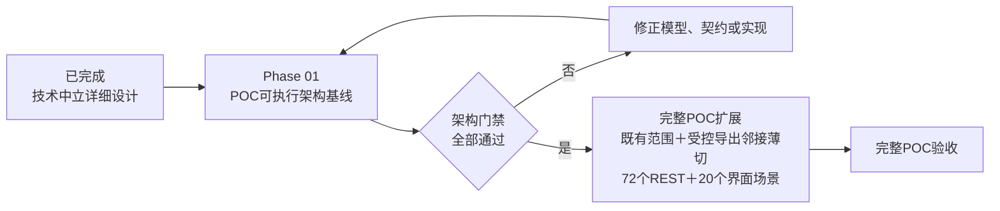
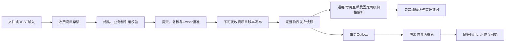

# Phase 01：POC可执行架构基线

状态：阶段目标、先后顺序、模块化单体应用形态、PostgreSQL 18.4事务数据库、数据库结构主权、TypeScript/Node.js 24/Fastify 5后端基线、pg/Kysely数据库访问策略、Asia/Shanghai无时区日期时间、显式流内排序权威、TypeBox到冻结OpenAPI的契约主权、React/Vite同源SPA、内置版本化工作流模块、Keycloak认证与平台本地授权边界、同进程Outbox派发边界、单一TypeScript验证与不可覆盖证据包、根目录单一npm工作区拓扑、governance-api深模块内部结构、领域版本与生命周期所有权、`price-list`与`price-resolution`分离、`release-distribution`统一发布登记与投递、领域内容投影与快照制品分工、领域拥有版本化投影Schema并进入单一TypeBox—OpenAPI契约链、消费者精确版本支持声明与不兼容投递隔离、Phase 01一发布一规范投影一权威快照、投影Schema升级高风险契约治理、投影载荷与完整快照制品双摘要、PostgreSQL `bytea`事务内权威快照存储，以及仅适用于合成POC的16 MiB单快照容量护栏均已确认；本阶段只实现并验证`SNAPSHOT_PULL`，`MANAGED_EXPORT_HANDOFF`明确延后为门禁、代表性容量实验和后续数值ADR通过后的完整POC邻接薄切，其瞬时技术故障有限完整重建式重试、确定性无压缩ZIP格式、独立PostgreSQL `bytea`短事务原子存储、完成制品保留/取代生命周期及容量先测后定/超限失败关闭方法均不提前进入本阶段；`RECORD_PUSH`继续只作长期预留；完整POC验收基线固定为72个REST和20个界面场景

容量环境补充状态：ADR-0110已确认本机WSL2 `Anolis-8.9-HDI-POC`的8 vCPU、4 GiB、无swap、10 GiB根磁盘、独占运行门禁及非生产证据边界；当前已完成OS、运行依赖和核心纵向切片验证，但仍不代表容量实验完成。

更新日期：2026-08-08

执行状态：核心纵向切片已通过架构门禁。不可变证据运行`b531c69f-7ffc-455a-988b-dd3fe257d453`位于`.runtime/evidence/live-20260808-09/`，验证了价表第5个显式发布版本、固定价格解析、两个隔离消费者对同一规范快照的拉取/摘要/回执/检查点闭环、审计链重算、三项数据库迁移以及治理Schema中零个`timestamp with time zone`列。

未完成边界：当前尚未完成全部草稿CRUD和批量导入、暂停/恢复、完整受控故障注入、16 MiB边界实测、真实浏览器端到端自动化，以及完整POC的72个REST和20个界面场景。`MANAGED_EXPORT_HANDOFF`、`RECORD_PUSH`和容量画像仍按已确认边界排除在Phase 01之外。

## 1. 阶段定位

本阶段位于技术中立详细设计与完整POC扩展之间。目标不是尽快堆叠全部功能，而是用一条真实可运行的纵向切片证明：项目已经确认的身份、版本、时间、权限、审批、发布、解析、审计和消费语义能够在同一工程基线中同时成立。

本阶段决策见[ADR-0068](../docs/adr/0068-establish-executable-architecture-baseline-before-full-poc.md)。

## 2. 阶段目标

本阶段必须产生以下可验证结果：

1. 从全新环境可以重复建立、启动和验证同一套POC工程。
2. 管理界面和REST API进入同一模块化单体治理应用，共用权限、规则、工作流和审计链。
3. 逻辑数据模型可以映射为受约束、可迁移、可回滚的物理结构。
4. 收费项目—价表—价格解析形成真实业务闭环，而不是静态演示数据。
5. 领域发布、审计、PostgreSQL `bytea`快照制品及元数据和Outbox满足已确认的原子边界。
6. 至少一个隔离仿真消费者使用长期目标契约完成接收、校验、幂等应用和回执。
7. 关键失败路径能够失败关闭并留下可解释证据。
8. 架构门禁可以自动重复执行，不依赖人工改库或口头判断。
9. `governance-api`按治理能力形成深模块，每个模块以一个小型接口隐藏规则、持久化和协议细节，跨模块原子操作由事务作用域统一协调。
10. 收费项目和价表分别由`charge-catalog`与`price-list`拥有其版本、状态机和生命周期，不建立独立通用版本模块或版本CRUD框架。
11. `price-list`通过小型接口提供双时点不可变已发布解析视图，独立`price-resolution`拥有固定两级选价、规则执行和不可变证据；两者同进程但不得直接查写对方表或复制解析算法。
12. `release-distribution`以一个深模块和逻辑接口统一发布包络、最终快照制品及元数据、Outbox、消费者订阅及独立投递证据；内部严格隔离事务内登记、提交后唤醒/轮询、短事务认领、事务外发送和新事务结果落库。
13. 领域模块从自身权威状态构造冻结、类型化且已完整物化的发布内容投影；`release-distribution`不回查领域表，统一完成通用包络、确定性规范序列化、投影载荷摘要、完整制品摘要、不可变存储和分发。
14. 每个代表性领域模块拥有稳定投影类型、字段语义、可执行TypeBox Schema和不可变Schema版本；组合根从模块公开接口装配唯一外部契约链，`release-distribution`只核验和携带契约身份。
15. 消费者订阅以不可变版本精确声明支持的投影类型及Schema版本；发布前逐订阅预检并留证，不兼容只阻断对应投递且不发生网络或水位推进，升级后通过受控重放恢复，禁止自动降级。
16. 每个领域发布在Phase 01只形成一个规范投影和一个权威快照；Schema升级形成新显式发布，历史制品不重打包，同时以发布事实与制品身份分离保留未来受控扩展接缝。
17. 投影Schema升级按高风险契约变更治理：领域Owner确认语义，平台契约Owner终审结构与证据，消费者无否决权；纯契约升级允许提交人兼任终审，但任何领域内容变化都恢复普通职责分离。
18. 每个权威快照分别冻结投影载荷摘要和完整快照制品摘要；领域版本或成员摘要独立证明领域等价，可变运维状态不进入双摘要，历史摘要不按当前算法或规则重算。
19. 每个唯一`CANONICAL`快照的最终字节原样保存于`release_snapshot`非空PostgreSQL `bytea`，与发布事实、元数据、审计和Outbox同事务；消费者只经平台受控下载API取得，本阶段不引入文件/S3或跨资源补偿。
20. 单个规范快照最终逻辑字节在Phase 01合成POC中不得超过16,777,216字节，超限失败关闭且不形成半发布；该护栏不得未经代表性容量验证外推为全院初始化、生产容量、性能SLA或招标上限。

## 3. 纵向切片

### 3.1 主链路

主链路必须使用真实持久化、真实服务调用和真实事务，不得用静态页面、内存Mock、手工SQL结果或预置成功回执替代。

### 3.2 必须进入切片的公共治理能力

- 稳定身份、不可变实体版本和不可变发布版本。
- 业务时间与记录时间双时态查询。
- 草稿增删改查、已发布不可修改删除和补偿发布入口。
- 文件及REST导入、批次内判重、原批次幂等重试和行级部分成功。
- 治理对象级授权、院区范围和普通领域内容变更的提交人与最终审批人分离；纯投影Schema契约升级按冻结模板执行限定例外。
- 普通审批、价表高风险审批和平台自动发布。
- 完整价表快照、通用/专用模式互斥和院区到全院固定两级解析。
- 紧急单人暂停未来解析以及只能通过新发布恢复的状态约束。
- 只追加审计、请求关联和完整性验证。
- 事务Outbox、不可变快照契约、消费者幂等、水位和回执。
- 固定按`Asia/Shanghai`解释、且不携带`Z`或偏移的院内本地日期时间。
- 版本、发布、审计、Outbox和处理尝试以显式流内序号决定规范顺序，日期时间不承担排序权威。
- 公开API只在Fastify TypeBox路由Schema中编辑，并单向生成、冻结OpenAPI 3.1供管理界面、仿真消费者和测试生成客户端。
- 管理界面以React/Vite客户端SPA构建并由Fastify同源提供；浏览器不承载治理主权，也不形成第二套服务端应用。
- 审批由模块化单体内的工作流领域模块执行；变更请求冻结不可变审批模板版本，不接入外部流程引擎、BPMN或任意脚本。
- Keycloak仅提供独立OIDC认证；Fastify使用服务端会话承接人员登录，仿真消费者使用各自服务凭据，治理对象、操作和院区授权始终由平台本地判定。
- Outbox派发器在同一Fastify/Node进程内运行；发布事务不做网络调用，提交后唤醒并以数据库轮询兜底，通过短事务租约认领、事务外至少一次投递和消费者独立状态完成闭环。
- 自动化验证以TypeScript测试资产和证据编排为唯一权威：Vitest承担通用测试，Playwright仅承担浏览器端到端，真实PostgreSQL、Keycloak和Toxiproxy由Testcontainers提供；每次正式运行生成新的不可覆盖SHA-256证据包，CI厂商不取得测试语义或放行主权。
- 当前根目录作为单一Git仓库，以Node.js 24.18.0自带npm 11.9.0管理一个锁文件和多个workspaces；应用、生成客户端、迁移、冻结契约、外部测试和验证工具明确分区，不引入其他包管理器、Turborepo或Nx。
- `governance-api`按治理能力纵向组织深模块，每个模块只有一个对外入口；组合根统一装配具体实现，跨模块协作只经接口并使用事务作用域应用上下文，不建立全局controller/service/repository横向层或通用业务基类。
- `charge-catalog`拥有收费项目身份、版本、演进和生命周期，`price-list`拥有价表身份、完整发布版本、价格条目和生命周期；通用发布包络、工作流和审计只记录或协调，不取得领域版本写入主权。
- `price-resolution`只经`price-list`接口消费冻结发布版本、条目及引用摘要构成的不可变视图，并独占院区到全院固定两级选择、通用/专用判定、规则执行、舍入和解析证据。
- 发布登记、最终快照制品及元数据、Outbox事件、消费者订阅、投递、尝试和平台侧回执统一归`release-distribution`，不拆成`publication`、`delivery`或独立`outbox`模块；统一模块不改变既有事务隔离。
- 领域发布事务把经领域校验的冻结类型化内容投影传给`release-distribution`；前者不写快照存储，后者不查领域表或解释领域字段，并对相同输入产生逐字节一致的载荷、快照制品及双摘要。
- 代表性领域模块只经自己的`index.ts`提供稳定`projection_type`、不可变Schema版本及可执行TypeBox Schema；组合根确定性装配进Fastify公开路由和冻结OpenAPI 3.1，快照与事件冻结并携带类型、版本、Schema摘要及算法。
- `release-distribution`在发布提交前以冻结订阅版本执行精确兼容预检；不兼容结果仍允许领域发布提交，但只为对应消费者建立`BLOCKED_INCOMPATIBLE`投递和影响事项。兼容消费者继续，升级后的消费者只能通过新订阅版本和受控重放原快照恢复。
- 一次领域发布只登记一个`CANONICAL`投影快照，发布身份与快照制品身份相互独立。契约Schema升级即使复用未变化的领域内容也形成新发布、新快照和新双摘要；原发布字节、算法、序列化规则和双摘要保持不变。
- Schema升级请求冻结领域语义确认、平台契约终审、TypeBox/OpenAPI差异、精确支持兼容矩阵、仿真消费和影响分析；消费者Owner只声明支持与迁移准备，不参与批准或否决。
- `release-distribution`分别计算只覆盖规范投影载荷字节的`projection_payload_digest`与覆盖最终冻结包络加载荷完整字节的`snapshot_artifact_digest`，两者初始使用SHA-256并冻结算法及序列化规则；完整制品摘要外置，可变存储、投递、回执和运维状态不进入任一摘要。
- `release-distribution`把最终制品字节原样写入同一发布事务的PostgreSQL `bytea`；事件只携带稳定快照ID，仿真消费者经冻结OpenAPI中的受控下载能力取得并校验字节。仓库不建立文件/S3快照实现、暂存提升、补偿状态机或未使用存储port。

### 3.3 最小领域对象

本阶段只实现支撑纵向切片所需的对象：

| 对象 | 基线所需能力 |
|---|---|
| 安全主体、治理对象与权限范围 | 外部身份显式绑定、本地安全主体、对象级授权、Owner、院区范围、审批模板 |
| 收费项目及版本 | 草稿、版本、双时态、发布、失效或替代入口 |
| 价表及发布版本 | 完整快照、计划生效、差异、补偿入口 |
| 价格条目 | 固定价、通用或专用模式、全院或院区范围 |
| 价格解析证据 | 由`price-resolution`拥有；冻结输入摘要、双时点、已发布视图、候选及引用摘要、有序检查步骤、结果和解释码 |
| 变更请求与审批 | 冻结变更分类、风险、模板、职责分离策略和证据；普通内容提交—终审分离，纯Schema契约升级允许限定例外；领域语义与平台契约确认分别授权和审计 |
| 紧急暂停与影响事项 | 立即阻断未来解析、事后复核入口 |
| 审计事件 | 只追加、请求关联和哈希验证 |
| 发布分发状态 | 领域模块构造冻结类型化内容投影并拥有其稳定类型、不可变TypeBox Schema版本、语义及领域内容等价证据；`release-distribution`核验并携带投影契约身份，分别保存发布事实与快照制品身份，Phase 01每个发布只有一个`CANONICAL`快照，并拥有规范序列化、投影载荷摘要、完整制品摘要、PostgreSQL `bytea`字节、受控下载、Outbox、版本化订阅及精确支持集合、逐发布兼容预检、`BLOCKED_INCOMPATIBLE`投递、尝试及平台侧检查点/回执；事务内登记与提交后投递隔离 |
| 仿真消费者状态 | 独立于治理应用保存幂等应用、水位和处理结果，并通过正式接口提交回执 |

计价规则、收费组套、政策、医保、医嘱、执行服务和完整外部代码模型在本阶段只保留已确认的模块边界；除非纵向切片的确定性输入确有需要，不提前铺开其完整薄切实现。

## 4. 明确不在本阶段

- 全部24个收费项目、3个完整价表快照及所有邻接对象数量的最终数据装载。
- A01至G12共72个强制REST场景和U01至U20共20个管理界面场景的正式完整验收。
- `MANAGED_EXPORT_HANDOFF`的消费者交付配置编辑、转换、派生制品和交接闭环，以及`RECORD_PUSH`的任何实现或adapter。
- 真实HIS、财务、体检、医保或其他消费系统。
- 同一发布的多投影版本、消费者专用快照、载荷转换器、变体路由器及生产投影协商机制；只保留发布事实与制品身份分离的结构接缝。
- 真实患者、医嘱、执行、账单、结算或待遇事实。
- 生产消息集群、CDC、分布式缓存、搜索集群、Kubernetes、高可用和灾备。
- 生产容量、P95/P99、RTO/RPO、影子计费和真实对账。
- 招标技术参数、生产上线或评级达标结论。

本阶段可以保留长期接口和替换边界，但不得用“未来会建设”替代当前门禁所需的可运行证据。

## 5. 工程交付物

| 交付物 | 最低要求 |
|---|---|
| 工程仓库骨架 | 当前根目录单一Git仓库；根`package.json`以npm 11.9.0管理`apps/*`、`packages/*`、`tests/*`和`tooling/*` workspaces，全仓库只有一个`package-lock.json`；严格模式TypeScript、Node.js 24.18.0和Fastify 5可重复安装、构建、启动、测试，不引入pnpm、Yarn、Bun、Turborepo或Nx |
| 工作区边界 | `apps/governance-api`、`apps/admin-web`、`apps/sim-consumer`、`packages/generated-api-client`、`db/migrations`、`contracts/openapi`、`tests/api`、`tests/e2e`、`tests/fault`和`tooling/verification`责任及依赖方向可自动核验；不存在可供消费者绕过契约的共享领域包 |
| governance-api模块结构 | `apps/governance-api/src/modules/<capability>`按治理能力组织深模块，每个模块只经一个`index.ts`公开小型接口；组合根是唯一具体依赖装配位置，事务运行器向跨模块命令提供绑定同一连接和事务的模块集合，原始`pg`/Kysely事务不进入模块接口；`charge-catalog`和`price-list`分别拥有自己的版本与生命周期，`price-resolution`只经不可变已发布视图单向依赖`price-list`并拥有解析算法及证据；领域模块构造冻结类型化内容投影、拥有Schema和领域等价证据并完成领域语义确认，工作流冻结平台契约终审及四类证据，组合根登记并装配契约；`release-distribution`统一发布登记、契约身份核验、批准引用核验、版本化订阅、精确支持声明、发布前兼容预检、`BLOCKED_INCOMPATIBLE`状态、受控重放、快照制品生成、双摘要、PostgreSQL `bytea`同事务存储、受控下载和提交后投递所有权；禁止横向技术层、独立通用版本/中央投影Schema/契约治理/兼容转换/摘要/快照存储模块、拆分`publication`/`delivery`/`outbox`/`snapshot-builder`模块、文件/S3快照实现或未使用存储port、跨模块查写表、数据库或REST类型泄漏、深层导入、循环依赖、算法复制、平行手写契约、消费者否决、自动降级、通用业务基类及为内存仓储制造的repository port |
| 技术决策ADR | 应用形态、数据库、后端、前端、工作流、身份和测试策略按需逐项记录 |
| 数据库迁移 | 以有序、版本化的原生SQL迁移为唯一Schema权威，从PostgreSQL 18.4空库安装`pgcrypto`、`btree_gist`并建立基线结构；约束、索引、种子数据、漂移检测和回退策略可验证 |
| 数据库访问与派生类型 | `pg`底层驱动、Kysely查询与显式事务、`kysely-codegen`从迁移后数据库生成并验证类型；禁用Schema Builder、Migrator、自动DDL和有损金额转换 |
| OpenAPI 3.1契约 | 各领域模块拥有的投影TypeBox Schema只经模块`index.ts`进入组合根，与其他Fastify公开路由Schema共同构成唯一可编辑定义链；覆盖写入、查询、工作流、发布、解析、暂停、快照元数据与按稳定ID授权下载、变化、版本化订阅支持声明、兼容预检结果、投递阻断、受控重放、回执和审计，并单向生成带投影类型、不可变Schema版本、Schema摘要、媒体类型、字节数、投影载荷摘要及完整制品摘要且不泄露数据库位置的冻结OpenAPI 3.1 JSON |
| 管理界面最小路径 | React 19、Vite 8、React Router 7 Data Mode和TanStack Query 5完成纵向切片所需操作；生产静态资源由Fastify同源提供，不建设完整产品导航或第二套服务端前端 |
| 工作流领域模块 | 版本化审批模板、固定阶段、变更分类、前置确认、领域语义确认、平台契约确认、职责分离策略、强制证据和平台自动发布；纯Schema升级例外必须由冻结策略驱动，使用本地事务，不引入外部流程引擎、BPMN或任意脚本 |
| 身份与授权边界 | Keycloak 26.7.0独立认证及镜像摘要、Fastify服务端OIDC会话、独立服务客户端、本地安全主体和外部身份绑定、对象/操作/院区/有效期授权；Keycloak角色不得成为业务权限来源 |
| 后台任务 | 计划生效及影响事项所需最小能力；`release-distribution`内部派发器在同一Fastify/Node进程内使用提交后唤醒、数据库周期轮询、短事务租约认领和事务外网络投递，不建立独立Worker或第二模块接口 |
| 仿真消费者 | 独立服务身份和状态，使用正式快照与变化契约 |
| 合成fixture | 覆盖所有架构门禁，不使用真实业务数据 |
| 自动化门禁 | TypeScript测试资产；Vitest 4.1.6覆盖单元、模块、Fastify `inject()`、真实数据库集成和生成客户端REST场景，Playwright Test 1.61.0只覆盖浏览器端到端；Redocly与oasdiff执行契约门禁 |
| 真实测试依赖与故障注入 | Testcontainers启动PostgreSQL 18.4、Keycloak 26.7.0和Toxiproxy；枚举化测试故障点验证事务及崩溃窗口，代理和容器生命周期验证网络及依赖故障，生产配置不能启用测试故障点 |
| 证据包 | 每次正式验证使用新的运行身份；汇总环境、迁移、契约、请求、测试、故障、审计、解析、事件和回执，生成规范化清单及逐项SHA-256，终态后不可覆盖或补写 |

## 6. 架构门禁

所有门禁均为强制项；不存在总体通过率。

| ID | 门禁 | 通过条件 |
|---|---|---|
| ABG-01 | 全新环境可重复建立 | 从空环境按受控命令完成安装、PostgreSQL 18.4及`pgcrypto`/`btree_gist`版本核验、迁移、种子、启动和测试，不依赖人工改库 |
| ABG-02 | UI与API同规则 | 相同主体和输入从两个渠道得到相同权限、校验、状态变化和审计结果 |
| ABG-03 | 物理约束承载核心不变量 | PostgreSQL唯一约束、外键、`CHECK`及基于`btree_gist`和范围类型的排他约束承载身份、排他目标、时间重叠及固定/规则价不变量，不能只靠界面约定 |
| ABG-04 | 发布不可变 | 已发布实体版本、价表快照和价格条目无法通过业务服务或业务数据库账号更新删除 |
| ABG-05 | 双时态可复现 | 当前、指定业务时点、指定记录时点和追溯更正前后结果均可查询 |
| ABG-06 | 导入与幂等成立 | 批次内同键判重、冲突阻断、原批次跳过成功行、新批次形成版本候选 |
| ABG-07 | 对象授权与职责分离 | 未授权对象不可维护；普通领域内容变更的提交人不能终审自己提交的变更。纯投影Schema升级的限定例外只按ABG-37执行，不得扩展到其他流程 |
| ABG-08 | 完整发布与价格互斥 | 价表作为完整快照发布；同范围同时段通用与专用混用被阻断 |
| ABG-09 | 价格解析确定 | 院区到全院固定两级、场景模式、服务发生时间和失败关闭路径均有证据 |
| ABG-10 | 紧急暂停不可原地恢复 | 单一专权人员可以立即暂停未来解析，只能由审批后的新发布恢复 |
| ABG-11 | 审计只追加且可核验 | 关键动作全部关联到主体、角色、对象、请求和内容摘要；模拟篡改可被检测 |
| ABG-12 | 发布事务原子 | 发布、PostgreSQL `bytea`快照字节及元数据、审计和Outbox全部提交或全部失败 |
| ABG-13 | 仿真消费可恢复 | 重复投递不重复应用，失败可重试，水位和回执只追加，缺口不会被静默跳过 |
| ABG-14 | 时间契约统一 | 数据库、API、导入、调度、仿真消费和界面日期时间均不携带时区或偏移并固定按`Asia/Shanghai`解释；改变运行主机时区不改变结果 |
| ABG-15 | 证据可以重放 | 使用固定fixture和版本标识可以重复得到相同成功、失败和摘要结果 |
| ABG-16 | 模块与消费者边界成立 | 模块边界测试阻止未授权跨模块内部依赖；仿真消费者以独立身份和状态运行，只使用正式契约且无治理数据库访问权限 |
| ABG-17 | 数据库结构主权无旁路 | 空库只能由已登记的原生SQL迁移建立；应用和ORM禁用自动DDL；已纳入证据基线的迁移文件及摘要不变，Schema漂移检测结果为零 |
| ABG-18 | 后端技术基线可重复 | Node.js精确版本为24.18.0，TypeScript严格检查通过，Fastify 5及全部运行依赖具有锁文件中的确切版本；全新环境不得通过浮动安装得到不同依赖图 |
| ABG-19 | 数据库访问边界无旁路 | Kysely Schema Builder和Migrator不可进入运行依赖或应用路径；数据库派生类型校验无漂移，事务使用同一连接上下文，参数化查询检查通过，金额及`int8`不存在有损`number`转换 |
| ABG-20 | 无时区日期时间无旁路 | 治理Schema只使用`timestamp without time zone`和`tsrange`承载日期时间及范围，不出现`timestamptz`、`timestamp with time zone`或`tstzrange`；API契约使用专用本地日期时间字符串并拒绝`Z`或偏移，驱动不得转换为JavaScript `Date` |
| ABG-21 | 流内排序权威成立 | 并发写入相同本地日期时间仍由唯一单调流内序号确定顺序；序号不复用且允许空洞，审计哈希链纳入序号，跨流查询不得按时间戳伪造全局总序 |
| ABG-22 | API契约权威无分叉 | 所有公开路由的参数、查询、请求头、请求体以及成功和错误响应均由TypeBox Schema定义并生成有效OpenAPI 3.1 JSON；重生成结果与冻结产物及摘要一致，管理界面、仿真消费者和契约测试只使用该产物生成客户端且不能导入后端内部类型，仓库不存在平行手写OpenAPI或DTO；本地日期时间不使用RFC 3339 `date-time` |
| ABG-23 | 管理界面边界无旁路 | React/Vite生产构建作为静态资源由Fastify同源提供，部署中不存在Next.js、SSR、RSC、Server Actions或第二套BFF；API调用只经过由冻结OpenAPI生成的`openapi-typescript`类型和`openapi-fetch`客户端，浏览器不能执行权威权限、流程、发布、解析或审计判断，治理写操作只在服务端确认后呈现成功 |
| ABG-24 | 工作流定义与实例可复现 | 每个变更请求冻结变更分类、已发布审批模板版本、风险结果、职责分离策略、必需阶段、内容摘要和强制证据；模板新版不迁移进行中请求，未知阶段、任意脚本、跳级、倒序、超时自动批准及外部引擎旁路均被阻断；每次转换、动作记录和审计原子提交，最终批准后的发布仍满足ABG-12 |
| ABG-25 | 认证与本地授权边界无旁路 | Keycloak 26.7.0及镜像摘要可核验；人员经Fastify的Authorization Code与PKCE S256进入服务端不透明会话，浏览器包、存储和URL中不存在访问或刷新令牌；每个仿真消费者以独立Client Credentials取得服务身份。平台仅从已验证发行者及主体或客户端标识解析本地安全主体，忽略Keycloak业务角色并逐请求校验对象、操作、院区和有效期；名称推断、未绑定主体、服务身份审批、普通内容变更由同一人员经另一外部账号自审批、伪造Cookie或CSRF请求均失败关闭。纯Schema升级同人多动作仍按同一本地人员主体、分别权限和审计处理。OIDC/JWT `NumericDate`只在认证适配器内校验，治理Schema和公开业务契约仍满足ABG-20 |
| ABG-26 | Outbox派发可恢复且消费者隔离 | 发布事务内不存在任何消费者网络调用，只原子登记不可变事件；同进程派发模块在提交后唤醒，并在唤醒丢失或进程重启后由数据库轮询恢复。待投递记录以短事务租约和`FOR UPDATE SKIP LOCKED`认领，网络调用期间不持有数据库锁；进程在消费者成功后、结果落库前崩溃会产生可幂等的重复投递。每个消费者具有独立投递状态、尝试序号、重试和顺序阻断，一个消费者失败不影响另一个消费者；重试耗尽保留事件并生成影响事项。仓库和运行环境不存在独立Worker部署、数据库触发器、`LISTEN/NOTIFY`、CDC或外部消息中间件旁路 |
| ABG-27 | 验证与证据权威无分叉 | Vitest 4.1.6作为唯一通用TypeScript测试运行器，Playwright Test 1.61.0只负责浏览器端到端；Fastify模块测试使用`inject()`，REST场景只使用冻结OpenAPI生成客户端。Testcontainers从空环境启动真实PostgreSQL 18.4、Keycloak 26.7.0和Toxiproxy；枚举化测试故障点在生产不可启用，网络及容器故障可重复。Redocly和oasdiff均通过；每次正式运行生成新的运行身份、机器可读结果、规范化清单和逐项SHA-256，终态证据不可覆盖。仓库不存在SQLite/内存替代、伪造IAM、Postman/Newman、Cucumber、第二套通用测试运行器、外部混沌平台或CI厂商专有放行旁路 |
| ABG-28 | 单仓库工作区边界无旁路 | 当前根目录是唯一Git仓库；根`package.json`固定Node.js 24.18.0及`npm@11.9.0`，只有一个根`package-lock.json`且`npm ci`可从空环境重复安装。应用、生成客户端、Schema迁移、冻结契约、API/E2E/故障测试和验证工具位于已确认分区，自动化依赖图证明管理界面、仿真消费者和外部测试不导入治理后端内部类型或领域实现；一套`apps/sim-consumer`以两个独立身份和状态运行。仓库不存在嵌套Git、pnpm/Yarn/Bun锁文件、Turborepo/Nx、工作区局部锁文件、共享领域包或CI专有任务旁路 |
| ABG-29 | governance-api深模块边界成立 | 每个治理能力模块只有一个公开入口和小型接口，HTTP adapter、状态机、SQL映射、数据库类型和内部实现均不外泄；组合根是唯一具体装配位置且不存在服务定位器。自动化依赖与SQL所有权检查阻断跨模块内部导入、循环依赖和直接查写他模块表；事务运行器把模块集合绑定到同一连接及事务，原始`pg`/Kysely事务不进入外部接口，任一模块失败全量回滚且提交后动作只在成功提交后发生。仓库不存在根级controllers/services/repositories/models横向层、`BaseService`/`BaseRepository`/`BaseController`、承载业务规则的common/shared层、通用CRUD继承、为模拟仓储制造的port或通用命令总线旁路；模块接口测试使用真实PostgreSQL验证持久化行为 |
| ABG-30 | 领域版本和生命周期主权无旁路 | 收费项目身份、版本、演进关系及生命周期只能由`charge-catalog`接口改变；价表身份、完整发布版本、价格条目及生命周期只能由`price-list`接口改变。工作流最终批准只形成审批决定，`release-distribution`只处理`governance_release`包络、快照制品和Outbox，审计只追加证据；三者均不能直接创建、更新或删除领域版本。表所有权、SQL写入路径和依赖扫描证明仓库不存在独立`version`模块、`VersionService`、`BaseVersion`、`VersionedRepository`、通用版本CRUD表或配置化通用生命周期状态机；发布失败时领域变化、发布包络、审计和Outbox全部回滚 |
| ABG-31 | 价表与解析模块边界无旁路 | `price-list`按价表身份、服务发生时间和记录时点提供唯一权威、不可变的已发布解析视图，并冻结发布、条目、目标及规则引用和摘要；`price-resolution`独占院区到全院固定两级选择、通用/专用判定、冲突失败关闭、规则执行、Decimal舍入及三类解析证据表。依赖图和SQL扫描证明只存在`price-resolution -> price-list`公开接口调用，不读取草稿或对方表、不回写价表、不由`price-list`或路由复制解析算法；同一冻结视图重复解析一致，后续发布不改变历史证据 |
| ABG-32 | 发布登记与投递模块边界无旁路 | `release-distribution`是发布包络、成员、最终快照制品及元数据、Outbox、消费者订阅、投递、尝试及平台侧检查点/回执的唯一拥有模块和逻辑接口；仓库不存在独立`publication`、`delivery`或`outbox`模块及跨模块直接SQL。故障注入证明领域发布事务只登记分发事实且全量回滚，提交后唤醒可丢失而轮询恢复，认领使用短事务，网络位于事务外，结果和回执以新事务留证；内部派发器不外露，平台检查点不代替消费者内部水位 |
| ABG-33 | 发布内容投影与快照制品seam无旁路 | 代表性领域模块只从自身权威状态构造经语义校验、冻结、类型化且完整物化的内容投影；投影不含数据库行、SQL、Kysely/`pg`类型、repository、事务句柄、延迟加载器或REST DTO。`release-distribution`不查询领域表或解释领域字段，独占通用包络、确定性规范序列化、最终快照字节、投影载荷摘要、快照制品摘要和不可变存储；领域模块不能写快照或Outbox存储。相同投影、包络输入和序列化规则重复生成逐字节相同的载荷、快照及其对应摘要，任一环节故障都不形成半发布；历史快照字节、双摘要、算法和序列化配置不得重算或改写 |
| ABG-34 | 投影Schema主权与单一契约链无旁路 | 每个代表性领域模块拥有稳定`projection_type`、字段语义、可执行TypeBox Schema和不可变`projection_schema_version`，只经唯一`index.ts`提供给组合根；快照、事件和查询冻结类型、版本、Schema摘要及算法，未知身份或同类型同版本摘要冲突失败关闭。组合根确定性装配这些Schema进入Fastify公开路由并生成冻结OpenAPI 3.1；仍被快照引用的Schema版本及对应冻结契约可追溯。仓库不存在中央`projection-schema`/`shared-schemas`模块、平行手写OpenAPI/JSON Schema/DTO、消费者私有契约、Schema原位改义删除，或由`release-distribution`执行选版、迁移、升降级和按版本标签猜测兼容性 |
| ABG-35 | 消费者精确兼容声明与隔离阻断无旁路 | 两个仿真消费者分别以不可变订阅版本声明精确`projection_type + projection_schema_version`支持集合并解析到登记Schema摘要；仓库和运行配置不存在`latest`、通配符、版本范围、SemVer推断或消费者探测。发布前对冻结活动订阅版本完成本地预检并随发布留证：一个订阅`UNSUPPORTED`时领域发布仍成功，该投递进入`BLOCKED_INCOMPATIBLE`、生成影响事项且无租约、网络尝试、检查点或消费者水位推进，另一兼容消费者继续。发布新订阅支持版本后，受控重放原事件及原快照恢复投递，原预检、影响事项、快照和摘要不变；`release-distribution`不存在自动降级、转换、迁移或替代Schema选择 |
| ABG-36 | 一发布一规范投影快照及历史不可重打包 | 每个代表性`governance_release`恰有一个`CANONICAL`快照，发布ID与快照ID不同且稳定，两个消费者共同引用该制品；为同一发布登记第二快照、另一Schema版本或消费者专用变体必须失败关闭。以未变化领域内容执行Schema契约升级时，必须形成新的发布序号、契约身份、快照和摘要并重新完成预检，原发布、字节、摘要和事件引用逐项不变。仓库不存在多投影变体表、投影注册器、转换器、变体路由器、消费者选择器或未使用的多投影port；未来扩展只保留发布事实与制品身份分离的结构接缝 |
| ABG-37 | Schema升级高风险契约治理与限定例外 | Schema升级请求冻结旧/新契约身份、相同领域内容及成员证据、TypeBox/OpenAPI差异、基于精确支持声明的兼容矩阵、冻结客户端仿真消费和影响分析；领域Owner完成语义确认，平台契约Owner完成结构与证据终审。同一已授权人员可以分别提交和终审纯契约升级，各动作独立授权、编号和审计；一旦领域内容、成员、规则或生命周期变化，同人终审必须以`SCHEMA_UPGRADE_SCOPE_MISMATCH`或`DUTY_SEPARATION_VIOLATION`失败。消费者Owner无审批或否决动作，`UNSUPPORTED`只阻断自身投递；仓库不存在独立契约治理模块、消费者否决接口或发布时消费者探测 |
| ABG-38 | 快照双摘要作用域与历史不可重算 | `release-distribution`为每个快照以冻结算法和序列化规则生成只覆盖规范投影载荷的`projection_payload_digest`及覆盖最终落盘冻结包络加载荷完整字节的`snapshot_artifact_digest`，两者初始均为SHA-256；完整制品摘要不自嵌入。事件、查询和清单明确携带双摘要及算法；存储位置、投递、尝试、回执、审计及可变运维状态改变不影响摘要。跨Schema领域等价只由领域版本/成员摘要证明，历史双摘要不得重算、覆盖或补写；仓库不存在含义模糊的快照`content_hash`或独立摘要模块/服务 |
| ABG-39 | PostgreSQL快照字节同事务且下载无物理旁路 | 每个代表性发布的唯一`CANONICAL`制品精确字节保存在`release_snapshot`非空`bytea`，其逻辑字节数和`snapshot_artifact_digest`逐字节核验一致；字节、元数据、发布、成员、兼容预检、独立投递登记、审计和Outbox任一写入故障均全量回滚。提交后两个仿真消费者只凭稳定快照ID经冻结OpenAPI下载相同字节，事件及响应不暴露数据库表、列、连接或物理位置。仓库和运行环境不存在文件/S3快照、双写、暂存提升、跨资源补偿、独立快照存储模块或未使用存储port |
| ABG-40 | 16 MiB合成POC容量护栏且禁止外推 | 对最终规范制品逻辑字节计量，恰好16,777,216字节可以发布，16,777,217字节返回`SNAPSHOT_ARTIFACT_TOO_LARGE`且发布事务不形成任何已发布结果、投递或水位推进。TOAST和HTTP内容编码不改变计量，不存在拆分、截断、裁剪、改换序列化、压缩规避、替代快照或外部存储回退；文档、配置和验收明确该数值只适用于合成POC，不作为全院初始化、生产容量、性能SLA或招标上限，未来结论必须引用代表性容量验证和新ADR |

## 7. 门禁证据

每次正式基线验证至少生成：

- 应用版本、Node.js、Fastify、React、Vite、React Router、TanStack Query、`openapi-typescript`、`openapi-fetch`、Vitest、Playwright、浏览器、Testcontainers、Redocly和oasdiff精确版本，依赖锁文件摘要、迁移版本、数据库派生类型摘要及过期校验、冻结OpenAPI契约版本与摘要和规则集版本。
- 环境构建及空库迁移日志、迁移清单与摘要、Schema指纹、时间类型清单和漂移检测结果。
- 架构门禁逐项结果与请求关联ID。
- 收费项目和价表版本历史、投影载荷摘要、完整快照制品摘要及差异。
- 通用/专用冲突和院区回退解析证据。
- 审批、紧急暂停、补偿入口和职责分离审计。
- 发布事务与故障注入结果。
- Outbox事件、仿真消费者水位、重试和回执。
- 审计完整性校验结果。
- 相同本地日期时间和并发写入fixture下的流内序号、缺口、哈希链、Outbox水位和跨流无总序验证结果。
- TypeBox路由Schema清单、OpenAPI 3.1重生成及规范校验结果、冻结产物差异、破坏性变更检查，以及管理界面和仿真消费者客户端来源证明。
- React/Vite构建清单、Fastify同源静态资源验证、部署进程及监听端口清单、浏览器包依赖检查，以及服务端拒绝被篡改浏览器状态和伪造成功结果的端到端证据。
- 审批模板稳定身份及版本清单、阶段定义摘要、变更请求冻结证据、模板升级前后的并行实例、非法转换与超时测试，以及流程动作、审计和发布事务故障注入结果。
- Keycloak版本及镜像摘要、OIDC发现与密钥证据、PKCE/状态/nonce及会话Cookie安全属性、浏览器无令牌扫描、人员和服务外部身份绑定、对象级授权决策、跨账号职责分离、服务身份隔离、CSRF阻断及`NumericDate`协议边界测试。
- Outbox提交后唤醒与丢失唤醒兜底日志、空闲及积压轮询、租约认领与过期回收、网络调用期间无数据库锁、进程崩溃窗口重复投递、两个消费者独立状态与顺序阻断、重试耗尽影响事项，以及无独立Worker/触发器/`LISTEN/NOTIFY`/CDC/消息中间件的运行证据。
- PostgreSQL、Keycloak和Toxiproxy镜像摘要，Vitest及Playwright机器可读结果、V8覆盖率、浏览器失败trace、Redocly规范检查、oasdiff破坏性变更检查、枚举化故障点及网络/容器故障恢复结果。
- 正式验证运行身份和流内序号、fixture版本与种子、规范化证据清单、每项SHA-256及证据包身份；重新运行必须形成新身份，旧终态证据不得覆盖或补写。
- Git根、仓库树、根`package.json`、npm及Node精确版本、唯一锁文件摘要、workspace清单、包依赖图和禁止导入扫描；两个仿真消费者实例的相同构建摘要、独立配置、身份及状态证据，以及仓库不存在嵌套Git、额外锁文件、Turborepo或Nx的扫描结果。
- governance-api模块清单、唯一公开入口及导出清单、模块依赖图和循环检查、禁止深层导入及横向层扫描、表与迁移的逻辑拥有模块清单、跨模块SQL访问检查、组合根装配清单，以及事务运行器同连接、全回滚和提交后动作隔离测试。
- `charge-catalog`与`price-list`版本及生命周期表所有权、所有写入调用路径、工作流批准到领域发布的事务证据，以及独立通用版本模块、通用版本基类和配置化生命周期框架扫描结果。
- `price-list`已发布解析视图契约及摘要、`price-resolution`三类证据表所有权、单向模块依赖、草稿和跨模块SQL禁止扫描、算法唯一实现检查，以及冻结视图重放和后续发布不改写历史证据的结果。
- `release-distribution`唯一入口和表所有权、禁止`publication`/`delivery`/独立`outbox`模块扫描、发布登记原子回滚、提交后唤醒隔离、轮询恢复、短租约、网络事务外、只追加尝试、消费者隔离及平台/消费者水位分离证据。
- 代表性领域内容投影的冻结输入和校验结果、禁止数据库/REST类型泄漏扫描、`release-distribution`无领域表查询及快照存储独占证明、相同输入的载荷/快照逐字节和双摘要重复性，以及投影/序列化/存储故障全回滚证据。
- 代表性领域投影Schema清单、`projection_type`/版本/Schema摘要及算法、模块唯一入口导出、组合根登记与Fastify TypeBox装配结果、冻结OpenAPI收录和重生成摘要、历史被引用Schema可追溯性，以及中央Schema模块、平行OpenAPI/JSON Schema/DTO和隐式迁移扫描结果。
- 两个消费者的订阅稳定身份、不可变版本、精确支持集合及Schema摘要解析结果；发布前逐订阅兼容预检输入、规则版本与结果；`BLOCKED_INCOMPATIBLE`投递、影响事项、无租约/尝试/水位变化及其他消费者继续的证据；升级后新订阅版本和受控重放只追加证据，以及自动降级/转换/迁移扫描结果。
- 每个发布的独立发布ID、唯一`CANONICAL`快照ID、投影契约身份、领域成员摘要、投影载荷摘要、完整制品摘要及各自算法；第二快照或消费者变体登记失败结果；复用相同领域内容的契约升级新发布证据；旧快照逐字节、算法、序列化规则和双摘要不变证明，以及多投影表、注册器、转换器、路由器、选择器和未使用扩展port扫描结果。
- 固定字节向量、单字节篡改、包络变化和运维状态变化测试，证明双摘要各自作用域、完整制品摘要不自嵌入、跨Schema领域等价证据独立及历史不可重算；含义模糊的快照`content_hash`与独立摘要模块/服务扫描结果为零。
- `release_snapshot`非空`bytea`、媒体类型、精确字节数和完整制品摘要一致性；在字节、元数据、发布、成员、预检、独立投递、审计与Outbox各写入点注入故障的全回滚结果；提交后两个消费者经平台API下载相同字节，以及数据库位置、文件/S3实现、暂存提升、补偿状态机、独立快照存储模块和未使用存储port扫描结果为零。
- 最终规范制品16,777,216字节成功与16,777,217字节失败的边界向量，超限全回滚、无投递和水位推进证据，以及无拆分、截断、裁剪、序列化变更、压缩规避、替代制品或外部存储回退的扫描结果；文档和配置必须证明16 MiB只标记为合成POC护栏，未成为全院或生产默认值。
- 投影Schema升级请求的变更分类、旧/新契约身份、领域内容及成员摘要、领域Owner语义确认、平台契约Owner终审、TypeBox/OpenAPI差异、精确支持兼容矩阵、冻结客户端仿真消费和影响分析；同人提交/终审的分别授权及审计、领域内容变化后例外失败、消费者无审批动作及独立契约治理模块/发布时探测扫描结果。

证据必须通过公开服务、只读验证接口或受控测试探针获得；人工数据库查询只能作为诊断材料，不能代替门禁证据。

## 8. 退出条件

只有同时满足以下条件，本阶段才结束并允许进入完整POC扩展：

1. ABG-01至ABG-40全部通过。
2. 纵向切片从输入到仿真消费可以在全新环境重复运行。
3. 没有通过绕过平台服务、放松不变量或手工修数解决的场景。
4. 逻辑模型与物理实现之间的偏差均有明确决策记录。
5. OpenAPI、迁移、实现、自动化测试和证据使用一致版本。
6. 未解决缺陷中不存在身份、时间、权限、发布、价格唯一性、审计或消费正确性问题。
7. 基线结论明确声明不等于完整POC验收或生产就绪。

## 9. 与完整POC验收的关系

[价表POC验收方案](../docs/design/price-list-poc-acceptance.md)保留A01至F08共60个既有REST场景和U01至U16共16个既有界面场景，并为`MANAGED_EXPORT_HANDOFF`新增G01至G12和U17至U20，使完整POC基线固定为72/20。架构门禁可以复用fixture、测试代码和证据结构，但Phase 01只执行代表性子集，其通过不能替代完整POC 72/20正式验收。

完整POC扩展必须继续在本阶段验证通过的工程基线上增量建设。若后续需要更换会改变事务边界、身份模型、版本语义、数据库结构主权或消费契约的基础技术，必须先重新确认核心架构并形成新的或取代性ADR，再重新执行受影响的架构门禁，而不是建立第二套实现。

[ADR-0095](../docs/adr/0095-support-three-delivery-modes-with-one-consumption-closure.md)至[ADR-0099](../docs/adr/0099-fail-the-entire-managed-export-job-on-any-record-conversion-error.md)确认了三种交付模式的共同真相、消费者交付配置、默认转换边界、派生制品及整作业失败语义；[ADR-0100](../docs/adr/0100-stage-managed-export-after-phase-01-and-reserve-record-push.md)冻结其阶段归属；[ADR-0101](../docs/adr/0101-expand-managed-export-acceptance-baseline-to-72-rest-and-20-ui-scenarios.md)冻结完整POC的72/20验收基线；[ADR-0102](../docs/adr/0102-retry-transient-managed-export-failures-within-the-same-frozen-job.md)确认确定性错误必须新建作业，而明确瞬时技术故障只在同一冻结作业内有限重试且每次完整重建；[ADR-0103](../docs/adr/0103-use-deterministic-uncompressed-zip-for-managed-export-artifacts.md)把派生制品冻结为只含`manifest.json`和`records.csv`的确定性无压缩ZIP，并分离清单内CSV摘要与制品外完整ZIP摘要；[ADR-0104](../docs/adr/0104-store-managed-export-artifacts-in-postgresql-for-complete-poc.md)确认完整POC在事务外完整生成ZIP及摘要后，由`release-distribution`以独立PostgreSQL `bytea`和短事务原子固化成功结果；[ADR-0105](../docs/adr/0105-retain-managed-export-artifacts-until-poc-evidence-baseline-disposal.md)确认完成制品保留至POC证据基线整体处置，新作业只追加，取代和权限变化不产生选择性删除资格；[ADR-0106](../docs/adr/0106-set-managed-export-artifact-capacity-from-representative-measurement.md)确认派生制品容量以最终ZIP精确字节先测后定、数值冻结后超限失败关闭；[ADR-0107](../docs/adr/0107-use-two-stage-capacity-evidence-with-integrated-ratification.md)确认前置隔离可行性实验只支撑实施上限，集成后真实链路核验才授予最终验收资格；[ADR-0108](../docs/adr/0108-freeze-managed-export-capacity-workload-profile-matrix.md)冻结七类容量专用负载画像、精确最终CSV数据行数、比较目的和业务fixture隔离边界；[ADR-0109](../docs/adr/0109-freeze-managed-export-capacity-field-distribution-rules.md)冻结逐字段非空、长度、宽度、字符/转义类别和适用字段资格；[ADR-0110](../docs/adr/0110-use-local-wsl2-anolis-8-9-for-capacity-simulation.md)冻结本机WSL2 Anolis OS 8.9、8 vCPU、4 GiB、无swap、10 GiB根磁盘、独占运行窗口及非生产证据边界。本阶段继续只实现`SNAPSHOT_PULL`并执行ABG-01至ABG-40，不新增门禁、API或界面场景，也不预建消费者交付配置编辑、受控导出转换/制品/技术重试/CSV/ZIP/存储/保留/容量adapter、画像或字段分布生成器、试验装置、`managed_export_artifact`字节表、取代关系、清理任务、环境处置入口、`RECORD_PUSH`、通用ETL或未使用port。只有全部门禁通过、使用冻结画像矩阵和字段分布规则完成前置容量实验且后续数值ADR冻结后，完整POC才以合成仿真消费者和默认受控表示转换实现`MANAGED_EXPORT_HANDOFF`邻接薄切；薄切集成后还必须通过实际`release-distribution`及冻结公共API使用完全相同的画像、字段分布和环境版本及其余参数完成容量核验，才取得最终容量验收资格。G05/U19验证恢复语义，G05/G06/U18验证确定性格式，G05/G06/G07/G12/U18验证存储原子性，G05/G07/G12/U18验证生命周期，G04/G05/G12/U19验证画像矩阵、字段分布、两阶段容量证据、容量基线及超限失败；不连接真实厂商或启用高风险语义转换。`RECORD_PUSH`继续只作长期预留。声明式规则具体语法和执行组件位置仍待确认；重复次数、峰值RSS/磁盘余量/时间阈值、结果聚合和最终数值上限仍待确认；派生制品不得继承Phase 01规范快照16 MiB护栏。

## 10. 已确认的实施决策

1. 治理后端采用模块化单体：一个部署单元，内部按治理能力建立明确模块；收费项目和价表是各自拥有版本与生命周期的领域模块，工作流、权限、审计、快照和Outbox等责任按后续已确认边界协作，不把“版本”单独建成横向模块。
2. 模块通过内部公开接口协作，不以共享任意表访问或循环依赖形成“大泥球”。
3. 本阶段不拆微服务，不引入跨治理模块的分布式事务。
4. 仿真消费者位于治理应用外部，使用独立服务身份、消费状态以及正式快照和变化契约，不能调用内部模块或直接访问治理数据库。
5. 未来是否拆分服务由真实团队、扩缩容或故障隔离需求驱动；改变事务或消费边界时重新执行全部架构门禁。
6. 治理事务数据库精确固定为PostgreSQL 18.4，允许`pgcrypto`和`btree_gist`；该选择只约束Phase 01，任何版本或产品变化都需要重新执行相关门禁。
7. 有序、版本化的原生SQL迁移是物理Schema的唯一权威；应用与ORM不得自动修改结构，进入正式证据基线的迁移不可改写，只能追加纠正迁移。
8. 治理后端采用严格模式TypeScript、Node.js 24 LTS和Fastify 5，首个证据基线精确固定Node.js 24.18.0；仿真消费者可以使用同一运行时，但继续保持独立进程、身份、状态和正式契约边界。
9. 数据库访问使用`pg`、Kysely和`kysely-codegen`；Kysely仅用于查询和显式事务，数据库派生类型必须可验证，禁止其Schema/Migration能力、运行时DDL、拼接SQL和金额有损转换。
10. 所有平台自有日期时间值均为固定按`Asia/Shanghai`解释的无时区本地日期时间；PostgreSQL使用`timestamp without time zone`和`tsrange`，业务API不携带`Z`或偏移并拒绝带偏移输入，数据库驱动保持字符串。OIDC/JWT标准`NumericDate`仅作为认证协议边界例外。
11. 所有需要严格排序的记录流以显式、单调、不复用且允许空洞的流内序号作为唯一顺序权威；日期时间不参与唯一性或最终排序，不建立跨流全局总序。
12. Fastify公开路由中的TypeBox Schema是API契约唯一可编辑定义源，并单向生成及冻结OpenAPI 3.1 JSON；管理界面、仿真消费者和测试只从冻结产物生成客户端，不导入后端内部类型，也不维护平行手写契约。
13. 管理界面采用React 19、Vite 8、React Router 7 Data Mode和TanStack Query 5，以独立前端工程包构建并由Fastify同源提供；API层使用`openapi-typescript`和`openapi-fetch`，浏览器不承载治理主权，本阶段不引入第二套服务端前端框架。
14. 工作流作为模块化单体内的独立领域模块，以不可变审批模板版本、固定阶段和显式状态机执行；变更请求冻结模板版本，本阶段不引入外部流程引擎、BPMN、任意脚本或超时自动批准。
15. Keycloak 26.7.0作为独立验证身份提供方，Fastify承担人员OIDC服务端会话且浏览器不持有令牌；每个服务使用独立Client Credentials。Keycloak不承载治理授权，平台以显式外部身份绑定解析本地安全主体，并按对象、操作、院区范围和有效期逐请求授权；人员主数据与IAM分离，OIDC/JWT `NumericDate`只作为协议边界例外。
16. Outbox派发器作为同一Fastify/Node进程内的后台基础设施模块运行；发布事务只登记事件，提交后通过进程内唤醒和数据库周期轮询触发派发，以短事务租约认领、事务外至少一次投递、消费者独立投递状态及只追加尝试保证恢复和隔离，不使用独立Worker、数据库触发器、`LISTEN/NOTIFY`、CDC或外部消息中间件。
17. 自动化验证以TypeScript测试资产和证据编排为唯一权威：Vitest 4.1.6作为通用测试运行器，Playwright Test 1.61.0只负责浏览器端到端，REST验收使用冻结OpenAPI生成客户端；Testcontainers提供真实PostgreSQL、Keycloak和Toxiproxy，枚举化故障点与网络/容器故障形成双层受控注入；Redocly与oasdiff执行契约门禁，每次正式运行生成新的不可覆盖SHA-256证据包，CI厂商只负责编排而不取得放行主权。
18. Phase 01在当前根目录建立单一Git仓库，使用Node.js 24.18.0、npm 11.9.0 workspaces和一个根锁文件；治理应用、管理界面、单实现双实例仿真消费者、生成客户端、迁移、冻结契约、API/E2E/故障测试及验证工具明确分区，不使用其他包管理器、Turborepo或Nx，也不建立可供消费者绕过公共契约的共享领域包。
19. `apps/governance-api`按治理能力组织深模块，每个模块只公开一个小型接口；HTTP路由、状态机和持久化实现留在模块内部，组合根统一装配具体依赖，跨模块原子命令通过绑定同一事务的作用域应用上下文协调。禁止横向技术分层、跨模块直接查写表、循环依赖、通用业务基类、通用命令总线以及仅为模拟测试建立repository port。
20. 不建立独立通用版本模块：`charge-catalog`拥有收费项目稳定身份、内容版本、演进和业务生命周期，`price-list`拥有价表稳定身份、完整发布版本、价格条目和业务生命周期；工作流只产生审批决定，通用发布与审计只登记包络和证据，不能直接修改领域版本。未来治理对象同样各自拥有版本语义。
21. `price-resolution`作为独立深模块，以`price-list`提供的双时点不可变已发布解析视图为唯一价表输入，拥有固定两级选价、通用/专用判定、规则执行、舍入和解析证据；两者仍在同一模块化单体，禁止直接表访问、草稿读取、价表回写或算法复制。
22. `release-distribution`作为一个深模块统一拥有通用发布登记、最终快照制品及元数据、Outbox和按消费者独立的投递证据；不拆`publication`、`delivery`或独立`outbox`模块。统一模块内部继续按发布事务、提交后激活、短租约认领、事务外网络、结果落库和回执处理隔离阶段。
23. 领域模块从自己拥有的权威状态构造冻结、类型化且完整物化的发布内容投影并完成语义校验；`release-distribution`通过唯一接口接收该值，负责通用包络、确定性规范序列化、最终快照字节、投影载荷摘要、完整制品摘要、不可变存储和分发。双方不得直接查写对方表，也不得用数据库句柄、延迟加载器、无类型任意JSON或REST DTO绕过seam。
24. 每个领域模块拥有稳定投影类型、字段语义、可执行TypeBox Schema和不可变Schema版本，并只经本模块`index.ts`交给组合根；快照冻结类型、版本、Schema摘要及算法，`release-distribution`只核验并携带身份。全部外部Schema进入唯一TypeBox—冻结OpenAPI 3.1权威链，禁止中央投影Schema模块、平行手写契约、隐式迁移和按版本标签猜测兼容性。
25. 每个消费者订阅以不可变版本精确列出支持的投影类型和Schema版本，禁止`latest`、通配符、范围及SemVer推断；平台发布前逐订阅本地预检并留证。已知不兼容不阻断领域发布，只使对应投递进入`BLOCKED_INCOMPATIBLE`且不发送、不产生尝试、不推进水位，其他消费者继续；升级通过新订阅版本和受控重放原快照恢复，禁止自动降级、转换和迁移。
26. Phase 01每个领域发布只冻结一个规范投影并形成一个`CANONICAL`权威快照；发布事实与快照制品使用不同稳定身份并保持一对一。Schema升级必须建立新发布，即使领域内容未变化也重新形成契约身份、快照、双摘要和预检证据；历史发布不重打包。本阶段不实现多投影或专用快照，只以身份分离保留未来经新ADR扩展的接缝。
27. 投影Schema升级固定为高风险契约变更：领域Owner确认字段语义和投影含义，平台契约Owner终审TypeBox/OpenAPI结构、契约身份及TypeBox/OpenAPI差异、兼容矩阵、仿真消费和影响分析证据。纯契约升级允许提交人兼任终审，但确认动作仍分别授权和审计；若内容、成员、规则或生命周期变化，恢复普通提交—终审分离。消费者Owner只声明支持与迁移准备，不拥有批准或否决权。
28. 每个权威快照分别冻结`projection_payload_digest`和`snapshot_artifact_digest`：前者只覆盖冻结Schema下的规范投影载荷，后者覆盖最终冻结包络及载荷完整字节且不自嵌入。两者初始使用SHA-256并冻结各自算法和序列化规则；可变存储、投递、回执和运维状态不进入摘要，领域等价继续由领域版本/成员摘要证明，历史不得重算。
29. Phase 01将唯一`CANONICAL`权威快照的最终精确字节保存于`release_snapshot`非空PostgreSQL `bytea`，与发布事实、成员、兼容预检、独立投递登记、审计和Outbox同一本地事务提交；消费者只凭稳定快照ID经平台受控下载API取得。本阶段不使用文件/S3、双写、暂存提升、跨资源补偿或预建快照存储port，未来迁移不得改变历史身份、下载契约、字节及双摘要。
30. Phase 01合成POC的单个`CANONICAL`规范快照以最终逻辑字节计量，上限为16 MiB（16,777,216字节）；超限返回`SNAPSHOT_ARTIFACT_TOO_LARGE`并使整个发布不形成已发布结果，禁止拆分、截断、压缩规避、替代快照或外部存储回退。该数值不是全院初始化、生产容量、性能SLA或招标参数，未来必须先完成代表性容量和性能验证再以新ADR确认。
31. Phase 01交付模式只实现并验证`SNAPSHOT_PULL`；不实现消费者交付配置编辑、`MANAGED_EXPORT_HANDOFF`或`RECORD_PUSH`，也不增加ABG-01至ABG-40。全部门禁通过后，完整POC才以合成仿真消费者和默认受控表示转换实现`MANAGED_EXPORT_HANDOFF`邻接薄切；`RECORD_PUSH`继续只作长期预留。
32. 完整POC受控导出必须把确定性转换错误与技术故障分离：确定性错误修正后新建作业；明确瞬时技术故障只在冻结输入完全不变的同一作业内有限重试，每次以显式尝试序号追加证据并完整重建，未知或额度耗尽进入影响事项及受控待处置。该规则仅加入G05和U19参数化子用例，不改变Phase 01 ABG-01至ABG-40，也不授权本阶段提前实现。
33. 完整POC的每个成功受控导出作业只生成一个确定性、无压缩且不可分段的ZIP派生制品，根目录仅含`manifest.json`与`records.csv`；CSV编码、换行、字段和总行序、Decimal及Asia/Shanghai无时区日期时间表示，清单及ZIP元数据均由精确格式版本冻结。清单只记录CSV摘要，完整ZIP摘要保存在制品外；相同冻结输入跨重试和新作业必须逐字节一致。该规则只加入G05、G06和U18参数化子用例，不改变Phase 01 ABG-01至ABG-40，也不授权本阶段预建生成adapter。
34. 完整POC的ZIP及摘要先在最终事务外完整生成，随后由`release-distribution`以短PostgreSQL本地事务把与`release_snapshot`分离的`managed_export_artifact`稳定身份、非空`bytea`、媒体类型、字节数、外置摘要、成功尝试/作业终态、审计及可交付资格原子提交。一个作业最多一个制品，提交前失败完整重建，提交后重复恢复只返回既有`artifact_id`。制品只经平台按该身份受控取得，不使用文件/S3/MinIO、双写、暂存提升、跨资源补偿、独立存储模块或预建port。该规则只加入G05、G06、G07、G12和U18子用例，不进入Phase 01、不改变ABG-01至ABG-40、不继承16 MiB，也不决定具体容量数值。
35. 完整POC完成派生制品、清单、摘要及消费闭环证据保留到隔离合成环境整体处置；平台不提供单制品删除、自动过期、覆盖、重打包、原位脱敏或选择性清理。新作业形成新制品并可追加取代事实，旧制品不变；撤权只阻断取得，恢复授权后仍返回原字节。环境整体处置只能在不可覆盖证据包完成导出复核后由业务平台外的受控流程执行。该规则只加入G05、G07、G12和U18子用例，不进入Phase 01、不新增ABG/API/UI编号，也不决定生产保留或具体容量数值。
36. 完整POC必须设置派生交付制品硬上限，但不得继承16 MiB或凭经验指定；受控导出业务薄切实施前先使用事先冻结且可重复生成的容量负载画像矩阵及逐字段分布规则完成实验，按最终确定性ZIP精确字节计量并记录内存、生成、PostgreSQL写入/WAL、平台下载/摘要核验及证据包体积，随后由新ADR冻结数值。上限冻结后在成功事务前失败关闭超限作业并保持零制品/零成功资格，禁止压缩、分片、截断、表示切换、存储回退或临时放宽绕过；测量不安全则先重新确认流式或存储架构。该方法不进入Phase 01、不新增ABG/API/UI编号，也不决定生产容量；实验环境由ADR-0110冻结，重复次数、峰值RSS/磁盘余量/时间阈值、结果聚合和数值仍待确认。
37. 完整POC容量证据分两阶段：Phase 01全部门禁通过后，既有TypeScript验证工具链先以一次性隔离试验装置执行候选ZIP、同物理形态PostgreSQL写入/读取和受控下载，结果只支撑实施上限ADR，不能形成业务API、正式DDL、运行时依赖、第二套实现或最终验收资格；业务薄切集成后，用完全相同的画像身份、字段分布版本、环境、方法和阈值，通过实际`release-distribution`及冻结公共API重跑，只有该结果通过才授予最终资格。两阶段版本、原始结果、差异和判定进入同一证据链；核验失败不得换画像、择优或静默放宽，任何上限调整须新证据和新ADR，提高上限须重做受影响的两阶段证据，降低上限须重跑边界用例。本规则不进入Phase 01或新增ABG/API/UI编号。
38. 容量负载画像矩阵固定为`F00`、`N10`、`N30`、`N50`、`N100`、`W50`和`E50`，最终`records.csv`数据行数分别为24、10,000、30,000、50,000、100,000、50,000和50,000且均不含表头。`F00`只控制功能与试验装置并排除在上限推断外；四个`N`画像除行数外使用同一正常分布，`N50`是合成主参考而不是真实医院统计，`N100`只检验高行数余量；`W50`隔离全部可选字段与接近合法最大长度的行宽压力；`E50`隔离正常宽度下中文多字节和合法CSV转义压力。容量fixture不复用业务验收fixture，记录必须有效、唯一、引用完整、稳定有序且可确定转换；冻结画像身份/版本、投影Schema身份、消费者交付配置与格式版本、生成器/代码摘要、种子、行数、分布、全序及字符/转义集合，两阶段使用同一版本。任何外部变长字符串缺少有限可执行最大长度均失败关闭。该画像矩阵不进入Phase 01、不新增工作区、模块、表、API、界面或ABG，也不形成真实医院、生产容量、SLA、部署或招标结论。
39. 容量字段分布按精确输出列身份和稳定记录顺序确定，禁止运行时随机近似。四个`N`画像逐可选字段精确70%有值/30%冻结空值；适用非空变长文本精确70%短、25%中、5%长，目标为合法最大Unicode码点长度的20%、50%和85%，夹取规则随画像版本冻结。普通画像使用无CSV结构字符的安全单字节基线；身份、代码、枚举、引用、摘要及严格模式字符串使用合法确定性生成器并排除出长度分布。`W50`全部可选字段有值，字符串目标90%且唯一后缀计入预算，非字符串使用最长合法表示，字符串仍为单字节。`E50`复用`N50`逐字段非空及码点长度分布，每个适用文本字段的非空单元格按稳定顺序精确形成纯中文、中文+ASCII、含逗号、含双引号、含逗号/双引号/LF五组各20%；适用列必须显式冻结，LF只进入多行字段，身份/代码/枚举/引用/摘要/金额/数值/日期/日期时间/布尔/不兼容模式字段排除。无合法字段、Schema映射不一致、静默跳过或类别重分配均失败关闭。字符串长度遵循OpenAPI 3.1/JSON Schema Unicode码点，容量仍只按最终ZIP字节计量；`F00`只作控制。本规则不进入Phase 01实现，也不确定重复次数、阈值、聚合、最终上限或生产部署。
40. 两阶段容量证据的当前运行环境固定为本机WSL2 `Anolis-8.9-HDI-POC`：Anolis OS 8.9 x86_64用户空间、Microsoft WSL2内核、8个逻辑处理器、4 GiB共享WSL2内存、swap关闭、10 GiB来宾根磁盘、`Asia/Shanghai`。CPU/内存/swap是全局WSL2配置，正式容量运行必须先`wsl --shutdown`并保证只有该发行版运行；任何并发WSL、Docker Desktop、Podman Machine或其他容器后端使本次证据失格。10 GiB和4 GiB只构成当前受限合成POC包络，不是生产、全院、SLA、部署或招标结论；当前回执只证明OS与资源边界已初始化，不代表应用栈已安装或容量实验已完成。
41. Phase 01容器运行时权威固定为同一Anolis发行版内的rootful Podman `4.9.4-rhel`，不再使用Docker Engine、Docker CLI或Compose provider。受管PostgreSQL、Keycloak及Testcontainers PostgreSQL只使用host network并在进程层绑定`127.0.0.1`冻结端口；禁止桥接网络、端口发布、全局防火墙改写、prune/reset和无完整五标签所有权的删除。正式预检必须验证精确Podman/OCI运行时/镜像身份、rootful Unix socket和空的仓库资源集合；运行与teardown统一使用包含run sequence和run-id安全短标识的`runtimeNamespace`。Testcontainers只通过`/run/podman/podman.sock`的兼容API访问同一Podman实例；`DOCKER_HOST`仅是第三方客户端变量，不表示Docker运行时依赖。既有Docker回执和终态证据保持历史事实，由新Podman回执与运行基线表达现状。

本条所称`E50`适用文本字段必须合法容纳全部五类字符；不允许LF的单行文本列整体排除在五组压力清单之外并保持普通内容，不能只跳过第五组或转移比例。

决策记录见[ADR-0069](../docs/adr/0069-use-modular-monolith-with-independent-simulated-consumers.md)、[ADR-0070](../docs/adr/0070-use-postgresql-18-4-for-phase-01.md)、[ADR-0071](../docs/adr/0071-use-versioned-native-sql-migrations-as-schema-authority.md)、[ADR-0072](../docs/adr/0072-use-typescript-node-24-and-fastify-5-for-phase-01.md)、[ADR-0073](../docs/adr/0073-use-pg-kysely-and-database-derived-types.md)、[ADR-0074](../docs/adr/0074-use-asia-shanghai-local-datetimes-without-time-zone.md)、[ADR-0075](../docs/adr/0075-use-explicit-per-stream-sequences-as-canonical-order.md)、[ADR-0076](../docs/adr/0076-generate-and-freeze-openapi-from-typebox-contracts.md)、[ADR-0077](../docs/adr/0077-use-a-same-origin-react-spa-for-management-ui.md)、[ADR-0078](../docs/adr/0078-implement-workflow-as-an-internal-domain-module.md)、[ADR-0079](../docs/adr/0079-separate-keycloak-authentication-from-platform-authorization.md)、[ADR-0080](../docs/adr/0080-run-outbox-dispatch-in-process-with-durable-polling.md)、[ADR-0081](../docs/adr/0081-use-a-single-typescript-verification-authority-and-immutable-evidence-packages.md)、[ADR-0082](../docs/adr/0082-use-a-single-npm-workspace-repository-for-phase-01.md)、[ADR-0083](../docs/adr/0083-structure-governance-api-as-deep-capability-modules.md)、[ADR-0084](../docs/adr/0084-keep-version-and-lifecycle-ownership-in-domain-modules.md)、[ADR-0085](../docs/adr/0085-separate-price-resolution-from-price-list-governance.md)、[ADR-0086](../docs/adr/0086-unify-release-registration-and-delivery-in-one-deep-module.md)、[ADR-0087](../docs/adr/0087-domain-projection-and-release-snapshot-packaging.md)、[ADR-0088](../docs/adr/0088-domain-owned-versioned-projection-schemas.md)、[ADR-0089](../docs/adr/0089-use-exact-consumer-projection-support-and-isolated-delivery-blocking.md)、[ADR-0090](../docs/adr/0090-use-one-canonical-projection-snapshot-per-release-in-phase-01.md)、[ADR-0091](../docs/adr/0091-govern-projection-schema-upgrades-as-high-risk-contract-changes.md)、[ADR-0092](../docs/adr/0092-use-separate-projection-payload-and-snapshot-artifact-digests.md)、[ADR-0093](../docs/adr/0093-store-canonical-snapshot-bytes-in-postgresql-transactionally.md)、[ADR-0094](../docs/adr/0094-limit-phase-01-canonical-snapshot-artifacts-to-16-mib.md)、[ADR-0100](../docs/adr/0100-stage-managed-export-after-phase-01-and-reserve-record-push.md)、[ADR-0101](../docs/adr/0101-expand-managed-export-acceptance-baseline-to-72-rest-and-20-ui-scenarios.md)、[ADR-0102](../docs/adr/0102-retry-transient-managed-export-failures-within-the-same-frozen-job.md)、[ADR-0103](../docs/adr/0103-use-deterministic-uncompressed-zip-for-managed-export-artifacts.md)、[ADR-0104](../docs/adr/0104-store-managed-export-artifacts-in-postgresql-for-complete-poc.md)和[ADR-0105](../docs/adr/0105-retain-managed-export-artifacts-until-poc-evidence-baseline-disposal.md)。

派生交付制品容量先测后定及超限失败关闭的方法见[ADR-0106](../docs/adr/0106-set-managed-export-artifact-capacity-from-representative-measurement.md)。

前置可行性实验与集成后真实链路核验组成的两阶段容量证据见[ADR-0107](../docs/adr/0107-use-two-stage-capacity-evidence-with-integrated-ratification.md)。

容量专用负载画像矩阵及其业务fixture隔离边界见[ADR-0108](../docs/adr/0108-freeze-managed-export-capacity-workload-profile-matrix.md)。

容量画像逐字段分布、文本长度、宽度、字符/CSV转义类别及适用字段资格见[ADR-0109](../docs/adr/0109-freeze-managed-export-capacity-field-distribution-rules.md)。

本机WSL2 Anolis OS 8.9容量仿真环境、独占运行门禁及非生产证据边界见[ADR-0110](../docs/adr/0110-use-local-wsl2-anolis-8-9-for-capacity-simulation.md)。

Phase 01唯一Podman容器运行时、host network回环绑定、资源身份和受控生命周期见[ADR-0111](../docs/adr/0111-use-podman-as-the-phase-01-container-runtime.md)。

自动化验证、故障注入和证据包的详细执行边界见[Phase 01自动化验证、故障注入与证据基线](../docs/design/phase-01-verification-toolchain.md)。

根仓库、工作区和包依赖边界见[Phase 01单仓库工作区拓扑](../docs/design/phase-01-workspace-topology.md)。

治理后端内部模块、接口、组合根、事务上下文和测试边界见[Phase 01 governance-api深模块结构](../docs/design/phase-01-governance-api-module-structure.md)。

## 11. 实施决策确认状态

Phase 01可执行架构基线所需的应用形态、数据库、Schema主权、后端、数据库访问、时间、排序、API契约、管理界面、工作流、认证授权、Outbox派发、自动化验证与证据工具链、单仓库npm工作区拓扑、governance-api深模块内部结构、领域版本与生命周期所有权、价表与解析模块边界、发布登记与投递模块边界、领域内容投影与快照制品seam、领域投影Schema主权与单一TypeBox—OpenAPI契约链、消费者精确支持声明与不兼容投递隔离、一发布一规范投影一权威快照、投影Schema升级高风险契约治理、投影载荷与完整快照制品双摘要、PostgreSQL `bytea`事务内权威快照存储、仅适用于合成POC的16 MiB单制品容量护栏、只实现`SNAPSHOT_PULL`的交付模式范围，以及rootful Podman唯一运行时、host network回环绑定与五标签受控生命周期均已逐项确认。完整POC邻接受控导出的有限完整重建式重试、确定性无压缩ZIP格式、独立PostgreSQL `bytea`短事务原子存储、完成制品保留/取代生命周期、容量先测后定/超限失败关闭方法、两阶段容量证据、七类容量负载画像矩阵、精确逐字段分布规则和受限本机WSL2 Anolis OS 8.9容量环境也已确认，但不授权在Phase 01预建实现或增加ABG门禁；重复次数、峰值RSS/磁盘余量/时间阈值、结果聚合和数值上限仍未确认。

后续工程初始化和纵向切片实施必须服从上述不变量和ABG-01至ABG-40，不能反过来修改业务语义以迁就目录结构、工具或CI平台。16 MiB不得未经容量验证成为未来全院初始化或生产默认值。

## 12. 核心架构变更控制

以下变化属于核心架构变更，实施前必须重新确认并建立新的或取代性ADR：改变模块化单体与独立消费者边界；把`governance-api`改为按controller/service/repository等技术种类横向分层，取消每模块唯一小型接口或组合根唯一装配，允许跨模块内部导入、直接查写他模块表、循环依赖、原始事务句柄外泄、通用业务基类、服务定位器、通用命令总线或为模拟仓储制造repository port；把收费项目或价表版本及生命周期移出各自领域模块，建立独立通用版本模块、通用版本基类/仓储/CRUD表或配置化通用状态机，或者让工作流、发布和审计直接修改领域版本；把`price-resolution`并回`price-list`、反转其单向依赖、允许解析读取草稿/价表表或回写价表，或者把固定两级解析算法复制到价表、路由或其他模块；把`release-distribution`拆成`publication`、`delivery`或独立`outbox`模块，允许其他模块查写其表、暴露内部派发状态机，或者因模块统一而合并发布登记与网络投递事务；更换PostgreSQL产品或18.4精确基线、移除已依赖扩展；改变原生SQL迁移的唯一Schema主权、已取证迁移不可变规则或核心数据库不变量；更换后端语言、Node.js主版本或Fastify主版本；允许金额、整数或时间在数据库边界发生有损转换；改变`Asia/Shanghai`无时区本地日期时间、禁止偏移输入或禁止时区感知数据库类型的规则，或把OIDC/JWT协议时间扩散到平台日期时间字段；以时间戳替代流内权威序号或引入跨流全局总序；改变TypeBox到冻结OpenAPI的单向契约主权或允许消费者绕过冻结契约；改变React/Vite同源SPA边界、React或Vite主版本，或者引入第二套服务端前端/BFF；把工作流移出本地领域模块、允许任意流程脚本或迁移进行中请求；更换Keycloak产品边界、允许身份提供方角色成为业务授权权威、让浏览器持有治理API令牌、合并人员与服务身份或绕过平台本地对象级授权；改变发布、快照、审计和Outbox的本地事务边界，把Outbox派发移到独立进程或外部中间件、在发布事务中执行网络调用、取消数据库轮询恢复权威、合并消费者投递状态或改为至多一次静默丢弃；引入平行测试/契约权威、以非真实依赖替代正式集成门禁、让生产可启用测试故障点、允许覆盖终态证据或让CI厂商取得放行语义；拆分多Git仓库、更换npm包管理主权、引入额外任务编排权威、改变已确认工作区责任、允许外部工作区导入治理内部领域实现或让两个仿真消费者形成分叉源码；改变身份、版本、时间、权限、发布、审计或消费契约语义。

让`release-distribution`回查领域表、解释或补齐领域字段，让领域模块直接写快照/Outbox存储或生成最终权威快照字节，或者以数据库行、REST DTO、无类型任意JSON、延迟加载器、repository及事务句柄代替冻结类型化内容投影，同样属于核心架构变更。

把投影Schema主权从领域模块移到`release-distribution`、组合根或中央共享模块，修改或删除已被快照引用的Schema版本，绕过模块唯一入口或冻结OpenAPI契约链，维护平行手写OpenAPI/JSON Schema/DTO或消费者私有契约，或者让`release-distribution`自动选版、迁移、升降级和按版本标签猜测兼容性，同样属于核心架构变更。

允许消费者订阅使用`latest`、通配符、版本范围、SemVer推断或运行时探测，覆盖已用于预检的订阅版本或结果，让不兼容投递发生网络调用、尝试或水位推进，因单个消费者不兼容回滚领域发布或阻断其他消费者，或者引入自动降级、转换及Schema迁移，同样属于核心架构变更。

允许同一Phase 01发布生成多个投影或快照、消费者专用变体或降级副本，合并发布与快照身份，重打包历史快照，Schema升级不建立新发布，或者提前引入投影注册器、变体路由器、消费者选择器及多投影port，同样属于核心架构变更。未来正式启用多投影版本或专用快照也必须先建立新ADR和对应门禁。

取消Schema升级的高风险分类、领域语义确认、平台契约终审或四类强制证据，赋予消费者Owner发布批准或否决权，把纯契约升级的提交—终审例外扩展到领域内容变更，允许同一人员把多个责任动作合并为一条记录，或者建立独立契约治理模块及发布时消费者探测，同样属于核心架构变更。

把投影载荷摘要与完整快照制品摘要合并为含义模糊的单一摘要，改变任一摘要的字节作用域，把完整制品摘要嵌入其自身覆盖字节，把可变存储、投递、回执、审计或运维状态纳入摘要，以双摘要推断跨Schema领域等价，按当前算法或序列化规则重算历史摘要，或把双摘要责任移出`release-distribution`建立独立摘要模块/服务，同样属于核心架构变更。

把权威快照字节移出PostgreSQL同一发布事务，改用文件/S3、双写、暂存提升或跨资源补偿，允许消费者直接读治理数据库或物理位置，建立独立快照存储模块、服务、workspace或未使用存储port，或者在未来迁移时改变历史快照身份、下载契约、字节及双摘要，同样属于核心架构变更。

在完整POC把派生ZIP写入`release_snapshot`、文件/S3/MinIO，采用双写、暂存提升或跨资源补偿，拆出存储模块/workspace或预建port，取消事务外完整生成和短事务原子成功提交，允许提交后恢复形成第二制品或任何物理旁路，或者未来迁移改变历史`artifact_id`、字节、摘要、媒体类型、平台契约及回执证据，同样属于核心架构变更；在Phase 01提前实现这些受控导出持久化也违反阶段基线。

允许完成派生制品被单独删除、自动过期、覆盖、重打包、原位脱敏或选择性清理，以取代、交付完成、对账通过、检查点推进或权限撤销改变其存在性，或者在证据包完成导出复核前处置环境、把环境整体处置做成业务API/UI/后台任务/模块port，同样属于核心生命周期变更；在Phase 01预建取代、保留、清理或处置能力也违反阶段基线。

未经代表性容量实验和后续数值ADR便实施受控导出，改变最终ZIP精确字节计量对象，使超限形成制品或成功资格，通过压缩、分片、截断、表示切换、存储回退或临时放宽绕过，或者在测量不安全时静默改变流式、存储、摘要及外部契约边界，同样属于核心容量架构变更；在Phase 01预建派生制品容量检查也违反阶段基线。

以前置隔离试验直接替代集成后真实链路核验，使用不同画像、环境、方法或阈值，绕过实际`release-distribution`或冻结公共API，选择较优轮次、覆盖差异、静默调整上限，或者在Phase 01预建一次性容量试验装置，同样违反两阶段容量证据及阶段隔离基线。

删除或改变七类画像中任一身份、精确最终CSV数据行数或比较角色，让两阶段使用不同画像版本，复用业务验收fixture，混入重复、错误、缺失映射或不确定转换记录，允许外部变长字符串没有有限最大长度，让`F00`进入上限推断，或者把画像行数解释为真实医院统计、生产规模、容量上限、SLA或招标参数，同样违反容量证据基线；在Phase 01预建画像生成器、容量fixture目录、业务模块、表、API或依赖也违反阶段隔离。

改变普通画像逐字段70%/30%非空、适用文本70%/25%/5%及20%/50%/85%目标长度，改变`W50`的全部可选字段、90%目标、唯一后缀预算或单字节隔离，改变`E50`复用`N50`逻辑分布及五类各20%，按字段名称或运行时随机决定分布，允许非法LF、无合法字段时静默跳过或重分配，或者混同Unicode码点长度和最终ZIP字节计量，同样违反容量证据基线；在Phase 01为此新增正式目录、运行时模块、表、API、共享包或依赖也违反阶段隔离。

迁移执行器、查询库、模块内部文件拆分、私有函数和仅实现内可见的adapter，在不改变单向契约权威链前提下更换等价客户端生成器，同一Node.js、npm、Fastify、React、Vite、React Router、TanStack Query、Vitest或Playwright主版本内的受控补丁升级，生成客户端是否提交、边界检查工具、CI平台选择，以及不改变契约、数据语义、验证权威或约束结果的索引调优，属于既定边界内的实施选择；它们仍需正常评审、测试和证据留存，但不自动构成核心架构变更。
